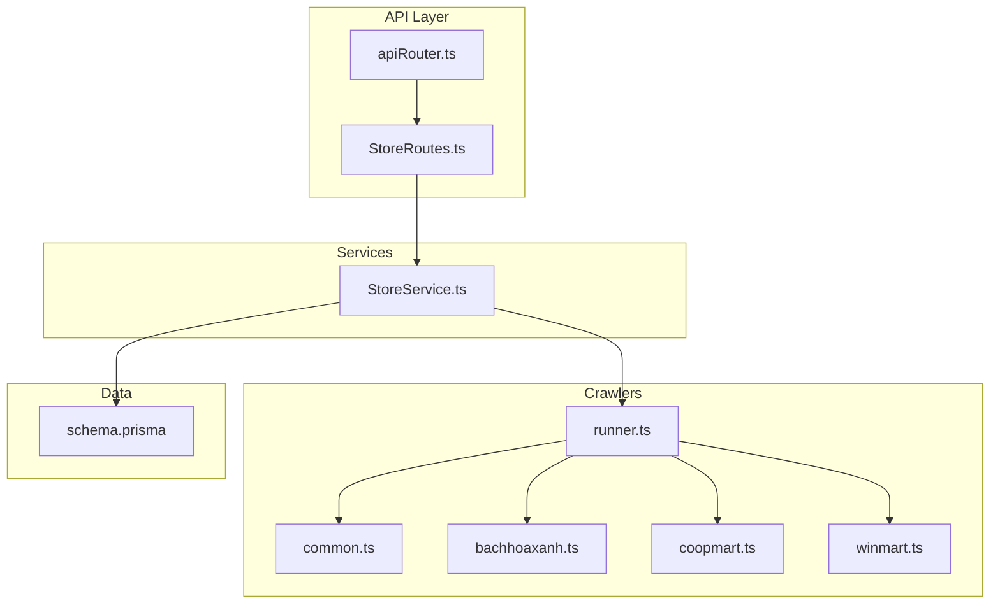
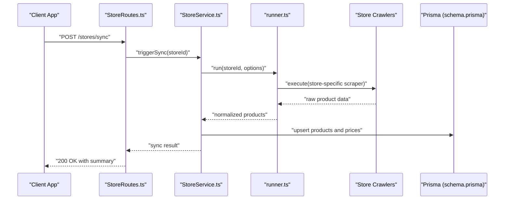
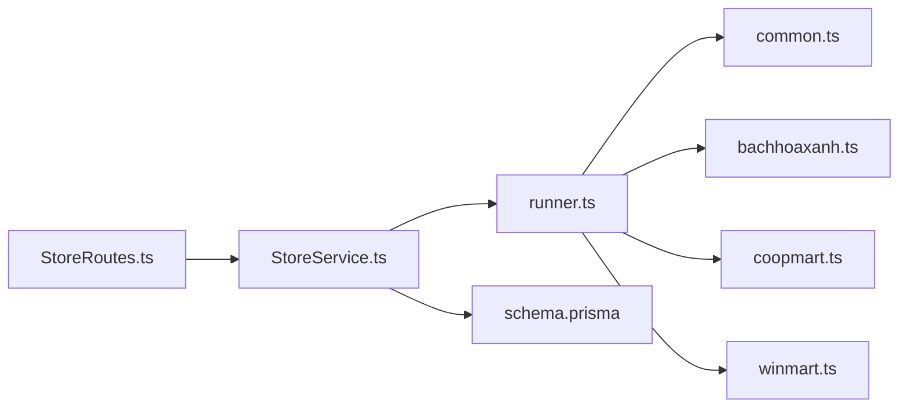

# Store Integration Service

<cite>
**Referenced Files in This Document**
- [StoreService.ts](file://Backend/src/services/StoreService.ts)
- [StoreRoutes.ts](file://Backend/src/routes/StoreRoutes.ts)
- [runner.ts](file://Backend/src/crawlers/runner.ts)
- [common.ts](file://Backend/src/crawlers/common.ts)
- [bachhoaxanh.ts](file://Backend/src/crawlers/bachhoaxanh.ts)
- [coopmart.ts](file://Backend/src/crawlers/coopmart.ts)
- [winmart.ts](file://Backend/src/crawlers/winmart.ts)
- [schema.prisma](file://Backend/prisma/schema.prisma)
- [env.ts](file://Backend/src/common/constants/env.ts)
- [apiRouter.ts](file://Backend/src/routes/apiRouter.ts)
</cite>

## Table of Contents
1. [Introduction](#introduction)
2. [Project Structure](#project-structure)
3. [Core Components](#core-components)
4. [Architecture Overview](#architecture-overview)
5. [Detailed Component Analysis](#detailed-component-analysis)
6. [Dependency Analysis](#dependency-analysis)
7. [Performance Considerations](#performance-considerations)
8. [Troubleshooting Guide](#troubleshooting-guide)
9. [Conclusion](#conclusion)
10. [Appendices](#appendices)

## Introduction
This document provides comprehensive documentation for the StoreIntegration Service that manages store integrations and price comparison functionality. It covers store product synchronization, price aggregation algorithms, availability checking, deal recommendations, and crawler coordination. It also includes practical guidance on adding new store integrations, handling different data formats, error recovery strategies, and performance optimization techniques for large-scale price comparisons.

## Project Structure
The StoreIntegration feature spans several modules:
- Services layer: central orchestration of store operations and price aggregation
- Crawlers layer: per-store scrapers and shared crawling utilities
- Routes layer: HTTP endpoints exposing store-related APIs
- Data layer: Prisma schema defining persistent models for stores, products, prices, and deals
- Configuration: environment variables controlling behavior and credentials

**Diagram sources**
- [StoreRoutes.ts](file://Backend/src/routes/StoreRoutes.ts)
- [apiRouter.ts](file://Backend/src/routes/apiRouter.ts)
- [StoreService.ts](file://Backend/src/services/StoreService.ts)
- [runner.ts](file://Backend/src/crawlers/runner.ts)
- [common.ts](file://Backend/src/crawlers/common.ts)
- [bachhoaxanh.ts](file://Backend/src/crawlers/bachhoaxanh.ts)
- [coopmart.ts](file://Backend/src/crawlers/coopmart.ts)
- [winmart.ts](file://Backend/src/crawlers/winmart.ts)
- [schema.prisma](file://Backend/prisma/schema.prisma)

**Section sources**
- [StoreService.ts](file://Backend/src/services/StoreService.ts)
- [StoreRoutes.ts](file://Backend/src/routes/StoreRoutes.ts)
- [runner.ts](file://Backend/src/crawlers/runner.ts)
- [common.ts](file://Backend/src/crawlers/common.ts)
- [bachhoaxanh.ts](file://Backend/src/crawlers/bachhoaxanh.ts)
- [coopmart.ts](file://Backend/src/crawlers/coopmart.ts)
- [winmart.ts](file://Backend/src/crawlers/winmart.ts)
- [schema.prisma](file://Backend/prisma/schema.prisma)
- [env.ts](file://Backend/src/common/constants/env.ts)
- [apiRouter.ts](file://Backend/src/routes/apiRouter.ts)

## Core Components
- StoreService: orchestrates store synchronization, price fetching, aggregation, availability checks, and deal recommendation logic. It coordinates with crawlers to fetch raw data, normalizes it into a unified model, persists results, and exposes API endpoints via routes.
- Crawler Runner: executes store-specific crawlers concurrently or sequentially based on configuration, handles retries, rate limiting, and error propagation.
- Store Crawlers: implement per-store scraping logic, parsing, and normalization into a common product representation.
- Data Models: define entities such as Store, Product, Price, Availability, and Deal, enabling consistent storage and querying across stores.

Key responsibilities:
- Synchronize store catalogs by invoking crawlers and upserting normalized products
- Aggregate prices across stores for the same product using configurable rules
- Check availability and freshness of offers
- Recommend deals based on price thresholds, discounts, and user preferences
- Expose REST endpoints for clients to query and trigger sync operations

**Section sources**
- [StoreService.ts](file://Backend/src/services/StoreService.ts)
- [runner.ts](file://Backend/src/crawlers/runner.ts)
- [common.ts](file://Backend/src/crawlers/common.ts)
- [schema.prisma](file://Backend/prisma/schema.prisma)

## Architecture Overview
The system follows a layered architecture:
- API Layer: routes expose endpoints for store operations
- Service Layer: business logic for synchronization, aggregation, and recommendations
- Crawling Layer: adapters for each store’s website or API
- Persistence Layer: database models managed through Prisma

**Diagram sources**
- [StoreRoutes.ts](file://Backend/src/routes/StoreRoutes.ts)
- [StoreService.ts](file://Backend/src/services/StoreService.ts)
- [runner.ts](file://Backend/src/crawlers/runner.ts)
- [bachhoaxanh.ts](file://Backend/src/crawlers/bachhoaxanh.ts)
- [coopmart.ts](file://Backend/src/crawlers/coopmart.ts)
- [winmart.ts](file://Backend/src/crawlers/winmart.ts)
- [schema.prisma](file://Backend/prisma/schema.prisma)

## Detailed Component Analysis

### StoreService
Responsibilities:
- Orchestrate store synchronization workflows
- Normalize crawled data into unified product models
- Aggregate prices across stores and compute best offers
- Validate availability and freshness
- Generate deal recommendations based on configured rules
- Manage errors and retries at the service level

Typical flow:
- Receive sync request from routes
- Invoke crawler runner for target stores
- Normalize responses into consistent structures
- Upsert products and prices into the database
- Compute aggregated prices and availability
- Return structured results to the caller

Error handling:
- Wrap crawler calls with try-catch and log failures
- Implement retry policies for transient network errors
- Fallback to cached data when crawlers fail
- Propagate meaningful error messages to routes

Performance considerations:
- Batch upserts for products and prices
- Use concurrency limits for crawler execution
- Cache frequently accessed product mappings
- Defer heavy computations to background jobs if needed

**Section sources**
- [StoreService.ts](file://Backend/src/services/StoreService.ts)

### Crawler Runner
Responsibilities:
- Execute store-specific crawlers
- Enforce concurrency and rate limiting
- Handle retries and timeouts
- Aggregate results and propagate errors

Execution modes:
- Sequential execution for strict ordering
- Parallel execution with bounded concurrency
- Selective execution based on store tags or filters

Error management:
- Capture exceptions per crawler
- Continue processing other crawlers on failure
- Provide detailed per-store status in results

**Section sources**
- [runner.ts](file://Backend/src/crawlers/runner.ts)

### Common Crawling Utilities
Responsibilities:
- Shared helpers for HTTP requests, parsing, and normalization
- Standardized error types and logging
- Utility functions for currency conversion and unit normalization

Common patterns:
- Retry with exponential backoff
- Timeout enforcement
- Input validation and sanitization

**Section sources**
- [common.ts](file://Backend/src/crawlers/common.ts)

### Store-Specific Crawlers
Examples:
- Bach Ho Xanh crawler
- Coop Mart crawler
- Win Mart crawler

Each crawler implements:
- Fetching product listings
- Parsing HTML or JSON responses
- Normalizing fields like name, SKU, price, currency, and availability
- Handling pagination and filtering

Normalization strategy:
- Map store-specific fields to canonical product schema
- Ensure consistent units and currencies
- Deduplicate products using identifiers or fuzzy matching

**Section sources**
- [bachhoaxanh.ts](file://Backend/src/crawlers/bachhoaxanh.ts)
- [coopmart.ts](file://Backend/src/crawlers/coopmart.ts)
- [winmart.ts](file://Backend/src/crawlers/winmart.ts)

### Data Models (Prisma Schema)
Entities typically include:
- Store: identifies integration source and metadata
- Product: canonical product representation
- Price: per-store pricing with currency and timestamp
- Availability: stock status and last checked time
- Deal: recommended offers based on rules

Relationships:
- Store has many Products
- Product has many Prices
- Product has one or more Availability records
- Deal references Product and Price

**Section sources**
- [schema.prisma](file://Backend/prisma/schema.prisma)

### API Endpoints
Endpoints exposed by StoreRoutes:
- Trigger store synchronization
- Query aggregated prices for a product
- Retrieve availability status
- Fetch deal recommendations

Request/response patterns:
- Standardized error responses
- Pagination for large result sets
- Filtering by store, currency, and date range

**Section sources**
- [StoreRoutes.ts](file://Backend/src/routes/StoreRoutes.ts)
- [apiRouter.ts](file://Backend/src/routes/apiRouter.ts)

## Dependency Analysis
The StoreIntegration feature exhibits clear separation of concerns:
- Routes depend on StoreService for business logic
- StoreService depends on crawler runner and utilities
- Crawlers are independent adapters per store
- Data persistence is abstracted via Prisma schema

**Diagram sources**
- [StoreRoutes.ts](file://Backend/src/routes/StoreRoutes.ts)
- [StoreService.ts](file://Backend/src/services/StoreService.ts)
- [runner.ts](file://Backend/src/crawlers/runner.ts)
- [common.ts](file://Backend/src/crawlers/common.ts)
- [bachhoaxanh.ts](file://Backend/src/crawlers/bachhoaxanh.ts)
- [coopmart.ts](file://Backend/src/crawlers/coopmart.ts)
- [winmart.ts](file://Backend/src/crawlers/winmart.ts)
- [schema.prisma](file://Backend/prisma/schema.prisma)

**Section sources**
- [StoreRoutes.ts](file://Backend/src/routes/StoreRoutes.ts)
- [StoreService.ts](file://Backend/src/services/StoreService.ts)
- [runner.ts](file://Backend/src/crawlers/runner.ts)
- [common.ts](file://Backend/src/crawlers/common.ts)
- [bachhoaxanh.ts](file://Backend/src/crawlers/bachhoaxanh.ts)
- [coopmart.ts](file://Backend/src/crawlers/coopmart.ts)
- [winmart.ts](file://Backend/src/crawlers/winmart.ts)
- [schema.prisma](file://Backend/prisma/schema.prisma)

## Performance Considerations
Optimization techniques for large-scale price comparisons:
- Concurrency control: limit parallel crawler executions to avoid overloading external sites
- Batch operations: group upserts for products and prices to reduce database round-trips
- Caching: cache product mappings and recent price snapshots to minimize repeated work
- Incremental sync: only refresh products changed since last sync timestamp
- Lazy loading: defer heavy computations until requested by clients
- Background jobs: schedule sync tasks off the critical path for responsiveness

Monitoring and observability:
- Log crawler success/failure rates
- Track latency per store and overall sync duration
- Alert on sustained errors or slow responses

[No sources needed since this section provides general guidance]

## Troubleshooting Guide
Common issues and resolutions:
- Crawler timeouts: increase timeout settings or implement adaptive backoff
- Rate limiting: reduce concurrency and add delays between requests
- Parsing failures: update selectors or parsers for site changes
- Data inconsistencies: enforce normalization rules and validate inputs
- Database errors: check connection pools and transaction boundaries

Debugging steps:
- Enable verbose logging for crawler execution
- Inspect raw responses before normalization
- Verify mapping rules for store-specific fields
- Validate Prisma queries and relationships

Recovery strategies:
- Retry failed crawlers with exponential backoff
- Fall back to cached data when crawlers fail
- Mark products as stale and schedule re-sync
- Notify administrators of persistent failures

**Section sources**
- [runner.ts](file://Backend/src/crawlers/runner.ts)
- [common.ts](file://Backend/src/crawlers/common.ts)
- [StoreService.ts](file://Backend/src/services/StoreService.ts)

## Conclusion
The StoreIntegration Service provides a robust foundation for managing store integrations and price comparison functionality. By separating concerns across services, crawlers, and data models, it enables scalable and maintainable price aggregation. With proper error handling, caching, and concurrency controls, it can handle large-scale comparisons efficiently. Extending the system with new stores involves implementing standardized crawlers and leveraging shared utilities for reliability and performance.

[No sources needed since this section summarizes without analyzing specific files]

## Appendices

### Adding a New Store Integration
Steps to integrate a new store:
- Create a new crawler file following existing patterns
- Implement fetching, parsing, and normalization logic
- Register the crawler in the runner configuration
- Test with sample data and validate normalization
- Update API endpoints if needed for store-specific features

Best practices:
- Use shared utilities for HTTP requests and parsing
- Handle pagination and edge cases gracefully
- Include comprehensive logging and error reporting
- Write tests for parsing and normalization logic

**Section sources**
- [bachhoaxanh.ts](file://Backend/src/crawlers/bachhoaxanh.ts)
- [coopmart.ts](file://Backend/src/crawlers/coopmart.ts)
- [winmart.ts](file://Backend/src/crawlers/winmart.ts)
- [runner.ts](file://Backend/src/crawlers/runner.ts)
- [common.ts](file://Backend/src/crawlers/common.ts)

### Handling Different Data Formats
Normalization approach:
- Define a canonical product schema
- Map store-specific fields to canonical structure
- Handle variations in currency, units, and naming conventions
- Validate required fields and provide defaults where appropriate

Tools and utilities:
- Shared parsing helpers in common utilities
- Type guards and validators for input validation
- Conversion functions for currencies and measurements

**Section sources**
- [common.ts](file://Backend/src/crawlers/common.ts)
- [schema.prisma](file://Backend/prisma/schema.prisma)

### Error Recovery Strategies
Recommended patterns:
- Implement retry mechanisms with exponential backoff
- Use circuit breakers for failing external services
- Graceful degradation with cached data
- Comprehensive logging and alerting for failures

Implementation guidelines:
- Wrap external calls with error handlers
- Distinguish between transient and permanent errors
- Provide fallback strategies for critical operations
- Monitor error rates and adjust thresholds dynamically

**Section sources**
- [runner.ts](file://Backend/src/crawlers/runner.ts)
- [common.ts](file://Backend/src/crawlers/common.ts)
- [StoreService.ts](file://Backend/src/services/StoreService.ts)

### Performance Optimization Techniques
Advanced optimizations:
- Implement distributed crawling for horizontal scaling
- Use message queues for async processing
- Optimize database queries with proper indexing
- Implement intelligent caching strategies
- Profile and monitor crawler performance

Monitoring metrics:
- Success rates per store
- Average response times
- Memory and CPU usage during sync
- Database query performance

**Section sources**
- [runner.ts](file://Backend/src/crawlers/runner.ts)
- [StoreService.ts](file://Backend/src/services/StoreService.ts)
- [schema.prisma](file://Backend/prisma/schema.prisma)