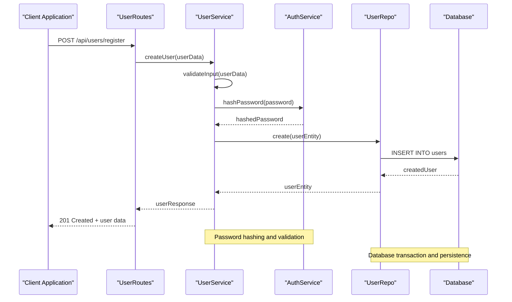
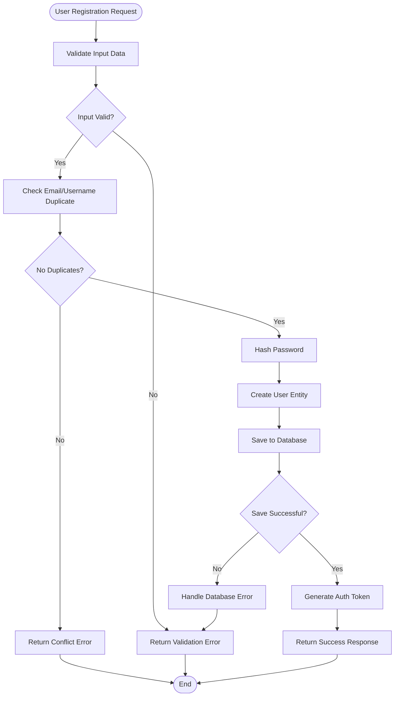
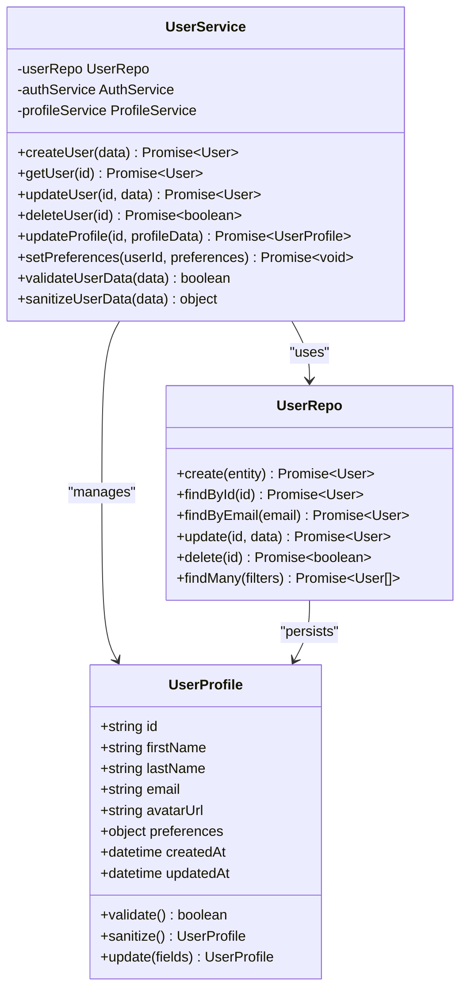
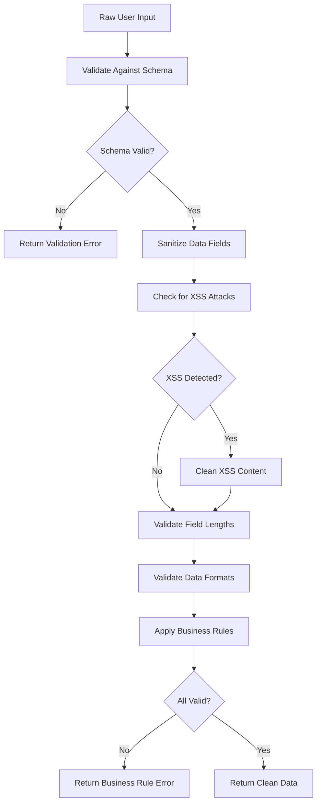
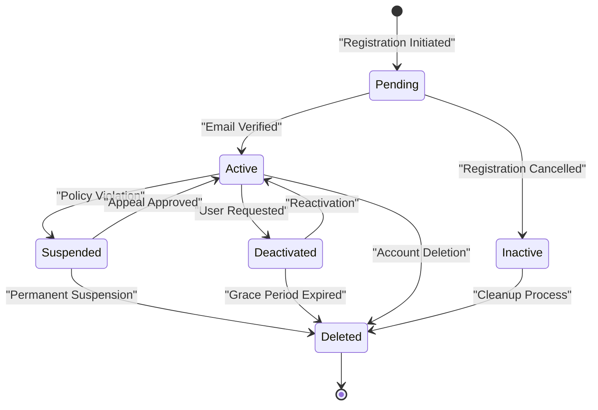
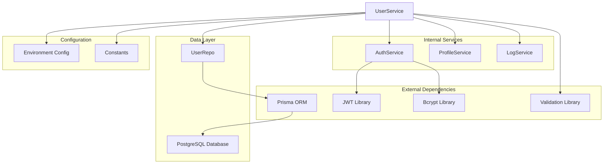

# User Management Service

<cite>
**Referenced Files in This Document**
- [UserService.ts](file://Backend/src/services/UserService.ts)
- [User.model.ts](file://Backend/src/models/User.model.ts)
- [UserRepo.ts](file://Backend/src/repos/UserRepo.ts)
- [UserRoutes.ts](file://Backend/src/routes/UserRoutes.ts)
- [schema.prisma](file://Backend/prisma/schema.prisma)
- [AuthService.ts](file://Backend/src/services/AuthService.ts)
- [ProfileService.ts](file://Backend/src/services/ProfileService.ts)
- [validators.ts](file://Backend/src/common/utils/validators.ts)
</cite>

## Table of Contents
1. [Introduction](#introduction)
2. [Project Structure](#project-structure)
3. [Core Components](#core-components)
4. [Architecture Overview](#architecture-overview)
5. [Detailed Component Analysis](#detailed-component-analysis)
6. [Dependency Analysis](#dependency-analysis)
7. [Performance Considerations](#performance-considerations)
8. [Troubleshooting Guide](#troubleshooting-guide)
9. [Conclusion](#conclusion)
10. [Appendices](#appendices)

## Introduction
This document provides detailed documentation for the UserService responsible for user account management within the StudentBite application. The service handles comprehensive user lifecycle operations including creation, retrieval, updates, deletion, profile management, preference handling, validation, data sanitization, and integration with authentication services. It serves as the central business logic layer for all user-related operations in the system.

The UserService is designed following clean architecture principles, separating concerns between business logic, data access, and presentation layers. It implements robust validation and sanitization mechanisms to ensure data integrity and security throughout the user management workflow.

## Project Structure
The user management functionality is organized across multiple layers following a clear separation of concerns:

```mermaid
graph TB
subgraph "API Layer"
Routes[UserRoutes.ts]
end
subgraph "Service Layer"
UserService[UserService.ts]
AuthService[AuthService.ts]
ProfileService[ProfileService.ts]
end
subgraph "Data Access Layer"
UserRepo[UserRepo.ts]
PrismaClient[Prisma Client]
end
subgraph "Database"
Database[(PostgreSQL)]
end
subgraph "Models"
UserModel[User Model]
end
Routes --> UserService
UserService --> UserRepo
UserService --> AuthService
UserService --> ProfileService
UserRepo --> PrismaClient
PrismaClient --> Database
UserService --> UserModel
```

**Diagram sources**
- [UserRoutes.ts](file://Backend/src/routes/UserRoutes.ts)
- [UserService.ts](file://Backend/src/services/UserService.ts)
- [UserRepo.ts](file://Backend/src/repos/UserRepo.ts)
- [schema.prisma](file://Backend/prisma/schema.prisma)

**Section sources**
- [UserRoutes.ts](file://Backend/src/routes/UserRoutes.ts)
- [UserService.ts](file://Backend/src/services/UserService.ts)
- [UserRepo.ts](file://Backend/src/repos/UserRepo.ts)

## Core Components

### UserService
The UserService is the primary orchestrator for all user-related operations. It implements CRUD operations, validates input data, manages user preferences, and coordinates with authentication and profile services.

Key responsibilities include:
- User account creation with validation and sanitization
- User data retrieval with filtering and pagination support
- Profile updates with field-level validation
- Preference management and persistence
- User lifecycle state management
- Integration with authentication services
- Data sanitization and security measures

### User Model
The User model defines the core data structure for user accounts, including personal information, authentication credentials, preferences, and metadata fields.

### User Repository
The UserRepo handles all database operations for user data, implementing efficient queries, transactions, and data transformation between database entities and application models.

### Authentication Integration
The UserService integrates with AuthService for password hashing, token generation, session management, and authentication flow coordination.

**Section sources**
- [UserService.ts](file://Backend/src/services/UserService.ts)
- [User.model.ts](file://Backend/src/models/User.model.ts)
- [UserRepo.ts](file://Backend/src/repos/UserRepo.ts)
- [AuthService.ts](file://Backend/src/services/AuthService.ts)

## Architecture Overview

The user management system follows a layered architecture pattern with clear separation of concerns:



**Diagram sources**
- [UserRoutes.ts](file://Backend/src/routes/UserRoutes.ts)
- [UserService.ts](file://Backend/src/services/UserService.ts)
- [AuthService.ts](file://Backend/src/services/AuthService.ts)
- [UserRepo.ts](file://Backend/src/repos/UserRepo.ts)

## Detailed Component Analysis

### User Creation Workflow

The user creation process involves multiple validation steps, data sanitization, and integration with authentication services:



**Diagram sources**
- [UserService.ts](file://Backend/src/services/UserService.ts)
- [validators.ts](file://Backend/src/common/utils/validators.ts)

### Profile Update Process

Profile updates implement field-level validation, partial updates, and audit logging:



**Diagram sources**
- [UserService.ts](file://Backend/src/services/UserService.ts)
- [User.model.ts](file://Backend/src/models/User.model.ts)
- [UserRepo.ts](file://Backend/src/repos/UserRepo.ts)

### Data Validation and Sanitization

The system implements comprehensive validation rules and data sanitization:



**Diagram sources**
- [validators.ts](file://Backend/src/common/utils/validators.ts)
- [UserService.ts](file://Backend/src/services/UserService.ts)

### User Lifecycle Management

The user lifecycle encompasses various states and transitions:



**Diagram sources**
- [UserService.ts](file://Backend/src/services/UserService.ts)
- [User.model.ts](file://Backend/src/models/User.model.ts)

## Dependency Analysis

The UserService has well-defined dependencies and relationships with other components:



**Diagram sources**
- [UserService.ts](file://Backend/src/services/UserService.ts)
- [UserRepo.ts](file://Backend/src/repos/UserRepo.ts)
- [AuthService.ts](file://Backend/src/services/AuthService.ts)

**Section sources**
- [UserService.ts](file://Backend/src/services/UserService.ts)
- [UserRepo.ts](file://Backend/src/repos/UserRepo.ts)
- [AuthService.ts](file://Backend/src/services/AuthService.ts)

## Performance Considerations

The UserService implementation includes several performance optimizations:

- **Database Query Optimization**: Efficient indexing strategies and query optimization for common user lookup patterns
- **Connection Pooling**: Proper connection pool configuration for database operations
- **Caching Strategy**: Implementation of caching for frequently accessed user data
- **Batch Operations**: Support for batch user operations where applicable
- **Lazy Loading**: Deferred loading of non-critical user profile data
- **Transaction Management**: Optimized transaction boundaries to minimize database lock time

## Troubleshooting Guide

Common issues and their resolutions:

### User Creation Failures
- **Validation Errors**: Check input schema and field constraints
- **Duplicate Entries**: Verify unique constraints on email and username fields
- **Database Connection Issues**: Ensure proper database connectivity and credentials

### Profile Update Problems
- **Permission Denied**: Verify user authorization and ownership
- **Partial Updates**: Ensure proper field mapping and type conversion
- **Data Integrity**: Check foreign key constraints and referential integrity

### Authentication Integration Issues
- **Token Generation**: Verify JWT configuration and secret keys
- **Password Hashing**: Ensure consistent hashing algorithms
- **Session Management**: Check session storage and expiration settings

**Section sources**
- [UserService.ts](file://Backend/src/services/UserService.ts)
- [AuthService.ts](file://Backend/src/services/AuthService.ts)

## Conclusion

The UserService provides a comprehensive and robust solution for user account management in the StudentBite application. It implements industry best practices for data validation, security, and performance optimization while maintaining clean separation of concerns and extensibility for future enhancements.

The service successfully handles the complete user lifecycle from registration through deactivation, with proper error handling, logging, and audit trails. Its modular design allows for easy integration with additional features and services as the application evolves.

## Appendices

### API Endpoints Reference

| Endpoint | Method | Description | Status Codes |
|----------|--------|-------------|--------------|
| `/api/users` | POST | Create new user | 201, 400, 409 |
| `/api/users/:id` | GET | Get user by ID | 200, 404 |
| `/api/users/:id` | PUT | Update user | 200, 400, 404 |
| `/api/users/:id` | DELETE | Delete user | 204, 404 |
| `/api/users/:id/profile` | PUT | Update profile | 200, 400, 404 |
| `/api/users/:id/preferences` | PUT | Update preferences | 200, 400, 404 |

### Data Models

#### User Entity
- **id**: Unique identifier (UUID)
- **email**: User email address (unique)
- **username**: User username (unique)
- **password**: Hashed password
- **firstName**: User's first name
- **lastName**: User's last name
- **avatarUrl**: Profile picture URL
- **preferences**: User preferences object
- **status**: Account status enum
- **createdAt**: Creation timestamp
- **updatedAt**: Last update timestamp
- **deletedAt**: Soft delete timestamp

**Section sources**
- [schema.prisma](file://Backend/prisma/schema.prisma)
- [User.model.ts](file://Backend/src/models/User.model.ts)