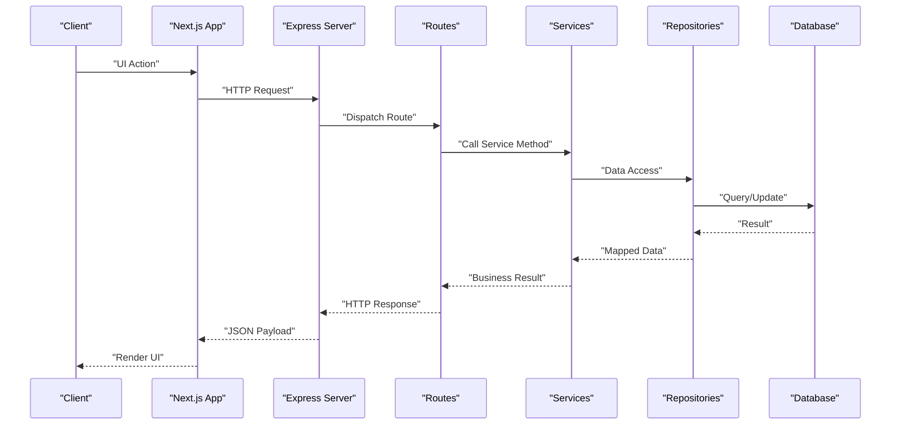
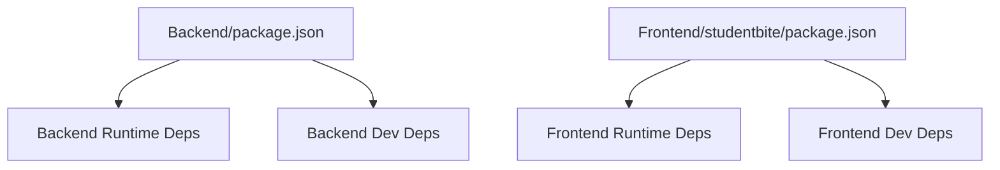

# Contributing Guidelines

<cite>
**Referenced Files in This Document**
- [README.md](file://README.md)
- [Backend/README.md](file://Backend/README.md)
- [Frontend/studentbite/README.md](file://Frontend/studentbite/README.md)
- [Backend/.prettierrc.json](file://Backend/.prettierrc.json)
- [Backend/eslint.config.ts](file://Backend/eslint.config.ts)
- [Frontend/studentbite/eslint.config.mjs](file://Frontend/studentbite/eslint.config.mjs)
- [Backend/package.json](file://Backend/package.json)
- [Frontend/studentbite/package.json](file://Frontend/studentbite/package.json)
- [Backend/vitest.config.mts](file://Backend/vitest.config.mts)
- [Backend/tests/planner.test.ts](file://Backend/tests/planner.test.ts)
- [Backend/tests/users.test.ts](file://Backend/tests/users.test.ts)
- [Backend/src/main.ts](file://Backend/src/main.ts)
- [Backend/src/server.ts](file://Backend/src/server.ts)
- [Frontend/studentbite/app/layout.tsx](file://Frontend/studentbite/app/layout.tsx)
- [Frontend/studentbite/app/(main)/layout.tsx](file://Frontend/studentbite/app/(main)/layout.tsx)
</cite>

## Table of Contents
1. [Introduction](#introduction)
2. [Project Structure](#project-structure)
3. [Core Components](#core-components)
4. [Architecture Overview](#architecture-overview)
5. [Detailed Component Analysis](#detailed-component-analysis)
6. [Dependency Analysis](#dependency-analysis)
7. [Performance Considerations](#performance-considerations)
8. [Troubleshooting Guide](#troubleshooting-guide)
9. [Conclusion](#conclusion)
10. [Appendices](#appendices)

## Introduction
This document defines the contributing guidelines for StudentBite. It covers code style standards (Prettier and ESLint), pull request workflow, commit message conventions, code review procedures, project structure expectations, testing requirements, documentation standards, feature addition/modification processes, bug reporting, development workflow, branching strategy, and collaboration best practices. The goal is to maintain code quality, consistency, and a smooth contributor experience across both Backend and Frontend.

## Project Structure
StudentBite is a monorepo with separate Backend and Frontend directories:
- Backend: Node.js/TypeScript server using Express-like routing, Prisma ORM, crawlers, services, routes, models, repositories, tests, and configuration files for linting/formatting and testing.
- Frontend: Next.js application with App Router, components, lib utilities, and configuration for ESLint and build tooling.

Key entry points and organization:
- Backend entry points are located under src/main.ts and src/server.ts.
- Frontend uses Next.js App Router with layout pages under app/ and feature pages grouped by route segments.

```mermaid
graph TB
subgraph "Backend"
BMain["src/main.ts"]
BServer["src/server.ts"]
BRoutes["src/routes/*"]
BServices["src/services/*"]
BModels["src/models/*"]
BRepos["src/repos/*"]
BCrawlers["src/crawlers/*"]
BTests["tests/*"]
BConfig[".prettierrc.json","eslint.config.ts","vitest.config.mts","package.json"]
end
subgraph "Frontend"
FLayout["app/layout.tsx"]
FMainLayout["app/(main)/layout.tsx"]
FPages["app/**/page.tsx"]
FComponents["components/*"]
FLib["lib/*"]
FEslint["eslint.config.mjs"]
FPkg["package.json"]
end
BMain --> BServer
BServer --> BRoutes
BRoutes --> BServices
BServices --> BModels
BServices --> BRepos
BRepos --> BConfig
BTests --> BConfig
FLayout --> FPages
FMainLayout --> FPages
FPages --> FComponents
FPages --> FLib
FPages --> FPkg
```

**Diagram sources**
- [Backend/src/main.ts](file://Backend/src/main.ts)
- [Backend/src/server.ts](file://Backend/src/server.ts)
- [Frontend/studentbite/app/layout.tsx](file://Frontend/studentbite/app/layout.tsx)
- [Frontend/studentbite/app/(main)/layout.tsx](file://Frontend/studentbite/app/(main)/layout.tsx)

**Section sources**
- [Backend/README.md](file://Backend/README.md)
- [Frontend/studentbite/README.md](file://Frontend/studentbite/README.md)

## Core Components
- Code Style and Linting:
  - Prettier configuration ensures consistent formatting across the Backend.
  - ESLint configurations exist for both Backend and Frontend to enforce code quality rules.
- Testing:
  - Backend uses Vitest for unit/integration tests with a dedicated config file and test suites under tests/.
- Entry Points:
  - Backend main and server initialization files define how the API starts and routes are mounted.
  - Frontend layout files define global UI structure and shared providers.

Guidelines:
- Always run Prettier and ESLint before committing changes.
- Ensure all tests pass locally before opening a PR.
- Keep new features aligned with existing module boundaries (services, routes, models).

**Section sources**
- [Backend/.prettierrc.json](file://Backend/.prettierrc.json)
- [Backend/eslint.config.ts](file://Backend/eslint.config.ts)
- [Frontend/studentbite/eslint.config.mjs](file://Frontend/studentbite/eslint.config.mjs)
- [Backend/vitest.config.mts](file://Backend/vitest.config.mts)
- [Backend/tests/planner.test.ts](file://Backend/tests/planner.test.ts)
- [Backend/tests/users.test.ts](file://Backend/tests/users.test.ts)
- [Backend/src/main.ts](file://Backend/src/main.ts)
- [Backend/src/server.ts](file://Backend/src/server.ts)
- [Frontend/studentbite/app/layout.tsx](file://Frontend/studentbite/app/layout.tsx)
- [Frontend/studentbite/app/(main)/layout.tsx](file://Frontend/studentbite/app/(main)/layout.tsx)

## Architecture Overview
The system follows a layered architecture on the Backend:
- Routes handle HTTP requests and delegate to Services.
- Services implement business logic and interact with Models and Repositories.
- Repositories abstract data access (Prisma or mock implementations).
- Crawlers provide external data ingestion capabilities.

Frontend is organized by Next.js App Router:
- Layouts define shared UI and context.
- Pages represent route segments and compose components.
- Lib contains reusable utilities and hooks.



[No diagram sources needed since this diagram shows conceptual workflow, not actual code structure]

## Detailed Component Analysis

### Code Style Standards (Prettier and ESLint)
- Prettier:
  - Backend formatting is governed by .prettierrc.json.
  - Use Prettier via npm scripts or IDE integration to format code consistently.
- ESLint:
  - Backend uses eslint.config.ts for rule definitions.
  - Frontend uses eslint.config.mjs for Next.js-specific rules.
- Best Practices:
  - Configure your editor to format on save.
  - Run linters locally before pushing changes.
  - Resolve all warnings and errors prior to submission.

**Section sources**
- [Backend/.prettierrc.json](file://Backend/.prettierrc.json)
- [Backend/eslint.config.ts](file://Backend/eslint.config.ts)
- [Frontend/studentbite/eslint.config.mjs](file://Frontend/studentbite/eslint.config.mjs)

### Pull Request Process
- Create a feature branch from the latest main.
- Implement changes following coding standards and add/update tests.
- Open a Pull Request with a clear description, affected modules, and testing notes.
- Ensure CI checks pass (linting, formatting, tests).
- Request reviews from maintainers; address feedback promptly.
- Squash commits if necessary to keep history clean.

[No section sources needed since this section provides general guidance]

### Commit Message Conventions
- Use conventional commits: type(scope): description
- Types include: feat, fix, docs, style, refactor, test, chore
- Scope should reflect module or area (e.g., backend, frontend, auth, planner)
- Keep descriptions concise and meaningful

[No section sources needed since this section provides general guidance]

### Code Review Procedures
- Reviewers check for correctness, readability, performance, and adherence to standards.
- Verify that tests cover new functionality and edge cases.
- Ensure no regressions in existing behavior.
- Provide actionable feedback and approve when satisfied.

[No section sources needed since this section provides general guidance]

### Project Structure Expectations
- Backend:
  - Place new routes under src/routes, services under src/services, models under src/models, repositories under src/repos.
  - Keep shared utilities under src/common/utils and types under src/common/types.
- Frontend:
  - Add new pages under appropriate route segments in app/.
  - Reusable UI components go under components/.
  - Shared logic/hooks/utilities belong in lib/.

**Section sources**
- [Backend/src/main.ts](file://Backend/src/main.ts)
- [Backend/src/server.ts](file://Backend/src/server.ts)
- [Frontend/studentbite/app/layout.tsx](file://Frontend/studentbite/app/layout.tsx)
- [Frontend/studentbite/app/(main)/layout.tsx](file://Frontend/studentbite/app/(main)/layout.tsx)

### Testing Requirements Before Submission
- Backend:
  - Use Vitest for unit and integration tests.
  - Add or update tests under tests/ for any new or modified functionality.
  - Ensure all tests pass locally before submitting.
- Frontend:
  - Follow existing patterns for component and utility tests if applicable.
  - Validate UI behavior through manual checks or automated tests as per project setup.

**Section sources**
- [Backend/vitest.config.mts](file://Backend/vitest.config.mts)
- [Backend/tests/planner.test.ts](file://Backend/tests/planner.test.ts)
- [Backend/tests/users.test.ts](file://Backend/tests/users.test.ts)

### Documentation Standards
- Update README files in relevant modules when adding features or changing behavior.
- Include inline comments for complex logic where necessary.
- Maintain clarity and consistency in naming and structure.

**Section sources**
- [README.md](file://README.md)
- [Backend/README.md](file://Backend/README.md)
- [Frontend/studentbite/README.md](file://Frontend/studentbite/README.md)

### Adding New Features
- Create a feature branch named feature/<short-description>.
- Implement changes within appropriate modules.
- Add tests and update documentation.
- Submit a PR with detailed description and screenshots if UI changes.

[No section sources needed since this section provides general guidance]

### Modifying Existing Functionality
- Identify affected modules and ensure backward compatibility.
- Update tests to reflect new behavior.
- Document breaking changes clearly in PR description.

[No section sources needed since this section provides general guidance]

### Reporting Bugs
- Open an issue with steps to reproduce, expected vs actual behavior, and environment details.
- Include logs or screenshots if applicable.
- Tag appropriately (bug, frontend, backend).

[No section sources needed since this section provides general guidance]

### Development Workflow and Branching Strategy
- Main branch is protected; use feature branches for development.
- Hotfixes should be branched from main and merged back after validation.
- Regularly sync feature branches with main to avoid conflicts.

[No section sources needed since this section provides general guidance]

### Collaboration Best Practices
- Communicate changes early via issues or discussions.
- Keep PRs small and focused.
- Respond to review comments promptly.
- Share knowledge and mentor newcomers.

[No section sources needed since this section provides general guidance]

## Dependency Analysis
- Backend dependencies are managed via package.json and include runtime and dev dependencies for server, database, and testing.
- Frontend dependencies are managed via package.json for Next.js ecosystem.
- Ensure dependency updates are reviewed and tested before merging.



**Diagram sources**
- [Backend/package.json](file://Backend/package.json)
- [Frontend/studentbite/package.json](file://Frontend/studentbite/package.json)

**Section sources**
- [Backend/package.json](file://Backend/package.json)
- [Frontend/studentbite/package.json](file://Frontend/studentbite/package.json)

## Performance Considerations
- Optimize database queries in repositories and services.
- Avoid unnecessary re-renders in Frontend components.
- Profile critical paths and reduce payload sizes where possible.
- Monitor memory usage and CPU consumption during heavy operations like crawling.

[No section sources needed since this section provides general guidance]

## Troubleshooting Guide
- Linting/Formatting Issues:
  - Run Prettier and ESLint locally to identify and fix issues.
  - Check configuration files for misconfigurations.
- Test Failures:
  - Inspect test output and error traces.
  - Ensure environment variables and mocks are set correctly.
- Build/Run Errors:
  - Verify Node.js version and installed dependencies.
  - Clear caches and reinstall dependencies if needed.

**Section sources**
- [Backend/.prettierrc.json](file://Backend/.prettierrc.json)
- [Backend/eslint.config.ts](file://Backend/eslint.config.ts)
- [Frontend/studentbite/eslint.config.mjs](file://Frontend/studentbite/eslint.config.mjs)
- [Backend/vitest.config.mts](file://Backend/vitest.config.mts)

## Conclusion
By adhering to these contributing guidelines, contributors can maintain high code quality, consistency, and a collaborative development environment. Following the established workflows, standards, and best practices ensures smooth integration of changes and a robust product.

[No section sources needed since this section summarizes without analyzing specific files]

## Appendices
- Quick Start Commands:
  - Backend: Install dependencies, run linters, execute tests.
  - Frontend: Install dependencies, start development server, run linters.
- Useful Links:
  - Repository README files for setup instructions.
  - Issue templates and PR templates if available.

**Section sources**
- [Backend/README.md](file://Backend/README.md)
- [Frontend/studentbite/README.md](file://Frontend/studentbite/README.md)
- [README.md](file://README.md)