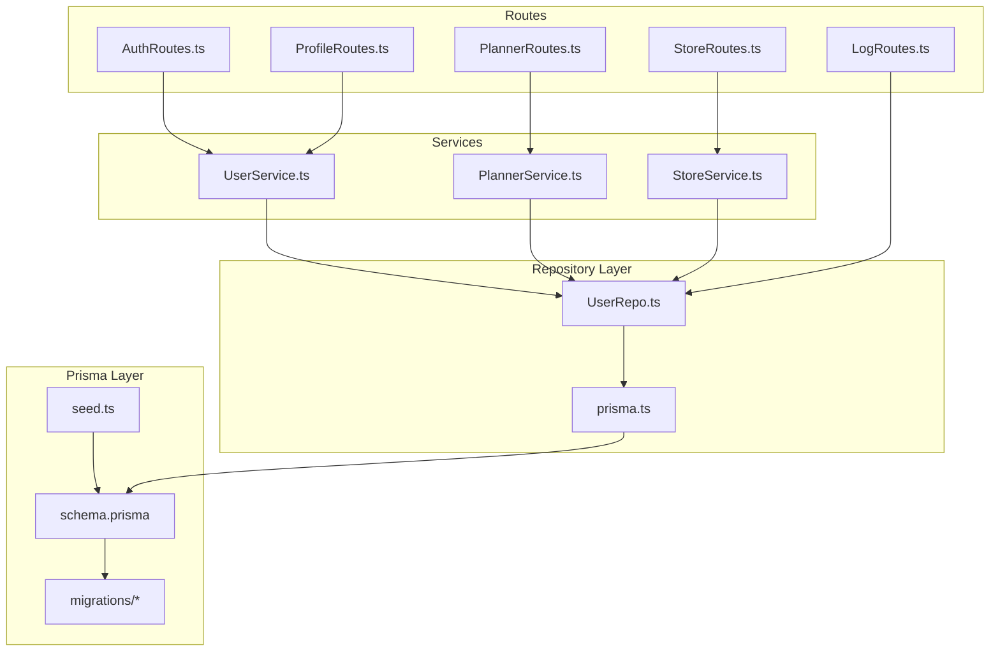
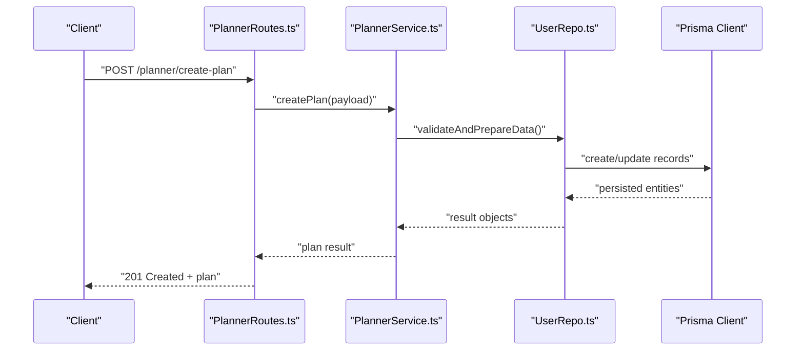
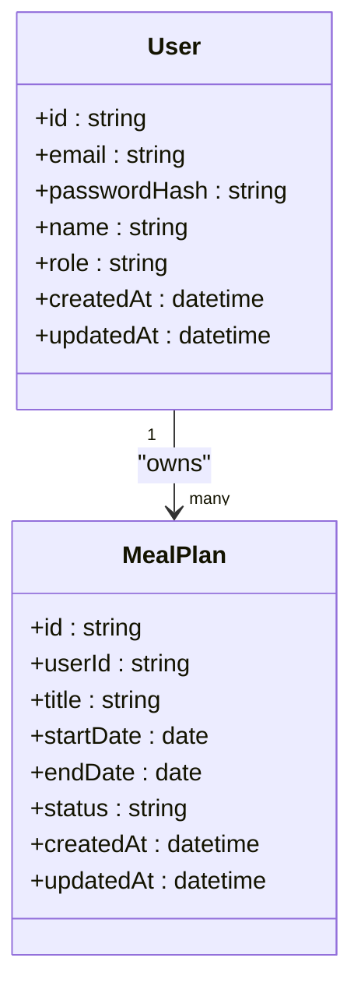
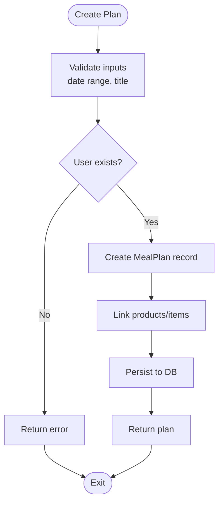
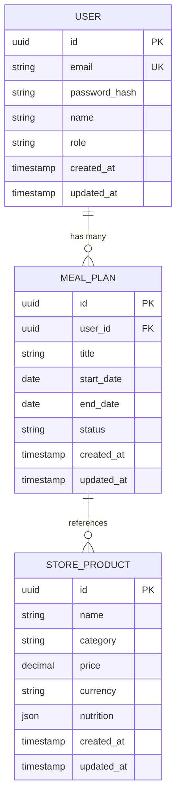
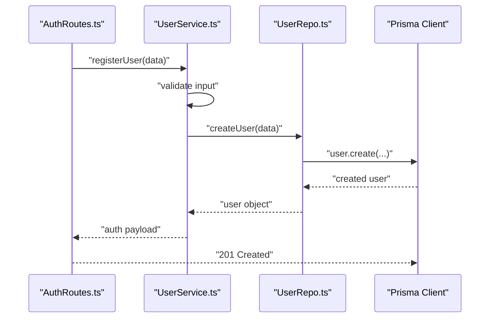
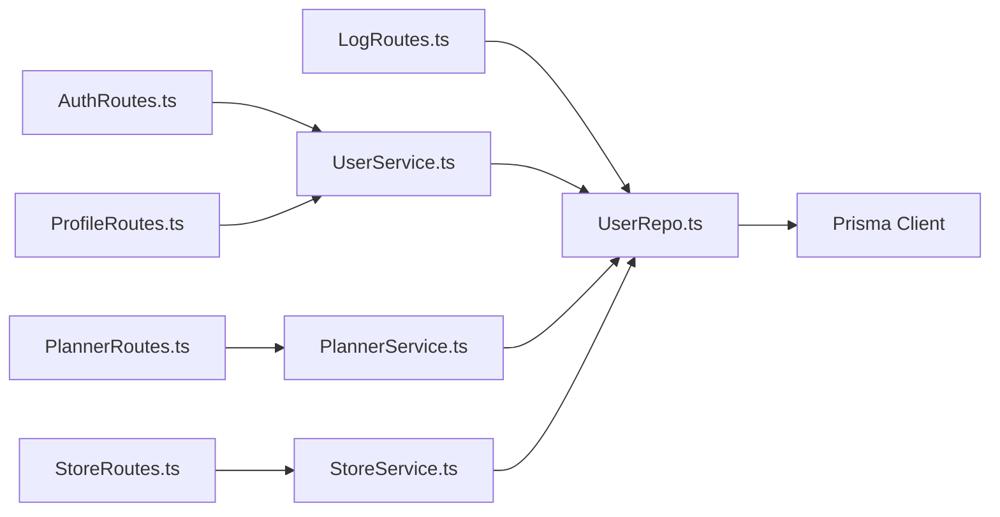

# Database Design

<cite>
**Referenced Files in This Document**
- [schema.prisma](file://Backend/prisma/schema.prisma)
- [migration.sql](file://Backend/prisma/migrations/20260801133844_init/migration.sql)
- [seed.ts](file://Backend/prisma/seed.ts)
- [User.model.ts](file://Backend/src/models/User.model.ts)
- [prisma.ts](file://Backend/src/repos/prisma.ts)
- [UserRepo.ts](file://Backend/src/repos/UserRepo.ts)
- [UserService.ts](file://Backend/src/services/UserService.ts)
- [PlannerRoutes.ts](file://Backend/src/routes/PlannerRoutes.ts)
- [StoreRoutes.ts](file://Backend/src/routes/StoreRoutes.ts)
- [AuthRoutes.ts](file://Backend/src/routes/AuthRoutes.ts)
- [ProfileRoutes.ts](file://Backend/src/routes/ProfileRoutes.ts)
- [LogRoutes.ts](file://Backend/src/routes/LogRoutes.ts)
</cite>

## Table of Contents
1. [Introduction](#introduction)
2. [Project Structure](#project-structure)
3. [Core Components](#core-components)
4. [Architecture Overview](#architecture-overview)
5. [Detailed Component Analysis](#detailed-component-analysis)
6. [Dependency Analysis](#dependency-analysis)
7. [Performance Considerations](#performance-considerations)
8. [Troubleshooting Guide](#troubleshooting-guide)
9. [Conclusion](#conclusion)
10. [Appendices](#appendices)

## Introduction
This document provides comprehensive data model documentation for StudentBite’s database schema defined via Prisma. It details entity relationships among User, MealPlan, StoreProduct, and related models, including field definitions, data types, constraints, indexes, and foreign keys. It also explains design decisions, normalization principles, validation rules, sample queries, migration strategy, seed data management, lifecycle considerations, and performance optimizations through indexing and query patterns.

## Project Structure
The database layer is centered around the Prisma schema and migrations under Backend/prisma. The application code interacts with the database through a typed client initialized in the repository layer and consumed by services and routes.

**Diagram sources**
- [schema.prisma](file://Backend/prisma/schema.prisma)
- [migration.sql](file://Backend/prisma/migrations/20260801133844_init/migration.sql)
- [seed.ts](file://Backend/prisma/seed.ts)
- [prisma.ts](file://Backend/src/repos/prisma.ts)
- [UserRepo.ts](file://Backend/src/repos/UserRepo.ts)
- [UserService.ts](file://Backend/src/services/UserService.ts)
- [PlannerRoutes.ts](file://Backend/src/routes/PlannerRoutes.ts)
- [StoreRoutes.ts](file://Backend/src/routes/StoreRoutes.ts)
- [AuthRoutes.ts](file://Backend/src/routes/AuthRoutes.ts)
- [ProfileRoutes.ts](file://Backend/src/routes/ProfileRoutes.ts)
- [LogRoutes.ts](file://Backend/src/routes/LogRoutes.ts)

**Section sources**
- [schema.prisma](file://Backend/prisma/schema.prisma)
- [prisma.ts](file://Backend/src/repos/prisma.ts)

## Core Components
This section outlines the primary entities and their relationships as modeled in Prisma:

- User
  - Represents an authenticated user account.
  - Fields include identifiers, authentication-related attributes, profile information, and timestamps.
  - Relationships: one-to-many with MealPlan (a user can have multiple meal plans), and potentially other entities depending on schema evolution.

- MealPlan
  - Represents a plan associated with a user, containing planning metadata and possibly references to products or meals.
  - Relationships: belongs to User; may reference StoreProduct entries or aggregated meal items.

- StoreProduct
  - Represents a product available at stores, including pricing, nutrition, and availability details.
  - Relationships: may be referenced by MealPlan or other planning entities.

- Additional Entities
  - Depending on the schema, there may be entities for Stores, Categories, NutritionData, and AuditLogs that support planning, search, and analytics.

Key design principles:
- Normalization: Entities are normalized to reduce redundancy (e.g., separating Users from Plans and Products).
- Referential integrity enforced via foreign keys.
- Indexes applied to frequently queried fields (e.g., userId, productId, planId).
- Validation rules enforced at both schema level (Prisma constraints) and application level (service validations).

**Section sources**
- [schema.prisma](file://Backend/prisma/schema.prisma)

## Architecture Overview
The data architecture follows a layered approach:
- Routes receive HTTP requests and delegate to services.
- Services orchestrate business logic and call repositories.
- Repositories interact with the Prisma client for data access.
- Prisma manages schema, migrations, and type generation.

**Diagram sources**
- [PlannerRoutes.ts](file://Backend/src/routes/PlannerRoutes.ts)
- [UserService.ts](file://Backend/src/services/UserService.ts)
- [UserRepo.ts](file://Backend/src/repos/UserRepo.ts)
- [prisma.ts](file://Backend/src/repos/prisma.ts)

## Detailed Component Analysis

### Entity Model: User
- Purpose: Central identity and profile management.
- Typical fields: id (unique identifier), email (unique), password hash, name, role, timestamps.
- Constraints: unique email, non-null required fields, default timestamps.
- Relationships: one-to-many with MealPlan.

**Diagram sources**
- [schema.prisma](file://Backend/prisma/schema.prisma)

**Section sources**
- [User.model.ts](file://Backend/src/models/User.model.ts)
- [UserService.ts](file://Backend/src/services/UserService.ts)
- [UserRepo.ts](file://Backend/src/repos/UserRepo.ts)

### Entity Model: MealPlan
- Purpose: Captures planning context per user, linking to products/meals.
- Typical fields: id, userId (FK), title, date range, status, timestamps.
- Constraints: non-null userId, valid date ranges, status enum.
- Relationships: belongs to User; references to StoreProduct or meal items.

**Diagram sources**
- [PlannerRoutes.ts](file://Backend/src/routes/PlannerRoutes.ts)
- [UserService.ts](file://Backend/src/services/UserService.ts)
- [UserRepo.ts](file://Backend/src/repos/UserRepo.ts)

**Section sources**
- [PlannerRoutes.ts](file://Backend/src/routes/PlannerRoutes.ts)
- [UserService.ts](file://Backend/src/services/UserService.ts)

### Entity Model: StoreProduct
- Purpose: Catalog of products available across stores with pricing and nutrition info.
- Typical fields: id, name, category, price, currency, nutrition fields, store references, timestamps.
- Constraints: unique product identifiers where applicable, numeric validations, required fields.
- Relationships: referenced by MealPlan or planning items.

**Diagram sources**
- [schema.prisma](file://Backend/prisma/schema.prisma)

**Section sources**
- [schema.prisma](file://Backend/prisma/schema.prisma)

### Data Access Layer
- prisma.ts initializes the Prisma client instance used across repositories.
- UserRepo.ts encapsulates CRUD operations for users and related entities.
- Services enforce business rules and coordinate multi-entity transactions.

**Diagram sources**
- [AuthRoutes.ts](file://Backend/src/routes/AuthRoutes.ts)
- [UserService.ts](file://Backend/src/services/UserService.ts)
- [UserRepo.ts](file://Backend/src/repos/UserRepo.ts)
- [prisma.ts](file://Backend/src/repos/prisma.ts)

**Section sources**
- [prisma.ts](file://Backend/src/repos/prisma.ts)
- [UserRepo.ts](file://Backend/src/repos/UserRepo.ts)
- [UserService.ts](file://Backend/src/services/UserService.ts)
- [AuthRoutes.ts](file://Backend/src/routes/AuthRoutes.ts)

## Dependency Analysis
The database dependencies flow from routes to services to repositories to the Prisma client. Strong cohesion within each layer ensures clear separation of concerns.

**Diagram sources**
- [AuthRoutes.ts](file://Backend/src/routes/AuthRoutes.ts)
- [PlannerRoutes.ts](file://Backend/src/routes/PlannerRoutes.ts)
- [StoreRoutes.ts](file://Backend/src/routes/StoreRoutes.ts)
- [ProfileRoutes.ts](file://Backend/src/routes/ProfileRoutes.ts)
- [LogRoutes.ts](file://Backend/src/routes/LogRoutes.ts)
- [UserService.ts](file://Backend/src/services/UserService.ts)
- [UserRepo.ts](file://Backend/src/repos/UserRepo.ts)
- [prisma.ts](file://Backend/src/repos/prisma.ts)

**Section sources**
- [AuthRoutes.ts](file://Backend/src/routes/AuthRoutes.ts)
- [PlannerRoutes.ts](file://Backend/src/routes/PlannerRoutes.ts)
- [StoreRoutes.ts](file://Backend/src/routes/StoreRoutes.ts)
- [ProfileRoutes.ts](file://Backend/src/routes/ProfileRoutes.ts)
- [LogRoutes.ts](file://Backend/src/routes/LogRoutes.ts)
- [UserService.ts](file://Backend/src/services/UserService.ts)
- [UserRepo.ts](file://Backend/src/repos/UserRepo.ts)
- [prisma.ts](file://Backend/src/repos/prisma.ts)

## Performance Considerations
- Indexing strategies:
  - Add indexes on foreign keys (userId, planId, productId) to optimize joins and lookups.
  - Index frequently filtered columns (email, status, category).
- Query patterns:
  - Use selective field projection to minimize payload size.
  - Prefer batched reads/writes to reduce round trips.
  - Leverage Prisma relations efficiently to avoid N+1 queries.
- Schema-level constraints:
  - Enforce uniqueness and non-null constraints to prevent invalid states.
  - Use enums for constrained values to reduce storage and improve query speed.
- Caching:
  - Cache frequent read-heavy data (e.g., product catalogs) at the application layer when appropriate.

[No sources needed since this section provides general guidance]

## Troubleshooting Guide
Common issues and resolutions:
- Migration failures:
  - Ensure environment variables for database connection are correct.
  - Review migration SQL for syntax errors or incompatible changes.
- Constraint violations:
  - Validate inputs before writes to avoid unique key conflicts.
  - Check foreign key references to ensure referential integrity.
- Performance regressions:
  - Analyze slow queries using database logs.
  - Add missing indexes based on query patterns.

**Section sources**
- [migration.sql](file://Backend/prisma/migrations/20260801133844_init/migration.sql)
- [prisma.ts](file://Backend/src/repos/prisma.ts)

## Conclusion
StudentBite’s database design emphasizes clarity, normalization, and strong constraints. The layered architecture separates concerns effectively, enabling maintainable and scalable data access. Proper indexing, validation, and query optimization are critical to performance. Continuous monitoring and iterative refinement of the schema will support evolving requirements.

[No sources needed since this section summarizes without analyzing specific files]

## Appendices

### Sample Queries
- Retrieve all meal plans for a user:
  - Select plans where userId matches the target user.
- Fetch product details by category:
  - Filter StoreProduct by category and sort by price.
- Join plans with referenced products:
  - Use relational queries to fetch plan items and product details.

[No sources needed since this section provides general guidance]

### Migration Strategy
- Use Prisma migrations to evolve schema incrementally.
- Apply migrations in CI/CD pipelines with rollback strategies.
- Maintain backward compatibility during schema changes.

**Section sources**
- [migration.sql](file://Backend/prisma/migrations/20260801133844_init/migration.sql)

### Seed Data Management
- Populate initial datasets for development and testing.
- Ensure seed scripts are idempotent and safe to re-run.
- Separate seed data from production initialization.

**Section sources**
- [seed.ts](file://Backend/prisma/seed.ts)

### Data Lifecycle Considerations
- Creation: Validate and persist new entities with default values.
- Updates: Apply partial updates with conflict resolution.
- Deletion: Implement soft deletes where necessary for auditability.
- Archival: Archive historical data periodically to maintain performance.

[No sources needed since this section provides general guidance]