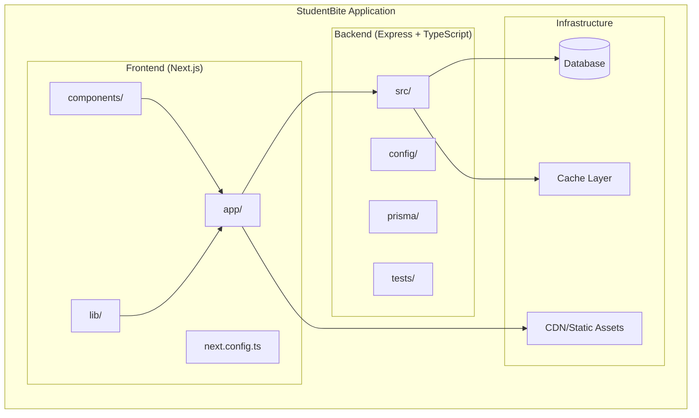
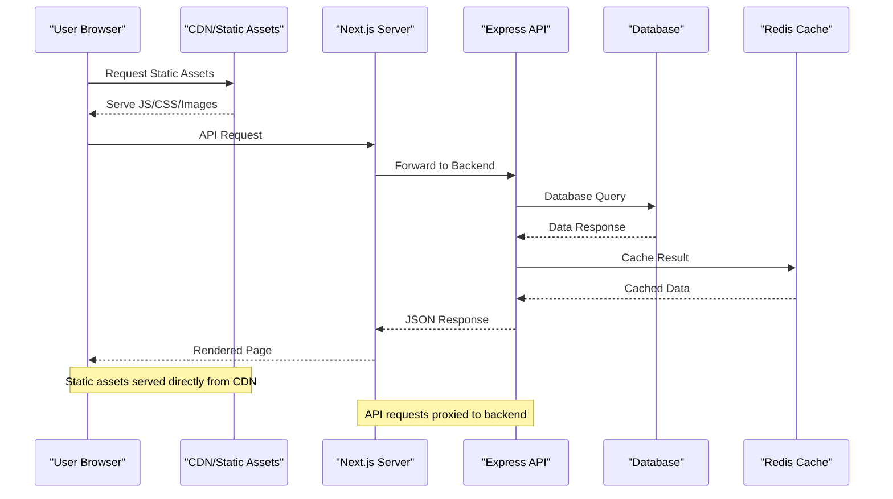
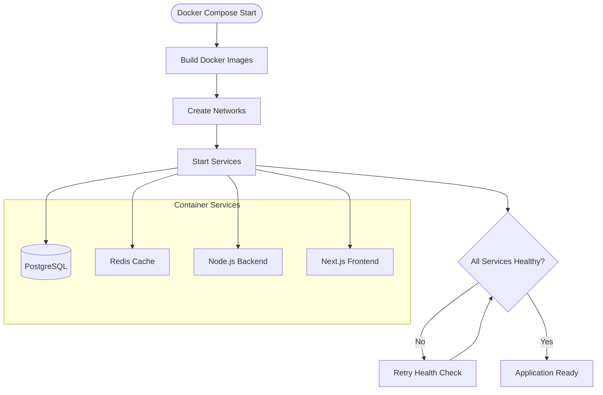
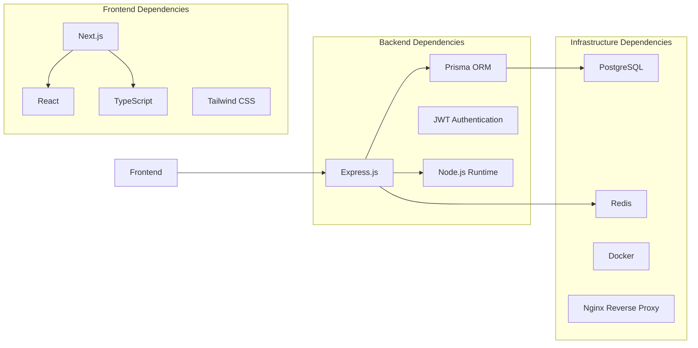

# Deployment Guide

<cite>
**Referenced Files in This Document**
- [Backend/package.json](file://Backend/package.json)
- [Frontend/studentbite/package.json](file://Frontend/studentbite/package.json)
- [Backend/tsconfig.json](file://Backend/tsconfig.json)
- [Backend/tsconfig.prod.json](file://Backend/tsconfig.prod.json)
- [Frontend/studentbite/next.config.ts](file://Frontend/studentbite/next.config.ts)
- [Backend/docker-compose.yml](file://Backend/docker-compose.yml)
- [Backend/prisma/schema.prisma](file://Backend/prisma/schema.prisma)
- [Backend/src/main.ts](file://Backend/src/main.ts)
- [Backend/src/server.ts](file://Backend/src/server.ts)
- [Backend/src/common/constants/env.ts](file://Backend/src/common/constants/env.ts)
- [Frontend/studentbite/app/layout.tsx](file://Frontend/studentbite/app/layout.tsx)
</cite>

## Table of Contents
1. [Introduction](#introduction)
2. [Project Structure](#project-structure)
3. [Core Components](#core-components)
4. [Architecture Overview](#architecture-overview)
5. [Detailed Component Analysis](#detailed-component-analysis)
6. [Dependency Analysis](#dependency-analysis)
7. [Performance Considerations](#performance-considerations)
8. [Troubleshooting Guide](#troubleshooting-guide)
9. [Conclusion](#conclusion)
10. [Appendices](#appendices)

## Introduction

StudentBite is a full-stack web application built with Next.js for the frontend and TypeScript/Express for the backend. This deployment guide provides comprehensive instructions for production deployment, including Docker containerization, environment configuration, security considerations, monitoring, and scaling strategies.

The application follows modern development practices with TypeScript for type safety, Prisma for database management, and Next.js for server-side rendering capabilities. The deployment architecture supports both development and production environments with proper separation of concerns.

## Project Structure

StudentBite follows a clear separation between frontend and backend components:



**Diagram sources**
- [Frontend/studentbite/package.json](file://Frontend/studentbite/package.json)
- [Backend/package.json](file://Backend/package.json)

**Section sources**
- [Backend/package.json](file://Backend/package.json)
- [Frontend/studentbite/package.json](file://Frontend/studentbite/package.json)

## Core Components

### Backend Architecture
The backend is built with Express.js and TypeScript, providing a robust API layer with the following key components:

- **Server Configuration**: Main server setup and middleware configuration
- **Route Handlers**: Modular route organization by feature
- **Service Layer**: Business logic abstraction
- **Data Access**: Prisma ORM for database operations
- **Authentication**: JWT-based user authentication
- **Crawlers**: Web scraping functionality for external data sources

### Frontend Architecture
The frontend uses Next.js with App Router for modern React development:

- **App Router**: File-based routing system
- **Component Library**: Reusable UI components
- **API Integration**: Client-side API communication
- **State Management**: React hooks and context
- **Styling**: CSS modules and global styles

**Section sources**
- [Backend/src/main.ts](file://Backend/src/main.ts)
- [Backend/src/server.ts](file://Backend/src/server.ts)
- [Frontend/studentbite/app/layout.tsx](file://Frontend/studentbite/app/layout.tsx)

## Architecture Overview

The StudentBite deployment architecture follows a microservices-inspired approach with clear separation of concerns:



**Diagram sources**
- [Backend/docker-compose.yml](file://Backend/docker-compose.yml)
- [Frontend/studentbite/next.config.ts](file://Frontend/studentbite/next.config.ts)

## Detailed Component Analysis

### Production Build Configuration

#### Backend TypeScript Configuration
The backend uses separate TypeScript configurations for development and production:

- **Development Config**: Optimized for debugging and hot reload
- **Production Config**: Optimized for performance and bundle size
- **Type Checking**: Strict type checking enabled in production builds
- **Source Maps**: Disabled in production for security

#### Frontend Next.js Configuration
The frontend leverages Next.js production optimizations:

- **Static Generation**: Pre-rendered pages for better performance
- **Code Splitting**: Automatic bundle splitting by route
- **Image Optimization**: Automatic image optimization and caching
- **CSS Minification**: Production CSS optimization

**Section sources**
- [Backend/tsconfig.json](file://Backend/tsconfig.json)
- [Backend/tsconfig.prod.json](file://Backend/tsconfig.prod.json)
- [Frontend/studentbite/next.config.ts](file://Frontend/studentbite/next.config.ts)

### Docker Containerization

The application uses Docker Compose for container orchestration:



**Diagram sources**
- [Backend/docker-compose.yml](file://Backend/docker-compose.yml)

### Environment Variable Management

Environment variables are managed through multiple layers:

- **Container Environment**: Docker environment variables
- **Application Config**: Runtime configuration loading
- **Secrets Management**: Sensitive data handling
- **Configuration Validation**: Environment validation at startup

**Section sources**
- [Backend/src/common/constants/env.ts](file://Backend/src/common/constants/env.ts)

### Database Configuration

The application uses Prisma ORM with PostgreSQL:

- **Schema Management**: Database schema defined in Prisma
- **Migrations**: Automated database migrations
- **Connection Pooling**: Efficient database connections
- **Backup Strategy**: Regular automated backups

**Section sources**
- [Backend/prisma/schema.prisma](file://Backend/prisma/schema.prisma)

## Dependency Analysis

The application has well-defined dependencies between components:



**Diagram sources**
- [Backend/package.json](file://Backend/package.json)
- [Frontend/studentbite/package.json](file://Frontend/studentbite/package.json)

**Section sources**
- [Backend/package.json](file://Backend/package.json)
- [Frontend/studentbite/package.json](file://Frontend/studentbite/package.json)

## Performance Considerations

### Backend Performance Optimizations
- **Connection Pooling**: Efficient database connection management
- **Caching Strategy**: Redis caching for frequently accessed data
- **Request Compression**: Gzip compression for API responses
- **Memory Management**: Proper garbage collection tuning

### Frontend Performance Optimizations
- **Code Splitting**: Route-based code splitting
- **Image Optimization**: Automatic image optimization
- **Bundle Analysis**: Bundle size optimization
- **Caching Strategy**: Browser caching headers

### Infrastructure Performance
- **Load Balancing**: Horizontal scaling support
- **CDN Integration**: Static asset delivery optimization
- **Database Indexing**: Optimized query performance
- **Monitoring**: Performance metrics collection

## Troubleshooting Guide

### Common Deployment Issues

#### Build Failures
- **TypeScript Errors**: Check compilation errors and type definitions
- **Missing Dependencies**: Verify all required packages are installed
- **Environment Variables**: Ensure all required variables are set
- **Port Conflicts**: Check for port conflicts in container networking

#### Runtime Issues
- **Database Connection**: Verify database connectivity and credentials
- **API Endpoints**: Test API endpoints individually
- **CORS Issues**: Configure CORS for cross-origin requests
- **SSL/TLS**: Verify SSL certificate configuration

#### Monitoring and Logging
- **Application Logs**: Centralized log collection
- **Error Tracking**: Error monitoring and alerting
- **Performance Metrics**: Key performance indicators tracking
- **Health Checks**: Service health monitoring

**Section sources**
- [Backend/src/common/utils/route-errors.ts](file://Backend/src/common/utils/route-errors.ts)

## Conclusion

StudentBite provides a robust foundation for deploying modern web applications. The combination of Next.js frontend, Express.js backend, and Docker containerization creates a scalable and maintainable deployment architecture. Following this guide ensures proper production deployment with security, performance, and reliability considerations.

Key deployment principles:
- **Security First**: Proper environment variable management and SSL configuration
- **Scalability**: Container-based architecture supporting horizontal scaling
- **Monitoring**: Comprehensive logging and health checks
- **Automation**: CI/CD pipeline integration for consistent deployments

## Appendices

### A. Quick Start Commands

#### Development Setup
```bash
# Install dependencies
npm install

# Run development servers
npm run dev
```

#### Production Build
```bash
# Build frontend
npm run build

# Build backend
npm run build:prod

# Start production services
docker-compose up -d
```

### B. Environment Variables Template

Create a `.env.production` file with the following variables:
- `DATABASE_URL`: PostgreSQL connection string
- `JWT_SECRET`: Secret key for JWT tokens
- `REDIS_URL`: Redis connection URL
- `NODE_ENV`: Set to "production"
- `PORT`: Backend server port

### C. Health Check Endpoints

- `/health`: Basic health check
- `/api/health`: API health status
- `/ready`: Readiness probe for load balancers

### D. Backup Procedures

#### Database Backups
- Automated daily backups
- Retention policy for backup files
- Restore procedures for disaster recovery

#### Configuration Backups
- Environment variable backups
- Docker configuration backups
- SSL certificate backups