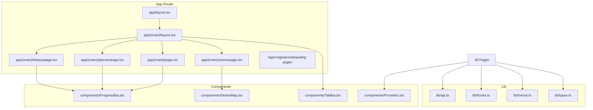
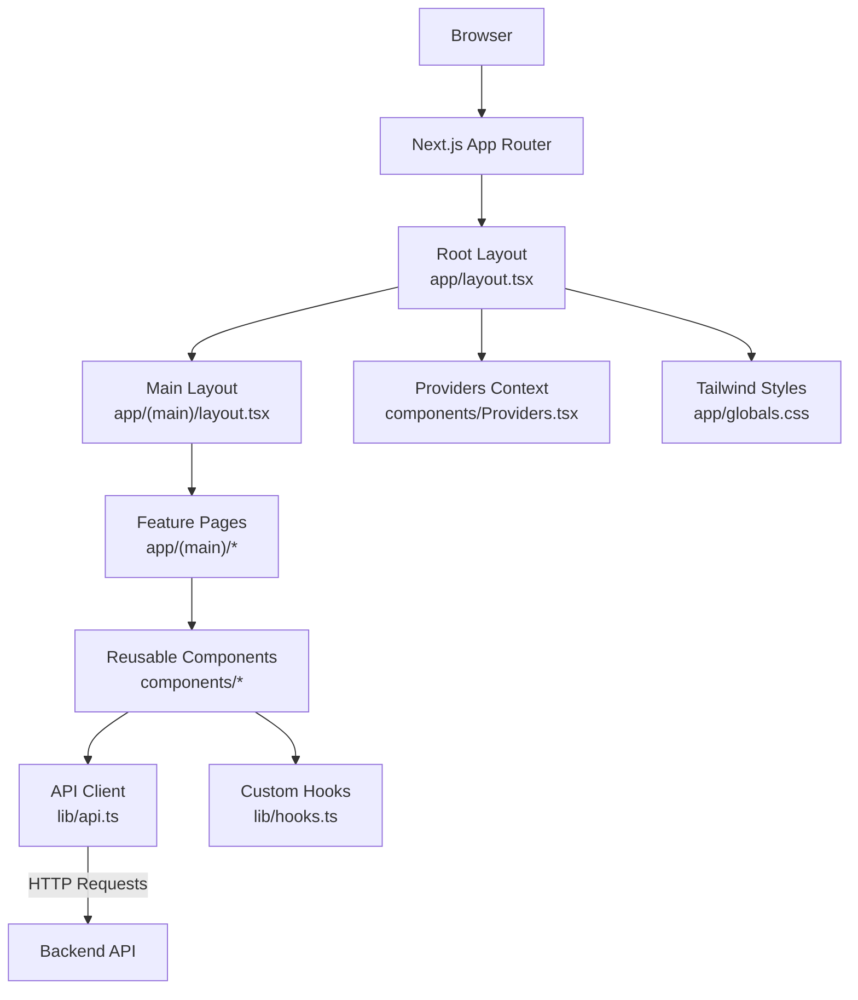
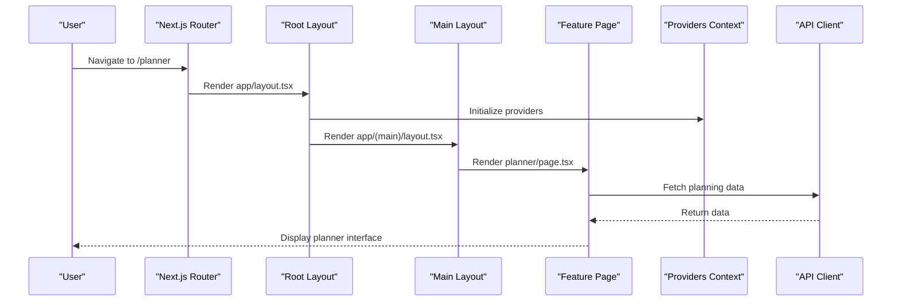
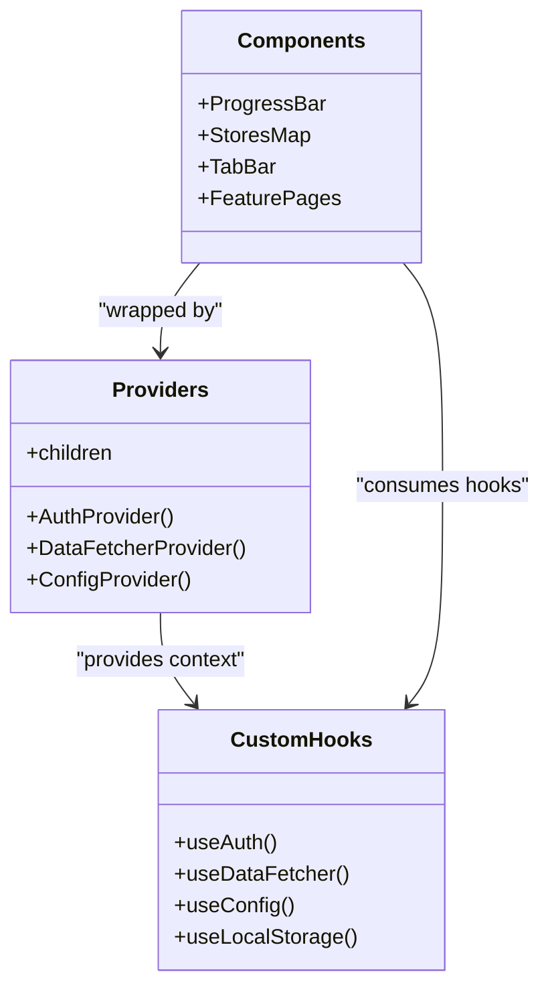
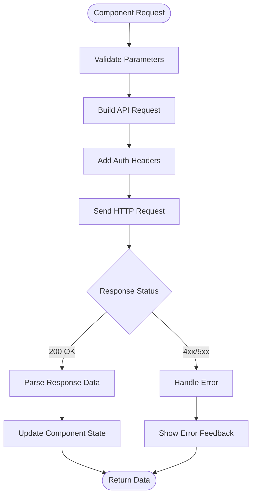
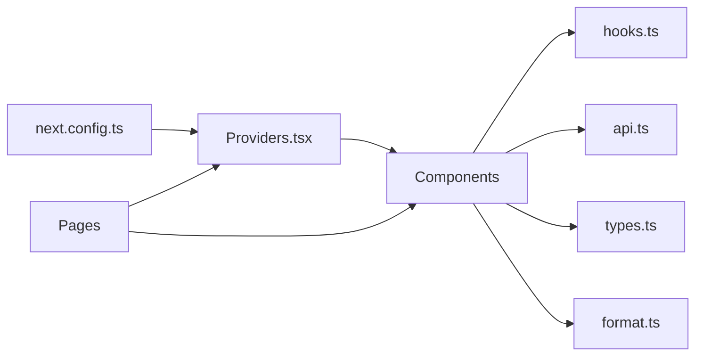

# Frontend Documentation

<cite>
**Referenced Files in This Document**
- [layout.tsx](file://Frontend/studentbite/app/layout.tsx)
- [layout.tsx](file://Frontend/studentbite/app/(main)/layout.tsx)
- [page.tsx](file://Frontend/studentbite/app/(main)/page.tsx)
- [page.tsx](file://Frontend/studentbite/app/(main)/planner/page.tsx)
- [page.tsx](file://Frontend/studentbite/app/(main)/stores/page.tsx)
- [page.tsx](file://Frontend/studentbite/app/(main)/history/page.tsx)
- [page.tsx](file://Frontend/studentbite/app/login/page.tsx)
- [page.tsx](file://Frontend/studentbite/app/register/page.tsx)
- [page.tsx](file://Frontend/studentbite/app/onboarding/page.tsx)
- [ProgressBar.tsx](file://Frontend/studentbite/components/ProgressBar.tsx)
- [StoresMap.tsx](file://Frontend/studentbite/components/StoresMap.tsx)
- [TabBar.tsx](file://Frontend/studentbite/components/TabBar.tsx)
- [Providers.tsx](file://Frontend/studentbite/components/Providers.tsx)
- [api.ts](file://Frontend/studentbite/lib/api.ts)
- [hooks.ts](file://Frontend/studentbite/lib/hooks.ts)
- [format.ts](file://Frontend/studentbite/lib/format.ts)
- [types.ts](file://Frontend/studentbite/lib/types.ts)
- [globals.css](file://Frontend/studentbite/app/globals.css)
- [next.config.ts](file://Frontend/studentbite/next.config.ts)
</cite>

## Table of Contents
1. [Introduction](#introduction)
2. [Project Structure](#project-structure)
3. [Core Components](#core-components)
4. [Architecture Overview](#architecture-overview)
5. [Detailed Component Analysis](#detailed-component-analysis)
6. [Dependency Analysis](#dependency-analysis)
7. [Performance Considerations](#performance-considerations)
8. [Troubleshooting Guide](#troubleshooting-guide)
9. [Conclusion](#conclusion)

## Introduction
This document provides comprehensive frontend documentation for the StudentBite Next.js application. It explains the App Router structure, component hierarchy, state management using React hooks and context, API client implementation, and styling with Tailwind CSS. It also covers page organization under app/(main)/, reusable components such as ProgressBar, StoresMap, and TabBar, and the providers pattern for global state. Navigation patterns, form handling, and responsive design considerations specific to the student-focused interface are included.

## Project Structure
The frontend is organized using Next.js App Router conventions:
- app/: Root of the application routes
  - (main)/: Grouped layout for authenticated/main features
    - page.tsx: Main dashboard entry
    - planner/page.tsx: Meal planning feature
    - stores/page.tsx: Store discovery and mapping
    - history/page.tsx: Historical data view
    - layout.tsx: Shared layout for main routes
  - login/page.tsx: Authentication entry
  - register/page.tsx: Registration flow
  - onboarding/page.tsx: First-time user setup
  - layout.tsx: Root layout wrapping all pages
  - globals.css: Global styles and Tailwind directives
- components/: Reusable UI components
  - ProgressBar.tsx: Progress indicator
  - StoresMap.tsx: Interactive store map
  - TabBar.tsx: Bottom navigation bar
  - Providers.tsx: Context providers for global state
- lib/: Utilities and shared logic
  - api.ts: API client
  - hooks.ts: Custom React hooks
  - format.ts: Formatting utilities
  - types.ts: TypeScript type definitions

**Diagram sources**
- [layout.tsx](file://Frontend/studentbite/app/layout.tsx)
- [layout.tsx](file://Frontend/studentbite/app/(main)/layout.tsx)
- [page.tsx](file://Frontend/studentbite/app/(main)/page.tsx)
- [page.tsx](file://Frontend/studentbite/app/(main)/planner/page.tsx)
- [page.tsx](file://Frontend/studentbite/app/(main)/stores/page.tsx)
- [page.tsx](file://Frontend/studentbite/app/(main)/history/page.tsx)
- [ProgressBar.tsx](file://Frontend/studentbite/components/ProgressBar.tsx)
- [StoresMap.tsx](file://Frontend/studentbite/components/StoresMap.tsx)
- [TabBar.tsx](file://Frontend/studentbite/components/TabBar.tsx)
- [Providers.tsx](file://Frontend/studentbite/components/Providers.tsx)
- [api.ts](file://Frontend/studentbite/lib/api.ts)
- [hooks.ts](file://Frontend/studentbite/lib/hooks.ts)
- [format.ts](file://Frontend/studentbite/lib/format.ts)
- [types.ts](file://Frontend/studentbite/lib/types.ts)

**Section sources**
- [layout.tsx](file://Frontend/studentbite/app/layout.tsx)
- [layout.tsx](file://Frontend/studentbite/app/(main)/layout.tsx)
- [page.tsx](file://Frontend/studentbite/app/(main)/page.tsx)
- [page.tsx](file://Frontend/studentbite/app/(main)/planner/page.tsx)
- [page.tsx](file://Frontend/studentbite/app/(main)/stores/page.tsx)
- [page.tsx](file://Frontend/studentbite/app/(main)/history/page.tsx)
- [ProgressBar.tsx](file://Frontend/studentbite/components/ProgressBar.tsx)
- [StoresMap.tsx](file://Frontend/studentbite/components/StoresMap.tsx)
- [TabBar.tsx](file://Frontend/studentbite/components/TabBar.tsx)
- [Providers.tsx](file://Frontend/studentbite/components/Providers.tsx)
- [api.ts](file://Frontend/studentbite/lib/api.ts)
- [hooks.ts](file://Frontend/studentbite/lib/hooks.ts)
- [format.ts](file://Frontend/studentbite/lib/format.ts)
- [types.ts](file://Frontend/studentbite/lib/types.ts)

## Core Components
- ProgressBar: Displays progress indicators used across features like meal planning and history views. It abstracts visual feedback for loading states and completion metrics.
- StoresMap: Renders an interactive map for store locations, integrating with location services and displaying markers for nearby stores.
- TabBar: Provides bottom navigation for mobile-first experiences, enabling quick switching between main sections.
- Providers: Wraps the application with context providers to manage global state, authentication, and configuration.

These components follow a consistent API surface and integrate with the API client and custom hooks for data fetching and state synchronization.

**Section sources**
- [ProgressBar.tsx](file://Frontend/studentbite/components/ProgressBar.tsx)
- [StoresMap.tsx](file://Frontend/studentbite/components/StoresMap.tsx)
- [TabBar.tsx](file://Frontend/studentbite/components/TabBar.tsx)
- [Providers.tsx](file://Frontend/studentbite/components/Providers.tsx)

## Architecture Overview
StudentBite uses Next.js App Router for routing and server-side rendering where applicable. The root layout sets up global providers and styles, while the (main) group encapsulates authenticated routes with shared layout and navigation. Components consume context from Providers and fetch data via the centralized API client. Tailwind CSS is applied through global styles and utility classes for responsive design.

**Diagram sources**
- [layout.tsx](file://Frontend/studentbite/app/layout.tsx)
- [layout.tsx](file://Frontend/studentbite/app/(main)/layout.tsx)
- [Providers.tsx](file://Frontend/studentbite/components/Providers.tsx)
- [api.ts](file://Frontend/studentbite/lib/api.ts)
- [hooks.ts](file://Frontend/studentbite/lib/hooks.ts)
- [page.tsx](file://Frontend/studentbite/app/(main)/page.tsx)
- [page.tsx](file://Frontend/studentbite/app/(main)/planner/page.tsx)
- [page.tsx](file://Frontend/studentbite/app/(main)/stores/page.tsx)
- [page.tsx](file://Frontend/studentbite/app/(main)/history/page.tsx)
- [globals.css](file://Frontend/studentbite/app/globals.css)

## Detailed Component Analysis

### App Router and Page Organization
- Root layout establishes global providers, metadata, and Tailwind integration.
- (main) layout groups authenticated routes and injects shared navigation and layout elements.
- Feature pages implement specific functionality:
  - Dashboard: Entry point for main features
  - Planner: Meal planning interface with progress tracking
  - Stores: Store discovery with interactive map
  - History: Historical data visualization

**Diagram sources**
- [layout.tsx](file://Frontend/studentbite/app/layout.tsx)
- [layout.tsx](file://Frontend/studentbite/app/(main)/layout.tsx)
- [page.tsx](file://Frontend/studentbite/app/(main)/planner/page.tsx)
- [Providers.tsx](file://Frontend/studentbite/components/Providers.tsx)
- [api.ts](file://Frontend/studentbite/lib/api.ts)

**Section sources**
- [layout.tsx](file://Frontend/studentbite/app/layout.tsx)
- [layout.tsx](file://Frontend/studentbite/app/(main)/layout.tsx)
- [page.tsx](file://Frontend/studentbite/app/(main)/page.tsx)
- [page.tsx](file://Frontend/studentbite/app/(main)/planner/page.tsx)
- [page.tsx](file://Frontend/studentbite/app/(main)/stores/page.tsx)
- [page.tsx](file://Frontend/studentbite/app/(main)/history/page.tsx)

### State Management with React Hooks and Context
- Providers component wraps the application with context providers for global state management
- Custom hooks in lib/hooks.ts encapsulate complex state logic and side effects
- Components consume context directly or through hooks for data access and updates
- Pattern supports both local component state and global application state

**Diagram sources**
- [Providers.tsx](file://Frontend/studentbite/components/Providers.tsx)
- [hooks.ts](file://Frontend/studentbite/lib/hooks.ts)
- [ProgressBar.tsx](file://Frontend/studentbite/components/ProgressBar.tsx)
- [StoresMap.tsx](file://Frontend/studentbite/components/StoresMap.tsx)
- [TabBar.tsx](file://Frontend/studentbite/components/TabBar.tsx)

**Section sources**
- [Providers.tsx](file://Frontend/studentbite/components/Providers.tsx)
- [hooks.ts](file://Frontend/studentbite/lib/hooks.ts)

### API Client Implementation
The API client centralizes HTTP requests, error handling, and response processing:
- Base URL configuration and request interceptors
- Typed responses using TypeScript interfaces
- Error handling and retry logic
- Integration with authentication tokens

**Diagram sources**
- [api.ts](file://Frontend/studentbite/lib/api.ts)

**Section sources**
- [api.ts](file://Frontend/studentbite/lib/api.ts)

### Styling with Tailwind CSS
- Global styles defined in app/globals.css include Tailwind directives and custom theme configurations
- Utility-first approach with responsive breakpoints for mobile-first design
- Consistent color palette and spacing system throughout the application
- Dark mode support and accessibility considerations

**Section sources**
- [globals.css](file://Frontend/studentbite/app/globals.css)

## Dependency Analysis
The application follows a clear dependency hierarchy:
- Components depend on hooks and API client
- Pages depend on components and providers
- Providers wrap the entire application tree
- Configuration flows from next.config.ts through providers to components

**Diagram sources**
- [next.config.ts](file://Frontend/studentbite/next.config.ts)
- [Providers.tsx](file://Frontend/studentbite/components/Providers.tsx)
- [hooks.ts](file://Frontend/studentbite/lib/hooks.ts)
- [api.ts](file://Frontend/studentbite/lib/api.ts)
- [types.ts](file://Frontend/studentbite/lib/types.ts)
- [format.ts](file://Frontend/studentbite/lib/format.ts)

**Section sources**
- [next.config.ts](file://Frontend/studentbite/next.config.ts)
- [Providers.tsx](file://Frontend/studentbite/components/Providers.tsx)
- [hooks.ts](file://Frontend/studentbite/lib/hooks.ts)
- [api.ts](file://Frontend/studentbite/lib/api.ts)
- [types.ts](file://Frontend/studentbite/lib/types.ts)
- [format.ts](file://Frontend/studentbite/lib/format.ts)

## Performance Considerations
- Lazy loading of components and routes for improved initial load times
- Efficient state updates using React.memo and useMemo where appropriate
- Optimized API calls with proper caching strategies
- Responsive images and assets for better mobile performance
- Code splitting at route level for faster navigation

## Troubleshooting Guide
Common issues and solutions:
- API connection errors: Check network connectivity and backend availability
- Authentication problems: Verify token storage and expiration handling
- State synchronization issues: Ensure proper context provider hierarchy
- Mobile responsiveness: Test on various screen sizes and orientations
- Performance bottlenecks: Use React DevTools to identify re-render issues

**Section sources**
- [api.ts](file://Frontend/studentbite/lib/api.ts)
- [Providers.tsx](file://Frontend/studentbite/components/Providers.tsx)
- [hooks.ts](file://Frontend/studentbite/lib/hooks.ts)

## Conclusion
StudentBite's frontend architecture demonstrates a well-structured Next.js application with clear separation of concerns. The App Router provides efficient routing, React hooks and context enable effective state management, and Tailwind CSS ensures responsive design. The modular component structure promotes reusability and maintainability, while the centralized API client simplifies data operations. This foundation supports the student-focused interface with intuitive navigation and smooth user experience.