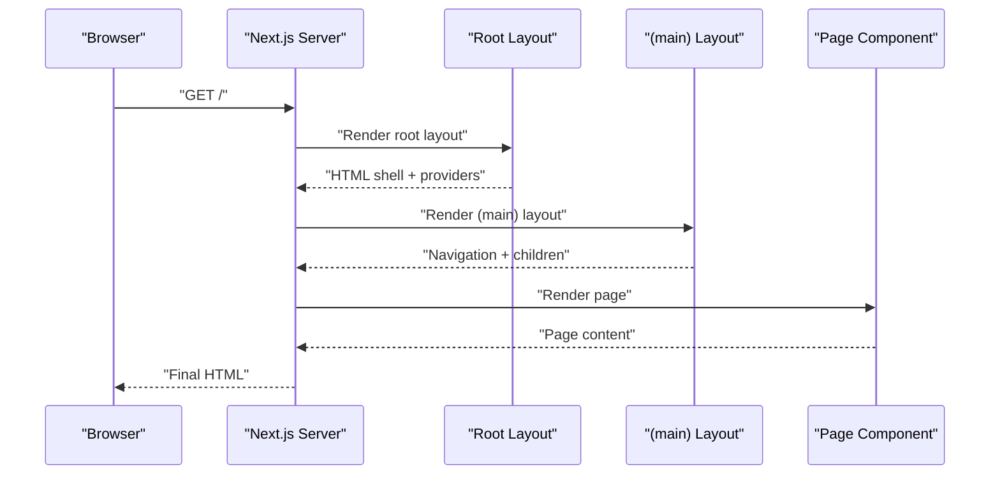
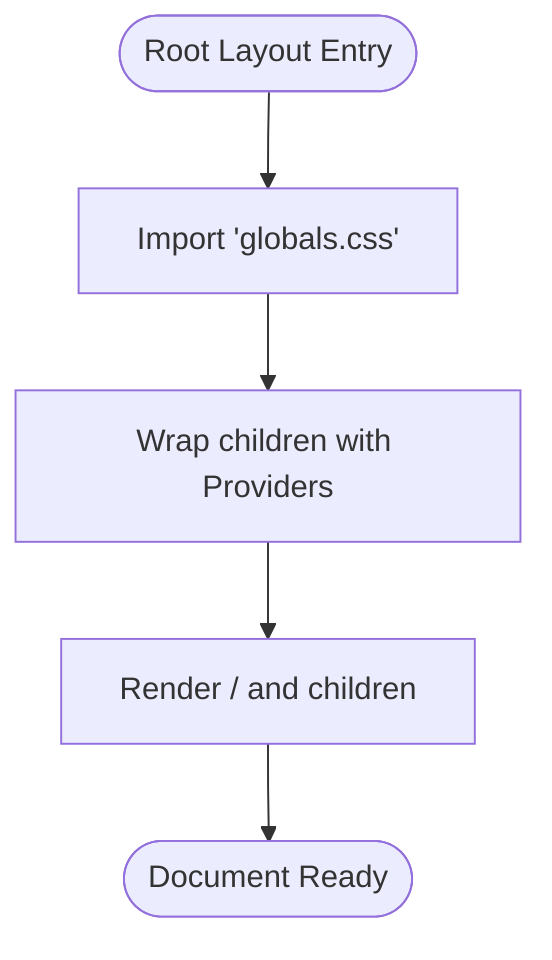
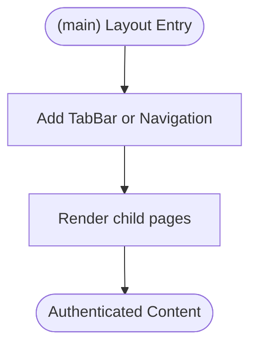
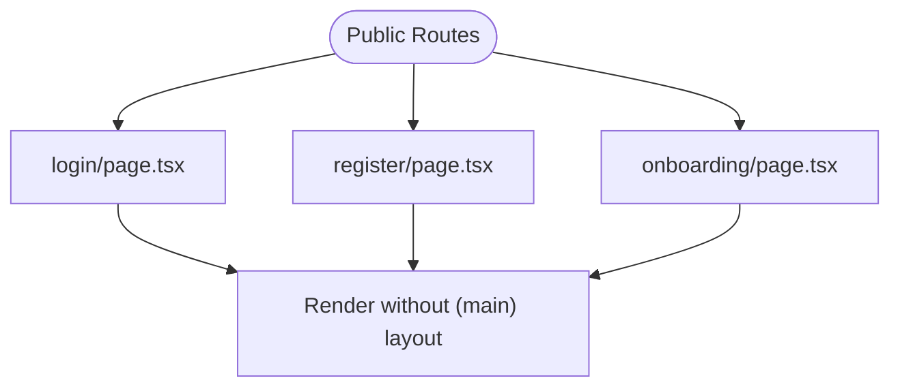
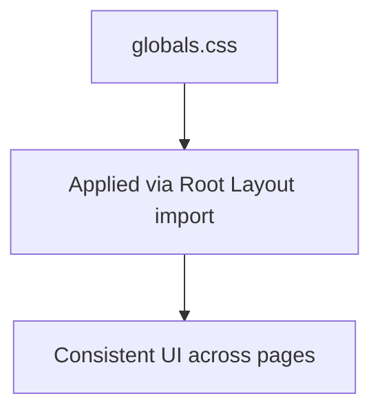
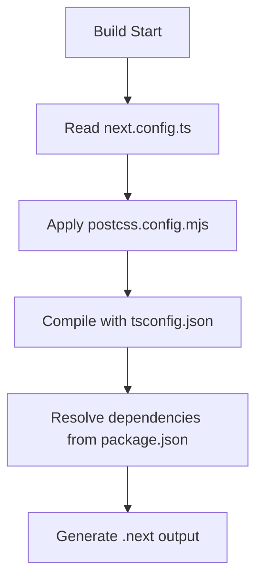
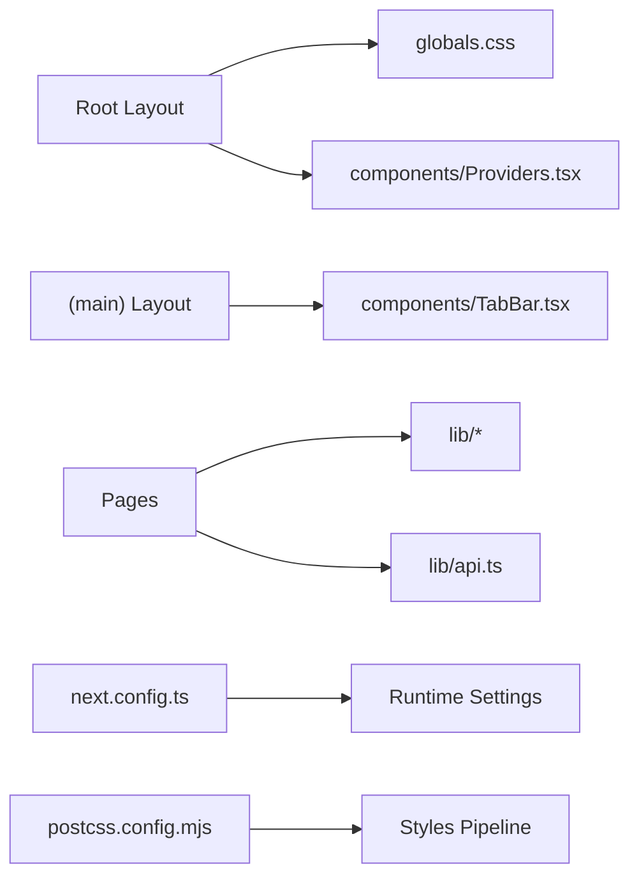

# Next.js Application Structure

<cite>
**Referenced Files in This Document**
- [layout.tsx](file://Frontend/studentbite/app/layout.tsx)
- [layout.tsx](file://Frontend/studentbite/app/(main)/layout.tsx)
- [page.tsx](file://Frontend/studentbite/app/(main)/page.tsx)
- [page.tsx](file://Frontend/studentbite/app/(main)/history/page.tsx)
- [page.tsx](file://Frontend/studentbite/app/(main)/planner/page.tsx)
- [page.tsx](file://Frontend/studentbite/app/(main)/stores/page.tsx)
- [page.tsx](file://Frontend/studentbite/app/login/page.tsx)
- [page.tsx](file://Frontend/studentbite/app/onboarding/page.tsx)
- [page.tsx](file://Frontend/studentbite/app/register/page.tsx)
- [globals.css](file://Frontend/studentbite/app/globals.css)
- [next.config.ts](file://Frontend/studentbite/next.config.ts)
- [postcss.config.mjs](file://Frontend/studentbite/postcss.config.mjs)
- [tsconfig.json](file://Frontend/studentbite/tsconfig.json)
- [package.json](file://Frontend/studentbite/package.json)
</cite>

## Table of Contents
1. [Introduction](#introduction)
2. [Project Structure](#project-structure)
3. [Core Components](#core-components)
4. [Architecture Overview](#architecture-overview)
5. [Detailed Component Analysis](#detailed-component-analysis)
6. [Dependency Analysis](#dependency-analysis)
7. [Performance Considerations](#performance-considerations)
8. [Troubleshooting Guide](#troubleshooting-guide)
9. [Conclusion](#conclusion)

## Introduction
This document explains the Next.js application structure for the StudentBite frontend, focusing on the App Router organization, route groups, layout hierarchy, global configurations, metadata handling, and build settings. It is intended to help both new contributors and experienced developers understand how pages are organized, how layouts compose, and how the project is configured for development and production.

## Project Structure
The StudentBite frontend uses the Next.js App Router with a clear separation between public routes (login, register, onboarding) and authenticated/main content under the (main) route group. Global styles and root-level metadata are defined at the app directory level, while shared UI components live under components and utilities under lib.

```mermaid
graph TB
subgraph "App Router"
RootLayout["app/layout.tsx"]
Globals["app/globals.css"]
MainGroup["app/(main)/layout.tsx"]
Home["app/(main)/page.tsx"]
History["app/(main)/history/page.tsx"]
Planner["app/(main)/planner/page.tsx"]
Stores["app/(main)/stores/page.tsx"]
Login["app/login/page.tsx"]
Register["app/register/page.tsx"]
Onboarding["app/onboarding/page.tsx"]
end
subgraph "Shared"
Providers["components/Providers.tsx"]
TabBar["components/TabBar.tsx"]
ProgressBar["components/ProgressBar.tsx"]
StoresMap["components/StoresMap.tsx"]
end
subgraph "Config"
NextCfg["next.config.ts"]
PostCSS["postcss.config.mjs"]
TSConf["tsconfig.json"]
Pkg["package.json"]
end
RootLayout --> MainGroup
MainGroup --> Home
MainGroup --> History
MainGroup --> Planner
MainGroup --> Stores
RootLayout --> Login
RootLayout --> Register
RootLayout --> Onboarding
RootLayout --> Globals
RootLayout --> Providers
RootLayout --> TabBar
RootLayout --> ProgressBar
RootLayout --> StoresMap
RootLayout --> NextCfg
RootLayout --> PostCSS
RootLayout --> TSConf
RootLayout --> Pkg
```

**Diagram sources**
- [layout.tsx](file://Frontend/studentbite/app/layout.tsx)
- [layout.tsx](file://Frontend/studentbite/app/(main)/layout.tsx)
- [page.tsx](file://Frontend/studentbite/app/(main)/page.tsx)
- [page.tsx](file://Frontend/studentbite/app/(main)/history/page.tsx)
- [page.tsx](file://Frontend/studentbite/app/(main)/planner/page.tsx)
- [page.tsx](file://Frontend/studentbite/app/(main)/stores/page.tsx)
- [page.tsx](file://Frontend/studentbite/app/login/page.tsx)
- [page.tsx](file://Frontend/studentbite/app/register/page.tsx)
- [page.tsx](file://Frontend/studentbite/app/onboarding/page.tsx)
- [globals.css](file://Frontend/studentbite/app/globals.css)
- [next.config.ts](file://Frontend/studentbite/next.config.ts)
- [postcss.config.mjs](file://Frontend/studentbite/postcss.config.mjs)
- [tsconfig.json](file://Frontend/studentbite/tsconfig.json)
- [package.json](file://Frontend/studentbite/package.json)

**Section sources**
- [layout.tsx](file://Frontend/studentbite/app/layout.tsx)
- [layout.tsx](file://Frontend/studentbite/app/(main)/layout.tsx)
- [page.tsx](file://Frontend/studentbite/app/(main)/page.tsx)
- [page.tsx](file://Frontend/studentbite/app/(main)/history/page.tsx)
- [page.tsx](file://Frontend/studentbite/app/(main)/planner/page.tsx)
- [page.tsx](file://Frontend/studentbite/app/(main)/stores/page.tsx)
- [page.tsx](file://Frontend/studentbite/app/login/page.tsx)
- [page.tsx](file://Frontend/studentbite/app/register/page.tsx)
- [page.tsx](file://Frontend/studentbite/app/onboarding/page.tsx)
- [globals.css](file://Frontend/studentbite/app/globals.css)
- [next.config.ts](file://Frontend/studentbite/next.config.ts)
- [postcss.config.mjs](file://Frontend/studentbite/postcss.config.mjs)
- [tsconfig.json](file://Frontend/studentbite/tsconfig.json)
- [package.json](file://Frontend/studentbite/package.json)

## Core Components
- Root layout: Defines the top-level HTML shell, imports global CSS, and provides context providers that wrap all pages.
- (main) layout: Wraps authenticated sections, typically adding navigation elements like a tab bar or persistent UI chrome.
- Pages: Each route file exports a page component; the (main) group shares its layout across history, planner, and stores.
- Shared components: Providers, TabBar, ProgressBar, and StoresMap encapsulate reusable UI and client-side logic.

Key responsibilities:
- Metadata handling at the root layout ensures consistent SEO and browser tab information.
- Global styles are centralized in globals.css and imported once at the root.
- Client-only features are isolated in components and hooks under lib.

**Section sources**
- [layout.tsx](file://Frontend/studentbite/app/layout.tsx)
- [layout.tsx](file://Frontend/studentbite/app/(main)/layout.tsx)
- [page.tsx](file://Frontend/studentbite/app/(main)/page.tsx)
- [page.tsx](file://Frontend/studentbite/app/(main)/history/page.tsx)
- [page.tsx](file://Frontend/studentbite/app/(main)/planner/page.tsx)
- [page.tsx](file://Frontend/studentbite/app/(main)/stores/page.tsx)
- [page.tsx](file://Frontend/studentbite/app/login/page.tsx)
- [page.tsx](file://Frontend/studentbite/app/register/page.tsx)
- [page.tsx](file://Frontend/studentbite/app/onboarding/page.tsx)
- [globals.css](file://Frontend/studentbite/app/globals.css)

## Architecture Overview
The App Router composes nested layouts to create a layered UI. The root layout sets up the document and global providers. The (main) layout adds navigation around authenticated pages. Public routes bypass the (main) layout.

**Diagram sources**
- [layout.tsx](file://Frontend/studentbite/app/layout.tsx)
- [layout.tsx](file://Frontend/studentbite/app/(main)/layout.tsx)
- [page.tsx](file://Frontend/studentbite/app/(main)/page.tsx)

## Detailed Component Analysis

### Root Layout
- Purpose: Provides the base HTML structure, imports global CSS, and wraps the app with providers (e.g., theme, auth, data fetching).
- Metadata: Centralizes site-wide metadata such as title, description, and icons.
- Styling: Imports globals.css to apply global styles across the entire app.

**Diagram sources**
- [layout.tsx](file://Frontend/studentbite/app/layout.tsx)
- [globals.css](file://Frontend/studentbite/app/globals.css)

**Section sources**
- [layout.tsx](file://Frontend/studentbite/app/layout.tsx)
- [globals.css](file://Frontend/studentbite/app/globals.css)

### (main) Route Group Layout
- Purpose: Encapsulates authenticated navigation and shared UI chrome for protected routes.
- Behavior: All pages under (main) inherit this layout, ensuring consistent navigation and layout behavior.

**Diagram sources**
- [layout.tsx](file://Frontend/studentbite/app/(main)/layout.tsx)
- [page.tsx](file://Frontend/studentbite/app/(main)/page.tsx)
- [page.tsx](file://Frontend/studentbite/app/(main)/history/page.tsx)
- [page.tsx](file://Frontend/studentbite/app/(main)/planner/page.tsx)
- [page.tsx](file://Frontend/studentbite/app/(main)/stores/page.tsx)

**Section sources**
- [layout.tsx](file://Frontend/studentbite/app/(main)/layout.tsx)
- [page.tsx](file://Frontend/studentbite/app/(main)/page.tsx)
- [page.tsx](file://Frontend/studentbite/app/(main)/history/page.tsx)
- [page.tsx](file://Frontend/studentbite/app/(main)/planner/page.tsx)
- [page.tsx](file://Frontend/studentbite/app/(main)/stores/page.tsx)

### Public Routes
- login, register, onboarding: Standalone pages not wrapped by the (main) layout, suitable for authentication flows and initial setup.

**Diagram sources**
- [page.tsx](file://Frontend/studentbite/app/login/page.tsx)
- [page.tsx](file://Frontend/studentbite/app/register/page.tsx)
- [page.tsx](file://Frontend/studentbite/app/onboarding/page.tsx)

**Section sources**
- [page.tsx](file://Frontend/studentbite/app/login/page.tsx)
- [page.tsx](file://Frontend/studentbite/app/register/page.tsx)
- [page.tsx](file://Frontend/studentbite/app/onboarding/page.tsx)

### Global Styles
- globals.css: Contains global CSS rules applied across the entire application. Imported once in the root layout to ensure consistent styling.

**Diagram sources**
- [globals.css](file://Frontend/studentbite/app/globals.css)
- [layout.tsx](file://Frontend/studentbite/app/layout.tsx)

**Section sources**
- [globals.css](file://Frontend/studentbite/app/globals.css)
- [layout.tsx](file://Frontend/studentbite/app/layout.tsx)

### Configuration Files
- next.config.ts: Central configuration for Next.js including optimizations, redirects, headers, and environment-specific settings.
- postcss.config.mjs: Configures PostCSS plugins used by Tailwind CSS or other processors.
- tsconfig.json: TypeScript configuration for the Next.js app.
- package.json: Dependencies, scripts, and project metadata.

**Diagram sources**
- [next.config.ts](file://Frontend/studentbite/next.config.ts)
- [postcss.config.mjs](file://Frontend/studentbite/postcss.config.mjs)
- [tsconfig.json](file://Frontend/studentbite/tsconfig.json)
- [package.json](file://Frontend/studentbite/package.json)

**Section sources**
- [next.config.ts](file://Frontend/studentbite/next.config.ts)
- [postcss.config.mjs](file://Frontend/studentbite/postcss.config.mjs)
- [tsconfig.json](file://Frontend/studentbite/tsconfig.json)
- [package.json](file://Frontend/studentbite/package.json)

## Dependency Analysis
The App Router organizes code into logical layers:
- Root layout depends on global styles and providers.
- (main) layout depends on shared UI components like TabBar.
- Pages depend on lib utilities and API clients.
- Configuration files influence build-time behavior and runtime environment.

**Diagram sources**
- [layout.tsx](file://Frontend/studentbite/app/layout.tsx)
- [layout.tsx](file://Frontend/studentbite/app/(main)/layout.tsx)
- [globals.css](file://Frontend/studentbite/app/globals.css)
- [next.config.ts](file://Frontend/studentbite/next.config.ts)
- [postcss.config.mjs](file://Frontend/studentbite/postcss.config.mjs)

**Section sources**
- [layout.tsx](file://Frontend/studentbite/app/layout.tsx)
- [layout.tsx](file://Frontend/studentbite/app/(main)/layout.tsx)
- [globals.css](file://Frontend/studentbite/app/globals.css)
- [next.config.ts](file://Frontend/studentbite/next.config.ts)
- [postcss.config.mjs](file://Frontend/studentbite/postcss.config.mjs)

## Performance Considerations
- Use Next.js built-in optimizations: image optimization, font loading, and script management via next.config.ts.
- Keep global styles minimal and scoped where possible to reduce CSS payload.
- Prefer client components only when necessary; keep server components default for better performance.
- Leverage route-based code splitting through the App Router to load only required code per page.

[No sources needed since this section provides general guidance]

## Troubleshooting Guide
Common issues and resolutions:
- Styles not applying: Ensure globals.css is imported in the root layout and PostCSS is correctly configured.
- Metadata missing: Verify metadata export in the root layout and any page-level overrides.
- Build errors: Check next.config.ts syntax and environment variables; validate tsconfig.json paths.
- Routing problems: Confirm route group parentheses and file naming conventions for App Router.

**Section sources**
- [globals.css](file://Frontend/studentbite/app/globals.css)
- [layout.tsx](file://Frontend/studentbite/app/layout.tsx)
- [next.config.ts](file://Frontend/studentbite/next.config.ts)
- [postcss.config.mjs](file://Frontend/studentbite/postcss.config.mjs)
- [tsconfig.json](file://Frontend/studentbite/tsconfig.json)

## Conclusion
The StudentBite Next.js application follows a clean App Router structure with a root layout providing global context and styles, and an authenticated (main) route group sharing common navigation. Configuration is centralized in next.config.ts and supporting files, enabling consistent builds and optimized delivery. This organization promotes maintainability, scalability, and clarity for contributors.

[No sources needed since this section summarizes without analyzing specific files]