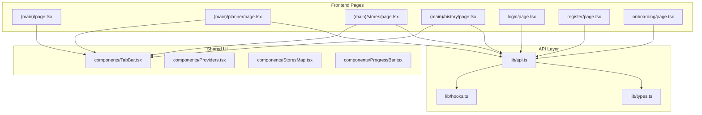
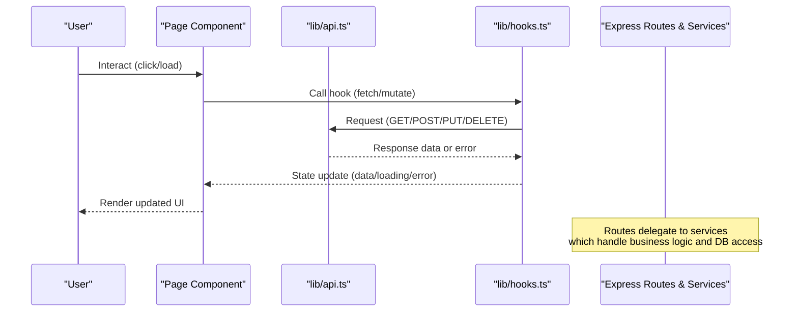
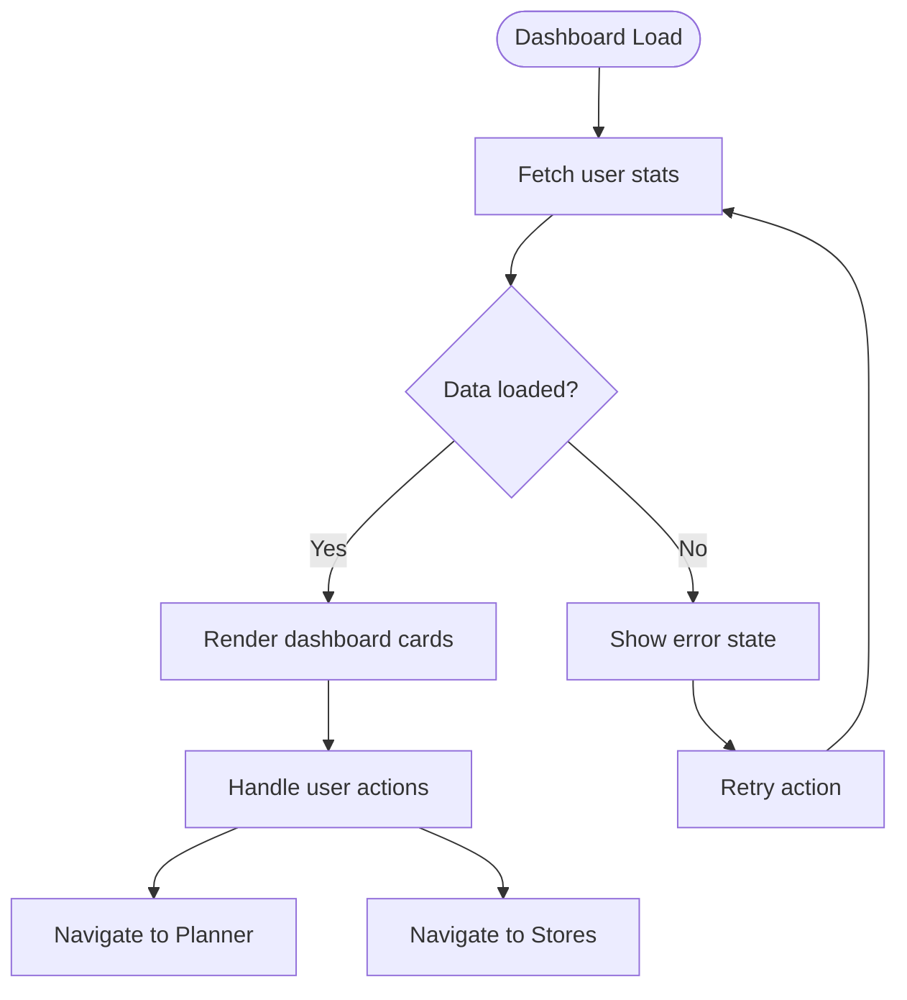
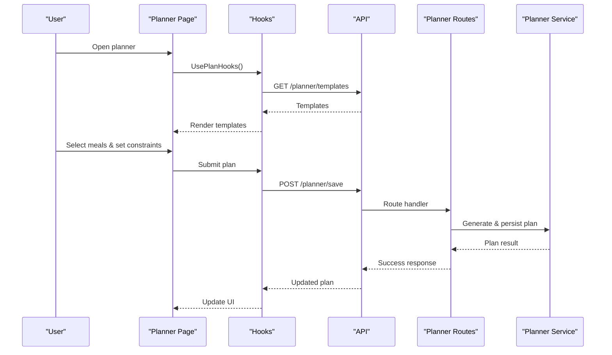
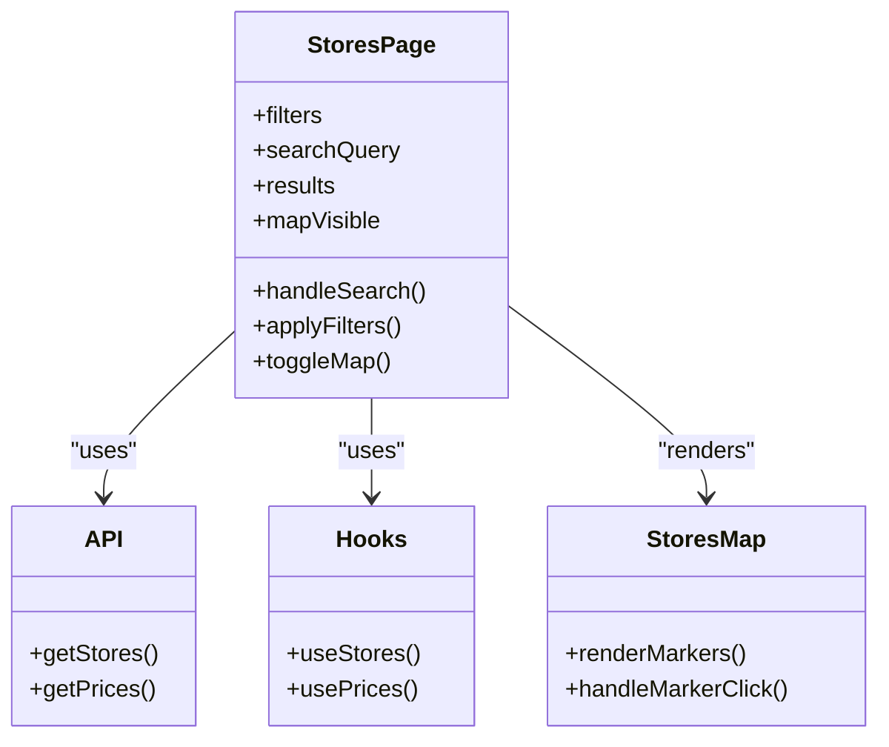
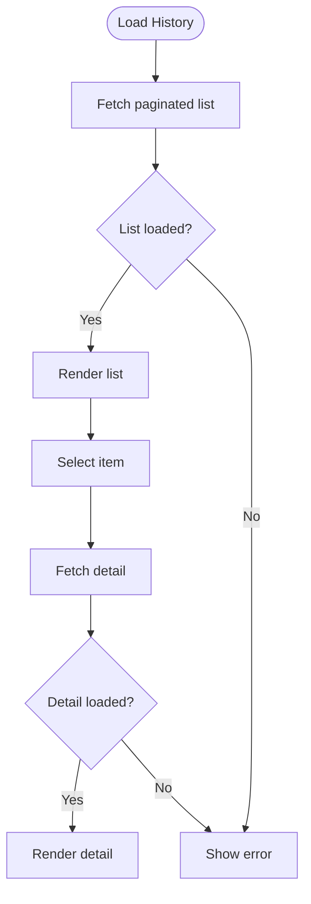
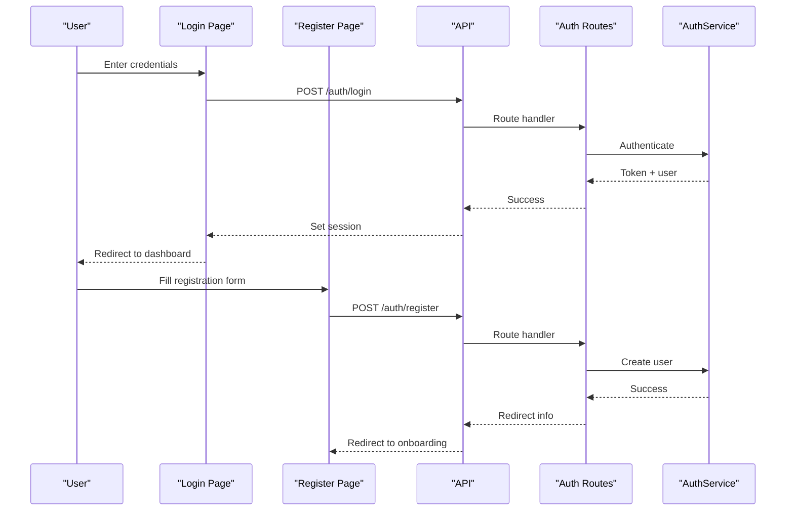
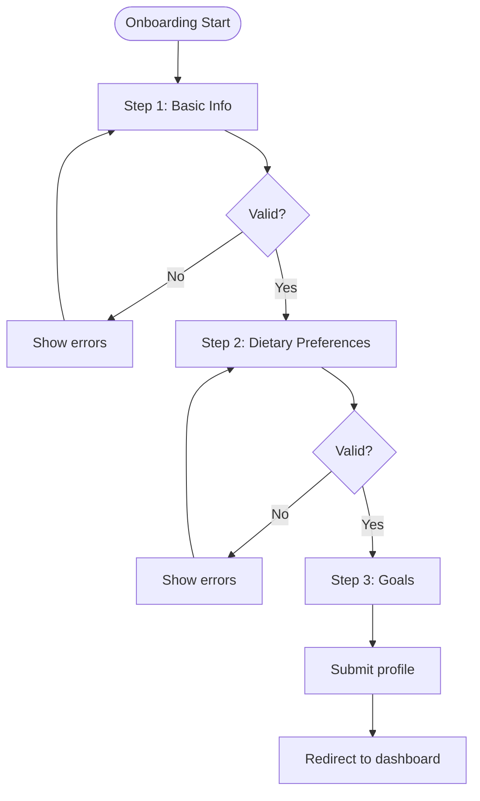
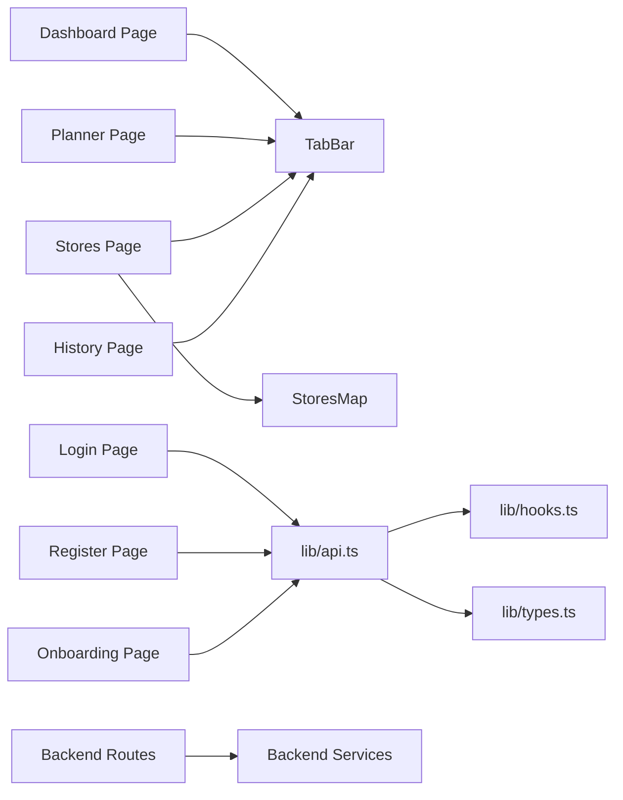

# Page Components

<cite>
**Referenced Files in This Document**
- [layout.tsx](file://Frontend/studentbite/app/(main)/layout.tsx)
- [page.tsx](file://Frontend/studentbite/app/(main)/page.tsx)
- [planner/page.tsx](file://Frontend/studentbite/app/(main)/planner/page.tsx)
- [stores/page.tsx](file://Frontend/studentbite/app/(main)/stores/page.tsx)
- [history/page.tsx](file://Frontend/studentbite/app/(main)/history/page.tsx)
- [login/page.tsx](file://Frontend/studentbite/app/login/page.tsx)
- [register/page.tsx](file://Frontend/studentbite/app/register/page.tsx)
- [onboarding/page.tsx](file://Frontend/studentbite/app/onboarding/page.tsx)
- [Providers.tsx](file://Frontend/studentbite/components/Providers.tsx)
- [TabBar.tsx](file://Frontend/studentbite/components/TabBar.tsx)
- [StoresMap.tsx](file://Frontend/studentbite/components/StoresMap.tsx)
- [ProgressBar.tsx](file://Frontend/studentbite/components/ProgressBar.tsx)
- [api.ts](file://Frontend/studentbite/lib/api.ts)
- [hooks.ts](file://Frontend/studentbite/lib/hooks.ts)
- [types.ts](file://Frontend/studentbite/lib/types.ts)
- [AuthRoutes.ts](file://Backend/src/routes/AuthRoutes.ts)
- [PlannerRoutes.ts](file://Backend/src/routes/PlannerRoutes.ts)
- [StoreRoutes.ts](file://Backend/src/routes/StoreRoutes.ts)
- [ProfileRoutes.ts](file://Backend/src/routes/ProfileRoutes.ts)
- [UserRoutes.ts](file://Backend/src/routes/UserRoutes.ts)
- [AuthService.ts](file://Backend/src/services/AuthService.ts)
- [PlannerService.ts](file://Backend/src/services/PlannerService.ts)
- [StoreService.ts](file://Backend/src/services/StoreService.ts)
- [UserService.ts](file://Backend/src/services/UserService.ts)
</cite>

## Table of Contents
1. Introduction
2. Project Structure
3. Core Components
4. Architecture Overview
5. Detailed Component Analysis
6. Dependency Analysis
7. Performance Considerations
8. Troubleshooting Guide
9. Conclusion

## Introduction
This document provides comprehensive documentation for the StudentBite application’s page components, focusing on the main dashboard, meal planner interface, store comparison page, history tracking, authentication pages (login/register), and the onboarding flow. It explains data fetching patterns, form handling, user interactions, state management, navigation between pages, and integration with backend services.

## Project Structure
The frontend is a Next.js app organized under app/ with route groups and shared components. The backend exposes REST endpoints via Express routes and services.

**Diagram sources**
- [layout.tsx](file://Frontend/studentbite/app/(main)/layout.tsx)
- [page.tsx](file://Frontend/studentbite/app/(main)/page.tsx)
- [planner/page.tsx](file://Frontend/studentbite/app/(main)/planner/page.tsx)
- [stores/page.tsx](file://Frontend/studentbite/app/(main)/stores/page.tsx)
- [history/page.tsx](file://Frontend/studentbite/app/(main)/history/page.tsx)
- [login/page.tsx](file://Frontend/studentbite/app/login/page.tsx)
- [register/page.tsx](file://Frontend/studentbite/app/register/page.tsx)
- [onboarding/page.tsx](file://Frontend/studentbite/app/onboarding/page.tsx)
- [TabBar.tsx](file://Frontend/studentbite/components/TabBar.tsx)
- [Providers.tsx](file://Frontend/studentbite/components/Providers.tsx)
- [StoresMap.tsx](file://Frontend/studentbite/components/StoresMap.tsx)
- [ProgressBar.tsx](file://Frontend/studentbite/components/ProgressBar.tsx)
- [api.ts](file://Frontend/studentbite/lib/api.ts)
- [hooks.ts](file://Frontend/studentbite/lib/hooks.ts)
- [types.ts](file://Frontend/studentbite/lib/types.ts)

**Section sources**
- [layout.tsx](file://Frontend/studentbite/app/(main)/layout.tsx)
- [page.tsx](file://Frontend/studentbite/app/(main)/page.tsx)
- [planner/page.tsx](file://Frontend/studentbite/app/(main)/planner/page.tsx)
- [stores/page.tsx](file://Frontend/studentbite/app/(main)/stores/page.tsx)
- [history/page.tsx](file://Frontend/studentbite/app/(main)/history/page.tsx)
- [login/page.tsx](file://Frontend/studentbite/app/login/page.tsx)
- [register/page.tsx](file://Frontend/studentbite/app/register/page.tsx)
- [onboarding/page.tsx](file://Frontend/studentbite/app/onboarding/page.tsx)
- [TabBar.tsx](file://Frontend/studentbite/components/TabBar.tsx)
- [Providers.tsx](file://Frontend/studentbite/components/Providers.tsx)
- [StoresMap.tsx](file://Frontend/studentbite/components/StoresMap.tsx)
- [ProgressBar.tsx](file://Frontend/studentbite/components/ProgressBar.tsx)
- [api.ts](file://Frontend/studentbite/lib/api.ts)
- [hooks.ts](file://Frontend/studentbite/lib/hooks.ts)
- [types.ts](file://Frontend/studentbite/lib/types.ts)

## Core Components
- TabBar: Shared navigation bar used across main pages to switch between Dashboard, Planner, Stores, and History.
- Providers: Global providers wrapping the app (e.g., theme, auth context, query client).
- StoresMap: Map component used by the stores page to visualize nearby stores or locations.
- ProgressBar: Reusable progress indicator used during loading states.

These components are reused across pages to ensure consistent UX and behavior.

**Section sources**
- [TabBar.tsx](file://Frontend/studentbite/components/TabBar.tsx)
- [Providers.tsx](file://Frontend/studentbite/components/Providers.tsx)
- [StoresMap.tsx](file://Frontend/studentbite/components/StoresMap.tsx)
- [ProgressBar.tsx](file://Frontend/studentbite/components/ProgressBar.tsx)

## Architecture Overview
The frontend pages interact with backend services through a centralized API layer. Each page manages local state and uses hooks for data fetching and mutations. Navigation is handled by Next.js routing with a shared layout and tab-based navigation.

**Diagram sources**
- [api.ts](file://Frontend/studentbite/lib/api.ts)
- [hooks.ts](file://Frontend/studentbite/lib/hooks.ts)
- [AuthRoutes.ts](file://Backend/src/routes/AuthRoutes.ts)
- [PlannerRoutes.ts](file://Backend/src/routes/PlannerRoutes.ts)
- [StoreRoutes.ts](file://Backend/src/routes/StoreRoutes.ts)
- [ProfileRoutes.ts](file://Backend/src/routes/ProfileRoutes.ts)
- [UserRoutes.ts](file://Backend/src/routes/UserRoutes.ts)

## Detailed Component Analysis

### Main Dashboard ((main)/page.tsx)
- Purpose: Entry point after login; displays overview metrics and quick actions.
- Data Fetching: Uses hooks to fetch user stats and recent activity from backend endpoints.
- State Management: Local state for filters and selections; global provider for user session.
- User Interactions: Clicks navigate to Planner or Stores; refresh triggers re-fetch.
- Navigation: TabBar provides quick links; direct route transitions via Next.js router.

**Section sources**
- [page.tsx](file://Frontend/studentbite/app/(main)/page.tsx)
- [api.ts](file://Frontend/studentbite/lib/api.ts)
- [hooks.ts](file://Frontend/studentbite/lib/hooks.ts)
- [types.ts](file://Frontend/studentbite/lib/types.ts)

### Meal Planner Interface ((main)/planner/page.tsx)
- Purpose: Create and manage weekly meal plans; adjust preferences and constraints.
- Data Fetching: Loads plan templates and user preferences; submits new plans via POST.
- Form Handling: Controlled inputs for meal selection, dietary filters, and portion sizes.
- State Management: Local state for form fields; optimistic updates for better UX.
- User Interactions: Drag-and-drop or select-to-add meals; save and confirm changes.
- Backend Integration: Planner routes and service orchestrate plan generation and storage.

**Diagram sources**
- [planner/page.tsx](file://Frontend/studentbite/app/(main)/planner/page.tsx)
- [hooks.ts](file://Frontend/studentbite/lib/hooks.ts)
- [api.ts](file://Frontend/studentbite/lib/api.ts)
- [PlannerRoutes.ts](file://Backend/src/routes/PlannerRoutes.ts)
- [PlannerService.ts](file://Backend/src/services/PlannerService.ts)

**Section sources**
- [planner/page.tsx](file://Frontend/studentbite/app/(main)/planner/page.tsx)
- [hooks.ts](file://Frontend/studentbite/lib/hooks.ts)
- [api.ts](file://Frontend/studentbite/lib/api.ts)
- [types.ts](file://Frontend/studentbite/lib/types.ts)
- [PlannerRoutes.ts](file://Backend/src/routes/PlannerRoutes.ts)
- [PlannerService.ts](file://Backend/src/services/PlannerService.ts)

### Store Comparison Page ((main)/stores/page.tsx)
- Purpose: Compare prices and availability across multiple stores; visualize on map.
- Data Fetching: Retrieves store catalogs and price lists; supports search and filters.
- Form Handling: Search input, category filters, and sort options.
- State Management: Local state for filters; cached results to reduce network calls.
- User Interactions: Click items to view details; toggle map view; export comparisons.
- Backend Integration: Store routes and service aggregate data from crawlers and databases.

**Diagram sources**
- [stores/page.tsx](file://Frontend/studentbite/app/(main)/stores/page.tsx)
- [StoresMap.tsx](file://Frontend/studentbite/components/StoresMap.tsx)
- [api.ts](file://Frontend/studentbite/lib/api.ts)
- [hooks.ts](file://Frontend/studentbite/lib/hooks.ts)
- [StoreRoutes.ts](file://Backend/src/routes/StoreRoutes.ts)
- [StoreService.ts](file://Backend/src/services/StoreService.ts)

**Section sources**
- [stores/page.tsx](file://Frontend/studentbite/app/(main)/stores/page.tsx)
- [StoresMap.tsx](file://Frontend/studentbite/components/StoresMap.tsx)
- [api.ts](file://Frontend/studentbite/lib/api.ts)
- [hooks.ts](file://Frontend/studentbite/lib/hooks.ts)
- [types.ts](file://Frontend/studentbite/lib/types.ts)
- [StoreRoutes.ts](file://Backend/src/routes/StoreRoutes.ts)
- [StoreService.ts](file://Backend/src/services/StoreService.ts)

### History Tracking ((main)/history/page.tsx)
- Purpose: View past meal plans, purchases, and nutrition logs.
- Data Fetching: Paginated list of historical entries; detail view on click.
- State Management: Pagination state; selected item detail state.
- User Interactions: Filter by date range; drill into details; export reports.
- Backend Integration: Profile and user routes provide historical data.

**Section sources**
- [history/page.tsx](file://Frontend/studentbite/app/(main)/history/page.tsx)
- [api.ts](file://Frontend/studentbite/lib/api.ts)
- [hooks.ts](file://Frontend/studentbite/lib/hooks.ts)
- [ProfileRoutes.ts](file://Backend/src/routes/ProfileRoutes.ts)
- [UserRoutes.ts](file://Backend/src/routes/UserRoutes.ts)

### Authentication Pages (login/register)
- Login Page: Handles email/password submission, validates input, and navigates to dashboard upon success.
- Register Page: Collects user details, validates, creates account, and redirects to onboarding or dashboard.
- Data Fetching: Auth routes handle token issuance and user profile retrieval.
- Form Handling: Controlled inputs with real-time validation; error messages displayed inline.
- State Management: Local form state; global auth context for session persistence.
- Navigation: Redirects based on auth status and user flow.

**Diagram sources**
- [login/page.tsx](file://Frontend/studentbite/app/login/page.tsx)
- [register/page.tsx](file://Frontend/studentbite/app/register/page.tsx)
- [api.ts](file://Frontend/studentbite/lib/api.ts)
- [hooks.ts](file://Frontend/studentbite/lib/hooks.ts)
- [AuthRoutes.ts](file://Backend/src/routes/AuthRoutes.ts)
- [AuthService.ts](file://Backend/src/services/AuthService.ts)

**Section sources**
- [login/page.tsx](file://Frontend/studentbite/app/login/page.tsx)
- [register/page.tsx](file://Frontend/studentbite/app/register/page.tsx)
- [api.ts](file://Frontend/studentbite/lib/api.ts)
- [hooks.ts](file://Frontend/studentbite/lib/hooks.ts)
- [types.ts](file://Frontend/studentbite/lib/types.ts)
- [AuthRoutes.ts](file://Backend/src/routes/AuthRoutes.ts)
- [AuthService.ts](file://Backend/src/services/AuthService.ts)

### Onboarding Flow (onboarding/page.tsx)
- Purpose: Guided setup for new users; collects preferences, dietary restrictions, and goals.
- Data Fetching: Optional pre-filled data from profile if available.
- Form Handling: Multi-step wizard with validation and progress indication.
- State Management: Step state persisted locally until submission; final submission updates profile.
- User Interactions: Next/back navigation; skip optional steps; save progress.
- Backend Integration: Profile routes update user preferences.

**Section sources**
- [onboarding/page.tsx](file://Frontend/studentbite/app/onboarding/page.tsx)
- [api.ts](file://Frontend/studentbite/lib/api.ts)
- [hooks.ts](file://Frontend/studentbite/lib/hooks.ts)
- [types.ts](file://Frontend/studentbite/lib/types.ts)
- [ProfileRoutes.ts](file://Backend/src/routes/ProfileRoutes.ts)
- [UserService.ts](file://Backend/src/services/UserService.ts)

## Dependency Analysis
Pages depend on shared components and the API layer. Backend routes delegate to services that implement business logic and data access.

**Diagram sources**
- [page.tsx](file://Frontend/studentbite/app/(main)/page.tsx)
- [planner/page.tsx](file://Frontend/studentbite/app/(main)/planner/page.tsx)
- [stores/page.tsx](file://Frontend/studentbite/app/(main)/stores/page.tsx)
- [history/page.tsx](file://Frontend/studentbite/app/(main)/history/page.tsx)
- [login/page.tsx](file://Frontend/studentbite/app/login/page.tsx)
- [register/page.tsx](file://Frontend/studentbite/app/register/page.tsx)
- [onboarding/page.tsx](file://Frontend/studentbite/app/onboarding/page.tsx)
- [TabBar.tsx](file://Frontend/studentbite/components/TabBar.tsx)
- [StoresMap.tsx](file://Frontend/studentbite/components/StoresMap.tsx)
- [api.ts](file://Frontend/studentbite/lib/api.ts)
- [hooks.ts](file://Frontend/studentbite/lib/hooks.ts)
- [types.ts](file://Frontend/studentbite/lib/types.ts)
- [AuthRoutes.ts](file://Backend/src/routes/AuthRoutes.ts)
- [PlannerRoutes.ts](file://Backend/src/routes/PlannerRoutes.ts)
- [StoreRoutes.ts](file://Backend/src/routes/StoreRoutes.ts)
- [ProfileRoutes.ts](file://Backend/src/routes/ProfileRoutes.ts)
- [UserRoutes.ts](file://Backend/src/routes/UserRoutes.ts)
- [AuthService.ts](file://Backend/src/services/AuthService.ts)
- [PlannerService.ts](file://Backend/src/services/PlannerService.ts)
- [StoreService.ts](file://Backend/src/services/StoreService.ts)
- [UserService.ts](file://Backend/src/services/UserService.ts)

**Section sources**
- [api.ts](file://Frontend/studentbite/lib/api.ts)
- [hooks.ts](file://Frontend/studentbite/lib/hooks.ts)
- [types.ts](file://Frontend/studentbite/lib/types.ts)
- [AuthRoutes.ts](file://Backend/src/routes/AuthRoutes.ts)
- [PlannerRoutes.ts](file://Backend/src/routes/PlannerRoutes.ts)
- [StoreRoutes.ts](file://Backend/src/routes/StoreRoutes.ts)
- [ProfileRoutes.ts](file://Backend/src/routes/ProfileRoutes.ts)
- [UserRoutes.ts](file://Backend/src/routes/UserRoutes.ts)
- [AuthService.ts](file://Backend/src/services/AuthService.ts)
- [PlannerService.ts](file://Backend/src/services/PlannerService.ts)
- [StoreService.ts](file://Backend/src/services/StoreService.ts)
- [UserService.ts](file://Backend/src/services/UserService.ts)

## Performance Considerations
- Prefer lazy loading for heavy components like maps and charts.
- Cache frequently accessed data using hooks and local storage where appropriate.
- Debounce search inputs to reduce network requests.
- Implement pagination and virtualization for large lists.
- Optimize images and assets; use efficient formats and compression.

[No sources needed since this section provides general guidance]

## Troubleshooting Guide
- Network Errors: Check API responses and status codes; retry failed requests with backoff.
- Validation Errors: Ensure form fields match expected types and constraints; display clear messages.
- State Inconsistencies: Reset local state on navigation; avoid stale data by invalidating caches.
- Auth Issues: Verify tokens and session state; handle expiration gracefully.

**Section sources**
- [api.ts](file://Frontend/studentbite/lib/api.ts)
- [hooks.ts](file://Frontend/studentbite/lib/hooks.ts)
- [types.ts](file://Frontend/studentbite/lib/types.ts)

## Conclusion
StudentBite’s page components are structured around reusable UI elements and a centralized API layer. Each page manages its own state while leveraging shared hooks and providers for consistency. Clear separation between frontend pages and backend services ensures maintainability and scalability. Following the documented patterns will help extend functionality and improve reliability.

[No sources needed since this section summarizes without analyzing specific files]