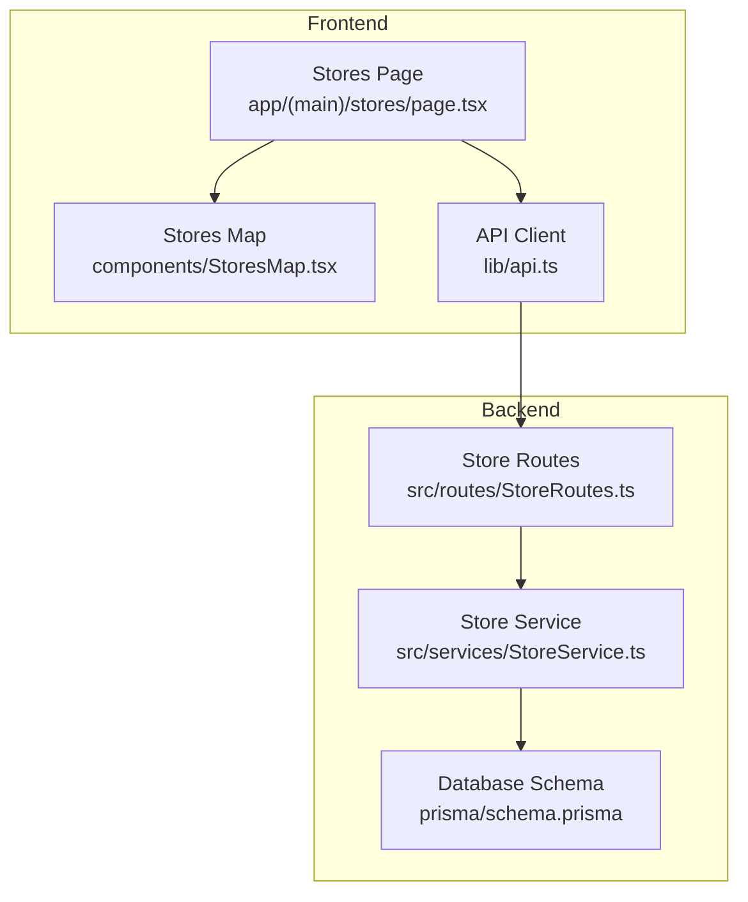
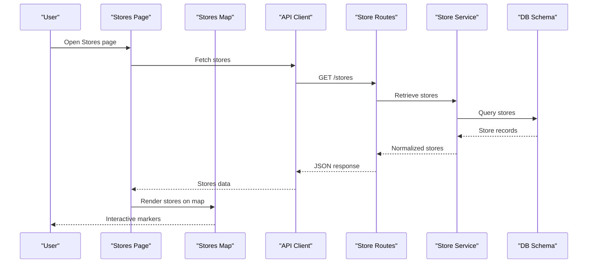
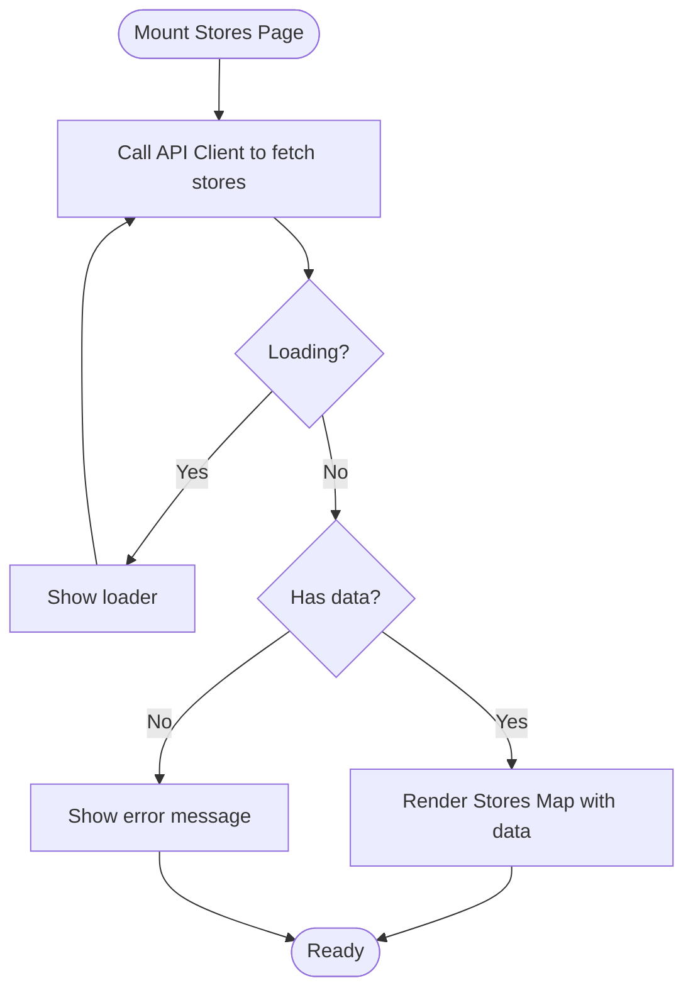
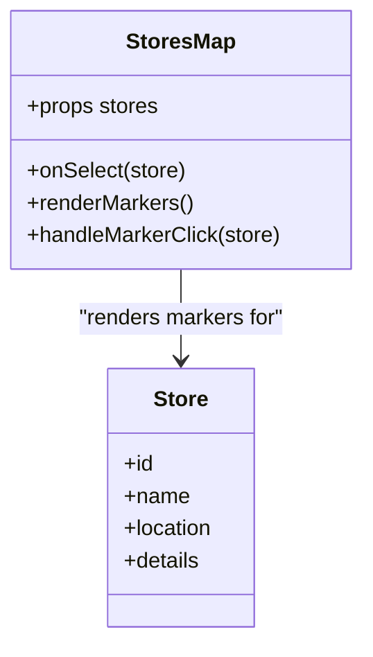
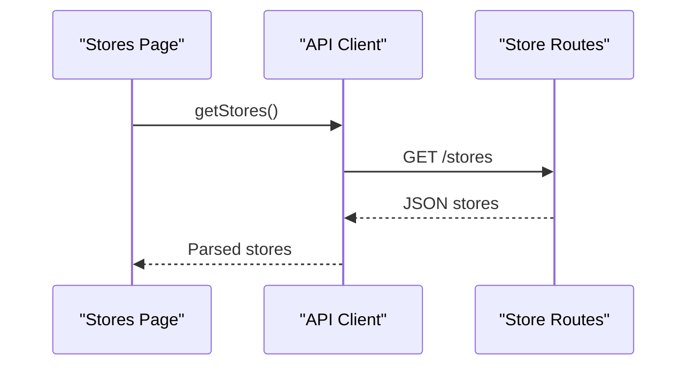
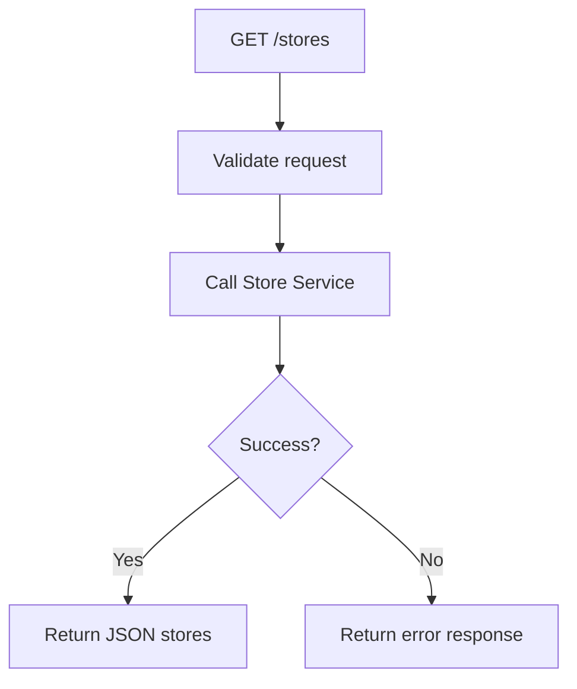
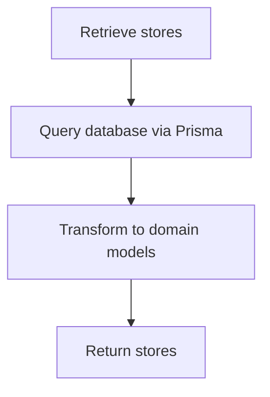
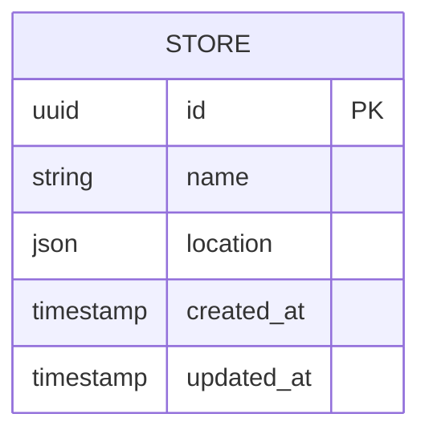
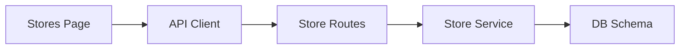

# Stores Page Component

<cite>
**Referenced Files in This Document**
- [page.tsx](file://Frontend/studentbite/app/(main)/stores/page.tsx)
- [StoresMap.tsx](file://Frontend/studentbite/components/StoresMap.tsx)
- [api.ts](file://Frontend/studentbite/lib/api.ts)
- [StoreRoutes.ts](file://Backend/src/routes/StoreRoutes.ts)
- [StoreService.ts](file://Backend/src/services/StoreService.ts)
- [schema.prisma](file://Backend/prisma/schema.prisma)
</cite>

## Table of Contents
1. [Introduction](#introduction)
2. [Project Structure](#project-structure)
3. [Core Components](#core-components)
4. [Architecture Overview](#architecture-overview)
5. [Detailed Component Analysis](#detailed-component-analysis)
6. [Dependency Analysis](#dependency-analysis)
7. [Performance Considerations](#performance-considerations)
8. [Troubleshooting Guide](#troubleshooting-guide)
9. [Conclusion](#conclusion)

## Introduction
This document explains the Stores Page component that displays stores on a map and integrates with the backend to fetch store data. It covers how the frontend page composes UI, calls the API, and renders interactive map markers for each store. It also documents the backend routes and services involved in serving store information and the data model used by the database layer.

## Project Structure
The Stores feature spans both frontend and backend:
- Frontend: A Next.js page under app/(main)/stores that renders the Stores Map component and handles user interactions.
- Backend: Express routes and services that expose endpoints for retrieving store data, backed by Prisma and the database schema.

**Diagram sources**
- [page.tsx](file://Frontend/studentbite/app/(main)/stores/page.tsx)
- [StoresMap.tsx](file://Frontend/studentbite/components/StoresMap.tsx)
- [api.ts](file://Frontend/studentbite/lib/api.ts)
- [StoreRoutes.ts](file://Backend/src/routes/StoreRoutes.ts)
- [StoreService.ts](file://Backend/src/services/StoreService.ts)
- [schema.prisma](file://Backend/prisma/schema.prisma)

**Section sources**
- [page.tsx](file://Frontend/studentbite/app/(main)/stores/page.tsx)
- [StoresMap.tsx](file://Frontend/studentbite/components/StoresMap.tsx)
- [api.ts](file://Frontend/studentbite/lib/api.ts)
- [StoreRoutes.ts](file://Backend/src/routes/StoreRoutes.ts)
- [StoreService.ts](file://Backend/src/services/StoreService.ts)
- [schema.prisma](file://Backend/prisma/schema.prisma)

## Core Components
- Stores Page (Next.js): Orchestrates fetching store data and rendering the map. It manages loading states and error handling before passing data to the map component.
- Stores Map: Renders an interactive map with markers for each store. Handles marker interactions such as selection or click events.
- API Client: Provides typed functions to call backend endpoints for store retrieval.
- Store Routes: Defines HTTP endpoints for store-related operations.
- Store Service: Encapsulates business logic for querying and transforming store data.
- Database Schema: Defines the structure of store entities and relationships.

**Section sources**
- [page.tsx](file://Frontend/studentbite/app/(main)/stores/page.tsx)
- [StoresMap.tsx](file://Frontend/studentbite/components/StoresMap.tsx)
- [api.ts](file://Frontend/studentbite/lib/api.ts)
- [StoreRoutes.ts](file://Backend/src/routes/StoreRoutes.ts)
- [StoreService.ts](file://Backend/src/services/StoreService.ts)
- [schema.prisma](file://Backend/prisma/schema.prisma)

## Architecture Overview
The Stores feature follows a layered architecture:
- Presentation Layer: The Stores Page composes UI and delegates rendering to the Stores Map component.
- Data Access Layer: The API client abstracts HTTP requests to backend routes.
- Business Logic Layer: The Store Service processes queries and returns normalized store data.
- Persistence Layer: Prisma interacts with the database using the schema definition.

**Diagram sources**
- [page.tsx](file://Frontend/studentbite/app/(main)/stores/page.tsx)
- [StoresMap.tsx](file://Frontend/studentbite/components/StoresMap.tsx)
- [api.ts](file://Frontend/studentbite/lib/api.ts)
- [StoreRoutes.ts](file://Backend/src/routes/StoreRoutes.ts)
- [StoreService.ts](file://Backend/src/services/StoreService.ts)
- [schema.prisma](file://Backend/prisma/schema.prisma)

## Detailed Component Analysis

### Stores Page (Next.js)
Responsibilities:
- Fetches store data via the API client.
- Manages loading and error states.
- Passes store data to the Stores Map component for rendering.

Key behaviors:
- On mount or navigation, triggers data retrieval.
- Displays loading indicators while waiting for the response.
- Handles errors gracefully and surfaces feedback to the user.

**Diagram sources**
- [page.tsx](file://Frontend/studentbite/app/(main)/stores/page.tsx)
- [api.ts](file://Frontend/studentbite/lib/api.ts)

**Section sources**
- [page.tsx](file://Frontend/studentbite/app/(main)/stores/page.tsx)
- [api.ts](file://Frontend/studentbite/lib/api.ts)

### Stores Map Component
Responsibilities:
- Renders an interactive map with markers for each store.
- Handles marker interactions (e.g., click to show details).
- Updates UI state based on selected store or zoom level.

Key behaviors:
- Accepts store data as props.
- Initializes map instance and adds markers.
- Emits events for selection or detail view updates.

**Diagram sources**
- [StoresMap.tsx](file://Frontend/studentbite/components/StoresMap.tsx)

**Section sources**
- [StoresMap.tsx](file://Frontend/studentbite/components/StoresMap.tsx)

### API Client
Responsibilities:
- Provides typed functions to call backend endpoints.
- Serializes requests and parses responses.
- Centralizes error handling and retries if needed.

Key behaviors:
- Exposes a function to retrieve stores.
- Maps backend responses to frontend types.

**Diagram sources**
- [api.ts](file://Frontend/studentbite/lib/api.ts)
- [StoreRoutes.ts](file://Backend/src/routes/StoreRoutes.ts)

**Section sources**
- [api.ts](file://Frontend/studentbite/lib/api.ts)
- [StoreRoutes.ts](file://Backend/src/routes/StoreRoutes.ts)

### Store Routes (Backend)
Responsibilities:
- Define HTTP endpoints for store operations.
- Validate request parameters and delegate to service layer.
- Return standardized JSON responses.

Key behaviors:
- GET /stores endpoint retrieves all stores.
- Error handling and status code mapping.

**Diagram sources**
- [StoreRoutes.ts](file://Backend/src/routes/StoreRoutes.ts)
- [StoreService.ts](file://Backend/src/services/StoreService.ts)

**Section sources**
- [StoreRoutes.ts](file://Backend/src/routes/StoreRoutes.ts)
- [StoreService.ts](file://Backend/src/services/StoreService.ts)

### Store Service (Backend)
Responsibilities:
- Implements business logic for store queries.
- Transforms raw database records into domain models.
- Handles filtering, sorting, or pagination if applicable.

Key behaviors:
- Queries database using Prisma.
- Returns normalized store data to routes.

**Diagram sources**
- [StoreService.ts](file://Backend/src/services/StoreService.ts)
- [schema.prisma](file://Backend/prisma/schema.prisma)

**Section sources**
- [StoreService.ts](file://Backend/src/services/StoreService.ts)
- [schema.prisma](file://Backend/prisma/schema.prisma)

### Database Schema
Responsibilities:
- Defines store entity fields and relationships.
- Ensures data integrity through constraints.

Key aspects:
- Fields include identifiers, names, locations, and metadata.
- Relationships may link stores to categories or other entities.

**Diagram sources**
- [schema.prisma](file://Backend/prisma/schema.prisma)

**Section sources**
- [schema.prisma](file://Backend/prisma/schema.prisma)

## Dependency Analysis
The Stores feature has clear dependencies between layers:
- Frontend depends on the API client for data access.
- Backend routes depend on the store service for business logic.
- Store service depends on the database schema for persistence.

**Diagram sources**
- [page.tsx](file://Frontend/studentbite/app/(main)/stores/page.tsx)
- [api.ts](file://Frontend/studentbite/lib/api.ts)
- [StoreRoutes.ts](file://Backend/src/routes/StoreRoutes.ts)
- [StoreService.ts](file://Backend/src/services/StoreService.ts)
- [schema.prisma](file://Backend/prisma/schema.prisma)

**Section sources**
- [page.tsx](file://Frontend/studentbite/app/(main)/stores/page.tsx)
- [api.ts](file://Frontend/studentbite/lib/api.ts)
- [StoreRoutes.ts](file://Backend/src/routes/StoreRoutes.ts)
- [StoreService.ts](file://Backend/src/services/StoreService.ts)
- [schema.prisma](file://Backend/prisma/schema.prisma)

## Performance Considerations
- Lazy loading: Defer map initialization until data is available.
- Caching: Cache store data locally to reduce network requests.
- Pagination: Implement server-side pagination for large datasets.
- Marker optimization: Use clustering for many markers to improve rendering performance.

[No sources needed since this section provides general guidance]

## Troubleshooting Guide
Common issues and resolutions:
- Network errors: Verify backend endpoint availability and CORS settings.
- Empty map: Ensure store data is correctly fetched and passed to the map component.
- Marker not visible: Check coordinate format and map bounds.
- Slow rendering: Optimize marker count and consider clustering.

**Section sources**
- [api.ts](file://Frontend/studentbite/lib/api.ts)
- [StoresMap.tsx](file://Frontend/studentbite/components/StoresMap.tsx)
- [StoreRoutes.ts](file://Backend/src/routes/StoreRoutes.ts)

## Conclusion
The Stores Page component provides an interactive map experience by integrating frontend UI with backend APIs. It follows a clean separation of concerns across presentation, data access, business logic, and persistence layers. Proper error handling, performance optimizations, and clear dependency management ensure a robust and scalable implementation.

[No sources needed since this section summarizes without analyzing specific files]