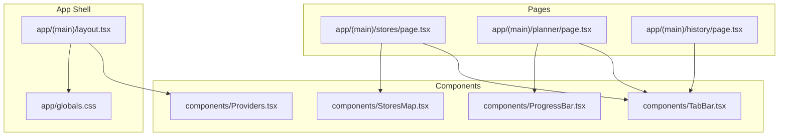
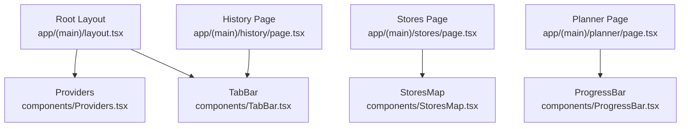
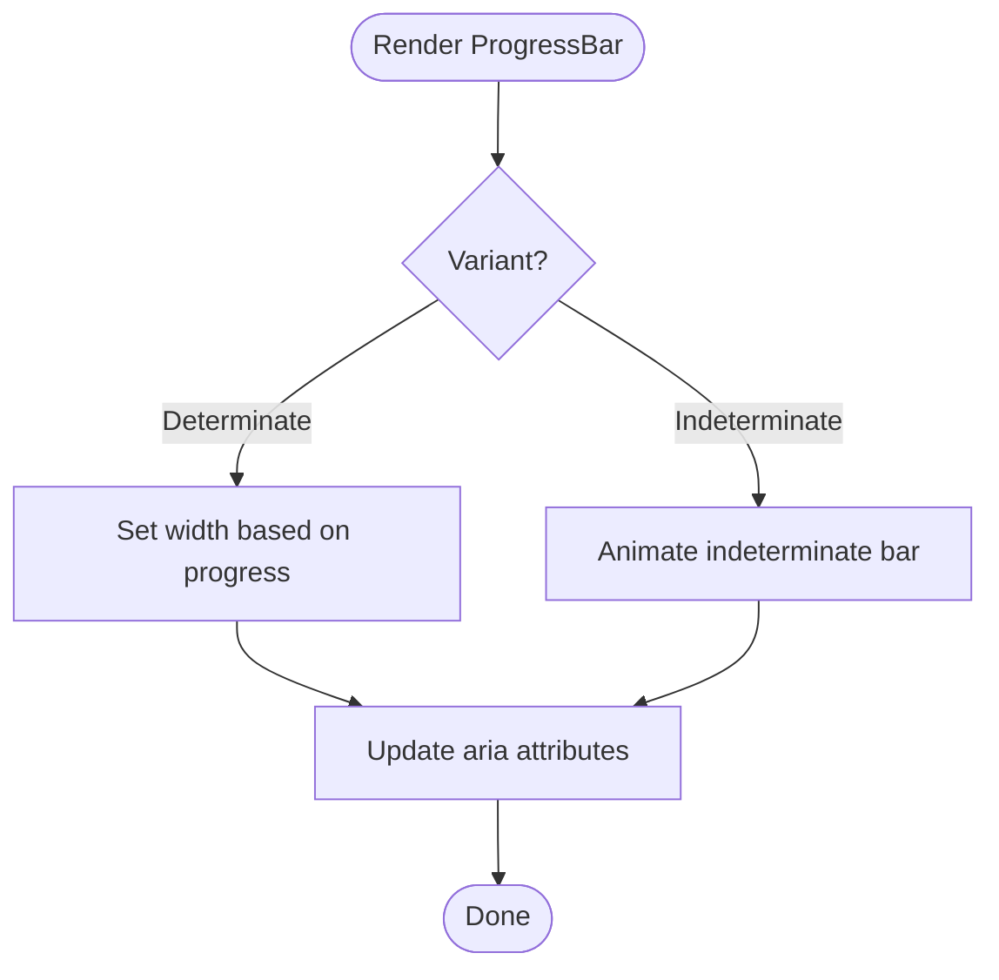
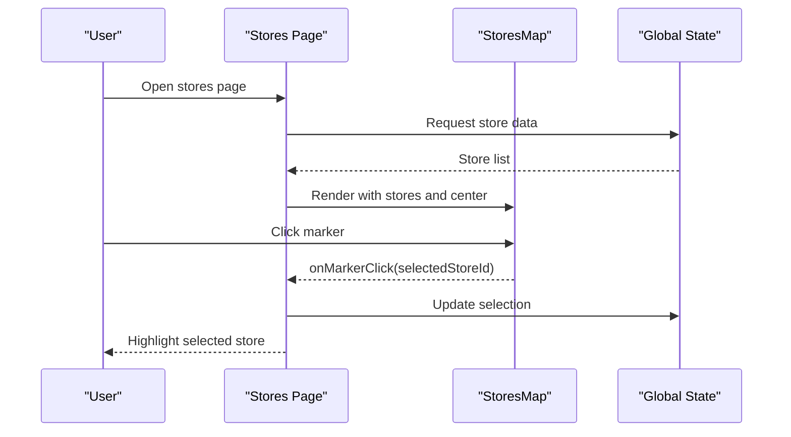
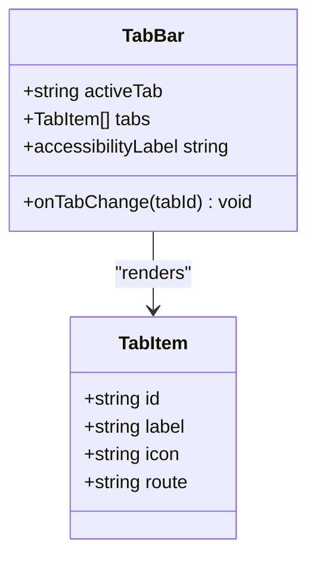
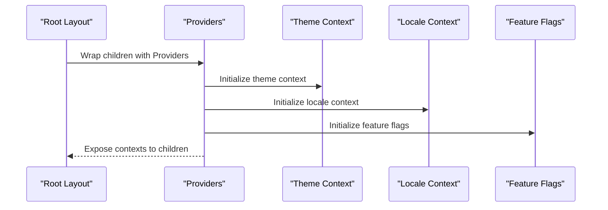
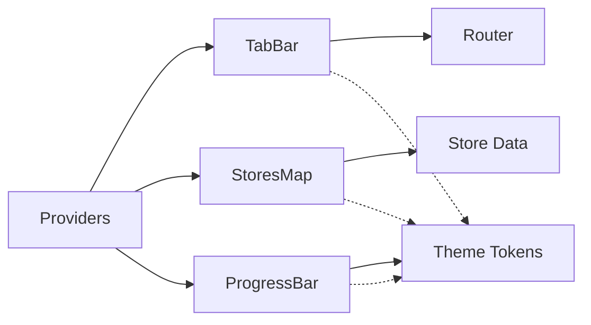

# UI Components

<cite>
**Referenced Files in This Document**
- [ProgressBar.tsx](file://Frontend/studentbite/components/ProgressBar.tsx)
- [StoresMap.tsx](file://Frontend/studentbite/components/StoresMap.tsx)
- [TabBar.tsx](file://Frontend/studentbite/components/TabBar.tsx)
- [Providers.tsx](file://Frontend/studentbite/components/Providers.tsx)
- [layout.tsx](file://Frontend/studentbite/app/(main)/layout.tsx)
- [stores/page.tsx](file://Frontend/studentbite/app/(main)/stores/page.tsx)
- [planner/page.tsx](file://Frontend/studentbite/app/(main)/planner/page.tsx)
- [history/page.tsx](file://Frontend/studentbite/app/(main)/history/page.tsx)
- [globals.css](file://Frontend/studentbite/app/globals.css)
</cite>

## Table of Contents
1. [Introduction](#introduction)
2. [Project Structure](#project-structure)
3. [Core Components](#core-components)
4. [Architecture Overview](#architecture-overview)
5. [Detailed Component Analysis](#detailed-component-analysis)
6. [Dependency Analysis](#dependency-analysis)
7. [Performance Considerations](#performance-considerations)
8. [Troubleshooting Guide](#troubleshooting-guide)
9. [Conclusion](#conclusion)

## Introduction
This document provides comprehensive documentation for the reusable UI components that power the StudentBite application’s student-friendly interface. It focuses on four core components:
- ProgressBar: visual feedback for loading and progress states
- StoresMap: interactive visualization of grocery stores
- TabBar: bottom navigation for quick access to key sections
- Providers: global state management setup for consistent app-wide data and context

The goal is to explain how these components work together, their props and usage patterns, styling approaches, and integration points within the Next.js application.

## Project Structure
StudentBite uses a Next.js App Router structure with shared UI components under a dedicated folder. The main layout wraps pages with Providers to supply global state and theme. Pages consume components like TabBar, StoresMap, and ProgressBar to deliver a cohesive experience.

**Diagram sources**
- [layout.tsx](file://Frontend/studentbite/app/(main)/layout.tsx)
- [providers.tsx](file://Frontend/studentbite/components/Providers.tsx)
- [tabbar.tsx](file://Frontend/studentbite/components/TabBar.tsx)
- [storesmap.tsx](file://Frontend/studentbite/components/StoresMap.tsx)
- [progressbar.tsx](file://Frontend/studentbite/components/ProgressBar.tsx)
- [stores/page.tsx](file://Frontend/studentbite/app/(main)/stores/page.tsx)
- [planner/page.tsx](file://Frontend/studentbite/app/(main)/planner/page.tsx)
- [history/page.tsx](file://Frontend/studentbite/app/(main)/history/page.tsx)
- [globals.css](file://Frontend/studentbite/app/globals.css)

**Section sources**
- [layout.tsx](file://Frontend/studentbite/app/(main)/layout.tsx)
- [providers.tsx](file://Frontend/studentbite/components/Providers.tsx)
- [tabbar.tsx](file://Frontend/studentbite/components/TabBar.tsx)
- [storesmap.tsx](file://Frontend/studentbite/components/StoresMap.tsx)
- [progressbar.tsx](file://Frontend/studentbite/components/ProgressBar.tsx)
- [stores/page.tsx](file://Frontend/studentbite/app/(main)/stores/page.tsx)
- [planner/page.tsx](file://Frontend/studentbite/app/(main)/planner/page.tsx)
- [history/page.tsx](file://Frontend/studentbite/app/(main)/history/page.tsx)
- [globals.css](file://Frontend/studentbite/app/globals.css)

## Core Components
This section introduces each component’s purpose, typical props, styling approach, and where it is used across the app.

- ProgressBar
  - Purpose: Provides visual feedback during asynchronous operations or long-running tasks.
  - Typical props: progress value (0–100), variant (indeterminate vs determinate), size, color, label text, accessibility attributes.
  - Styling: Uses CSS variables from globals.css; supports theme-aware colors and responsive sizing.
  - Usage example: Wrap heavy computations or API calls with a conditional render of ProgressBar while loading.

- StoresMap
  - Purpose: Displays nearby grocery stores on an interactive map, enabling students to find shopping locations quickly.
  - Typical props: store list, selected store ID, zoom level, center coordinates, markers configuration, click handlers.
  - Styling: Map tiles and overlays styled via CSS classes; responsive container adapts to screen sizes.
  - Usage example: Render in the stores page to visualize store distribution and allow selection.

- TabBar
  - Purpose: Bottom navigation bar for switching between main sections (e.g., Planner, Stores, History).
  - Typical props: active tab identifier, navigation callbacks, icon set, labels, accessibility hints.
  - Styling: Styled with CSS variables for consistent theme; accessible focus states and keyboard navigation.
  - Usage example: Include in the main layout so all pages share consistent navigation.

- Providers
  - Purpose: Wraps the app to provide global state, theme, and other contexts consumed by components.
  - Typical props: children, theme settings, locale, feature flags.
  - Styling: Supplies theme tokens and CSS variables to child components.
  - Usage example: Wrap the root layout to make contexts available throughout the app.

**Section sources**
- [progressbar.tsx](file://Frontend/studentbite/components/ProgressBar.tsx)
- [storesmap.tsx](file://Frontend/studentbite/components/StoresMap.tsx)
- [tabbar.tsx](file://Frontend/studentbite/components/TabBar.tsx)
- [providers.tsx](file://Frontend/studentbite/components/Providers.tsx)
- [globals.css](file://Frontend/studentbite/app/globals.css)

## Architecture Overview
The UI architecture centers around a shared layout that injects Providers, ensuring consistent global state and theming. Pages compose reusable components to build features:
- TabBar appears across pages for navigation.
- StoresMap renders store data visually in the stores page.
- ProgressBar indicates loading states in data-heavy flows like planner generation.

**Diagram sources**
- [layout.tsx](file://Frontend/studentbite/app/(main)/layout.tsx)
- [providers.tsx](file://Frontend/studentbite/components/Providers.tsx)
- [tabbar.tsx](file://Frontend/studentbite/components/TabBar.tsx)
- [storesmap.tsx](file://Frontend/studentbite/components/StoresMap.tsx)
- [progressbar.tsx](file://Frontend/studentbite/components/ProgressBar.tsx)
- [stores/page.tsx](file://Frontend/studentbite/app/(main)/stores/page.tsx)
- [planner/page.tsx](file://Frontend/studentbite/app/(main)/planner/page.tsx)
- [history/page.tsx](file://Frontend/studentbite/app/(main)/history/page.tsx)

## Detailed Component Analysis

### ProgressBar
- Responsibilities:
  - Display deterministic progress when a percentage is known.
  - Show indeterminate animation when progress is unknown.
  - Provide accessibility labels and keyboard support.
- Props overview:
  - progress: numeric percentage (0–100)
  - variant: “determinate” | “indeterminate”
  - size: “sm” | “md” | “lg”
  - color: theme token reference
  - label: optional descriptive text
  - aria-* attributes for accessibility
- Styling approach:
  - CSS variables define track and fill colors.
  - Responsive width scaling based on container.
  - Smooth transitions for progress updates.
- Integration pattern:
  - Toggle visibility based on loading state in async workflows.
  - Combine with skeleton loaders for perceived performance.

**Diagram sources**
- [progressbar.tsx](file://Frontend/studentbite/components/ProgressBar.tsx)

**Section sources**
- [progressbar.tsx](file://Frontend/studentbite/components/ProgressBar.tsx)
- [globals.css](file://Frontend/studentbite/app/globals.css)

### StoresMap
- Responsibilities:
  - Render an interactive map with store markers.
  - Handle user interactions such as selecting a store or changing zoom.
  - Adapt to different screen sizes and orientations.
- Props overview:
  - stores: array of store objects with location and metadata
  - selectedStoreId: current selection
  - center: latitude/longitude for initial map center
  - zoom: initial zoom level
  - onMarkerClick: callback when a marker is clicked
  - onZoomChange: callback when zoom changes
- Styling approach:
  - Container uses responsive CSS classes.
  - Marker styles are theme-aware and customizable.
  - Map tiles and overlays respect dark/light mode.
- Integration pattern:
  - Fetch store data and pass to StoresMap.
  - Use selectedStoreId to drive detail views or actions.

**Diagram sources**
- [stores/page.tsx](file://Frontend/studentbite/app/(main)/stores/page.tsx)
- [storesmap.tsx](file://Frontend/studentbite/components/StoresMap.tsx)
- [providers.tsx](file://Frontend/studentbite/components/Providers.tsx)

**Section sources**
- [storesmap.tsx](file://Frontend/studentbite/components/StoresMap.tsx)
- [stores/page.tsx](file://Frontend/studentbite/app/(main)/stores/page.tsx)
- [globals.css](file://Frontend/studentbite/app/globals.css)

### TabBar
- Responsibilities:
  - Provide persistent bottom navigation across pages.
  - Indicate the active tab and handle navigation events.
  - Ensure accessibility and keyboard navigation.
- Props overview:
  - activeTab: identifier of the currently active tab
  - tabs: array of tab definitions (id, label, icon, route)
  - onTabChange: callback when a tab is selected
  - accessibilityLabel: screen reader description
- Styling approach:
  - CSS variables for background, text, and accent colors.
  - Focus rings and hover states for better UX.
  - Responsive icons and labels.
- Integration pattern:
  - Place inside the main layout to persist across routes.
  - Use router navigation to switch pages.

**Diagram sources**
- [tabbar.tsx](file://Frontend/studentbite/components/TabBar.tsx)

**Section sources**
- [tabbar.tsx](file://Frontend/studentbite/components/TabBar.tsx)
- [globals.css](file://Frontend/studentbite/app/globals.css)

### Providers
- Responsibilities:
  - Supply global contexts such as theme, locale, and feature flags.
  - Manage application-wide state consumed by components.
  - Initialize services or hooks required by child components.
- Props overview:
  - children: React tree to wrap
  - theme: theme configuration object
  - locale: language and formatting options
  - featureFlags: boolean toggles for features
- Styling approach:
  - Injects CSS variables into the document root for consistent theming.
  - Supports dynamic theme switching at runtime.
- Integration pattern:
  - Wrap the root layout to make contexts available globally.
  - Consume contexts in components via custom hooks.

**Diagram sources**
- [providers.tsx](file://Frontend/studentbite/components/Providers.tsx)
- [layout.tsx](file://Frontend/studentbite/app/(main)/layout.tsx)

**Section sources**
- [providers.tsx](file://Frontend/studentbite/components/Providers.tsx)
- [layout.tsx](file://Frontend/studentbite/app/(main)/layout.tsx)
- [globals.css](file://Frontend/studentbite/app/globals.css)

## Dependency Analysis
The components have clear dependencies and integration points:
- TabBar depends on routing and theme contexts provided by Providers.
- StoresMap depends on store data and selection state managed through global state.
- ProgressBar depends on theme tokens for consistent styling.
- All components rely on CSS variables defined in globals.css for theming.

**Diagram sources**
- [providers.tsx](file://Frontend/studentbite/components/Providers.tsx)
- [tabbar.tsx](file://Frontend/studentbite/components/TabBar.tsx)
- [storesmap.tsx](file://Frontend/studentbite/components/StoresMap.tsx)
- [progressbar.tsx](file://Frontend/studentbite/components/ProgressBar.tsx)
- [globals.css](file://Frontend/studentbite/app/globals.css)

**Section sources**
- [providers.tsx](file://Frontend/studentbite/components/Providers.tsx)
- [tabbar.tsx](file://Frontend/studentbite/components/TabBar.tsx)
- [storesmap.tsx](file://Frontend/studentbite/components/StoresMap.tsx)
- [progressbar.tsx](file://Frontend/studentbite/components/ProgressBar.tsx)
- [globals.css](file://Frontend/studentbite/app/globals.css)

## Performance Considerations
- ProgressBar:
  - Avoid frequent re-renders by batching progress updates.
  - Use requestAnimationFrame for smooth animations in indeterminate mode.
- StoresMap:
  - Debounce zoom and pan events to reduce recalculations.
  - Lazy-load markers and tile layers for large datasets.
- TabBar:
  - Memoize tab items to prevent unnecessary re-renders.
  - Use lightweight icons and avoid heavy SVGs.
- Providers:
  - Keep context values stable using useMemo/useCallback to minimize consumer re-renders.
  - Split contexts if they change independently to improve granularity.

[No sources needed since this section provides general guidance]

## Troubleshooting Guide
Common issues and resolutions:
- ProgressBar not updating:
  - Ensure progress prop changes trigger re-renders.
  - Verify CSS variable names match those defined in globals.css.
- StoresMap markers not visible:
  - Confirm store coordinates are valid and within map bounds.
  - Check that marker styles are not overridden by conflicting CSS.
- TabBar navigation not working:
  - Validate activeTab matches the current route.
  - Ensure onTabChange updates the router correctly.
- Providers not applying theme:
  - Verify theme context is initialized before rendering child components.
  - Check that CSS variables are injected into the document root.

**Section sources**
- [progressbar.tsx](file://Frontend/studentbite/components/ProgressBar.tsx)
- [storesmap.tsx](file://Frontend/studentbite/components/StoresMap.tsx)
- [tabbar.tsx](file://Frontend/studentbite/components/TabBar.tsx)
- [providers.tsx](file://Frontend/studentbite/components/Providers.tsx)
- [globals.css](file://Frontend/studentbite/app/globals.css)

## Conclusion
The StudentBite UI components—ProgressBar, StoresMap, TabBar, and Providers—work together to create a cohesive, student-friendly interface. By leveraging shared theming, global state, and modular design, these components ensure consistency, accessibility, and performance across the application. Following the documented props, styling approaches, and integration patterns will help developers extend and maintain the UI effectively.

[No sources needed since this section summarizes without analyzing specific files]