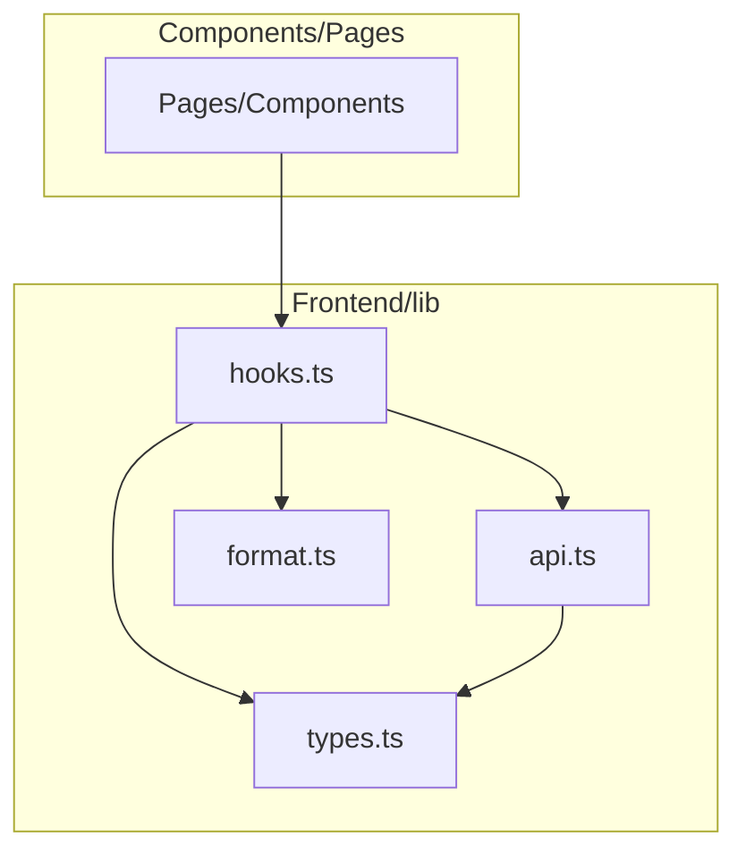
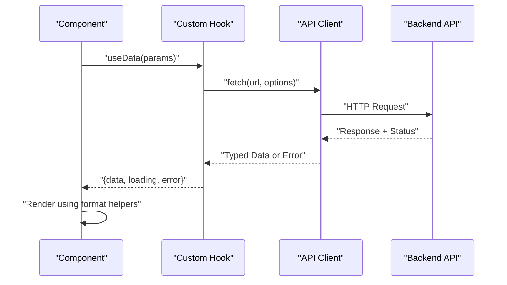
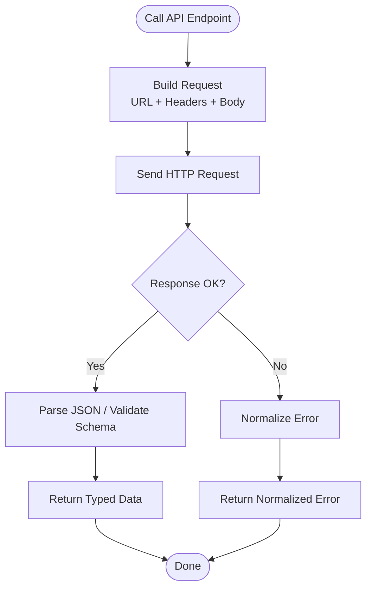
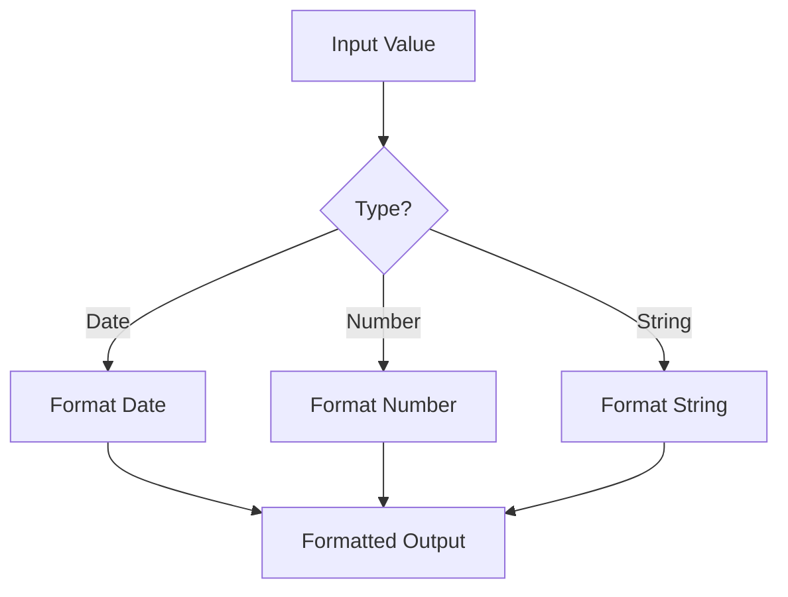
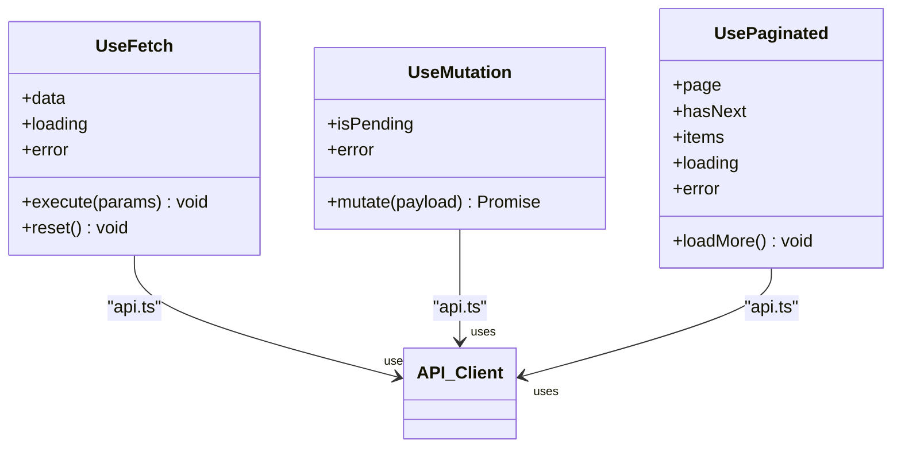
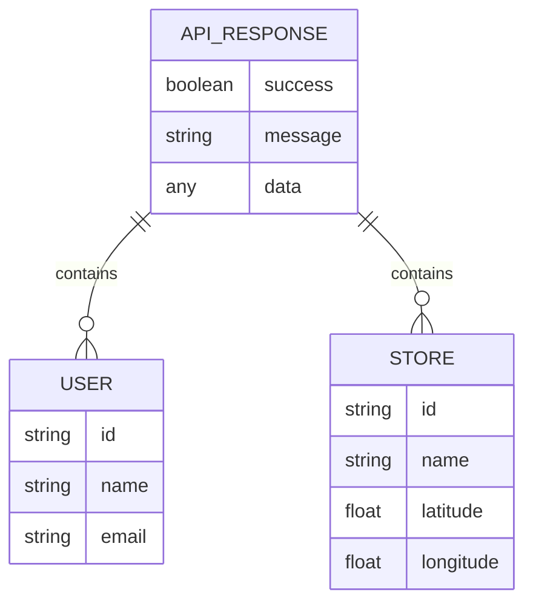
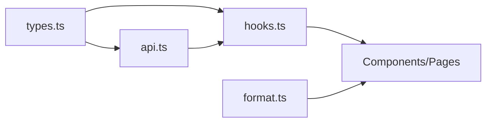

# Utilities and Hooks

<cite>
**Referenced Files in This Document**
- [api.ts](file://Frontend/studentbite/lib/api.ts)
- [format.ts](file://Frontend/studentbite/lib/format.ts)
- [hooks.ts](file://Frontend/studentbite/lib/hooks.ts)
- [types.ts](file://Frontend/studentbite/lib/types.ts)
</cite>

## Table of Contents
1. [Introduction](#introduction)
2. [Project Structure](#project-structure)
3. [Core Components](#core-components)
4. [Architecture Overview](#architecture-overview)
5. [Detailed Component Analysis](#detailed-component-analysis)
6. [Dependency Analysis](#dependency-analysis)
7. [Performance Considerations](#performance-considerations)
8. [Troubleshooting Guide](#troubleshooting-guide)
9. [Conclusion](#conclusion)
10. [Appendices](#appendices)

## Introduction
This document explains the frontend utilities, custom hooks, API client, and TypeScript type definitions used across the StudentBite application. It focuses on:
- Custom hooks for data fetching and state management
- The API client implementation for backend communication
- Formatting utilities for dates and numbers
- Shared TypeScript types that ensure consistency across components

The goal is to help you understand how these building blocks work together and how to extend them for new features.

## Project Structure
The relevant frontend utilities live under the lib directory:
- api.ts: HTTP client wrapper for backend requests
- format.ts: Date and number formatting helpers
- hooks.ts: Custom React hooks for data fetching and state
- types.ts: Shared TypeScript interfaces and types

**Diagram sources**
- [api.ts](file://Frontend/studentbite/lib/api.ts)
- [format.ts](file://Frontend/studentbite/lib/format.ts)
- [hooks.ts](file://Frontend/studentbite/lib/hooks.ts)
- [types.ts](file://Frontend/studentbite/lib/types.ts)

**Section sources**
- [api.ts](file://Frontend/studentbite/lib/api.ts)
- [format.ts](file://Frontend/studentbite/lib/format.ts)
- [hooks.ts](file://Frontend/studentbite/lib/hooks.ts)
- [types.ts](file://Frontend/studentbite/lib/types.ts)

## Core Components
- API Client (api.ts): Centralized HTTP client with request/response handling, error normalization, and optional caching or retry strategies.
- Formatting Utilities (format.ts): Helpers for date formatting, number formatting, and locale-aware display values.
- Custom Hooks (hooks.ts): Reusable hooks encapsulating data fetching, loading states, errors, retries, and pagination where applicable.
- Types (types.ts): Shared interfaces for API payloads, responses, and domain models used by hooks and components.

These modules are designed to be small, focused, and composable. Hooks depend on the API client and types; formatting utilities are independent and can be reused anywhere in the UI.

**Section sources**
- [api.ts](file://Frontend/studentbite/lib/api.ts)
- [format.ts](file://Frontend/studentbite/lib/format.ts)
- [hooks.ts](file://Frontend/studentbite/lib/hooks.ts)
- [types.ts](file://Frontend/studentbite/lib/types.ts)

## Architecture Overview
The data flow typically follows this pattern:
- A component calls a custom hook.
- The hook uses the API client to perform network requests.
- The API client returns typed data or normalized errors.
- The hook manages loading, success, and error states.
- Components render based on these states and use formatting utilities for display.

**Diagram sources**
- [hooks.ts](file://Frontend/studentbite/lib/hooks.ts)
- [api.ts](file://Frontend/studentbite/lib/api.ts)

## Detailed Component Analysis

### API Client (api.ts)
Responsibilities:
- Build URLs and headers
- Serialize request bodies and parse JSON responses
- Normalize errors into a consistent shape
- Provide methods for GET/POST/PUT/DELETE operations
- Optional: add interceptors for auth tokens, retries, or caching

Usage patterns:
- Create a typed endpoint function that wraps the base client call
- Handle success and error branches explicitly in hooks or components
- Use shared types from types.ts for request and response shapes

Extension tips:
- Add an interceptor for token refresh or logging
- Introduce a cache layer keyed by URL and params
- Implement exponential backoff for transient failures

**Diagram sources**
- [api.ts](file://Frontend/studentbite/lib/api.ts)

**Section sources**
- [api.ts](file://Frontend/studentbite/lib/api.ts)

### Formatting Utilities (format.ts)
Responsibilities:
- Format dates consistently (e.g., localized strings, relative time)
- Format numbers (currency, decimals, percentages)
- Provide safe fallbacks for missing or invalid inputs

Usage patterns:
- Import specific formatters where needed
- Chain formatters when combining formats (e.g., currency + locale)
- Keep formatting logic out of business logic to maintain testability

Extension tips:
- Add new locales or custom formatters
- Memoize expensive formatting computations if used frequently
- Centralize formatting configuration (e.g., default locale, currency code)

**Diagram sources**
- [format.ts](file://Frontend/studentbite/lib/format.ts)

**Section sources**
- [format.ts](file://Frontend/studentbite/lib/format.ts)

### Custom Hooks (hooks.ts)
Responsibilities:
- Encapsulate data fetching lifecycle (loading, success, error)
- Manage local state derived from API responses
- Expose simple APIs for components to consume
- Optionally support pagination, filtering, and debounced queries

Common hook patterns:
- useFetch: generic fetch with typed responses
- useMutation: POST/PUT/DELETE with optimistic updates
- usePaginated: list endpoints with page/size parameters
- useDebounceQuery: avoid excessive requests on rapid input changes

Usage patterns:
- Call the hook in functional components
- Destructure { data, loading, error } and render accordingly
- Trigger mutations via returned functions

Extension tips:
- Add caching or background refetching
- Integrate with global state stores if needed
- Provide retry policies and timeouts

**Diagram sources**
- [hooks.ts](file://Frontend/studentbite/lib/hooks.ts)
- [api.ts](file://Frontend/studentbite/lib/api.ts)

**Section sources**
- [hooks.ts](file://Frontend/studentbite/lib/hooks.ts)

### Type Definitions (types.ts)
Responsibilities:
- Define shared interfaces for API requests and responses
- Model domain entities used across components and hooks
- Provide discriminated unions for different response shapes
- Ensure compile-time safety for endpoints and payloads

Usage patterns:
- Import types where needed for props, state, and API contracts
- Extend base types for feature-specific variants
- Keep types close to the API contract to minimize drift

Extension tips:
- Generate types from OpenAPI specs if available
- Add Zod/Yup validators alongside types for runtime checks
- Group related types into namespaces or modules

**Diagram sources**
- [types.ts](file://Frontend/studentbite/lib/types.ts)

**Section sources**
- [types.ts](file://Frontend/studentbite/lib/types.ts)

## Dependency Analysis
Relationships between modules:
- hooks.ts depends on api.ts and types.ts
- components/pages depend on hooks.ts and format.ts
- api.ts may depend on types.ts for request/response shapes
- format.ts is self-contained and reusable

**Diagram sources**
- [api.ts](file://Frontend/studentbite/lib/api.ts)
- [format.ts](file://Frontend/studentbite/lib/format.ts)
- [hooks.ts](file://Frontend/studentbite/lib/hooks.ts)
- [types.ts](file://Frontend/studentbite/lib/types.ts)

**Section sources**
- [api.ts](file://Frontend/studentbite/lib/api.ts)
- [format.ts](file://Frontend/studentbite/lib/format.ts)
- [hooks.ts](file://Frontend/studentbite/lib/hooks.ts)
- [types.ts](file://Frontend/studentbite/lib/types.ts)

## Performance Considerations
- Avoid unnecessary re-renders by memoizing formatted values when used heavily
- Debounce search inputs to reduce API calls
- Implement pagination and virtualization for large lists
- Cache repeated requests at the API client level
- Use lightweight hooks and keep side effects minimal

[No sources needed since this section provides general guidance]

## Troubleshooting Guide
Common issues and resolutions:
- Network errors: Ensure the API client normalizes errors and surfaces meaningful messages
- Loading states: Verify hooks expose correct loading flags and handle aborts
- Type mismatches: Align types.ts with backend schema changes promptly
- Formatting inconsistencies: Centralize locale settings and validate inputs before formatting

Diagnostic steps:
- Log request payloads and responses in development
- Inspect hook state transitions during interactions
- Add unit tests for formatting edge cases and API error paths

**Section sources**
- [api.ts](file://Frontend/studentbite/lib/api.ts)
- [hooks.ts](file://Frontend/studentbite/lib/hooks.ts)
- [format.ts](file://Frontend/studentbite/lib/format.ts)
- [types.ts](file://Frontend/studentbite/lib/types.ts)

## Conclusion
The StudentBite frontend relies on a clear separation of concerns:
- A robust API client abstracts networking details
- Custom hooks encapsulate data fetching and state
- Formatting utilities standardize user-facing values
- Shared types enforce consistency and safety

By following the extension tips and best practices outlined here, you can confidently add new features while maintaining a clean and predictable architecture.

[No sources needed since this section summarizes without analyzing specific files]

## Appendices
- Example usage patterns:
  - Fetching data: call a useFetch-like hook with typed params and render based on state
  - Mutating data: use a mutation hook to send updates and handle pending/error states
  - Formatting: apply date and number formatters directly in JSX or computed values
  - Extending types: add new interfaces and update API endpoints accordingly

[No sources needed since this section provides general guidance]