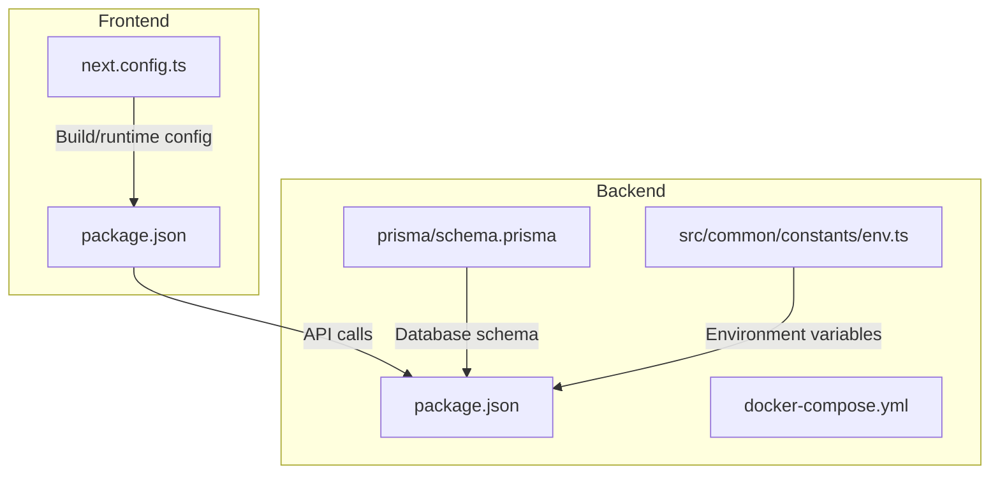
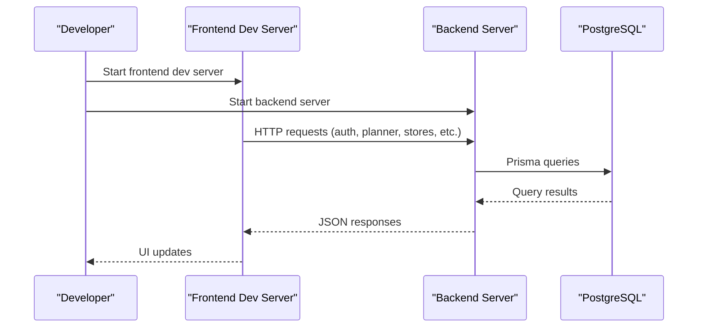
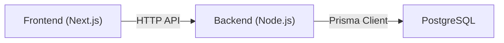

# Getting Started

<cite>
**Referenced Files in This Document**
- [README.md](file://README.md)
- [Backend/package.json](file://Backend/package.json)
- [Backend/docker-compose.yml](file://Backend/docker-compose.yml)
- [Backend/prisma/schema.prisma](file://Backend/prisma/schema.prisma)
- [Backend/src/common/constants/env.ts](file://Backend/src/common/constants/env.ts)
- [Frontend/studentbite/package.json](file://Frontend/studentbite/package.json)
- [Frontend/studentbite/next.config.ts](file://Frontend/studentbite/next.config.ts)
</cite>

## Table of Contents
1. [Introduction](#introduction)
2. [Project Structure](#project-structure)
3. [Core Components](#core-components)
4. [Architecture Overview](#architecture-overview)
5. [Detailed Component Analysis](#detailed-component-analysis)
6. [Dependency Analysis](#dependency-analysis)
7. [Performance Considerations](#performance-considerations)
8. [Troubleshooting Guide](#troubleshooting-guide)
9. [Conclusion](#conclusion)
10. [Appendices](#appendices)

## Introduction
StudentBite is a full-stack application with a Node.js backend and a Next.js frontend. This guide helps you set up the environment, install dependencies, configure variables, initialize the database using Prisma, and run both servers for development. It also includes Docker-based setup instructions and verification steps to ensure everything works correctly.

## Project Structure
The repository contains two main parts:
- Backend (Node.js + TypeScript + Prisma)
- Frontend (Next.js + TypeScript)

**Diagram sources**
- [Backend/package.json](file://Backend/package.json)
- [Backend/prisma/schema.prisma](file://Backend/prisma/schema.prisma)
- [Backend/src/common/constants/env.ts](file://Backend/src/common/constants/env.ts)
- [Backend/docker-compose.yml](file://Backend/docker-compose.yml)
- [Frontend/studentbite/package.json](file://Frontend/studentbite/package.json)
- [Frontend/studentbite/next.config.ts](file://Frontend/studentbite/next.config.ts)

**Section sources**
- [README.md](file://README.md)
- [Backend/package.json](file://Backend/package.json)
- [Frontend/studentbite/package.json](file://Frontend/studentbite/package.json)

## Core Components
- Backend: Express-like server with TypeScript, Prisma ORM, and services for authentication, planning, profiles, stores, and logs.
- Frontend: Next.js app with pages for login, register, onboarding, planner, stores, and history.

Key configuration points:
- Backend environment variables are consumed via a dedicated module.
- Database schema is defined in Prisma.
- Frontend build and runtime configuration is managed by Next.js config.

**Section sources**
- [Backend/src/common/constants/env.ts](file://Backend/src/common/constants/env.ts)
- [Backend/prisma/schema.prisma](file://Backend/prisma/schema.prisma)
- [Frontend/studentbite/next.config.ts](file://Frontend/studentbite/next.config.ts)

## Architecture Overview
High-level flow during development:
- The frontend runs a dev server and calls the backend API endpoints.
- The backend reads environment variables, connects to PostgreSQL via Prisma, and serves routes/services.
- Docker Compose can be used to spin up PostgreSQL and other services if needed.

[No sources needed since this diagram shows conceptual workflow, not actual code structure]

## Detailed Component Analysis

### Prerequisites
- Node.js (LTS recommended)
- npm or yarn
- PostgreSQL server (local or containerized)
- Optional: Docker and Docker Compose

Ensure your environment has these tools installed before proceeding.

**Section sources**
- [Backend/package.json](file://Backend/package.json)
- [Frontend/studentbite/package.json](file://Frontend/studentbite/package.json)

### Installation Steps

#### Backend Setup
1. Navigate to the backend directory.
2. Install dependencies using your package manager.
3. Create an environment file for local configuration.
4. Initialize and apply Prisma migrations against your PostgreSQL database.
5. Start the backend development server.

Commands:
- Install dependencies: see [Backend/package.json](file://Backend/package.json)
- Apply Prisma migrations: see [Backend/prisma/schema.prisma](file://Backend/prisma/schema.prisma)
- Start server: see [Backend/package.json](file://Backend/package.json)

**Section sources**
- [Backend/package.json](file://Backend/package.json)
- [Backend/prisma/schema.prisma](file://Backend/prisma/schema.prisma)

#### Frontend Setup
1. Navigate to the frontend directory.
2. Install dependencies using your package manager.
3. Ensure the backend is running so API calls succeed.
4. Start the frontend development server.

Commands:
- Install dependencies: see [Frontend/studentbite/package.json](file://Frontend/studentbite/package.json)
- Start dev server: see [Frontend/studentbite/package.json](file://Frontend/studentbite/package.json)

**Section sources**
- [Frontend/studentbite/package.json](file://Frontend/studentbite/package.json)

### Environment Variables Configuration
- Backend environment variables are loaded through a dedicated module.
- Typical variables include database connection details and any service-specific settings.

Steps:
- Create a .env file in the backend root.
- Define required variables as expected by the environment loader.
- Restart the backend after changes.

Reference:
- Environment loading module: [Backend/src/common/constants/env.ts](file://Backend/src/common/constants/env.ts)

**Section sources**
- [Backend/src/common/constants/env.ts](file://Backend/src/common/constants/env.ts)

### Database Initialization with Prisma
- The database schema is defined in Prisma.
- Use Prisma CLI commands to generate clients and run migrations.

Steps:
- Generate Prisma client: see [Backend/prisma/schema.prisma](file://Backend/prisma/schema.prisma)
- Run migrations: see [Backend/prisma/schema.prisma](file://Backend/prisma/schema.prisma)
- Seed data (if applicable): see [Backend/prisma/schema.prisma](file://Backend/prisma/schema.prisma)

**Section sources**
- [Backend/prisma/schema.prisma](file://Backend/prisma/schema.prisma)

### First Run Instructions
- Start PostgreSQL (locally or via Docker).
- Apply Prisma migrations to create tables.
- Start the backend server.
- Start the frontend dev server.
- Open the frontend URL in your browser and verify basic functionality.

Verification tips:
- Check that the backend responds to health or status endpoints.
- Confirm the frontend loads without network errors.

**Section sources**
- [Backend/package.json](file://Backend/package.json)
- [Frontend/studentbite/package.json](file://Frontend/studentbite/package.json)

### Docker Setup
Use Docker Compose to manage PostgreSQL and related services alongside the backend.

Steps:
- Build and start containers using Docker Compose from the backend directory.
- Verify services are running.
- Proceed with Prisma migrations inside the backend container or host.

Reference:
- Docker Compose configuration: [Backend/docker-compose.yml](file://Backend/docker-compose.yml)

**Section sources**
- [Backend/docker-compose.yml](file://Backend/docker-compose.yml)

## Dependency Analysis
- Backend depends on Node.js packages defined in its package manifest and uses Prisma for database access.
- Frontend depends on Next.js and related tooling.
- Both sides communicate over HTTP; ensure CORS and base URLs are configured appropriately.

**Diagram sources**
- [Backend/package.json](file://Backend/package.json)
- [Frontend/studentbite/package.json](file://Frontend/studentbite/package.json)

**Section sources**
- [Backend/package.json](file://Backend/package.json)
- [Frontend/studentbite/package.json](file://Frontend/studentbite/package.json)

## Performance Considerations
- Keep database connections healthy by reusing Prisma clients.
- Avoid heavy synchronous operations in request handlers.
- Use efficient queries and indexes where appropriate.
- Enable compression and caching at the API layer when suitable.

[No sources needed since this section provides general guidance]

## Troubleshooting Guide
Common issues and resolutions:
- Cannot connect to PostgreSQL:
  - Verify credentials and host/port in environment variables.
  - Ensure the database server is running and accessible.
- Prisma migration errors:
  - Confirm the database user has sufficient privileges.
  - Reset migrations only if necessary and back up data.
- Frontend cannot reach backend:
  - Check CORS settings and base URL configuration.
  - Ensure the backend is listening on the expected port.
- Docker-related problems:
  - Inspect container logs for startup errors.
  - Validate network connectivity between containers.

Relevant files:
- Backend environment loader: [Backend/src/common/constants/env.ts](file://Backend/src/common/constants/env.ts)
- Database schema: [Backend/prisma/schema.prisma](file://Backend/prisma/schema.prisma)
- Docker Compose: [Backend/docker-compose.yml](file://Backend/docker-compose.yml)

**Section sources**
- [Backend/src/common/constants/env.ts](file://Backend/src/common/constants/env.ts)
- [Backend/prisma/schema.prisma](file://Backend/prisma/schema.prisma)
- [Backend/docker-compose.yml](file://Backend/docker-compose.yml)

## Conclusion
You now have the essential steps to set up StudentBite locally or via Docker. Follow the installation, configuration, and initialization steps carefully, then verify the setup by starting both servers and testing core features. Refer to the linked configuration files whenever you need to adjust behavior or troubleshoot issues.

[No sources needed since this section summarizes without analyzing specific files]

## Appendices

### Quick Commands Reference
- Backend dependency installation: see [Backend/package.json](file://Backend/package.json)
- Frontend dependency installation: see [Frontend/studentbite/package.json](file://Frontend/studentbite/package.json)
- Prisma migrations: see [Backend/prisma/schema.prisma](file://Backend/prisma/schema.prisma)
- Docker Compose usage: see [Backend/docker-compose.yml](file://Backend/docker-compose.yml)

**Section sources**
- [Backend/package.json](file://Backend/package.json)
- [Frontend/studentbite/package.json](file://Frontend/studentbite/package.json)
- [Backend/prisma/schema.prisma](file://Backend/prisma/schema.prisma)
- [Backend/docker-compose.yml](file://Backend/docker-compose.yml)