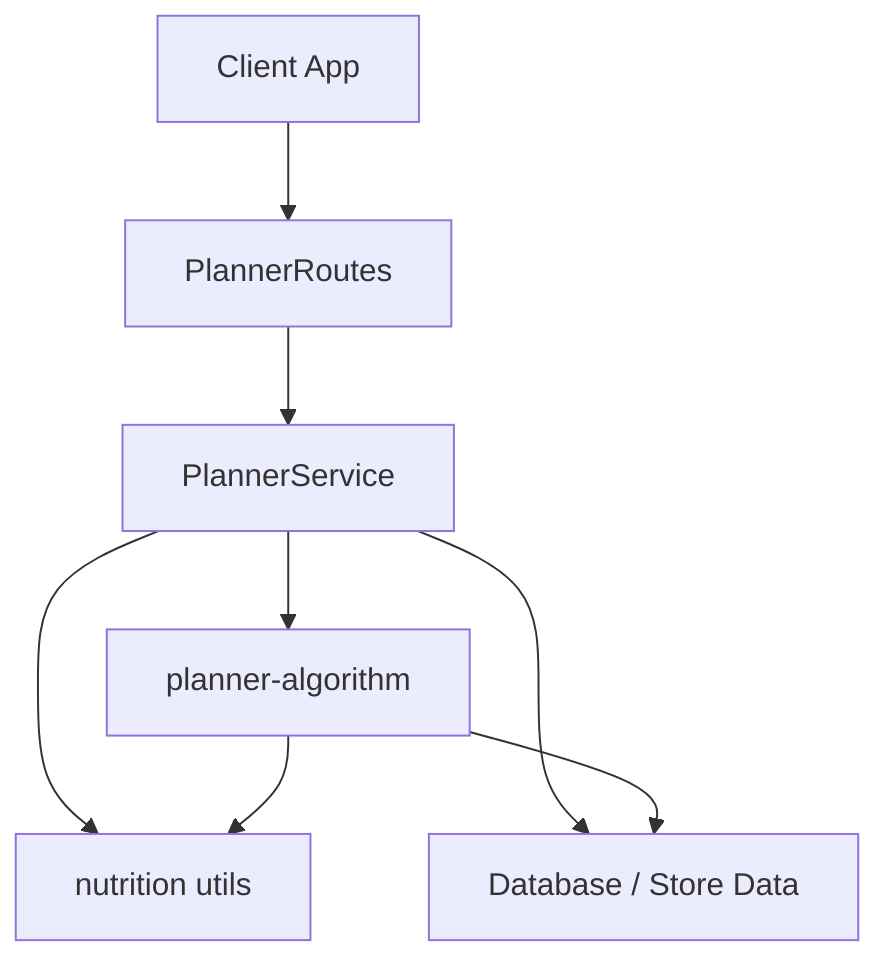
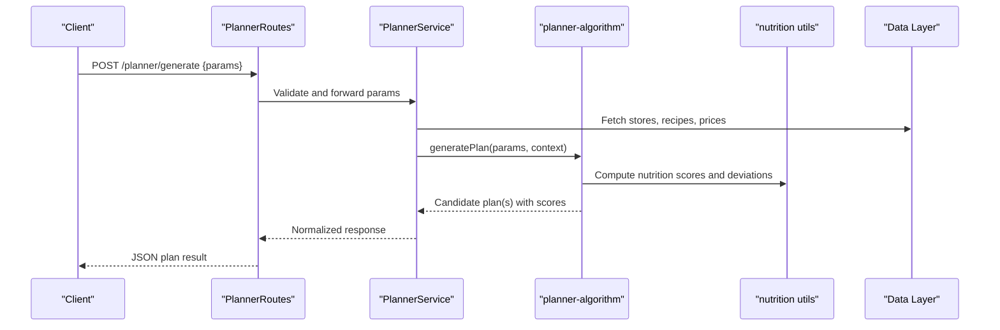
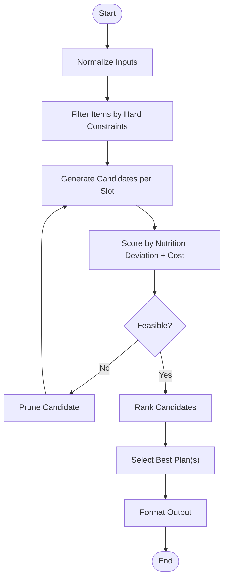
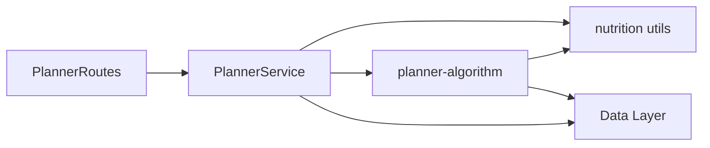

# Meal Planning Algorithm

<cite>
**Referenced Files in This Document**
- [planner-algorithm.ts](file://Backend/src/services/planner-algorithm.ts)
- [PlannerService.ts](file://Backend/src/services/PlannerService.ts)
- [PlannerRoutes.ts](file://Backend/src/routes/PlannerRoutes.ts)
- [nutrition.ts](file://Backend/src/common/utils/nutrition.ts)
- [planner.test.ts](file://Backend/tests/planner.test.ts)
- [package.json](file://Backend/package.json)
</cite>

## Table of Contents
1. [Introduction](#introduction)
2. [Project Structure](#project-structure)
3. [Core Components](#core-components)
4. [Architecture Overview](#architecture-overview)
5. [Detailed Component Analysis](#detailed-component-analysis)
6. [Dependency Analysis](#dependency-analysis)
7. [Performance Considerations](#performance-considerations)
8. [Troubleshooting Guide](#troubleshooting-guide)
9. [Conclusion](#conclusion)
10. [Appendices](#appendices)

## Introduction
This document explains StudentBite’s meal planning algorithm engine, focusing on how it generates balanced weekly or daily meal plans under constraints such as nutrition targets, budget limits, and dietary restrictions. It covers the constraint satisfaction approach, nutritional balancing logic, budget optimization strategies, input parameters, processing steps, output formats, customization options, and extensibility points. It also clarifies the relationship between the algorithm implementation and the PlannerService layer that orchestrates requests and responses.

## Project Structure
The meal planning functionality is implemented primarily within the Backend service layer:
- The core algorithm resides in a dedicated module for constraint satisfaction and plan generation.
- The PlannerService coordinates inputs, invokes the algorithm, and returns structured results to routes.
- Routes expose endpoints for clients to request plans with specific parameters.
- Nutrition utilities support calculations and scoring used by the algorithm.
- Tests validate behavior and edge cases.

**Diagram sources**
- [PlannerRoutes.ts](file://Backend/src/routes/PlannerRoutes.ts)
- [PlannerService.ts](file://Backend/src/services/PlannerService.ts)
- [planner-algorithm.ts](file://Backend/src/services/planner-algorithm.ts)
- [nutrition.ts](file://Backend/src/common/utils/nutrition.ts)

**Section sources**
- [PlannerRoutes.ts](file://Backend/src/routes/PlannerRoutes.ts)
- [PlannerService.ts](file://Backend/src/services/PlannerService.ts)
- [planner-algorithm.ts](file://Backend/src/services/planner-algorithm.ts)
- [nutrition.ts](file://Backend/src/common/utils/nutrition.ts)

## Core Components
- planner-algorithm.ts: Implements the constraint satisfaction engine that builds feasible meal plans based on inputs and rules.
- PlannerService.ts: Orchestrates request handling, parameter validation, data retrieval, and invocation of the algorithm; returns normalized outputs.
- nutrition.ts: Provides helpers for computing macro/micronutrient totals, scoring, and deviation metrics used by the algorithm.
- PlannerRoutes.ts: Defines API endpoints that accept planning parameters and return generated plans.

Key responsibilities:
- Input normalization and validation (e.g., days, meals per day, calorie targets, macros, budget).
- Constraint modeling (dietary restrictions, store availability, price caps).
- Plan generation via search/backtracking or heuristic selection.
- Scoring and ranking of candidate plans against objectives (nutritional balance, cost).
- Output formatting into a stable schema consumed by the frontend.

**Section sources**
- [planner-algorithm.ts](file://Backend/src/services/planner-algorithm.ts)
- [PlannerService.ts](file://Backend/src/services/PlannerService.ts)
- [nutrition.ts](file://Backend/src/common/utils/nutrition.ts)
- [PlannerRoutes.ts](file://Backend/src/routes/PlannerRoutes.ts)

## Architecture Overview
The system follows a layered architecture:
- Presentation layer (routes) accepts HTTP requests and validates payloads.
- Service layer (PlannerService) prepares context, fetches necessary data, and delegates to the algorithm.
- Algorithm layer (planner-algorithm) performs constraint satisfaction and optimization using nutrition utilities.
- Data layer (stores, recipes, prices) provides ingredients, menus, and pricing information.

**Diagram sources**
- [PlannerRoutes.ts](file://Backend/src/routes/PlannerRoutes.ts)
- [PlannerService.ts](file://Backend/src/services/PlannerService.ts)
- [planner-algorithm.ts](file://Backend/src/services/planner-algorithm.ts)
- [nutrition.ts](file://Backend/src/common/utils/nutrition.ts)

## Detailed Component Analysis

### Constraint Satisfaction Engine (planner-algorithm.ts)
Responsibilities:
- Model constraints: hard constraints (dietary restrictions, allergens, store availability) and soft constraints (calorie/macros targets, budget, variety).
- Search strategy: construct candidate meals across days/meals, prune infeasible combinations early, and rank remaining candidates.
- Nutritional balancing: compute aggregate nutrition per day/week and adjust selections to minimize deviation from targets.
- Budget optimization: incorporate price aggregation and apply thresholds or penalties to keep total cost within budget.
- Extensibility: allow adding new constraints or preferences without disrupting existing logic.

Processing flow:
1. Parse and normalize inputs (days, meals per day, targets, restrictions, budget).
2. Load available items and filter by hard constraints.
3. Generate candidate combinations per day/meal slot.
4. Score candidates using nutrition deviation and cost penalties.
5. Select top-ranked feasible plan(s) and format output.

**Diagram sources**
- [planner-algorithm.ts](file://Backend/src/services/planner-algorithm.ts)
- [nutrition.ts](file://Backend/src/common/utils/nutrition.ts)

**Section sources**
- [planner-algorithm.ts](file://Backend/src/services/planner-algorithm.ts)
- [nutrition.ts](file://Backend/src/common/utils/nutrition.ts)

### PlannerService Layer (PlannerService.ts)
Responsibilities:
- Accepts client requests and validates parameters.
- Retrieves contextual data (e.g., stores, recipes, prices) needed for planning.
- Invokes the algorithm with prepared context and parameters.
- Ensures consistent error handling and response structure.
- Bridges domain models to API contracts.

Interaction with algorithm:
- Delegates core computation to planner-algorithm while managing I/O and orchestration.
- Applies additional business rules if necessary before/after algorithm execution.

**Section sources**
- [PlannerService.ts](file://Backend/src/services/PlannerService.ts)

### API Entry Points (PlannerRoutes.ts)
Responsibilities:
- Expose endpoints for generating meal plans.
- Parse and validate request bodies.
- Return standardized JSON responses including plan details and metadata.

Typical endpoint behavior:
- POST /planner/generate receives planning parameters and returns a generated plan.
- Error responses include descriptive messages for invalid inputs or failures during planning.

**Section sources**
- [PlannerRoutes.ts](file://Backend/src/routes/PlannerRoutes.ts)

### Nutrition Utilities (nutrition.ts)
Responsibilities:
- Compute totals and deviations for calories, macronutrients, and other nutrients.
- Provide scoring functions used by the algorithm to evaluate plan quality.
- Support helper operations like rounding, clamping values, and aggregating across meals/days.

Usage in algorithm:
- Scores are computed per day/week to guide selection toward balanced nutrition.
- Deviations inform penalties and ranking decisions.

**Section sources**
- [nutrition.ts](file://Backend/src/common/utils/nutrition.ts)

### Test Suite (planner.test.ts)
Purpose:
- Validates algorithm behavior under various scenarios (tight budgets, strict restrictions, varied targets).
- Ensures stability of output schemas and error handling paths.
- Acts as examples for expected inputs and outputs.

**Section sources**
- [planner.test.ts](file://Backend/tests/planner.test.ts)

## Dependency Analysis
Internal dependencies:
- PlannerRoutes depends on PlannerService for business logic.
- PlannerService depends on planner-algorithm and nutrition utilities.
- planner-algorithm depends on nutrition utilities and data access for items/prices.

External dependencies:
- Database or store APIs for recipe and pricing data.
- Node.js runtime and TypeScript compilation.

**Diagram sources**
- [PlannerRoutes.ts](file://Backend/src/routes/PlannerRoutes.ts)
- [PlannerService.ts](file://Backend/src/services/PlannerService.ts)
- [planner-algorithm.ts](file://Backend/src/services/planner-algorithm.ts)
- [nutrition.ts](file://Backend/src/common/utils/nutrition.ts)

**Section sources**
- [package.json](file://Backend/package.json)

## Performance Considerations
- Candidate generation complexity grows combinatorially with number of slots and available items; use pruning and filtering to reduce search space.
- Precompute or cache frequently accessed data (prices, nutrition facts) to avoid repeated I/O.
- Use incremental scoring and early termination when constraints cannot be satisfied.
- Batch nutrition calculations where possible to minimize redundant computations.
- Tune algorithm parameters (search depth, penalty weights) to balance quality and latency.

[No sources needed since this section provides general guidance]

## Troubleshooting Guide
Common issues and resolutions:
- Invalid or missing parameters: Ensure all required fields are present and within acceptable ranges.
- No feasible plan found: Relax constraints or increase budget; verify dietary restrictions and store availability.
- High nutrition deviation: Adjust target values or modify preference weights to prioritize certain nutrients.
- Slow response times: Reduce search scope, enable caching, or optimize scoring functions.

Operational checks:
- Verify data integrity for recipes and prices.
- Confirm that restriction filters match item attributes.
- Inspect logs around algorithm entry/exit for bottlenecks.

**Section sources**
- [planner.test.ts](file://Backend/tests/planner.test.ts)

## Conclusion
StudentBite’s meal planning engine combines constraint satisfaction with nutritional balancing and budget optimization to produce practical, personalized meal plans. The separation between PlannerService and the algorithm promotes maintainability and extensibility, allowing new constraints and preferences to be integrated cleanly. Proper input validation, efficient search strategies, and robust scoring ensure reliable performance and high-quality outputs.

[No sources needed since this section summarizes without analyzing specific files]

## Appendices

### Input Parameters
- Time horizon: number of days to plan.
- Meals per day: breakfast, lunch, dinner, snacks.
- Nutritional targets: calories, macronutrient ranges, micronutrient goals.
- Dietary restrictions: vegetarian, vegan, gluten-free, allergies.
- Budget: maximum total cost or per-meal caps.
- Preferences: cuisine types, repeat avoidance, ingredient diversity.
- Store constraints: preferred stores, availability windows.

### Processing Steps
- Validate and normalize inputs.
- Retrieve and filter available items by hard constraints.
- Generate candidate combinations per slot.
- Score candidates using nutrition deviation and cost penalties.
- Select best feasible plan(s) and format output.

### Output Formats
- Plan object containing days and meals with selected items.
- Per-meal and per-day nutrition summaries.
- Total cost and budget adherence indicators.
- Metadata: constraints applied, scoring weights, generation time.

### Customization Options
- Adjust penalty weights for nutrition vs. cost.
- Add new dietary tags or allergen filters.
- Introduce new constraints (e.g., cooking time, prep difficulty).
- Customize scoring functions to emphasize specific goals.

### Extensibility Points
- Extend constraint model to support new hard/soft rules.
- Plug in alternative search strategies or heuristics.
- Add new nutrition metrics or external scoring sources.
- Integrate additional data sources for recipes and pricing.

[No sources needed since this section provides general guidance]