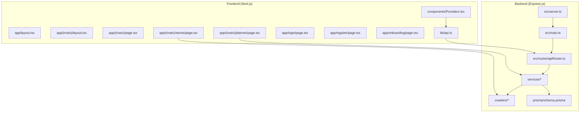
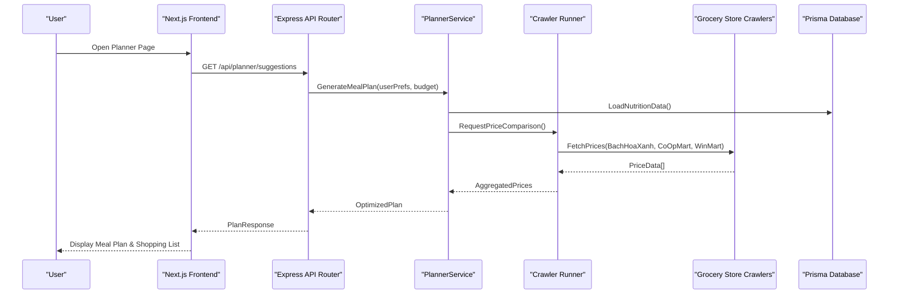
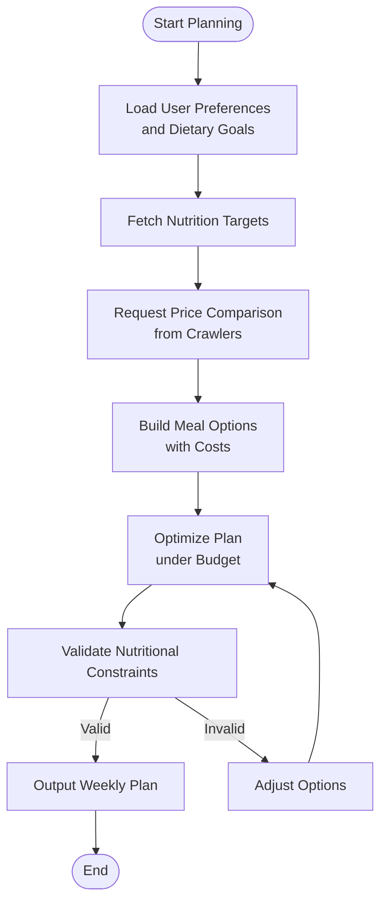
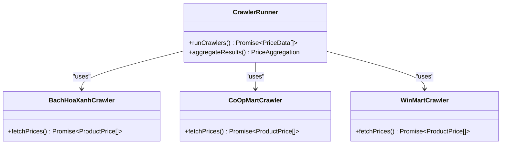
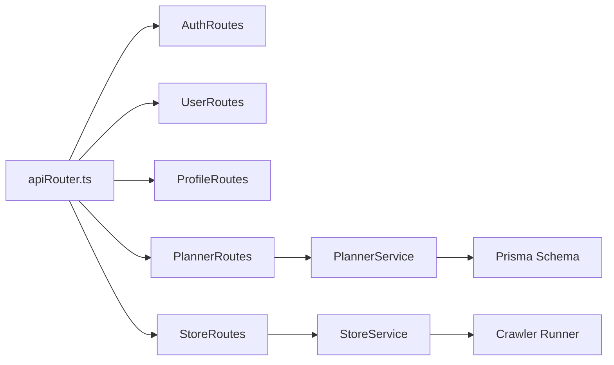
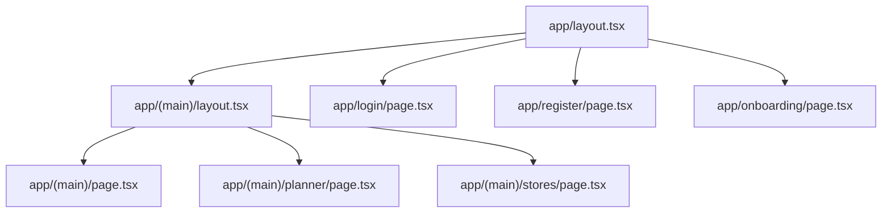
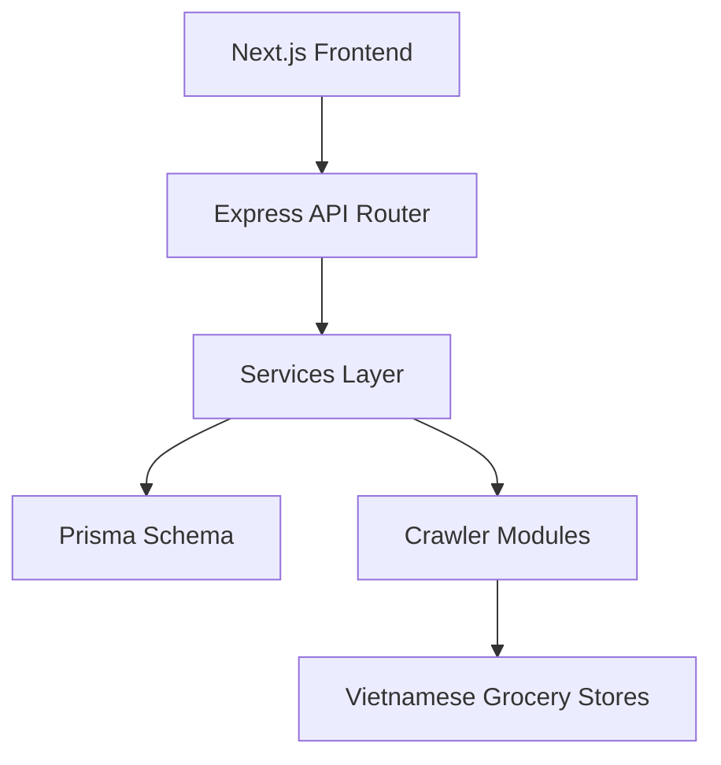

# Project Overview

<cite>
**Referenced Files in This Document**
- [README.md](file://README.md)
- [Backend/README.md](file://Backend/README.md)
- [Frontend/studentbite/README.md](file://Frontend/studentbite/README.md)
- [Backend/src/main.ts](file://Backend/src/main.ts)
- [Backend/src/server.ts](file://Backend/src/server.ts)
- [Backend/src/routes/apiRouter.ts](file://Backend/src/routes/apiRouter.ts)
- [Backend/src/services/planner-algorithm.ts](file://Backend/src/services/planner-algorithm.ts)
- [Backend/src/crawlers/runner.ts](file://Backend/src/crawlers/runner.ts)
- [Backend/src/crawlers/bachhoaxanh.ts](file://Backend/src/crawlers/bachhoaxanh.ts)
- [Backend/src/crawlers/coopmart.ts](file://Backend/src/crawlers/coopmart.ts)
- [Backend/src/crawlers/winmart.ts](file://Backend/src/crawlers/winmart.ts)
- [Backend/prisma/schema.prisma](file://Backend/prisma/schema.prisma)
- [Frontend/studentbite/app/layout.tsx](file://Frontend/studentbite/app/layout.tsx)
- [Frontend/studentbite/app/(main)/layout.tsx](file://Frontend/studentbite/app/(main)/layout.tsx)
- [Frontend/studentbite/app/(main)/page.tsx](file://Frontend/studentbite/app/(main)/page.tsx)
- [Frontend/studentbite/app/(main)/planner/page.tsx](file://Frontend/studentbite/app/(main)/planner/page.tsx)
- [Frontend/studentbite/app/(main)/stores/page.tsx](file://Frontend/studentbite/app/(main)/stores/page.tsx)
- [Frontend/studentbite/app/login/page.tsx](file://Frontend/studentbite/app/login/page.tsx)
- [Frontend/studentbite/app/register/page.tsx](file://Frontend/studentbite/app/register/page.tsx)
- [Frontend/studentbite/app/onboarding/page.tsx](file://Frontend/studentbite/app/onboarding/page.tsx)
- [Frontend/studentbite/lib/api.ts](file://Frontend/studentbite/lib/api.ts)
- [Frontend/studentbite/components/Providers.tsx](file://Frontend/studentbite/components/Providers.tsx)
</cite>

## Table of Contents
1. [Introduction](#introduction)
2. [Project Structure](#project-structure)
3. [Core Components](#core-components)
4. [Architecture Overview](#architecture-overview)
5. [Detailed Component Analysis](#detailed-component-analysis)
6. [Dependency Analysis](#dependency-analysis)
7. [Performance Considerations](#performance-considerations)
8. [Troubleshooting Guide](#troubleshooting-guide)
9. [Conclusion](#conclusion)

## Introduction
StudentBite is a meal planning and grocery shopping optimization platform designed specifically for students. It helps users plan nutritious meals, compare real-time prices across Vietnamese grocery stores, track nutritional intake, and optimize spending within a budget. The platform combines an intelligent meal planner with live price data to deliver actionable shopping recommendations that fit both dietary goals and financial constraints.

Target audience:
- Students seeking affordable, healthy, and convenient meal solutions
- Budget-conscious households looking to reduce food costs without sacrificing nutrition
- Anyone who wants a simple way to plan weekly meals and shop smarter

Key benefits:
- Intelligent meal planning aligned with personal preferences and dietary needs
- Real-time price comparison across major Vietnamese grocery chains
- Nutritional tracking to support health goals
- Budget optimization to keep weekly spending under control
- A streamlined, student-friendly interface for quick decisions

High-level architecture:
- Frontend built with Next.js (App Router) for a responsive, modern user experience
- Backend implemented with Express.js providing RESTful APIs, authentication, and business logic
- Data persistence via Prisma ORM with a relational database schema
- Price intelligence through web crawlers for Vietnamese grocery stores
- Services layer encapsulating core algorithms such as the meal planner and store aggregation

[No sources needed since this section provides a conceptual overview]

## Project Structure
The repository follows a clear separation between frontend and backend:
- Backend directory contains the Express.js server, routes, services, crawlers, models, and Prisma configuration
- Frontend directory contains the Next.js application with App Router pages, components, and API integration utilities

**Diagram sources**
- [Frontend/studentbite/app/layout.tsx](file://Frontend/studentbite/app/layout.tsx)
- [Frontend/studentbite/app/(main)/layout.tsx](file://Frontend/studentbite/app/(main)/layout.tsx)
- [Frontend/studentbite/app/(main)/page.tsx](file://Frontend/studentbite/app/(main)/page.tsx)
- [Frontend/studentbite/app/(main)/planner/page.tsx](file://Frontend/studentbite/app/(main)/planner/page.tsx)
- [Frontend/studentbite/app/(main)/stores/page.tsx](file://Frontend/studentbite/app/(main)/stores/page.tsx)
- [Frontend/studentbite/app/login/page.tsx](file://Frontend/studentbite/app/login/page.tsx)
- [Frontend/studentbite/app/register/page.tsx](file://Frontend/studentbite/app/register/page.tsx)
- [Frontend/studentbite/app/onboarding/page.tsx](file://Frontend/studentbite/app/onboarding/page.tsx)
- [Frontend/studentbite/lib/api.ts](file://Frontend/studentbite/lib/api.ts)
- [Frontend/studentbite/components/Providers.tsx](file://Frontend/studentbite/components/Providers.tsx)
- [Backend/src/server.ts](file://Backend/src/server.ts)
- [Backend/src/main.ts](file://Backend/src/main.ts)
- [Backend/src/routes/apiRouter.ts](file://Backend/src/routes/apiRouter.ts)
- [Backend/prisma/schema.prisma](file://Backend/prisma/schema.prisma)

**Section sources**
- [README.md](file://README.md)
- [Backend/README.md](file://Backend/README.md)
- [Frontend/studentbite/README.md](file://Frontend/studentbite/README.md)

## Core Components
- Meal Planning Service: Implements intelligent algorithms to generate weekly plans based on user preferences, nutritional targets, and budget constraints.
- Store Crawlers: Fetches real-time product prices from Vietnamese grocery stores (e.g., Bach Hoa Xanh, Co.op Mart, WinMart) to power price comparisons.
- API Routes: Organized endpoints for authentication, user profile management, planner operations, and store data.
- Data Layer: Prisma schema defines entities and relationships; repositories abstract database access.
- Frontend Pages: Next.js app pages for home, planner, stores, login, register, and onboarding, integrated via a centralized API client.

Key features:
- Intelligent meal planning algorithms tailored to student budgets and dietary needs
- Real-time price comparison across multiple Vietnamese grocery stores
- Nutritional tracking to monitor macro/micronutrient intake
- Budget optimization to minimize cost while meeting nutritional goals

**Section sources**
- [Backend/src/services/planner-algorithm.ts](file://Backend/src/services/planner-algorithm.ts)
- [Backend/src/crawlers/runner.ts](file://Backend/src/crawlers/runner.ts)
- [Backend/src/crawlers/bachhoaxanh.ts](file://Backend/src/crawlers/bachhoaxanh.ts)
- [Backend/src/crawlers/coopmart.ts](file://Backend/src/crawlers/coopmart.ts)
- [Backend/src/crawlers/winmart.ts](file://Backend/src/crawlers/winmart.ts)
- [Backend/src/routes/apiRouter.ts](file://Backend/src/routes/apiRouter.ts)
- [Backend/prisma/schema.prisma](file://Backend/prisma/schema.prisma)
- [Frontend/studentbite/lib/api.ts](file://Frontend/studentbite/lib/api.ts)
- [Frontend/studentbite/app/(main)/planner/page.tsx](file://Frontend/studentbite/app/(main)/planner/page.tsx)
- [Frontend/studentbite/app/(main)/stores/page.tsx](file://Frontend/studentbite/app/(main)/stores/page.tsx)

## Architecture Overview
StudentBite uses a full-stack architecture combining Next.js and Express.js:
- The Next.js frontend renders interactive UIs and delegates data operations to the backend via REST APIs.
- The Express.js backend exposes routes that orchestrate services, including the meal planner and store crawlers.
- Data is persisted using Prisma with a relational schema, ensuring consistency and scalability.
- Crawlers run asynchronously to aggregate pricing data from multiple grocery stores, enabling real-time comparisons.

**Diagram sources**
- [Frontend/studentbite/app/(main)/planner/page.tsx](file://Frontend/studentbite/app/(main)/planner/page.tsx)
- [Frontend/studentbite/lib/api.ts](file://Frontend/studentbite/lib/api.ts)
- [Backend/src/routes/apiRouter.ts](file://Backend/src/routes/apiRouter.ts)
- [Backend/src/services/planner-algorithm.ts](file://Backend/src/services/planner-algorithm.ts)
- [Backend/src/crawlers/runner.ts](file://Backend/src/crawlers/runner.ts)
- [Backend/src/crawlers/bachhoaxanh.ts](file://Backend/src/crawlers/bachhoaxanh.ts)
- [Backend/src/crawlers/coopmart.ts](file://Backend/src/crawlers/coopmart.ts)
- [Backend/src/crawlers/winmart.ts](file://Backend/src/crawlers/winmart.ts)
- [Backend/prisma/schema.prisma](file://Backend/prisma/schema.prisma)

## Detailed Component Analysis

### Meal Planning Algorithm
The planner algorithm generates optimized weekly meal plans by balancing nutritional requirements, user preferences, and budget constraints. It integrates with store price data to recommend cost-effective combinations.

**Diagram sources**
- [Backend/src/services/planner-algorithm.ts](file://Backend/src/services/planner-algorithm.ts)
- [Backend/src/crawlers/runner.ts](file://Backend/src/crawlers/runner.ts)
- [Backend/prisma/schema.prisma](file://Backend/prisma/schema.prisma)

**Section sources**
- [Backend/src/services/planner-algorithm.ts](file://Backend/src/services/planner-algorithm.ts)

### Store Crawlers Integration
Crawlers fetch real-time pricing data from Vietnamese grocery stores. The runner orchestrates concurrent requests and aggregates results for the planner service.

**Diagram sources**
- [Backend/src/crawlers/runner.ts](file://Backend/src/crawlers/runner.ts)
- [Backend/src/crawlers/bachhoaxanh.ts](file://Backend/src/crawlers/bachhoaxanh.ts)
- [Backend/src/crawlers/coopmart.ts](file://Backend/src/crawlers/coopmart.ts)
- [Backend/src/crawlers/winmart.ts](file://Backend/src/crawlers/winmart.ts)

**Section sources**
- [Backend/src/crawlers/runner.ts](file://Backend/src/crawlers/runner.ts)
- [Backend/src/crawlers/bachhoaxanh.ts](file://Backend/src/crawlers/bachhoaxanh.ts)
- [Backend/src/crawlers/coopmart.ts](file://Backend/src/crawlers/coopmart.ts)
- [Backend/src/crawlers/winmart.ts](file://Backend/src/crawlers/winmart.ts)

### API Routing and Services
Routes organize endpoints for authentication, user profiles, planner operations, and store data. Services encapsulate business logic, coordinating with the database and crawlers.

**Diagram sources**
- [Backend/src/routes/apiRouter.ts](file://Backend/src/routes/apiRouter.ts)
- [Backend/prisma/schema.prisma](file://Backend/prisma/schema.prisma)

**Section sources**
- [Backend/src/routes/apiRouter.ts](file://Backend/src/routes/apiRouter.ts)

### Frontend Pages and Navigation
The Next.js app organizes pages for home, planner, stores, login, register, and onboarding. The layout files define shared structure and navigation.

**Diagram sources**
- [Frontend/studentbite/app/layout.tsx](file://Frontend/studentbite/app/layout.tsx)
- [Frontend/studentbite/app/(main)/layout.tsx](file://Frontend/studentbite/app/(main)/layout.tsx)
- [Frontend/studentbite/app/(main)/page.tsx](file://Frontend/studentbite/app/(main)/page.tsx)
- [Frontend/studentbite/app/(main)/planner/page.tsx](file://Frontend/studentbite/app/(main)/planner/page.tsx)
- [Frontend/studentbite/app/(main)/stores/page.tsx](file://Frontend/studentbite/app/(main)/stores/page.tsx)
- [Frontend/studentbite/app/login/page.tsx](file://Frontend/studentbite/app/login/page.tsx)
- [Frontend/studentbite/app/register/page.tsx](file://Frontend/studentbite/app/register/page.tsx)
- [Frontend/studentbite/app/onboarding/page.tsx](file://Frontend/studentbite/app/onboarding/page.tsx)

**Section sources**
- [Frontend/studentbite/app/layout.tsx](file://Frontend/studentbite/app/layout.tsx)
- [Frontend/studentbite/app/(main)/layout.tsx](file://Frontend/studentbite/app/(main)/layout.tsx)
- [Frontend/studentbite/app/(main)/page.tsx](file://Frontend/studentbite/app/(main)/page.tsx)
- [Frontend/studentbite/app/(main)/planner/page.tsx](file://Frontend/studentbite/app/(main)/planner/page.tsx)
- [Frontend/studentbite/app/(main)/stores/page.tsx](file://Frontend/studentbite/app/(main)/stores/page.tsx)
- [Frontend/studentbite/app/login/page.tsx](file://Frontend/studentbite/app/login/page.tsx)
- [Frontend/studentbite/app/register/page.tsx](file://Frontend/studentbite/app/register/page.tsx)
- [Frontend/studentbite/app/onboarding/page.tsx](file://Frontend/studentbite/app/onboarding/page.tsx)

## Dependency Analysis
The system exhibits clear separation of concerns:
- Frontend depends on the backend API for data and operations
- Backend routes depend on services for business logic
- Services depend on Prisma for data persistence and crawlers for external price data
- Crawlers are independent modules targeting specific grocery stores

**Diagram sources**
- [Frontend/studentbite/lib/api.ts](file://Frontend/studentbite/lib/api.ts)
- [Backend/src/routes/apiRouter.ts](file://Backend/src/routes/apiRouter.ts)
- [Backend/prisma/schema.prisma](file://Backend/prisma/schema.prisma)
- [Backend/src/crawlers/runner.ts](file://Backend/src/crawlers/runner.ts)

**Section sources**
- [Backend/src/routes/apiRouter.ts](file://Backend/src/routes/apiRouter.ts)
- [Backend/src/crawlers/runner.ts](file://Backend/src/crawlers/runner.ts)
- [Backend/prisma/schema.prisma](file://Backend/prisma/schema.prisma)

## Performance Considerations
- Concurrent crawling: Use parallel requests to gather price data quickly while handling rate limits and failures gracefully.
- Caching strategies: Cache frequently accessed nutrition data and store prices to reduce latency and external calls.
- Efficient planning: Optimize the planner algorithm to avoid unnecessary recomputation and leverage precomputed options where possible.
- Frontend rendering: Leverage Next.js server-side rendering and static generation for faster initial loads.

[No sources needed since this section provides general guidance]

## Troubleshooting Guide
Common issues and resolutions:
- API connectivity: Ensure the backend server is running and CORS settings allow frontend requests.
- Authentication errors: Verify token handling and route protection middleware.
- Crawler failures: Monitor crawler logs and implement retries for transient network errors.
- Database migrations: Confirm Prisma migrations are applied and schema matches the current codebase.

**Section sources**
- [Backend/src/server.ts](file://Backend/src/server.ts)
- [Backend/src/main.ts](file://Backend/src/main.ts)

## Conclusion
StudentBite empowers students to make smarter food choices by combining intelligent meal planning with real-time price comparisons across Vietnamese grocery stores. Its full-stack architecture—Next.js frontend and Express.js backend—delivers a responsive, scalable solution that balances nutrition, affordability, and convenience. By focusing on practical features like budget optimization and nutritional tracking, StudentBite addresses everyday challenges faced by students and promotes healthier, more economical eating habits.

[No sources needed since this section summarizes without analyzing specific files]