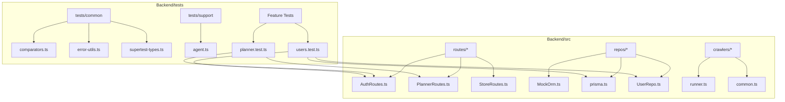
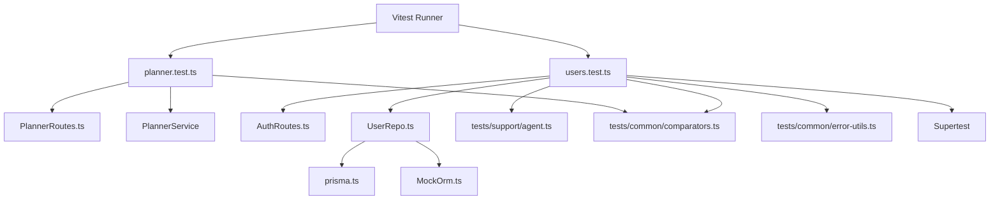
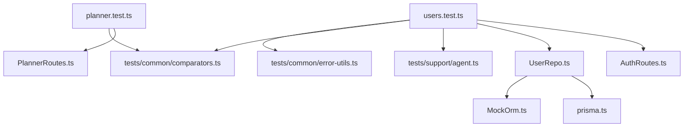
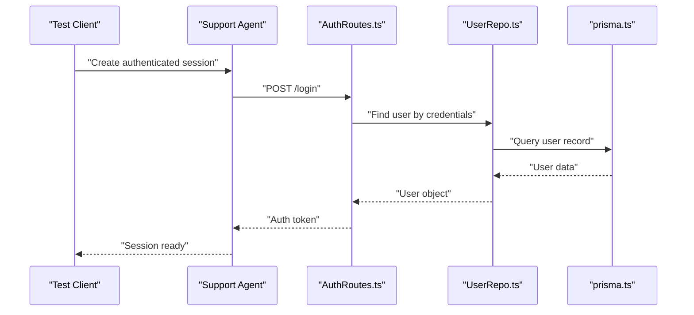
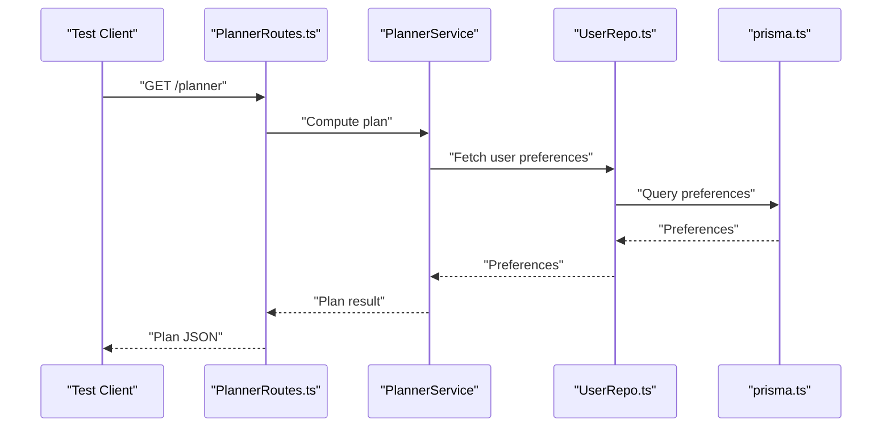

# Testing Strategy

<cite>
**Referenced Files in This Document**
- [vitest.config.mts](file://Backend/vitest.config.mts)
- [package.json](file://Backend/package.json)
- [comparators.ts](file://Backend/tests/common/comparators.ts)
- [error-utils.ts](file://Backend/tests/common/error-utils.ts)
- [supertest-types.ts](file://Backend/tests/common/supertest-types.ts)
- [agent.ts](file://Backend/tests/support/agent.ts)
- [planner.test.ts](file://Backend/tests/planner.test.ts)
- [users.test.ts](file://Backend/tests/users.test.ts)
- [MockOrm.ts](file://Backend/src/repos/MockOrm.ts)
- [prisma.ts](file://Backend/src/repos/prisma.ts)
- [UserRepo.ts](file://Backend/src/repos/UserRepo.ts)
- [AuthRoutes.ts](file://Backend/src/routes/AuthRoutes.ts)
- [PlannerRoutes.ts](file://Backend/src/routes/PlannerRoutes.ts)
- [StoreRoutes.ts](file://Backend/src/routes/StoreRoutes.ts)
- [runner.ts](file://Backend/src/crawlers/runner.ts)
- [common.ts](file://Backend/src/crawlers/common.ts)
</cite>

## Table of Contents
1. [Introduction](#introduction)
2. [Project Structure](#project-structure)
3. [Core Components](#core-components)
4. [Architecture Overview](#architecture-overview)
5. [Detailed Component Analysis](#detailed-component-analysis)
6. [Dependency Analysis](#dependency-analysis)
7. [Performance Considerations](#performance-considerations)
8. [Troubleshooting Guide](#troubleshooting-guide)
9. [Conclusion](#conclusion)
10. [Appendices](#appendices)

## Introduction
This document explains StudentBite’s testing strategy, focusing on unit and integration tests for the backend. It covers how Vitest is configured, how tests are organized, strategies for mocking external dependencies, API endpoint integration tests, and utilities used across test suites. It also provides guidelines for writing effective tests, coverage expectations, and best practices for asynchronous operations, database integration tests, and crawler testing.

## Project Structure
The backend test suite lives under Backend/tests with a clear separation between shared utilities and feature-specific tests:
- tests/common: Shared helpers, custom comparators, error utilities, and Supertest type definitions.
- tests/support: Test support agents (e.g., HTTP agent setup).
- Feature tests: planner.test.ts and users.test.ts demonstrate unit/integration patterns.

**Diagram sources**
- [vitest.config.mts](file://Backend/vitest.config.mts)
- [comparators.ts](file://Backend/tests/common/comparators.ts)
- [error-utils.ts](file://Backend/tests/common/error-utils.ts)
- [supertest-types.ts](file://Backend/tests/common/supertest-types.ts)
- [agent.ts](file://Backend/tests/support/agent.ts)
- [planner.test.ts](file://Backend/tests/planner.test.ts)
- [users.test.ts](file://Backend/tests/users.test.ts)
- [MockOrm.ts](file://Backend/src/repos/MockOrm.ts)
- [prisma.ts](file://Backend/src/repos/prisma.ts)
- [UserRepo.ts](file://Backend/src/repos/UserRepo.ts)
- [AuthRoutes.ts](file://Backend/src/routes/AuthRoutes.ts)
- [PlannerRoutes.ts](file://Backend/src/routes/PlannerRoutes.ts)
- [StoreRoutes.ts](file://Backend/src/routes/StoreRoutes.ts)
- [runner.ts](file://Backend/src/crawlers/runner.ts)
- [common.ts](file://Backend/src/crawlers/common.ts)

**Section sources**
- [vitest.config.mts](file://Backend/vitest.config.mts)
- [package.json](file://Backend/package.json)

## Core Components
- Vitest configuration: Centralized test runner settings, environment, globals, and coverage thresholds.
- Custom comparators: Domain-aware equality checks to assert complex objects without brittle diffs.
- Error utilities: Helpers to normalize and assert error responses from endpoints or services.
- Supertest types: Type-safe request/response assertions for Express routes.
- Support agent: Reusable HTTP agent for authenticated or stateful integration tests.

Key responsibilities:
- comparators.ts: Define matchers for domain entities and response shapes.
- error-utils.ts: Provide assertion helpers for error codes, messages, and stack traces.
- supertest-types.ts: Enforce typed requests/responses for route tests.
- agent.ts: Manage session/auth context across multiple requests.

**Section sources**
- [comparators.ts](file://Backend/tests/common/comparators.ts)
- [error-utils.ts](file://Backend/tests/common/error-utils.ts)
- [supertest-types.ts](file://Backend/tests/common/supertest-types.ts)
- [agent.ts](file://Backend/tests/support/agent.ts)

## Architecture Overview
Testing architecture centers around Vitest as the runner, Supertest for HTTP integration, and Prisma for data access. Services and repositories are isolated via mocks where appropriate. Crawlers are tested through their orchestrator to avoid network flakiness.

**Diagram sources**
- [vitest.config.mts](file://Backend/vitest.config.mts)
- [planner.test.ts](file://Backend/tests/planner.test.ts)
- [users.test.ts](file://Backend/tests/users.test.ts)
- [PlannerRoutes.ts](file://Backend/src/routes/PlannerRoutes.ts)
- [AuthRoutes.ts](file://Backend/src/routes/AuthRoutes.ts)
- [UserRepo.ts](file://Backend/src/repos/UserRepo.ts)
- [prisma.ts](file://Backend/src/repos/prisma.ts)
- [MockOrm.ts](file://Backend/src/repos/MockOrm.ts)
- [comparators.ts](file://Backend/tests/common/comparators.ts)
- [error-utils.ts](file://Backend/tests/common/error-utils.ts)
- [agent.ts](file://Backend/tests/support/agent.ts)

## Detailed Component Analysis

### Unit Testing with Vitest
- Test discovery and execution are driven by Vitest configuration.
- Use describe/it blocks to structure tests per service or module.
- Prefer pure functions and deterministic inputs for fast, reliable unit tests.
- Mock external modules using Vitest’s built-in mocking utilities when needed.

Guidelines:
- Keep tests focused on one behavior per test case.
- Avoid coupling tests to implementation details; assert observable outcomes.
- Use meaningful names that describe expected behavior.

**Section sources**
- [vitest.config.mts](file://Backend/vitest.config.mts)
- [package.json](file://Backend/package.json)

### Test Organization Patterns
- tests/common: Shared utilities and helpers reused across all tests.
- tests/support: Environment setup, authentication agents, and lifecycle hooks.
- Feature-level tests: One file per domain area (e.g., planner.test.ts, users.test.ts).

Patterns:
- Arrange-Act-Assert structure within each test.
- Group related tests with describe blocks.
- Extract repeated setup into beforeEach or support helpers.

**Section sources**
- [comparators.ts](file://Backend/tests/common/comparators.ts)
- [error-utils.ts](file://Backend/tests/common/error-utils.ts)
- [supertest-types.ts](file://Backend/tests/common/supertest-types.ts)
- [agent.ts](file://Backend/tests/support/agent.ts)
- [planner.test.ts](file://Backend/tests/planner.test.ts)
- [users.test.ts](file://Backend/tests/users.test.ts)

### Mock Strategies for External Dependencies
- Repository layer: Use MockOrm.ts to replace real database calls during unit tests.
- Service layer: Inject mock implementations or use dependency injection to swap real services.
- Network calls: Stub fetch/http clients or route handlers to return deterministic responses.

Best practices:
- Mock at the boundary closest to the system under test.
- Validate that mocks receive expected calls and return values.
- Keep mocks minimal—only stub what the test needs.

**Section sources**
- [MockOrm.ts](file://Backend/src/repos/MockOrm.ts)
- [UserRepo.ts](file://Backend/src/repos/UserRepo.ts)
- [prisma.ts](file://Backend/src/repos/prisma.ts)

### Integration Testing for API Endpoints
- Use Supertest to send HTTP requests to Express routes.
- Authenticate via tests/support/agent.ts to maintain session/state across requests.
- Assert status codes, headers, and response bodies using custom comparators and error utilities.

Typical flow:
- Setup test fixtures and seed data if necessary.
- Perform authenticated requests against AuthRoutes.ts and other route files.
- Verify business logic outcomes via response shape and side effects.

**Section sources**
- [agent.ts](file://Backend/tests/support/agent.ts)
- [AuthRoutes.ts](file://Backend/src/routes/AuthRoutes.ts)
- [PlannerRoutes.ts](file://Backend/src/routes/PlannerRoutes.ts)
- [StoreRoutes.ts](file://Backend/src/routes/StoreRoutes.ts)
- [supertest-types.ts](file://Backend/tests/common/supertest-types.ts)
- [comparators.ts](file://Backend/tests/common/comparators.ts)
- [error-utils.ts](file://Backend/tests/common/error-utils.ts)

### Testing Utilities, Custom Comparators, and Support Agents
- Custom comparators: Normalize object comparisons for robust assertions.
- Error utilities: Standardize error checking across tests.
- Supertest types: Ensure type safety for request/response payloads.
- Support agent: Encapsulate auth/session handling for integration tests.

Usage tips:
- Import comparators to assert nested structures without brittle diffs.
- Use error utilities to assert both success and failure paths consistently.
- Leverage the support agent to reduce duplication in authenticated flows.

**Section sources**
- [comparators.ts](file://Backend/tests/common/comparators.ts)
- [error-utils.ts](file://Backend/tests/common/error-utils.ts)
- [supertest-types.ts](file://Backend/tests/common/supertest-types.ts)
- [agent.ts](file://Backend/tests/support/agent.ts)

### Asynchronous Operations
- Use async/await in test cases for promises and timeouts.
- Wrap async assertions in try/catch where needed to capture errors.
- Set appropriate timeouts for slow operations (network, DB).

Recommendations:
- Isolate long-running operations behind interfaces to allow mocking.
- Use deterministic fixtures to avoid flaky timing-dependent tests.

[No sources needed since this section provides general guidance]

### Database Integration Tests
- Use prisma.ts for real database interactions in integration tests.
- Seed test data before running suites and clean up afterward.
- Prefer transactional setups to isolate test runs.

Guidelines:
- Keep integration tests separate from unit tests.
- Use MockOrm.ts only for unit tests; rely on prisma.ts for integration tests.

**Section sources**
- [prisma.ts](file://Backend/src/repos/prisma.ts)
- [UserRepo.ts](file://Backend/src/repos/UserRepo.ts)
- [MockOrm.ts](file://Backend/src/repos/MockOrm.ts)

### Crawler Testing Strategies
- Crawl orchestration is handled by runner.ts and common utilities.
- Avoid live network calls in tests; mock HTTP clients or responses.
- Validate parsing logic and data transformations with deterministic fixtures.

Approach:
- Test runner.ts with mocked fetch/http responses.
- Assert that parsed results conform to expected schemas using comparators.
- Simulate edge cases like missing fields or malformed pages.

**Section sources**
- [runner.ts](file://Backend/src/crawlers/runner.ts)
- [common.ts](file://Backend/src/crawlers/common.ts)

## Dependency Analysis
Tests depend on routing, repository, and utility layers. The diagram below shows key relationships between test files and source modules they exercise.

**Diagram sources**
- [planner.test.ts](file://Backend/tests/planner.test.ts)
- [users.test.ts](file://Backend/tests/users.test.ts)
- [PlannerRoutes.ts](file://Backend/src/routes/PlannerRoutes.ts)
- [AuthRoutes.ts](file://Backend/src/routes/AuthRoutes.ts)
- [UserRepo.ts](file://Backend/src/repos/UserRepo.ts)
- [prisma.ts](file://Backend/src/repos/prisma.ts)
- [MockOrm.ts](file://Backend/src/repos/MockOrm.ts)
- [comparators.ts](file://Backend/tests/common/comparators.ts)
- [error-utils.ts](file://Backend/tests/common/error-utils.ts)
- [agent.ts](file://Backend/tests/support/agent.ts)

**Section sources**
- [planner.test.ts](file://Backend/tests/planner.test.ts)
- [users.test.ts](file://Backend/tests/users.test.ts)
- [PlannerRoutes.ts](file://Backend/src/routes/PlannerRoutes.ts)
- [AuthRoutes.ts](file://Backend/src/routes/AuthRoutes.ts)
- [UserRepo.ts](file://Backend/src/repos/UserRepo.ts)
- [prisma.ts](file://Backend/src/repos/prisma.ts)
- [MockOrm.ts](file://Backend/src/repos/MockOrm.ts)
- [comparators.ts](file://Backend/tests/common/comparators.ts)
- [error-utils.ts](file://Backend/tests/common/error-utils.ts)
- [agent.ts](file://Backend/tests/support/agent.ts)

## Performance Considerations
- Keep unit tests fast by avoiding real I/O; mock external systems.
- Use in-memory databases or transactional rollbacks for integration tests.
- Parallelize independent test suites where possible.
- Limit heavy fixtures and reuse shared setup efficiently.

[No sources needed since this section provides general guidance]

## Troubleshooting Guide
Common issues and resolutions:
- Flaky network tests: Replace live calls with deterministic mocks.
- Authentication failures in integration tests: Ensure the support agent initializes correctly and persists cookies/tokens.
- Assertion mismatches: Use custom comparators to ignore irrelevant fields and stabilize diffs.
- Database state leakage: Wrap tests in transactions or reset seeds between runs.

Checklist:
- Verify Vitest config includes correct globals and environment.
- Confirm Supertest types align with actual route responses.
- Validate that mocks cover all external dependencies invoked by the code under test.

**Section sources**
- [vitest.config.mts](file://Backend/vitest.config.mts)
- [supertest-types.ts](file://Backend/tests/common/supertest-types.ts)
- [comparators.ts](file://Backend/tests/common/comparators.ts)
- [agent.ts](file://Backend/tests/support/agent.ts)

## Conclusion
StudentBite’s testing strategy leverages Vitest for execution, Supertest for HTTP integration, and targeted mocking to ensure reliability. Custom comparators and error utilities standardize assertions, while the support agent simplifies authenticated flows. By following the outlined guidelines for unit, integration, async, database, and crawler tests, teams can maintain a robust, fast, and predictable test suite.

[No sources needed since this section summarizes without analyzing specific files]

## Appendices

### Coverage Requirements and Best Practices
- Aim for high branch and function coverage on critical paths (auth, planning algorithms, user management).
- Prioritize coverage for services and repositories over thin route wrappers.
- Treat coverage as a guide, not a goal; focus on meaningful scenarios.

[No sources needed since this section provides general guidance]

### Example Test Flows

#### API Authentication Flow

**Diagram sources**
- [agent.ts](file://Backend/tests/support/agent.ts)
- [AuthRoutes.ts](file://Backend/src/routes/AuthRoutes.ts)
- [UserRepo.ts](file://Backend/src/repos/UserRepo.ts)
- [prisma.ts](file://Backend/src/repos/prisma.ts)

#### Planner Endpoint Flow

**Diagram sources**
- [PlannerRoutes.ts](file://Backend/src/routes/PlannerRoutes.ts)
- [UserRepo.ts](file://Backend/src/repos/UserRepo.ts)
- [prisma.ts](file://Backend/src/repos/prisma.ts)