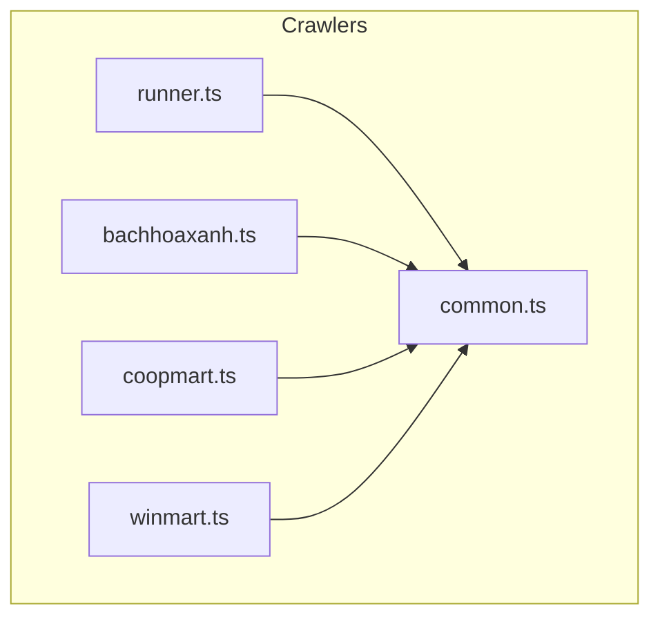
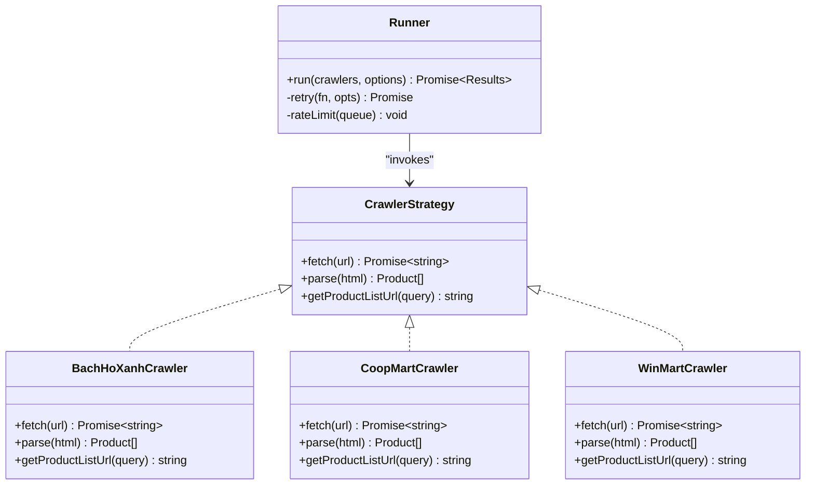
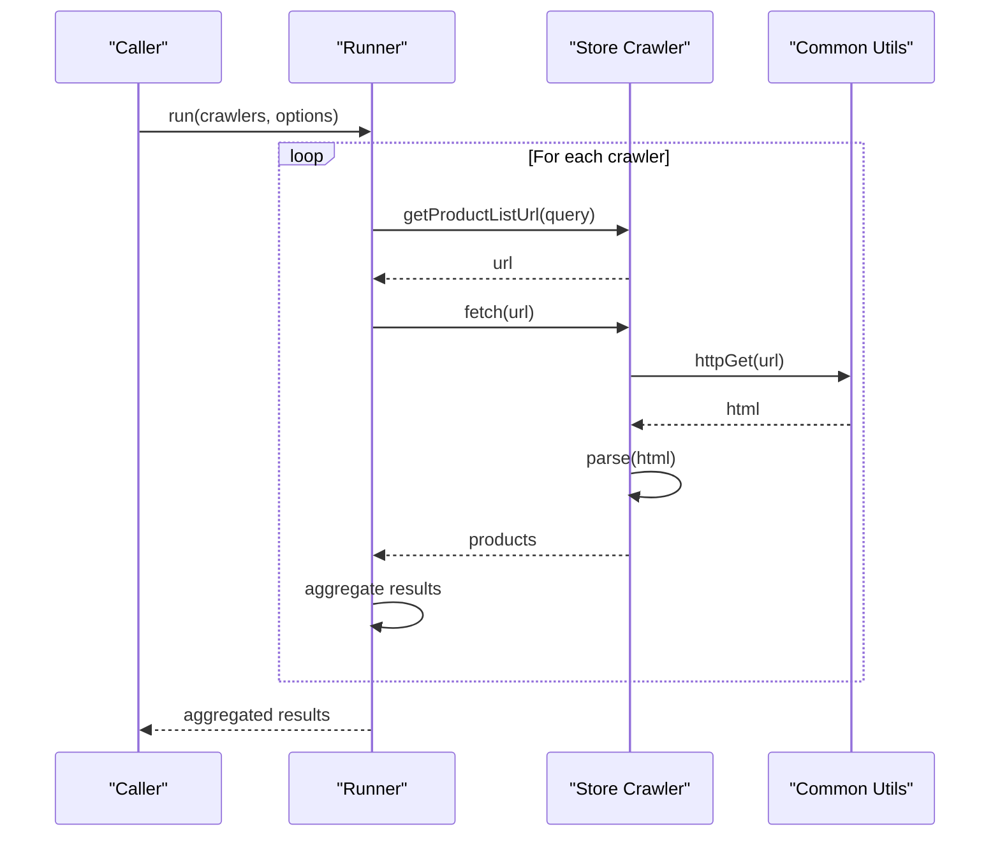
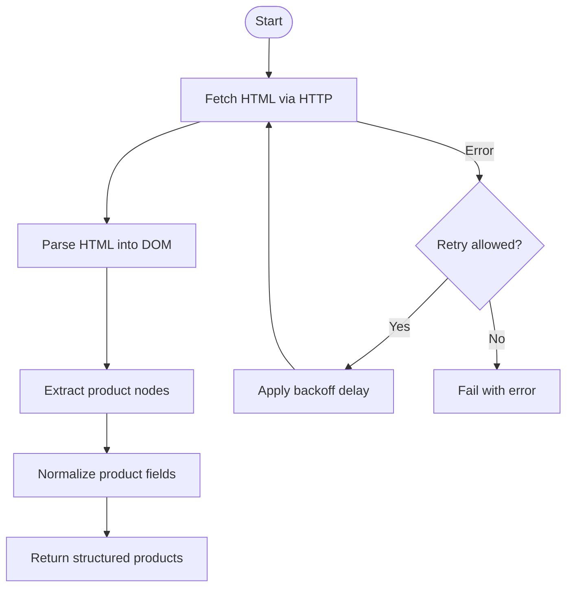
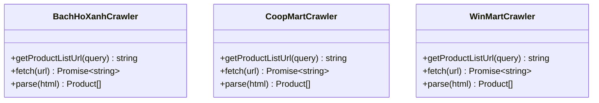
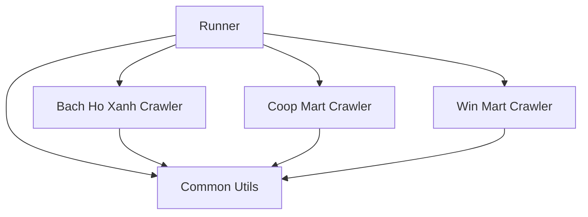

# Crawler Architecture

<cite>
**Referenced Files in This Document**
- [runner.ts](file://Backend/src/crawlers/runner.ts)
- [common.ts](file://Backend/src/crawlers/common.ts)
- [bachhoaxanh.ts](file://Backend/src/crawlers/bachhoaxanh.ts)
- [coopmart.ts](file://Backend/src/crawlers/coopmart.ts)
- [winmart.ts](file://Backend/src/crawlers/winmart.ts)
</cite>

## Table of Contents
1. [Introduction](#introduction)
2. [Project Structure](#project-structure)
3. [Core Components](#core-components)
4. [Architecture Overview](#architecture-overview)
5. [Detailed Component Analysis](#detailed-component-analysis)
6. [Dependency Analysis](#dependency-analysis)
7. [Performance Considerations](#performance-considerations)
8. [Troubleshooting Guide](#troubleshooting-guide)
9. [Conclusion](#conclusion)
10. [Appendices](#appendices)

## Introduction
This document explains the StudentBite crawler architecture with a focus on the Strategy Pattern used to implement pluggable, store-specific crawlers. It covers common utilities for parsing HTML responses and extracting product data, the runner system that orchestrates crawling operations, interface contracts between crawlers, error handling strategies, retry mechanisms, and rate limiting approaches. It also provides guidance on how to implement new store crawlers following established patterns.

## Project Structure
The crawler subsystem lives under Backend/src/crawlers and is composed of:
- A runner that coordinates execution across multiple store crawlers
- A shared common module providing utilities for HTTP requests, HTML parsing, and product extraction
- Store-specific crawler implementations (e.g., Bach Ho Xanh, Coop Mart, Win Mart)

**Diagram sources**
- [runner.ts](file://Backend/src/crawlers/runner.ts)
- [common.ts](file://Backend/src/crawlers/common.ts)
- [bachhoaxanh.ts](file://Backend/src/crawlers/bachhoaxanh.ts)
- [coopmart.ts](file://Backend/src/crawlers/coopmart.ts)
- [winmart.ts](file://Backend/src/crawlers/winmart.ts)

**Section sources**
- [runner.ts](file://Backend/src/crawlers/runner.ts)
- [common.ts](file://Backend/src/crawlers/common.ts)
- [bachhoaxanh.ts](file://Backend/src/crawlers/bachhoaxanh.ts)
- [coopmart.ts](file://Backend/src/crawlers/coopmart.ts)
- [winmart.ts](file://Backend/src/crawlers/winmart.ts)

## Core Components
- Runner: Orchestrates crawling by invoking store-specific crawlers, managing concurrency, retries, and rate limiting.
- Common Utilities: Provide HTTP fetching, HTML parsing helpers, and product data extraction functions used by all crawlers.
- Store Crawlers: Implement the crawler strategy for each store, defining how to fetch pages, parse HTML, and extract product information.

Key responsibilities:
- Interface contract: Each crawler exposes a consistent API for discovery and extraction.
- Error handling: Standardized errors and recovery paths.
- Retry and backoff: Configurable attempts and delays.
- Rate limiting: Throttling per-store or global limits.

**Section sources**
- [runner.ts](file://Backend/src/crawlers/runner.ts)
- [common.ts](file://Backend/src/crawlers/common.ts)
- [bachhoaxanh.ts](file://Backend/src/crawlers/bachhoaxanh.ts)
- [coopmart.ts](file://Backend/src/crawlers/coopmart.ts)
- [winmart.ts](file://Backend/src/crawlers/winmart.ts)

## Architecture Overview
The crawler system follows a Strategy Pattern where each store has its own crawler implementation adhering to a common interface. The runner composes these strategies and manages execution flow.

**Diagram sources**
- [runner.ts](file://Backend/src/crawlers/runner.ts)
- [common.ts](file://Backend/src/crawlers/common.ts)
- [bachhoaxanh.ts](file://Backend/src/crawlers/bachhoaxanh.ts)
- [coopmart.ts](file://Backend/src/crawlers/coopmart.ts)
- [winmart.ts](file://Backend/src/crawlers/winmart.ts)

## Detailed Component Analysis

### Runner Orchestration
The runner coordinates crawling tasks across multiple store crawlers. It typically:
- Accepts a list of crawler strategies and execution options
- Enforces concurrency limits and rate limiting
- Wraps crawler calls with retry logic and exponential backoff
- Aggregates results and handles errors consistently

**Diagram sources**
- [runner.ts](file://Backend/src/crawlers/runner.ts)
- [common.ts](file://Backend/src/crawlers/common.ts)
- [bachhoaxanh.ts](file://Backend/src/crawlers/bachhoaxanh.ts)
- [coopmart.ts](file://Backend/src/crawlers/coopmart.ts)
- [winmart.ts](file://Backend/src/crawlers/winmart.ts)

**Section sources**
- [runner.ts](file://Backend/src/crawlers/runner.ts)

### Common Utilities
Common utilities centralize HTTP fetching, HTML parsing, and product extraction logic to avoid duplication across crawlers. Typical features include:
- HTTP client wrapper with configurable headers and timeouts
- HTML parser integration for DOM traversal
- Helpers to normalize product fields (name, price, unit, availability)
- Utility functions for URL construction and query parameter encoding

**Diagram sources**
- [common.ts](file://Backend/src/crawlers/common.ts)

**Section sources**
- [common.ts](file://Backend/src/crawlers/common.ts)

### Store-Specific Crawlers
Each store crawler implements the same interface contract:
- getProductListUrl(query): Returns the search/list page URL for a given query
- fetch(url): Retrieves the HTML content from the target URL
- parse(html): Parses HTML and returns an array of normalized product objects

Examples:
- Bach Ho Xanh crawler: Implements store-specific selectors and normalization rules
- Coop Mart crawler: Adapts parsing logic to Coop Mart’s HTML structure
- Win Mart crawler: Handles Win Mart’s unique response format

**Diagram sources**
- [bachhoaxanh.ts](file://Backend/src/crawlers/bachhoaxanh.ts)
- [coopmart.ts](file://Backend/src/crawlers/coopmart.ts)
- [winmart.ts](file://Backend/src/crawlers/winmart.ts)

**Section sources**
- [bachhoaxanh.ts](file://Backend/src/crawlers/bachhoaxanh.ts)
- [coopmart.ts](file://Backend/src/crawlers/coopmart.ts)
- [winmart.ts](file://Backend/src/crawlers/winmart.ts)

### Interface Contracts
All crawlers must adhere to a consistent interface:
- getProductListUrl(query): Produces a valid store search URL
- fetch(url): Performs HTTP GET and returns raw HTML
- parse(html): Converts HTML into a standardized product list

Normalization expectations:
- Product name: Cleaned and canonicalized
- Price: Numeric value with currency/unit context
- Availability: Boolean or status indicator
- Metadata: Optional fields like brand, category, or source URL

**Section sources**
- [common.ts](file://Backend/src/crawlers/common.ts)
- [bachhoaxanh.ts](file://Backend/src/crawlers/bachhoaxanh.ts)
- [coopmart.ts](file://Backend/src/crawlers/coopmart.ts)
- [winmart.ts](file://Backend/src/crawlers/winmart.ts)

### Error Handling Strategies
- Network errors: Retries with exponential backoff up to a configured maximum
- Parsing errors: Graceful fallbacks and logging; partial results may be returned
- Validation errors: Reject malformed product entries and continue processing
- Timeout handling: Configurable request timeouts with immediate retry or failure

**Section sources**
- [runner.ts](file://Backend/src/crawlers/runner.ts)
- [common.ts](file://Backend/src/crawlers/common.ts)

### Retry Mechanisms
- Exponential backoff: Delays increase with each retry attempt
- Maximum attempts: Prevents infinite retries
- Idempotency: Safe to retry GET requests without side effects
- Failure thresholds: Stop after consecutive failures beyond a threshold

**Section sources**
- [runner.ts](file://Backend/src/crawlers/runner.ts)

### Rate Limiting Approaches
- Per-crawler limits: Respect store-specific request caps
- Global limits: Cap total concurrent requests across all crawlers
- Token bucket or sliding window: Smooth out bursts and maintain fairness
- Delay scheduling: Queue-based execution with controlled concurrency

**Section sources**
- [runner.ts](file://Backend/src/crawlers/runner.ts)

## Dependency Analysis
The runner depends on the common utilities and invokes each crawler strategy. Store crawlers depend on common utilities for HTTP and parsing.

**Diagram sources**
- [runner.ts](file://Backend/src/crawlers/runner.ts)
- [common.ts](file://Backend/src/crawlers/common.ts)
- [bachhoaxanh.ts](file://Backend/src/crawlers/bachhoaxanh.ts)
- [coopmart.ts](file://Backend/src/crawlers/coopmart.ts)
- [winmart.ts](file://Backend/src/crawlers/winmart.ts)

**Section sources**
- [runner.ts](file://Backend/src/crawlers/runner.ts)
- [common.ts](file://Backend/src/crawlers/common.ts)
- [bachhoaxanh.ts](file://Backend/src/crawlers/bachhoaxanh.ts)
- [coopmart.ts](file://Backend/src/crawlers/coopmart.ts)
- [winmart.ts](file://Backend/src/crawlers/winmart.ts)

## Performance Considerations
- Concurrency control: Tune parallelism to balance throughput and server load
- Caching: Cache repeated queries or stable HTML fragments when appropriate
- Selective parsing: Minimize DOM traversal scope to reduce CPU usage
- Streaming: Consider streaming large responses if supported by the HTTP client
- Monitoring: Track latency, error rates, and throughput per crawler

[No sources needed since this section provides general guidance]

## Troubleshooting Guide
Common issues and resolutions:
- HTTP timeouts: Increase timeout settings or adjust retry configuration
- Parsing failures: Inspect HTML structure changes and update selectors
- Rate limit errors: Reduce concurrency or add longer delays
- Inconsistent product data: Validate normalization rules and add missing fields

**Section sources**
- [runner.ts](file://Backend/src/crawlers/runner.ts)
- [common.ts](file://Backend/src/crawlers/common.ts)

## Conclusion
The StudentBite crawler architecture leverages the Strategy Pattern to provide a clean, extensible framework for integrating new store crawlers. The runner centralizes orchestration, while common utilities standardize HTTP and parsing behavior. By adhering to the defined interface contracts and leveraging built-in error handling, retries, and rate limiting, developers can rapidly add new stores with minimal friction.

[No sources needed since this section summarizes without analyzing specific files]

## Appendices

### How to Implement a New Store Crawler
Steps:
1. Create a new file under Backend/src/crawlers named after the store (e.g., newstore.ts)
2. Implement the crawler interface:
   - getProductListUrl(query): Build the correct search URL for the store
   - fetch(url): Use common HTTP utilities to retrieve HTML
   - parse(html): Extract product nodes and return normalized product objects
3. Register the crawler with the runner by adding it to the list of strategies
4. Test with sample queries and validate output consistency

Best practices:
- Reuse common utilities for HTTP and parsing
- Normalize product fields consistently
- Handle edge cases and malformed responses gracefully
- Add logging and metrics for observability

**Section sources**
- [runner.ts](file://Backend/src/crawlers/runner.ts)
- [common.ts](file://Backend/src/crawlers/common.ts)
- [bachhoaxanh.ts](file://Backend/src/crawlers/bachhoaxanh.ts)
- [coopmart.ts](file://Backend/src/crawlers/coopmart.ts)
- [winmart.ts](file://Backend/src/crawlers/winmart.ts)