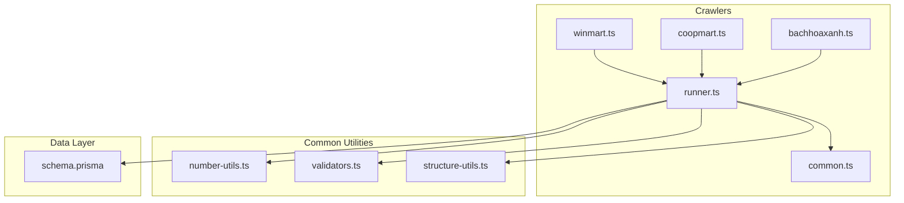
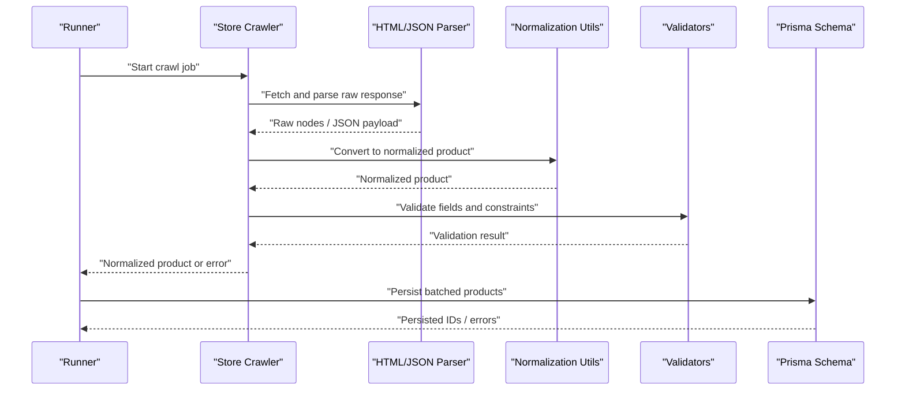
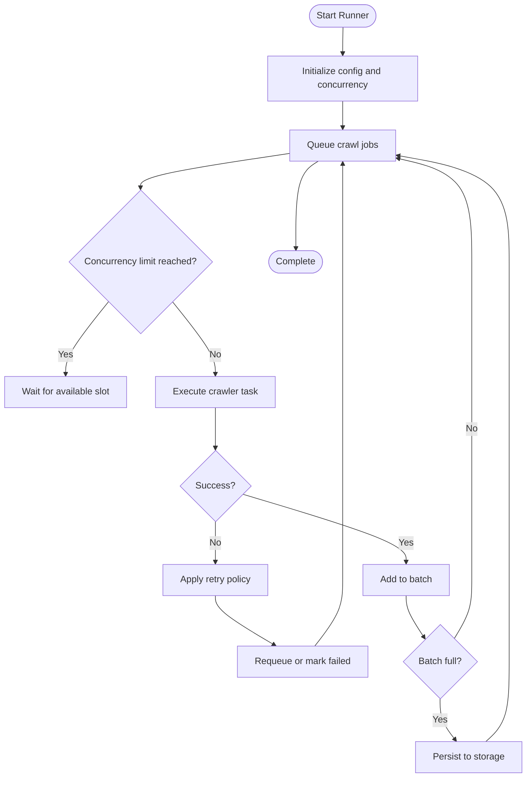
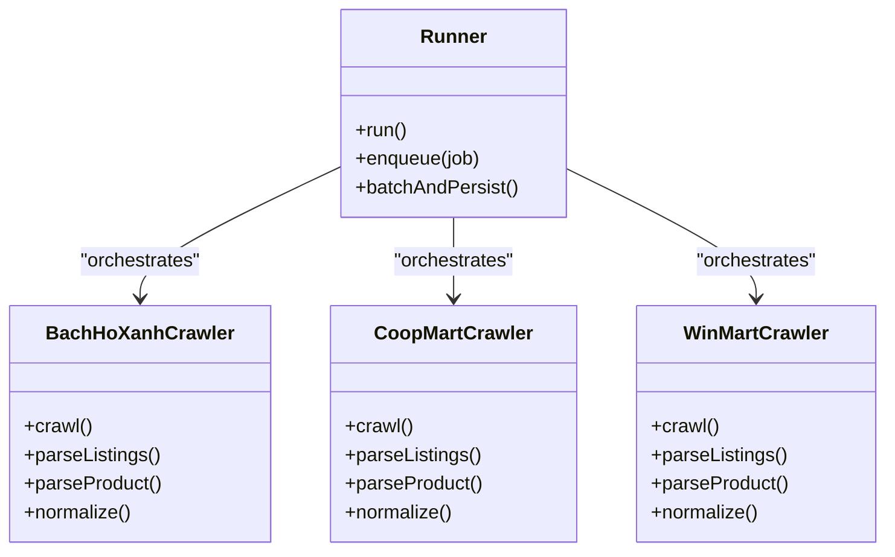
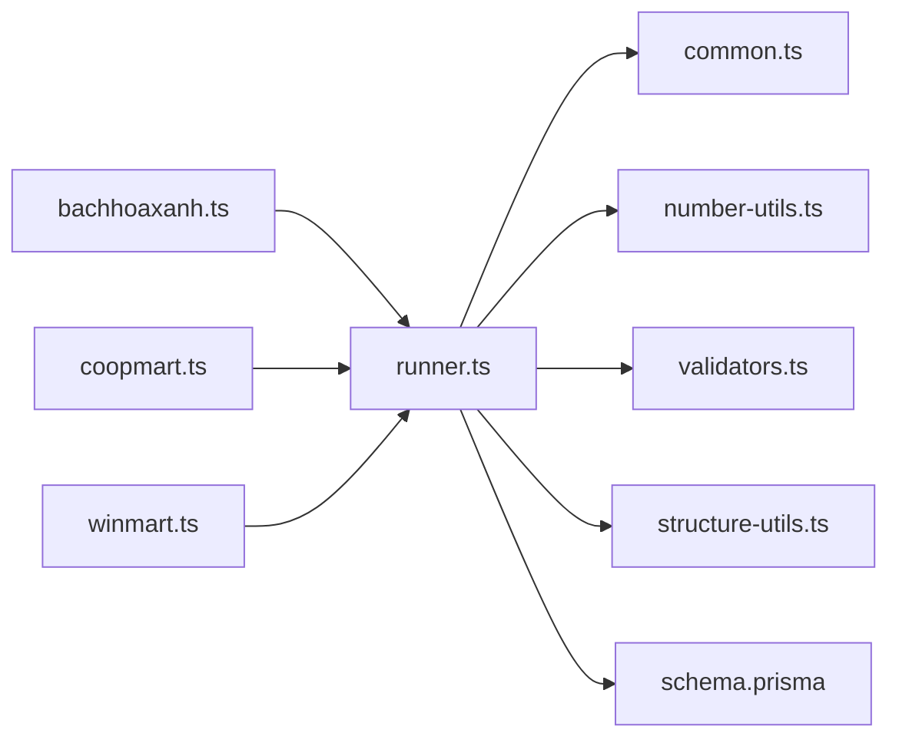

# Data Normalization & Processing

<cite>
**Referenced Files in This Document**
- [runner.ts](file://Backend/src/crawlers/runner.ts)
- [common.ts](file://Backend/src/crawlers/common.ts)
- [bachhoaxanh.ts](file://Backend/src/crawlers/bachhoaxanh.ts)
- [coopmart.ts](file://Backend/src/crawlers/coopmart.ts)
- [winmart.ts](file://Backend/src/crawlers/winmart.ts)
- [number-utils.ts](file://Backend/src/common/utils/number-utils.ts)
- [validators.ts](file://Backend/src/common/utils/validators.ts)
- [structure-utils.ts](file://Backend/src/common/types/structure-utils.ts)
- [schema.prisma](file://Backend/prisma/schema.prisma)
</cite>

## Table of Contents
1. [Introduction](#introduction)
2. [Project Structure](#project-structure)
3. [Core Components](#core-components)
4. [Architecture Overview](#architecture-overview)
5. [Detailed Component Analysis](#detailed-component-analysis)
6. [Dependency Analysis](#dependency-analysis)
7. [Performance Considerations](#performance-considerations)
8. [Troubleshooting Guide](#troubleshooting-guide)
9. [Conclusion](#conclusion)

## Introduction
This document explains how the web scraping system normalizes and processes raw product data from multiple stores into a unified format. It covers price standardization, product categorization, availability mapping, HTML parsing utilities, JSON response handling, validation, transformation pipelines, error recovery, and performance techniques for large-scale scraping.

## Project Structure
The normalization and processing logic is primarily implemented under Backend/src/crawlers with shared utilities in Backend/src/common/utils and Backend/src/common/types. Store-specific crawlers produce normalized records that are consumed by a common runner and persisted via Prisma.

**Diagram sources**
- [runner.ts](file://Backend/src/crawlers/runner.ts)
- [common.ts](file://Backend/src/crawlers/common.ts)
- [bachhoaxanh.ts](file://Backend/src/crawlers/bachhoaxanh.ts)
- [coopmart.ts](file://Backend/src/crawlers/coopmart.ts)
- [winmart.ts](file://Backend/src/crawlers/winmart.ts)
- [number-utils.ts](file://Backend/src/common/utils/number-utils.ts)
- [validators.ts](file://Backend/src/common/utils/validators.ts)
- [structure-utils.ts](file://Backend/src/common/types/structure-utils.ts)
- [schema.prisma](file://Backend/prisma/schema.prisma)

**Section sources**
- [runner.ts](file://Backend/src/crawlers/runner.ts)
- [common.ts](file://Backend/src/crawlers/common.ts)
- [bachhoaxanh.ts](file://Backend/src/crawlers/bachhoaxanh.ts)
- [coopmart.ts](file://Backend/src/crawlers/coopmart.ts)
- [winmart.ts](file://Backend/src/crawlers/winmart.ts)
- [number-utils.ts](file://Backend/src/common/utils/number-utils.ts)
- [validators.ts](file://Backend/src/common/utils/validators.ts)
- [structure-utils.ts](file://Backend/src/common/types/structure-utils.ts)
- [schema.prisma](file://Backend/prisma/schema.prisma)

## Core Components
- Crawlers: Each store crawler extracts raw HTML or JSON responses and converts them into a normalized product record shape.
- Runner: Orchestrates crawling jobs, coordinates normalization, handles retries, and persists results.
- Common Utilities: Provide number formatting/parsing, validators, and structure helpers used across crawlers and the runner.
- Data Model: Prisma schema defines the canonical product entity to which all normalized records conform.

Key responsibilities:
- Price standardization: Parse localized prices, remove currency symbols, normalize to a numeric base unit (e.g., smallest currency unit), and ensure consistent rounding.
- Product categorization: Map store-specific categories to a canonical taxonomy using helper mappings and fallbacks.
- Availability status mapping: Normalize various stock signals (in stock, out of stock, pre-order, limited) into a consistent enum-like state.
- Validation: Enforce required fields, types, and constraints before persistence.

**Section sources**
- [runner.ts](file://Backend/src/crawlers/runner.ts)
- [common.ts](file://Backend/src/crawlers/common.ts)
- [number-utils.ts](file://Backend/src/common/utils/number-utils.ts)
- [validators.ts](file://Backend/src/common/utils/validators.ts)
- [structure-utils.ts](file://Backend/src/common/types/structure-utils.ts)
- [schema.prisma](file://Backend/prisma/schema.prisma)

## Architecture Overview
The pipeline follows a clear flow: crawl → parse → normalize → validate → persist. Store crawlers implement their own parsing strategies but output a common normalized product type. The runner manages concurrency, retries, and batching for efficient ingestion.

**Diagram sources**
- [runner.ts](file://Backend/src/crawlers/runner.ts)
- [common.ts](file://Backend/src/crawlers/common.ts)
- [bachhoaxanh.ts](file://Backend/src/crawlers/bachhoaxanh.ts)
- [coopmart.ts](file://Backend/src/crawlers/coopmart.ts)
- [winmart.ts](file://Backend/src/crawlers/winmart.ts)
- [number-utils.ts](file://Backend/src/common/utils/number-utils.ts)
- [validators.ts](file://Backend/src/common/utils/validators.ts)
- [schema.prisma](file://Backend/prisma/schema.prisma)

## Detailed Component Analysis

### Runner Orchestration
Responsibilities:
- Dispatches crawl tasks per store.
- Manages concurrency limits and backpressure.
- Aggregates results and batches writes.
- Implements retry policies and error classification.

**Diagram sources**
- [runner.ts](file://Backend/src/crawlers/runner.ts)

**Section sources**
- [runner.ts](file://Backend/src/crawlers/runner.ts)

### Common Crawling Utilities
Responsibilities:
- Shared HTTP request helpers, timeouts, and headers.
- HTML selectors and JSON path utilities.
- Error wrappers and logging conventions.

Usage patterns:
- Centralized fetch wrapper with retry and timeout.
- Selector-based extraction helpers for HTML content.
- JSON response parsers with safe fallbacks.

**Section sources**
- [common.ts](file://Backend/src/crawlers/common.ts)

### Store-Specific Crawlers
Each crawler implements:
- URL generation and pagination strategy.
- Raw response parsing (HTML or JSON).
- Mapping to the normalized product schema.
- Store-specific availability and pricing quirks.

Examples:
- Bach Ho Xanh crawler: Parses HTML listings and product pages; maps local price formats and category names.
- Coop Mart crawler: Handles mixed HTML/JSON endpoints; normalizes stock indicators.
- Win Mart crawler: Extracts promotional pricing and discounts; resolves final price after promotions.

**Diagram sources**
- [runner.ts](file://Backend/src/crawlers/runner.ts)
- [bachhoaxanh.ts](file://Backend/src/crawlers/bachhoaxanh.ts)
- [coopmart.ts](file://Backend/src/crawlers/coopmart.ts)
- [winmart.ts](file://Backend/src/crawlers/winmart.ts)

**Section sources**
- [bachhoaxanh.ts](file://Backend/src/crawlers/bachhoaxanh.ts)
- [coopmart.ts](file://Backend/src/crawlers/coopmart.ts)
- [winmart.ts](file://Backend/src/crawlers/winmart.ts)

### Number Utilities for Price Standardization
Responsibilities:
- Parse localized numeric strings (with separators, decimals, currency symbols).
- Convert to a canonical numeric representation (e.g., smallest currency unit).
- Round consistently and handle edge cases (NaN, negative values).

Typical operations:
- Strip non-numeric characters except decimal separator.
- Normalize decimal places based on currency rules.
- Validate ranges and return typed results.

**Section sources**
- [number-utils.ts](file://Backend/src/common/utils/number-utils.ts)

### Validators and Structure Helpers
Responsibilities:
- Validate normalized product fields (required, types, enums).
- Provide structural checks for nested objects and arrays.
- Return structured validation errors for downstream handling.

Common validations:
- Required identifiers and names.
- Numeric ranges for prices and quantities.
- Enumerated statuses for availability and categories.

**Section sources**
- [validators.ts](file://Backend/src/common/utils/validators.ts)
- [structure-utils.ts](file://Backend/src/common/types/structure-utils.ts)

### Data Model and Persistence
Responsibilities:
- Define canonical product schema used by all crawlers and the runner.
- Ensure referential integrity and constraints at the database layer.
- Support indexing for search and aggregation.

Key aspects:
- Unique constraints on external IDs and store-product combinations.
- Timestamps for tracking freshness and last crawl time.
- Enum-like fields for category and availability.

**Section sources**
- [schema.prisma](file://Backend/prisma/schema.prisma)

## Dependency Analysis
The normalization pipeline depends on shared utilities and adheres to a strict contract between crawlers and the runner.

**Diagram sources**
- [runner.ts](file://Backend/src/crawlers/runner.ts)
- [common.ts](file://Backend/src/crawlers/common.ts)
- [number-utils.ts](file://Backend/src/common/utils/number-utils.ts)
- [validators.ts](file://Backend/src/common/utils/validators.ts)
- [structure-utils.ts](file://Backend/src/common/types/structure-utils.ts)
- [schema.prisma](file://Backend/prisma/schema.prisma)
- [bachhoaxanh.ts](file://Backend/src/crawlers/bachhoaxanh.ts)
- [coopmart.ts](file://Backend/src/crawlers/coopmart.ts)
- [winmart.ts](file://Backend/src/crawlers/winmart.ts)

**Section sources**
- [runner.ts](file://Backend/src/crawlers/runner.ts)
- [common.ts](file://Backend/src/crawlers/common.ts)
- [number-utils.ts](file://Backend/src/common/utils/number-utils.ts)
- [validators.ts](file://Backend/src/common/utils/validators.ts)
- [structure-utils.ts](file://Backend/src/common/types/structure-utils.ts)
- [schema.prisma](file://Backend/prisma/schema.prisma)
- [bachhoaxanh.ts](file://Backend/src/crawlers/bachhoaxanh.ts)
- [coopmart.ts](file://Backend/src/crawlers/coopmart.ts)
- [winmart.ts](file://Backend/src/crawlers/winmart.ts)

## Performance Considerations
- Concurrency control: Limit parallel requests per store to avoid rate limiting and server overload.
- Batching writes: Aggregate normalized products and flush in batches to reduce database round-trips.
- Caching parsed selectors and mappings: Avoid recomputing static structures during runtime.
- Stream-friendly parsing: Process large HTML responses incrementally where possible.
- Backoff and retries: Implement exponential backoff for transient network failures.
- Memory management: Clear intermediate buffers and avoid retaining large DOM trees.

[No sources needed since this section provides general guidance]

## Troubleshooting Guide
Common issues and resolutions:
- Invalid price strings: Use robust parsing utilities to strip non-numeric characters and handle locale-specific separators.
- Missing required fields: Apply validators early to fail fast and log detailed field-level errors.
- Unexpected availability signals: Normalize store-specific stock messages to canonical states; add fallback defaults.
- Network errors: Implement retries with backoff and circuit breaker patterns for failing endpoints.
- Schema mismatches: Align crawler outputs with the canonical product schema; enforce constraints at the boundary.

**Section sources**
- [validators.ts](file://Backend/src/common/utils/validators.ts)
- [number-utils.ts](file://Backend/src/common/utils/number-utils.ts)
- [runner.ts](file://Backend/src/crawlers/runner.ts)

## Conclusion
The normalization and processing pipeline transforms heterogeneous store data into a consistent, validated product model suitable for analytics and user-facing features. By centralizing utilities for parsing, validation, and persistence, the system ensures reliability, scalability, and maintainability across diverse store integrations.

[No sources needed since this section summarizes without analyzing specific files]