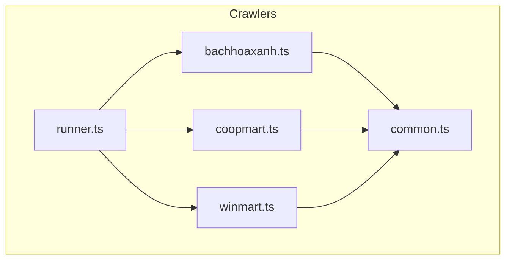
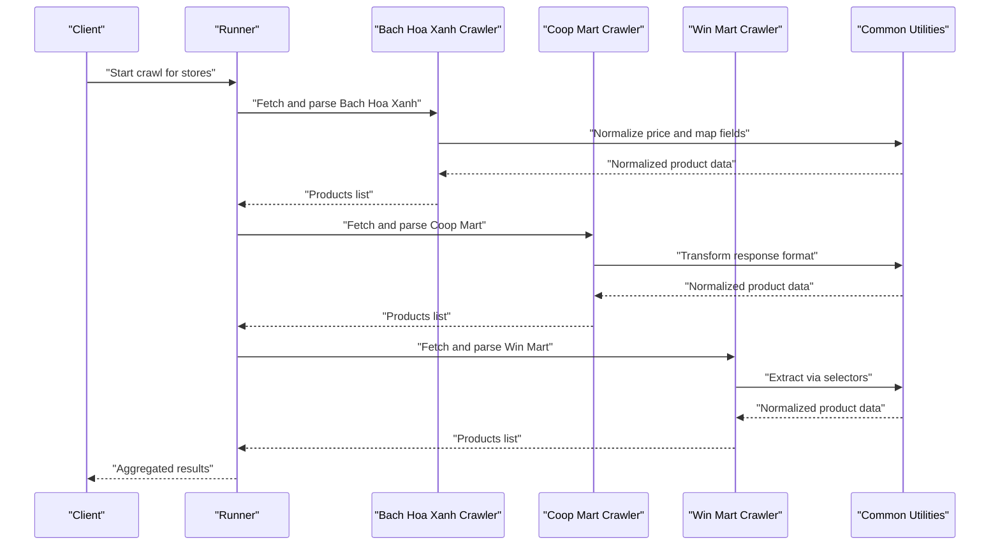
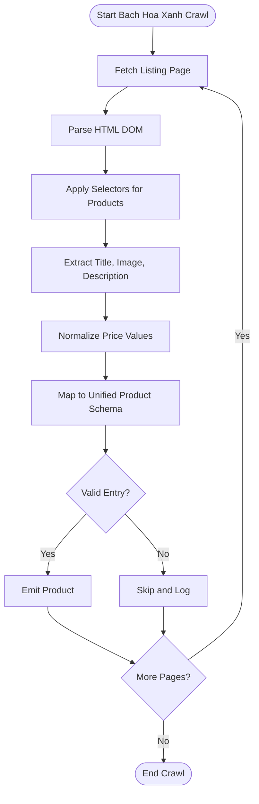
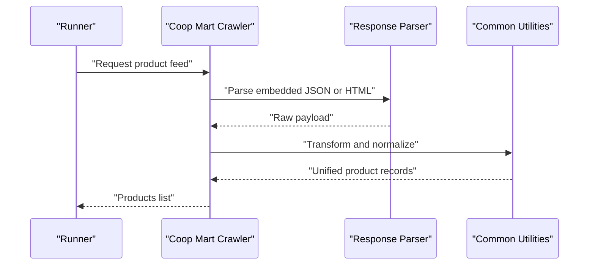
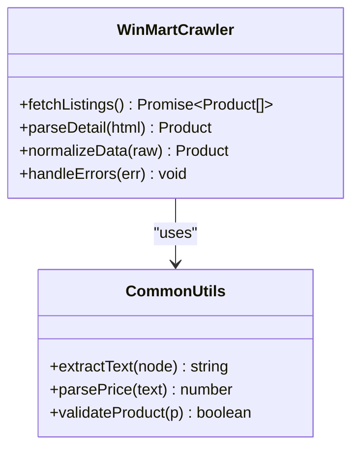
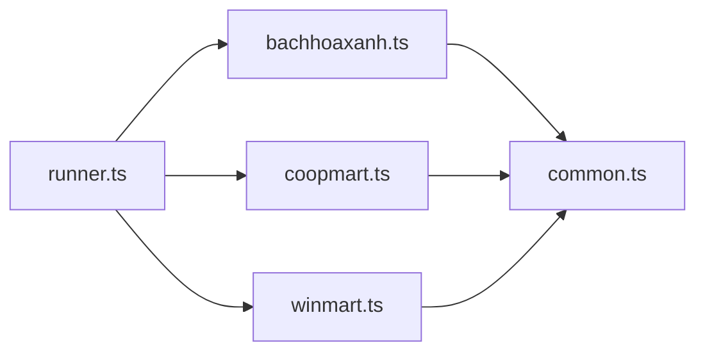

# Store-Specific Crawlers

<cite>
**Referenced Files in This Document**
- [bachhoaxanh.ts](file://Backend/src/crawlers/bachhoaxanh.ts)
- [coopmart.ts](file://Backend/src/crawlers/coopmart.ts)
- [winmart.ts](file://Backend/src/crawlers/winmart.ts)
- [common.ts](file://Backend/src/crawlers/common.ts)
- [runner.ts](file://Backend/src/crawlers/runner.ts)
</cite>

## Table of Contents
1. [Introduction](#introduction)
2. [Project Structure](#project-structure)
3. [Core Components](#core-components)
4. [Architecture Overview](#architecture-overview)
5. [Detailed Component Analysis](#detailed-component-analysis)
6. [Dependency Analysis](#dependency-analysis)
7. [Performance Considerations](#performance-considerations)
8. [Troubleshooting Guide](#troubleshooting-guide)
9. [Conclusion](#conclusion)

## Introduction
This document provides detailed documentation for the store-specific crawlers in StudentBite, focusing on Bach Hoa Xanh, Coop Mart, and Win Mart. It explains HTML parsing techniques, product data extraction methods, price normalization strategies, unique response formats, data transformation processes, selector strategies, error handling, configuration options, authentication requirements (if any), and troubleshooting guidance tailored to each store’s scraping challenges.

## Project Structure
The crawler implementations are located under Backend/src/crawlers. The key files include:
- bachhoaxanh.ts: Bach Hoa Xanh crawler implementation
- coopmart.ts: Coop Mart crawler implementation
- winmart.ts: Win Mart crawler implementation
- common.ts: Shared utilities and types used by crawlers
- runner.ts: Crawler orchestration and execution logic

**Diagram sources**
- [bachhoaxanh.ts](file://Backend/src/crawlers/bachhoaxanh.ts)
- [coopmart.ts](file://Backend/src/crawlers/coopmart.ts)
- [winmart.ts](file://Backend/src/crawlers/winmart.ts)
- [common.ts](file://Backend/src/crawlers/common.ts)
- [runner.ts](file://Backend/src/crawlers/runner.ts)

**Section sources**
- [bachhoaxanh.ts](file://Backend/src/crawlers/bachhoaxanh.ts)
- [coopmart.ts](file://Backend/src/crawlers/coopmart.ts)
- [winmart.ts](file://Backend/src/crawlers/winmart.ts)
- [common.ts](file://Backend/src/crawlers/common.ts)
- [runner.ts](file://Backend/src/crawlers/runner.ts)

## Core Components
- Bach Hoa Xanh crawler: Parses HTML pages to extract product listings and details, normalizes prices, and maps fields into a unified product schema.
- Coop Mart crawler: Handles distinct response formats and performs data transformations to align with the shared product model.
- Win Mart crawler: Uses targeted selectors to extract product information and implements robust error handling for resilience.
- Common utilities: Shared parsing helpers, normalization functions, and type definitions used across crawlers.
- Runner: Orchestrates crawling tasks, manages concurrency, retries, and logging.

**Section sources**
- [bachhoaxanh.ts](file://Backend/src/crawlers/bachhoaxanh.ts)
- [coopmart.ts](file://Backend/src/crawlers/coopmart.ts)
- [winmart.ts](file://Backend/src/crawlers/winmart.ts)
- [common.ts](file://Backend/src/crawlers/common.ts)
- [runner.ts](file://Backend/src/crawlers/runner.ts)

## Architecture Overview
The crawler architecture follows a modular design where each store has its own implementation adhering to a common interface. The runner coordinates execution, while common utilities provide reusable parsing and normalization logic.

**Diagram sources**
- [runner.ts](file://Backend/src/crawlers/runner.ts)
- [bachhoaxanh.ts](file://Backend/src/crawlers/bachhoaxanh.ts)
- [coopmart.ts](file://Backend/src/crawlers/coopmart.ts)
- [winmart.ts](file://Backend/src/crawlers/winmart.ts)
- [common.ts](file://Backend/src/crawlers/common.ts)

## Detailed Component Analysis

### Bach Hoa Xanh Crawler
- HTML Parsing Techniques:
  - Selects product listing containers using CSS or XPath selectors.
  - Extracts titles, images, descriptions, and availability from DOM nodes.
  - Handles dynamic content by waiting for specific elements or re-rendered sections.
- Product Data Extraction Methods:
  - Maps raw HTML attributes to canonical fields such as name, description, image URL, category, and stock status.
  - Aggregates multiple variants (e.g., sizes, flavors) into structured arrays.
- Price Normalization Strategies:
  - Strips currency symbols and locale formatting.
  - Converts localized number formats to numeric values.
  - Applies consistent rounding rules and unit conversions (e.g., per kg vs per item).
- Configuration Options:
  - Base URLs for product listing and detail pages.
  - Selector sets for different page layouts.
  - Retry policies and timeouts for network requests.
- Authentication Requirements:
  - Typically no authentication is required; if needed, cookies or tokens can be injected via headers.
- Error Handling:
  - Graceful fallback when selectors fail to match.
  - Retries on transient network errors.
  - Logs malformed responses and skips invalid entries.

**Diagram sources**
- [bachhoaxanh.ts](file://Backend/src/crawlers/bachhoaxanh.ts)
- [common.ts](file://Backend/src/crawlers/common.ts)

**Section sources**
- [bachhoaxanh.ts](file://Backend/src/crawlers/bachhoaxanh.ts)
- [common.ts](file://Backend/src/crawlers/common.ts)

### Coop Mart Crawler
- Unique Response Formats:
  - May return JSON-like payloads embedded in HTML or API endpoints with non-standard structures.
  - Requires custom deserialization to handle nested objects and arrays.
- Data Transformation Processes:
  - Flattens nested structures into flat product records.
  - Renames fields to match the unified schema.
  - Handles missing or null fields with defaults or omission.
- Selector Strategies:
  - Uses regex or string parsing for embedded JSON fragments.
  - Falls back to DOM-based extraction when necessary.
- Configuration Options:
  - Endpoint URLs for product feeds or search queries.
  - Field mapping tables for transforming keys.
  - Rate limiting and request throttling settings.
- Authentication Requirements:
  - If protected, supports API keys or session cookies passed via headers.
- Error Handling:
  - Detects malformed JSON and retries with adjusted parsing.
  - Skips incomplete products and logs warnings.

**Diagram sources**
- [coopmart.ts](file://Backend/src/crawlers/coopmart.ts)
- [common.ts](file://Backend/src/crawlers/common.ts)

**Section sources**
- [coopmart.ts](file://Backend/src/crawlers/coopmart.ts)
- [common.ts](file://Backend/src/crawlers/common.ts)

### Win Mart Crawler
- Implementation Details:
  - Employs precise CSS selectors targeting product cards and detail sections.
  - Extracts metadata like brand, weight, and promotional tags.
- Selector Strategies:
  - Prioritizes stable class names and data attributes over positional selectors.
  - Implements fallback selectors for layout changes.
- Error Handling:
  - Catches selector mismatches and returns empty arrays for affected pages.
  - Retries failed requests with exponential backoff.
  - Validates extracted data before emitting.
- Configuration Options:
  - Selector sets for different UI versions.
  - Timeout and retry configurations.
  - Optional proxy settings for geo-restrictions.
- Authentication Requirements:
  - Generally public access; if restricted, supports token injection.
- Troubleshooting Tips:
  - Inspect rendered DOM to verify selectors.
  - Use debug logs to trace parsing failures.

**Diagram sources**
- [winmart.ts](file://Backend/src/crawlers/winmart.ts)
- [common.ts](file://Backend/src/crawlers/common.ts)

**Section sources**
- [winmart.ts](file://Backend/src/crawlers/winmart.ts)
- [common.ts](file://Backend/src/crawlers/common.ts)

## Dependency Analysis
Crawlers depend on common utilities for parsing and normalization. The runner orchestrates calls to each crawler and aggregates results.

**Diagram sources**
- [runner.ts](file://Backend/src/crawlers/runner.ts)
- [bachhoaxanh.ts](file://Backend/src/crawlers/bachhoaxanh.ts)
- [coopmart.ts](file://Backend/src/crawlers/coopmart.ts)
- [winmart.ts](file://Backend/src/crawlers/winmart.ts)
- [common.ts](file://Backend/src/crawlers/common.ts)

**Section sources**
- [runner.ts](file://Backend/src/crawlers/runner.ts)
- [common.ts](file://Backend/src/crawlers/common.ts)

## Performance Considerations
- Concurrency: Limit parallel requests to avoid rate limits and IP bans.
- Caching: Cache parsed pages or API responses to reduce redundant work.
- Selectors: Prefer stable selectors to minimize re-parsing overhead.
- Memory: Stream large responses and avoid loading entire DOM trees when possible.
- Timeouts: Set appropriate timeouts to fail fast on unresponsive sites.

[No sources needed since this section provides general guidance]

## Troubleshooting Guide
- Bach Hoa Xanh:
  - Symptom: Missing product fields.
  - Action: Verify selectors against current page structure; update mapping if layout changed.
  - Symptom: Incorrect price values.
  - Action: Check normalization logic for currency and locale formatting.
- Coop Mart:
  - Symptom: Failed JSON parsing.
  - Action: Inspect raw payload; adjust parser to handle variations.
  - Symptom: Empty product lists.
  - Action: Confirm endpoint accessibility and field mappings.
- Win Mart:
  - Symptom: Selector mismatches.
  - Action: Inspect DOM; add fallback selectors; log mismatches for debugging.
  - Symptom: Intermittent failures.
  - Action: Increase retry attempts and backoff intervals.

**Section sources**
- [bachhoaxanh.ts](file://Backend/src/crawlers/bachhoaxanh.ts)
- [coopmart.ts](file://Backend/src/crawlers/coopmart.ts)
- [winmart.ts](file://Backend/src/crawlers/winmart.ts)
- [common.ts](file://Backend/src/crawlers/common.ts)

## Conclusion
The store-specific crawlers in StudentBite implement robust parsing, normalization, and error-handling strategies tailored to each retailer’s website behavior. By leveraging shared utilities and a coordinated runner, the system maintains consistency and reliability across diverse data sources. Continuous monitoring and selector updates ensure long-term stability as site layouts evolve.

[No sources needed since this section summarizes without analyzing specific files]