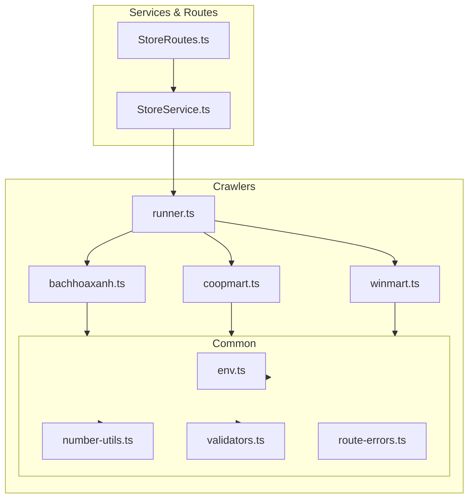
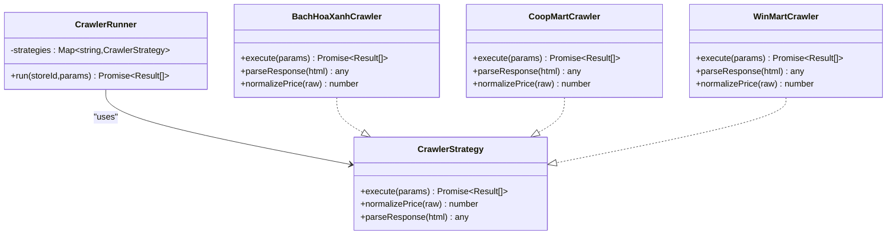
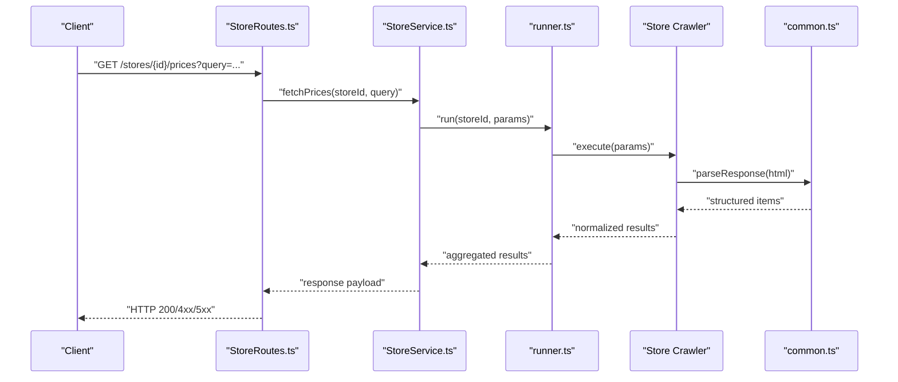
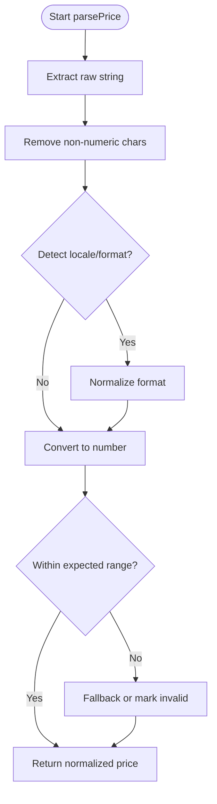
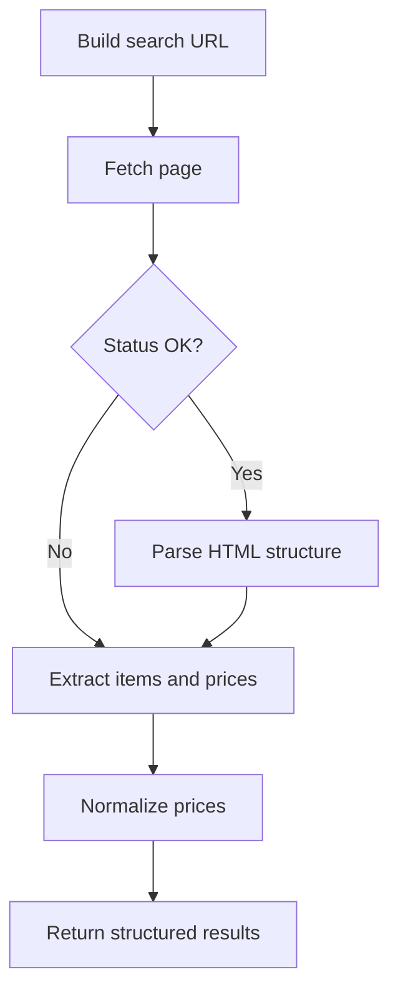
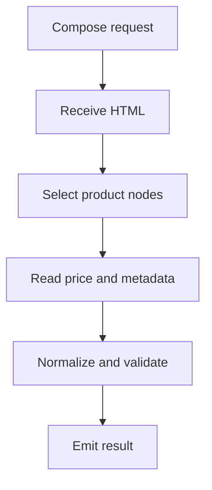
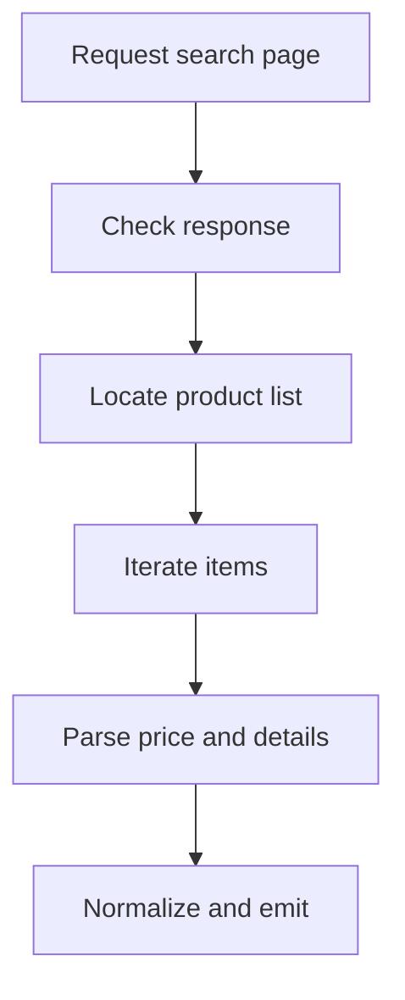
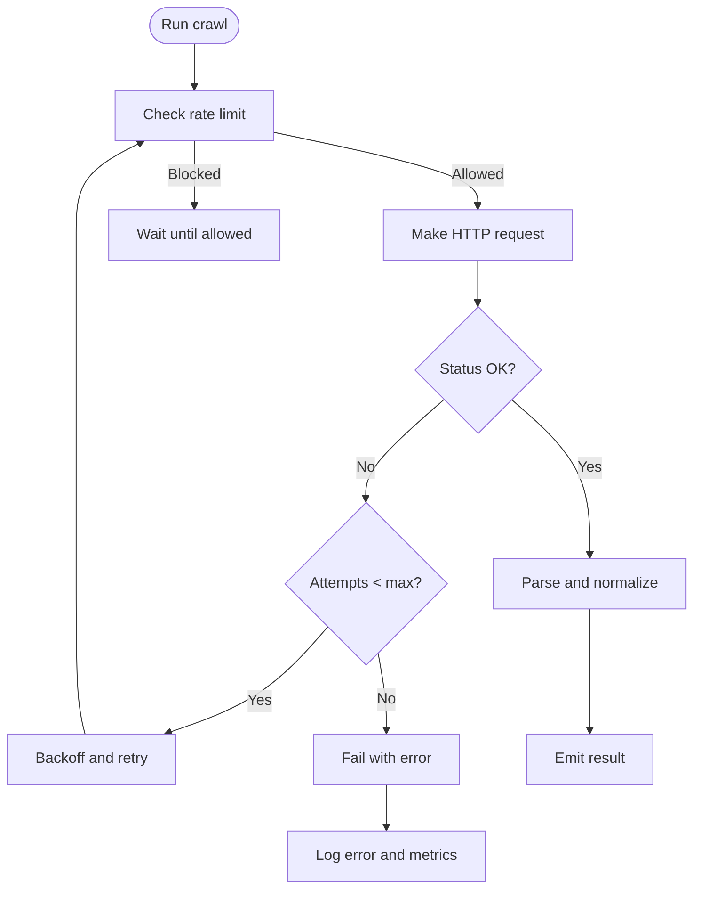
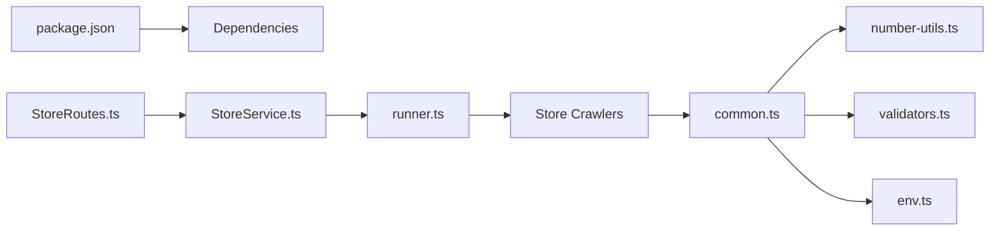

# Web Scraping System

<cite>
**Referenced Files in This Document**
- [main.ts](file://Backend/src/main.ts)
- [server.ts](file://Backend/src/server.ts)
- [runner.ts](file://Backend/src/crawlers/runner.ts)
- [common.ts](file://Backend/src/crawlers/common.ts)
- [bachhoaxanh.ts](file://Backend/src/crawlers/bachhoaxanh.ts)
- [coopmart.ts](file://Backend/src/crawlers/coopmart.ts)
- [winmart.ts](file://Backend/src/crawlers/winmart.ts)
- [StoreService.ts](file://Backend/src/services/StoreService.ts)
- [StoreRoutes.ts](file://Backend/src/routes/StoreRoutes.ts)
- [env.ts](file://Backend/src/common/constants/env.ts)
- [number-utils.ts](file://Backend/src/common/utils/number-utils.ts)
- [validators.ts](file://Backend/src/common/utils/validators.ts)
- [route-errors.ts](file://Backend/src/common/utils/route-errors.ts)
- [package.json](file://Backend/package.json)
</cite>

## Table of Contents
1. [Introduction](#introduction)
2. [Project Structure](#project-structure)
3. [Core Components](#core-components)
4. [Architecture Overview](#architecture-overview)
5. [Detailed Component Analysis](#detailed-component-analysis)
6. [Dependency Analysis](#dependency-analysis)
7. [Performance Considerations](#performance-considerations)
8. [Troubleshooting Guide](#troubleshooting-guide)
9. [Legal and Ethical Considerations](#legal-and-ethical-considerations)
10. [Conclusion](#conclusion)

## Introduction
This document explains StudentBite’s web scraping infrastructure for price aggregation across multiple grocery stores. It focuses on the crawler architecture that uses a Strategy Pattern to encapsulate store-specific crawling logic, shared utilities for parsing and data transformation, and robust error handling strategies. It also covers configuration, retry mechanisms, rate limiting, monitoring, legal considerations, best practices, and troubleshooting common issues.

## Project Structure
The scraping system lives under Backend/src/crawlers with a runner orchestrating strategy-based crawlers. Store implementations are isolated per retailer (Bach Hoa Xanh, Coop Mart, Win Mart). Shared utilities handle number parsing, validation, and environment configuration. Routes and services expose scraping capabilities to the rest of the application.

**Diagram sources**
- [runner.ts:1-L](file://Backend/src/crawlers/runner.ts#L1-L)
- [common.ts:1-L](file://Backend/src/crawlers/common.ts#L1-L)
- [bachhoaxanh.ts:1-L](file://Backend/src/crawlers/bachhoaxanh.ts#L1-L)
- [coopmart.ts:1-L](file://Backend/src/crawlers/coopmart.ts#L1-L)
- [winmart.ts:1-L](file://Backend/src/crawlers/winmart.ts#L1-L)
- [StoreService.ts:1-L](file://Backend/src/services/StoreService.ts#L1-L)
- [StoreRoutes.ts:1-L](file://Backend/src/routes/StoreRoutes.ts#L1-L)
- [env.ts:1-L](file://Backend/src/common/constants/env.ts#L1-L)
- [number-utils.ts:1-L](file://Backend/src/common/utils/number-utils.ts#L1-L)
- [validators.ts:1-L](file://Backend/src/common/utils/validators.ts#L1-L)
- [route-errors.ts:1-L](file://Backend/src/common/utils/route-errors.ts#L1-L)

**Section sources**
- [runner.ts:1-L](file://Backend/src/crawlers/runner.ts#L1-L)
- [common.ts:1-L](file://Backend/src/crawlers/common.ts#L1-L)
- [bachhoaxanh.ts:1-L](file://Backend/src/crawlers/bachhoaxanh.ts#L1-L)
- [coopmart.ts:1-L](file://Backend/src/crawlers/coopmart.ts#L1-L)
- [winmart.ts:1-L](file://Backend/src/crawlers/winmart.ts#L1-L)
- [StoreService.ts:1-L](file://Backend/src/services/StoreService.ts#L1-L)
- [StoreRoutes.ts:1-L](file://Backend/src/routes/StoreRoutes.ts#L1-L)
- [env.ts:1-L](file://Backend/src/common/constants/env.ts#L1-L)
- [number-utils.ts:1-L](file://Backend/src/common/utils/number-utils.ts#L1-L)
- [validators.ts:1-L](file://Backend/src/common/utils/validators.ts#L1-L)
- [route-errors.ts:1-L](file://Backend/src/common/utils/route-errors.ts#L1-L)

## Core Components
- Crawler Runner: Orchestrates execution of store-specific crawlers based on configuration and dispatches requests.
- Strategy Implementations: One file per store encapsulates URL construction, response parsing, and normalization.
- Common Utilities: Shared parsing helpers, validators, and environment access used by all crawlers.
- Service Layer: Exposes scraping endpoints and coordinates runner calls.
- Routes: HTTP endpoints that trigger scraping jobs and return results or status.

Key responsibilities:
- Isolate store differences behind a uniform interface.
- Centralize parsing and normalization to ensure consistent output.
- Provide resilient execution with retries and rate limiting.
- Surface errors consistently to clients.

**Section sources**
- [runner.ts:1-L](file://Backend/src/crawlers/runner.ts#L1-L)
- [common.ts:1-L](file://Backend/src/crawlers/common.ts#L1-L)
- [bachhoaxanh.ts:1-L](file://Backend/src/crawlers/bachhoaxanh.ts#L1-L)
- [coopmart.ts:1-L](file://Backend/src/crawlers/coopmart.ts#L1-L)
- [winmart.ts:1-L](file://Backend/src/crawlers/winmart.ts#L1-L)
- [StoreService.ts:1-L](file://Backend/src/services/StoreService.ts#L1-L)
- [StoreRoutes.ts:1-L](file://Backend/src/routes/StoreRoutes.ts#L1-L)

## Architecture Overview
The system follows a Strategy Pattern where each store is an independent crawler implementing a common interface. The runner selects and executes the appropriate strategy based on input parameters. Shared utilities standardize parsing and validation.

**Diagram sources**
- [runner.ts:1-L](file://Backend/src/crawlers/runner.ts#L1-L)
- [bachhoaxanh.ts:1-L](file://Backend/src/crawlers/bachhoaxanh.ts#L1-L)
- [coopmart.ts:1-L](file://Backend/src/crawlers/coopmart.ts#L1-L)
- [winmart.ts:1-L](file://Backend/src/crawlers/winmart.ts#L1-L)

## Detailed Component Analysis

### Crawler Runner
Responsibilities:
- Maintain a registry of store strategies.
- Validate inputs and select the correct strategy.
- Execute crawlers with configured concurrency and retries.
- Aggregate results and propagate errors.

Operational flow:
- Input validation and parameter sanitization.
- Strategy lookup and invocation.
- Retry on transient failures with backoff.
- Rate limiting between requests.
- Result normalization and error mapping.

**Diagram sources**
- [StoreRoutes.ts:1-L](file://Backend/src/routes/StoreRoutes.ts#L1-L)
- [StoreService.ts:1-L](file://Backend/src/services/StoreService.ts#L1-L)
- [runner.ts:1-L](file://Backend/src/crawlers/runner.ts#L1-L)
- [common.ts:1-L](file://Backend/src/crawlers/common.ts#L1-L)

**Section sources**
- [runner.ts:1-L](file://Backend/src/crawlers/runner.ts#L1-L)
- [StoreService.ts:1-L](file://Backend/src/services/StoreService.ts#L1-L)
- [StoreRoutes.ts:1-L](file://Backend/src/routes/StoreRoutes.ts#L1-L)

### Common Utilities (Parsing and Normalization)
Focus areas:
- Number parsing and currency normalization.
- Input validation helpers.
- Environment variable access for URLs, timeouts, and limits.

Normalization pipeline:
- Extract raw price strings from HTML.
- Strip non-numeric characters and locale formatting.
- Convert to numeric values in a canonical unit (e.g., VND).
- Validate ranges and reject outliers.

**Diagram sources**
- [common.ts:1-L](file://Backend/src/crawlers/common.ts#L1-L)
- [number-utils.ts:1-L](file://Backend/src/common/utils/number-utils.ts#L1-L)
- [validators.ts:1-L](file://Backend/src/common/utils/validators.ts#L1-L)

**Section sources**
- [common.ts:1-L](file://Backend/src/crawlers/common.ts#L1-L)
- [number-utils.ts:1-L](file://Backend/src/common/utils/number-utils.ts#L1-L)
- [validators.ts:1-L](file://Backend/src/common/utils/validators.ts#L1-L)
- [env.ts:1-L](file://Backend/src/common/constants/env.ts#L1-L)

### Bach Hoa Xanh Crawler
Scope:
- Construct search/list URLs for Bach Hoa Xanh.
- Parse product listings and item details.
- Extract prices, units, and identifiers.
- Normalize prices using shared utilities.

Extraction techniques:
- Identify listing containers and item nodes.
- Locate price elements and variant selectors.
- Handle pagination and dynamic content markers.

**Diagram sources**
- [bachhoaxanh.ts:1-L](file://Backend/src/crawlers/bachhoaxanh.ts#L1-L)
- [common.ts:1-L](file://Backend/src/crawlers/common.ts#L1-L)

**Section sources**
- [bachhoaxanh.ts:1-L](file://Backend/src/crawlers/bachhoaxanh.ts#L1-L)
- [common.ts:1-L](file://Backend/src/crawlers/common.ts#L1-L)

### Coop Mart Crawler
Scope:
- Build Coop Mart queries and navigate category pages.
- Parse product cards and detail views.
- Capture SKU, name, price, and availability signals.
- Apply normalization and validation.

Extraction techniques:
- Target specific CSS classes or attributes for product blocks.
- Resolve nested pricing and promotional tags.
- Handle missing fields gracefully.

**Diagram sources**
- [coopmart.ts:1-L](file://Backend/src/crawlers/coopmart.ts#L1-L)
- [common.ts:1-L](file://Backend/src/crawlers/common.ts#L1-L)

**Section sources**
- [coopmart.ts:1-L](file://Backend/src/crawlers/coopmart.ts#L1-L)
- [common.ts:1-L](file://Backend/src/crawlers/common.ts#L1-L)

### Win Mart Crawler
Scope:
- Generate Win Mart search endpoints.
- Parse search results and product pages.
- Extract pricing and unit information.
- Ensure consistent output schema.

Extraction techniques:
- Use DOM traversal to locate price spans and labels.
- Disambiguate sale vs regular price.
- Normalize units and currencies.

**Diagram sources**
- [winmart.ts:1-L](file://Backend/src/crawlers/winmart.ts#L1-L)
- [common.ts:1-L](file://Backend/src/crawlers/common.ts#L1-L)

**Section sources**
- [winmart.ts:1-L](file://Backend/src/crawlers/winmart.ts#L1-L)
- [common.ts:1-L](file://Backend/src/crawlers/common.ts#L1-L)

### Configuration, Retries, and Rate Limiting
Configuration:
- Environment variables control base URLs, timeouts, concurrency, and retry policies.
- Per-store settings can be extended via configuration objects.

Retries:
- Exponential backoff with jitter for transient network errors.
- Configurable maximum attempts and delay caps.

Rate Limiting:
- Token bucket or sliding window limiter to throttle requests per store.
- Respect robots.txt and site-imposed constraints.

Monitoring:
- Structured logging for requests, responses, and errors.
- Metrics collection for success rates, latency, and failure reasons.

**Diagram sources**
- [runner.ts:1-L](file://Backend/src/crawlers/runner.ts#L1-L)
- [env.ts:1-L](file://Backend/src/common/constants/env.ts#L1-L)

**Section sources**
- [runner.ts:1-L](file://Backend/src/crawlers/runner.ts#L1-L)
- [env.ts:1-L](file://Backend/src/common/constants/env.ts#L1-L)

## Dependency Analysis
External dependencies relevant to scraping:
- HTTP client libraries for fetching pages.
- HTML parsing libraries for DOM traversal.
- Validation and utility packages for number parsing and environment access.

Internal dependencies:
- Crawlers depend on common utilities for parsing and validation.
- Runner depends on strategy implementations and environment configuration.
- Services and routes depend on the runner to execute crawlers.

**Diagram sources**
- [package.json:1-L](file://Backend/package.json#L1-L)
- [runner.ts:1-L](file://Backend/src/crawlers/runner.ts#L1-L)
- [common.ts:1-L](file://Backend/src/crawlers/common.ts#L1-L)
- [number-utils.ts:1-L](file://Backend/src/common/utils/number-utils.ts#L1-L)
- [validators.ts:1-L](file://Backend/src/common/utils/validators.ts#L1-L)
- [env.ts:1-L](file://Backend/src/common/constants/env.ts#L1-L)
- [StoreService.ts:1-L](file://Backend/src/services/StoreService.ts#L1-L)
- [StoreRoutes.ts:1-L](file://Backend/src/routes/StoreRoutes.ts#L1-L)

**Section sources**
- [package.json:1-L](file://Backend/package.json#L1-L)
- [runner.ts:1-L](file://Backend/src/crawlers/runner.ts#L1-L)
- [common.ts:1-L](file://Backend/src/crawlers/common.ts#L1-L)
- [StoreService.ts:1-L](file://Backend/src/services/StoreService.ts#L1-L)
- [StoreRoutes.ts:1-L](file://Backend/src/routes/StoreRoutes.ts#L1-L)

## Performance Considerations
- Concurrency control: Limit parallel requests per store to avoid overloading targets and hitting rate limits.
- Connection reuse: Reuse HTTP connections where possible to reduce overhead.
- Parsing efficiency: Prefer targeted selectors and minimal DOM traversal to speed up parsing.
- Caching: Cache repeated queries and stable pages to reduce redundant work.
- Memory management: Stream large responses when feasible and avoid retaining unnecessary references.

[No sources needed since this section provides general guidance]

## Troubleshooting Guide
Common issues and resolutions:
- Network errors: Inspect timeout and retry settings; increase backoff and max retries if necessary.
- Parsing failures: Verify selectors and adapt to site changes; add fallback parsers and log detailed diffs.
- Price anomalies: Review normalization rules and validation thresholds; adjust ranges for promotions or bulk pricing.
- Rate limiting: Reduce concurrency and implement token bucket; respect robots.txt and site policies.
- Missing fields: Implement graceful defaults and mark incomplete records for manual review.

Error handling patterns:
- Consistent error types and messages.
- Logging at request/response boundaries.
- Metrics for failure categories and latencies.

**Section sources**
- [route-errors.ts:1-L](file://Backend/src/common/utils/route-errors.ts#L1-L)
- [validators.ts:1-L](file://Backend/src/common/utils/validators.ts#L1-L)
- [runner.ts:1-L](file://Backend/src/crawlers/runner.ts#L1-L)

## Legal and Ethical Considerations
- Compliance: Follow applicable laws and regulations regarding data collection and privacy.
- Robots.txt: Respect site directives and disallowed paths.
- Terms of Service: Adhere to store terms and usage policies.
- Rate and load: Avoid excessive requests; implement throttling and backoff.
- Data minimization: Collect only necessary data and avoid storing sensitive information.
- Transparency: Maintain logs and audit trails for compliance and debugging.

[No sources needed since this section provides general guidance]

## Conclusion
StudentBite’s scraping system leverages a Strategy Pattern to cleanly separate store-specific logic while centralizing parsing and normalization. The runner ensures resilient execution through retries and rate limiting, and shared utilities maintain consistency across stores. With careful configuration, monitoring, and adherence to legal and ethical guidelines, the system can reliably aggregate pricing data from multiple retailers.

[No sources needed since this section summarizes without analyzing specific files]