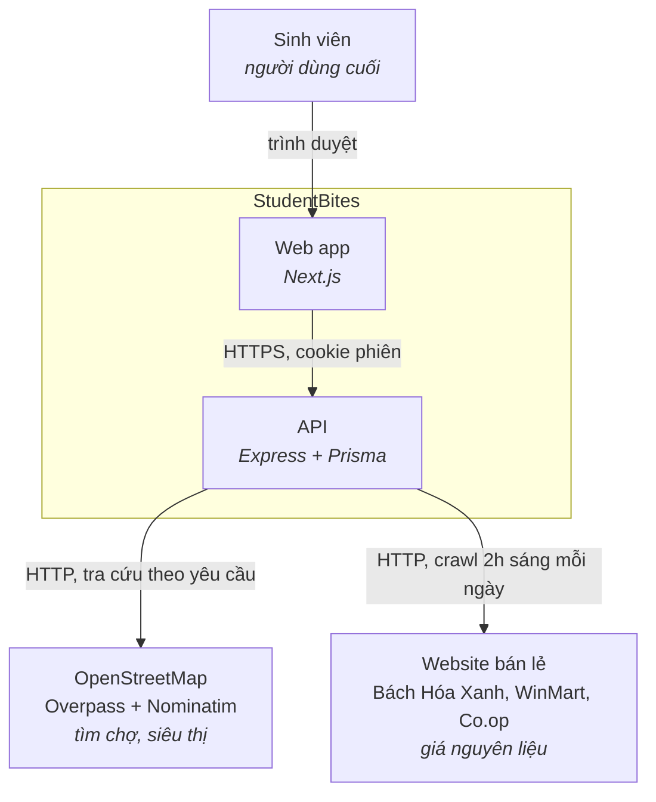
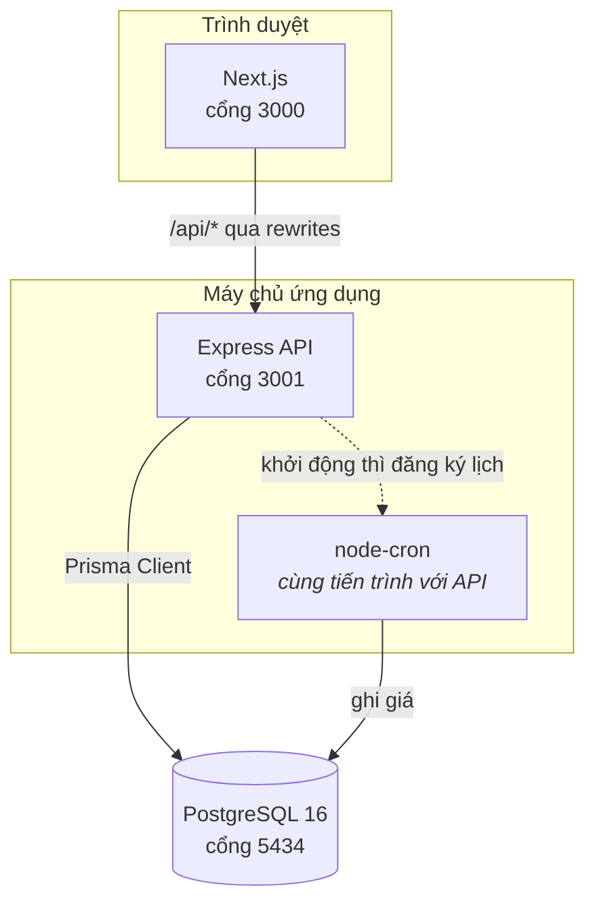
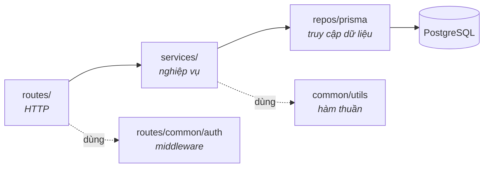
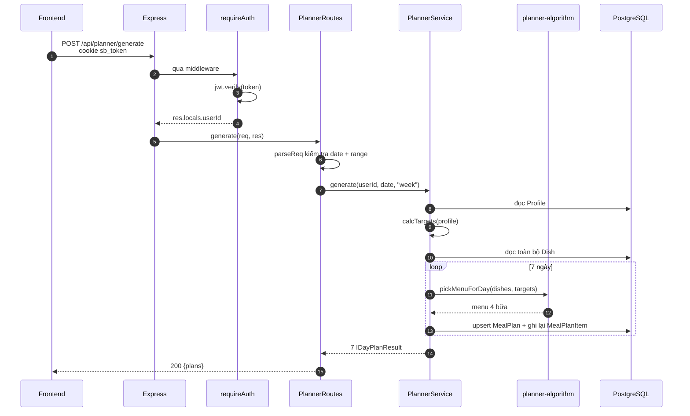
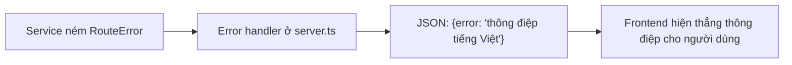
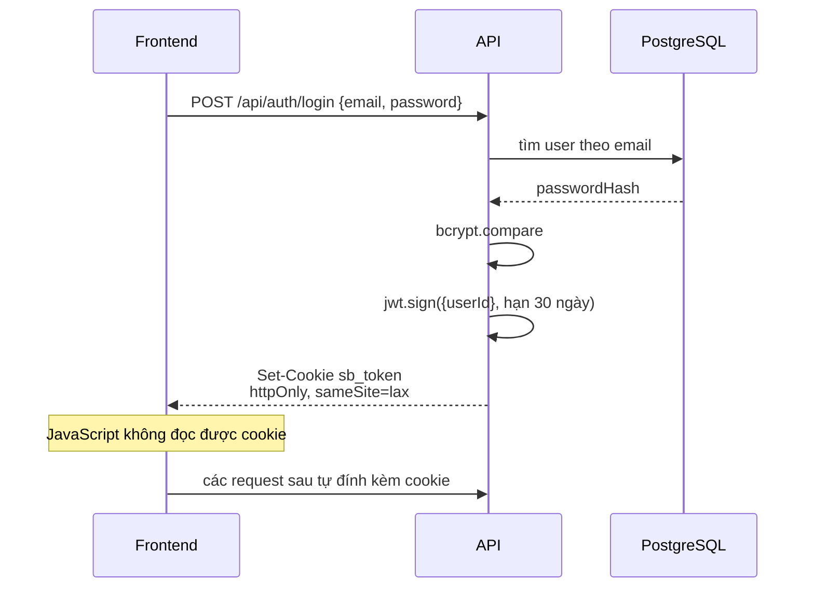

# 02 · Kiến trúc

> Giải thích hệ thống có hình dạng như hiện tại, và vì sao. Sơ đồ theo
> [C4 model](https://c4model.com/): đi từ bối cảnh ngoài vào trong.

**Loại tài liệu:** Explanation.

---

## C4 mức 1 — Bối cảnh

Ai dùng hệ thống, và hệ thống nói chuyện với ai bên ngoài.

Hai phụ thuộc ngoài đều **không có hợp đồng dịch vụ**: Overpass là dịch vụ
cộng đồng có giới hạn tần suất, còn các website bán lẻ có thể đổi HTML bất cứ
lúc nào. Hệ thống được thiết kế để vẫn chạy khi cả hai hỏng — xem
[06 · Crawler](./06-crawler.md) và [ADR-0003](./adr/0003-osm-thay-vi-google-maps.md).

---

## C4 mức 2 — Thành phần triển khai

**Điểm cần biết:** cron chạy **trong cùng tiến trình** với API
([`src/main.ts`](../src/main.ts)). Đơn giản cho một dự án học tập, nhưng nghĩa
là chạy nhiều bản sao API sẽ crawl trùng nhau. Xem
[08 · Vấn đề đã biết](./08-van-de-da-biet.md).

Frontend gọi API qua đường dẫn tương đối `/api/*`, được Next.js `rewrites`
chuyển tiếp sang cổng 3001. Nhờ vậy trình duyệt luôn thấy cùng một origin —
không cần CORS, và cookie `httpOnly` đi kèm request một cách tự nhiên.

---

## C4 mức 3 — Phân lớp bên trong API

Mã nguồn tuân theo một chiều phụ thuộc duy nhất, không có đường ngược:

| Lớp | Trách nhiệm | Không được làm |
|---|---|---|
| `routes/` | Đọc & kiểm tra đầu vào HTTP, chọn mã trạng thái, định dạng phản hồi | Chứa logic nghiệp vụ, gọi Prisma trực tiếp |
| `services/` | Toàn bộ quy tắc nghiệp vụ, điều phối truy vấn, ném `RouteError` | Biết tới `req`/`res` |
| `repos/prisma` | Một thể hiện Prisma Client dùng chung | — |
| `common/utils` | Hàm thuần, không I/O — dễ test nhất | Chạm vào DB hay mạng |

Quy ước này là lý do thuật toán chọn thực đơn nằm ở
[`services/planner-algorithm.ts`](../src/services/planner-algorithm.ts) dưới
dạng **hàm thuần nhận vào mảng món ăn**, tách khỏi
[`services/PlannerService.ts`](../src/services/PlannerService.ts) là nơi đọc
ghi DB. Nhờ tách vậy mà test thuật toán không cần database — xem
[07 · Kiểm thử](./07-kiem-thu-va-quy-uoc.md).

---

## Vòng đời một request

Ví dụ: người dùng bấm "Tạo cả tuần".

Ba điểm đáng chú ý trong luồng này:

1. **Xác thực xảy ra trước mọi thứ khác.** `requireAuth` gắn `userId` vào
   `res.locals`, service không bao giờ nhận `userId` từ body — nếu nhận thì
   người dùng A có thể sửa dữ liệu của người dùng B.
2. **Kiểm tra đầu vào ở biên.** `parseReq` ném lỗi nếu `date` sai định dạng,
   nên service luôn nhận dữ liệu đã sạch.
3. **Tạo lại thực đơn là thao tác thay thế, không cộng dồn.** `generate` xoá
   hết `MealPlanItem` cũ của ngày đó rồi ghi mới, nên bấm nhiều lần không sinh
   trùng.

---

## Xử lý lỗi

Service ném `RouteError(status, message)`
([`common/utils/route-errors.ts`](../src/common/utils/route-errors.ts)); bộ xử
lý lỗi tập trung trong [`src/server.ts`](../src/server.ts) đổi nó thành
`{ error: "..." }` với đúng mã HTTP.

Vì thông điệp lỗi đi thẳng ra giao diện nên **thông điệp phải viết cho người
dùng cuối đọc**, không phải cho lập trình viên: `"Chưa có thực đơn cho ngày
này. Hãy tạo thực đơn trước."` chứ không phải `"plan not found"`.

---

## Xác thực

Token đặt trong cookie `httpOnly` thay vì `localStorage` để mã JavaScript —
kể cả mã bị chèn qua XSS — không đọc được. Đánh đổi và các phương án đã cân
nhắc ghi ở [ADR-0002](./adr/0002-jwt-trong-cookie-httponly.md).

---

## Những thứ template để lại, chưa dùng tới

Dự án khởi đi từ một template Express nên còn vài phần thừa. Biết trước để
khỏi mất công đọc nhầm:

| Đường dẫn | Tình trạng |
|---|---|
| `src/repos/MockOrm.ts`, `src/repos/UserRepo.ts` | ORM giả bằng file JSON, đã bị Prisma thay thế |
| `src/routes/UserRoutes.ts` + `/api/users/*` | CRUD mẫu của template, **không** có `requireAuth`, ứng dụng không dùng |
| `src/views/`, `src/public/` | Trang HTML mẫu của template |
| `src/models/User.model.ts` | Model của MockOrm |

Xem [08 · Vấn đề đã biết](./08-van-de-da-biet.md) để biết mức độ ưu tiên dọn.
