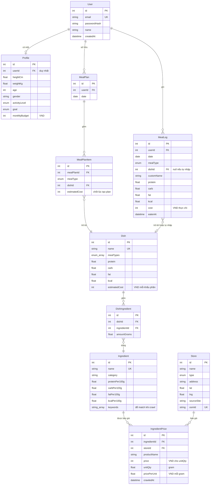
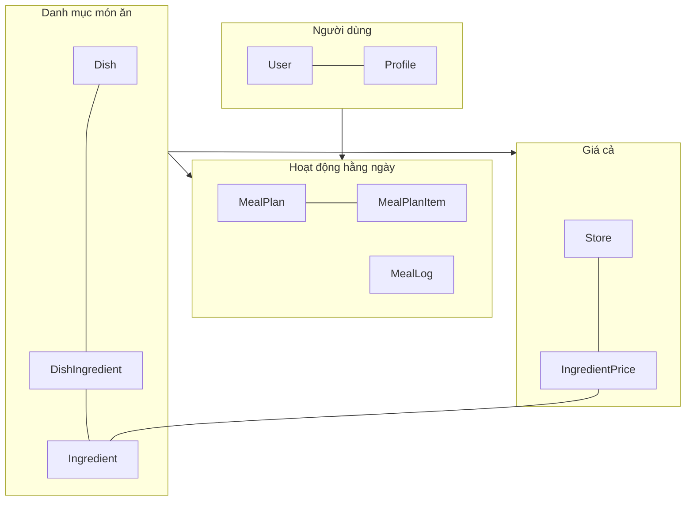

# 03 · Mô hình dữ liệu

> Tra cứu chính xác từng bảng, quan hệ và ràng buộc. Nguồn sự thật là
> [`prisma/schema.prisma`](../prisma/schema.prisma) — file này diễn giải nó.

**Loại tài liệu:** Reference.

---

## Sơ đồ quan hệ



---

## Ba nhóm bảng

Mô hình chia làm ba cụm gần như độc lập, nối với nhau qua `Dish`:



Hệ quả thực tế: **crawler và người dùng không đụng nhau.** Crawler chỉ ghi vào
`IngredientPrice`/`Store`; hỏng crawler thì thực đơn vẫn tạo được vì
`Dish.estimatedCost` là giá đã chốt sẵn trong danh mục.

---

## Enum

| Enum | Giá trị | Ghi chú |
|---|---|---|
| `ActivityLevel` | `SEDENTARY`, `LIGHT`, `MODERATE`, `ACTIVE`, `VERY_ACTIVE` | Ánh xạ sang hệ số 1.2 → 1.9, xem [05 · Nghiệp vụ](./05-nghiep-vu.md) |
| `Goal` | `GAIN_MUSCLE`, `LOSE_FAT`, `MAINTAIN` | Quyết định g protein/kg và mức chênh calo |
| `MealType` | `BREAKFAST`, `LUNCH`, `DINNER`, `SNACK` | Cũng là khoá chia ngân sách bữa |
| `StoreType` | `MARKET`, `SUPERMARKET`, `CONVENIENCE`, `ONLINE` | `MARKET` là mặc định khi OSM không nói rõ |

---

## Ràng buộc cần nhớ

| Bảng | Ràng buộc | Vì sao có |
|---|---|---|
| `Profile.userId` | `@unique` | Mỗi người đúng một hồ sơ; cho phép `upsert` theo `userId` |
| `MealPlan` | `@@unique([userId, date])` | Một người một ngày chỉ một thực đơn — tạo lại là ghi đè, không cộng dồn |
| `IngredientPrice` | `@@unique([ingredientId, storeId, productName])` | Crawler chạy lại mỗi ngày sẽ cập nhật đúng dòng cũ thay vì sinh bản sao |
| `Store.osmId` | `@unique` | Khoá `upsert` khi cache kết quả Overpass. Nguồn online cũng mượn cột này với dạng `online-winmart` |
| `Ingredient.name`, `Dish.name` | `@unique` | Để seed chạy lại được nhiều lần mà không nhân bản |

**Xoá lan (`onDelete: Cascade`)** được đặt trên mọi quan hệ thuộc về người
dùng: xoá `User` là dọn sạch `Profile`, `MealPlan`, `MealPlanItem`, `MealLog`.
Riêng `MealPlanItem.dish` và `MealLog.dish` **không** cascade — xoá một món ăn
khỏi danh mục sẽ bị chặn nếu còn kế hoạch hoặc lịch sử tham chiếu tới, đúng
mong muốn vì lịch sử đã ăn không được phép biến mất.

---

## Vì sao cột số liệu bị lặp

Cùng một con số protein xuất hiện ở ba nơi. Đây là chủ ý:

| Nơi | Ý nghĩa | Thay đổi khi |
|---|---|---|
| `Ingredient.proteinPer100g` | Sự thật dinh dưỡng của nguyên liệu | Gần như không bao giờ |
| `Dish.protein` | Tính sẵn cho một khẩu phần | Khi sửa công thức món |
| `MealLog.protein` | **Ảnh chụp** tại thời điểm ăn | Không bao giờ |

`MealLog` cố tình sao chép thay vì join tới `Dish`, vì nếu mai này công thức
món đổi thì lịch sử tháng trước phải giữ nguyên con số lúc đó. Cùng lý do,
`MealPlanItem.estimatedCost` chốt giá tại lúc tạo kế hoạch.

Đánh đổi: dữ liệu không chuẩn hoá hoàn toàn, và nếu sửa `Dish` thì kế hoạch
đã tạo không tự cập nhật giá — người dùng phải bấm tạo lại.

---

## Ngày tháng

Cột `date` của `MealPlan` và `MealLog` dùng kiểu `@db.Date` (không có giờ).
Mã nguồn quy đổi qua hai hàm trong
[`services/PlannerService.ts`](../src/services/PlannerService.ts):

```
parseDateOnly("2026-08-02")  ->  Date tại 2026-08-02T00:00:00.000Z
formatDateOnly(date)         ->  "2026-08-02"
```

**Mọi thứ neo theo UTC.** Với người dùng ở Việt Nam (UTC+7) điều này có nghĩa
"hôm nay" theo server và "hôm nay" theo điện thoại có thể lệch nhau trong
khoảng 00:00–07:00 giờ Việt Nam. Xem
[08 · Vấn đề đã biết](./08-van-de-da-biet.md).

---

## Dữ liệu mẫu

[`prisma/seed.ts`](../prisma/seed.ts) nạp:

- **28 nguyên liệu** phổ biến với macro chuẩn và `keywords` để crawler match.
- **3 cửa hàng online** đại diện — giá sinh ra từ `basePricePerKg` nhân hệ số:
  Bách Hóa Xanh `×1.00`, WinMart `×1.06`, Co.op `×0.97`. Nhờ chênh lệch nhân
  tạo này mà màn so giá có thứ để hiển thị ngay cả khi chưa crawl lần nào.
- **26 món ăn** sinh viên kèm định lượng nguyên liệu.

Seed dùng `upsert` toàn bộ nên chạy lại nhiều lần an toàn.
