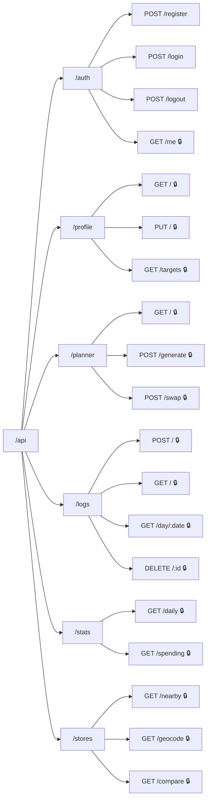

# 04 · API

> Tra cứu từng endpoint: đường dẫn, đầu vào, đầu ra, mã lỗi. Định nghĩa đường
> dẫn nằm ở [`src/common/constants/Paths.ts`](../src/common/constants/Paths.ts).

**Loại tài liệu:** Reference.

---

## Quy ước chung

| Mục | Giá trị |
|---|---|
| Gốc | `/api` |
| Kiểu dữ liệu | JSON (`Content-Type: application/json`) |
| Xác thực | Cookie `sb_token` (`httpOnly`, `sameSite=lax`, hạn 30 ngày) |
| Tiền tệ | Số nguyên VND, không có phần thập phân |
| Ngày | Chuỗi `YYYY-MM-DD` |
| Tháng | Chuỗi `YYYY-MM` |

**Dạng lỗi** — mọi lỗi đều trả về cùng một hình dạng, thông điệp viết bằng
tiếng Việt cho người dùng cuối đọc trực tiếp:

```json
{ "error": "Chưa có thực đơn cho ngày này. Hãy tạo thực đơn trước." }
```

| Mã | Khi nào |
|---|---|
| `400` | Đầu vào sai định dạng hoặc thiếu |
| `401` | Chưa đăng nhập hoặc token hết hạn |
| `404` | Không tìm thấy tài nguyên, hoặc chưa có hồ sơ |
| `409` | Email đã được đăng ký |

---

## Bản đồ endpoint



🔒 = cần đăng nhập.

---

## Auth

### `POST /api/auth/register`

Tạo tài khoản **và đăng nhập luôn** — phản hồi đã kèm `Set-Cookie`.

```json
{ "email": "sinhvien@gmail.com", "password": "matkhau123", "name": "Nguyễn Văn A" }
```

| Trường | Ràng buộc |
|---|---|
| `email` | Khớp `\S+@\S+\.\S+` |
| `password` | Tối thiểu 6 ký tự |
| `name` | Chuỗi không rỗng |

**201** → `{ "user": { "id", "email", "name", "createdAt", "profile": null } }`
**409** → email đã tồn tại.

### `POST /api/auth/login`

Vào `{ email, password }`, ra **200** `{ user }` kèm cookie.
Sai thông tin → **401** `"Email hoặc mật khẩu không đúng"` (không phân biệt
sai email hay sai mật khẩu, để không lộ email nào đã đăng ký).

### `POST /api/auth/logout`

Xoá cookie. Luôn **200** `{ "ok": true }`.

### `GET /api/auth/me` 🔒

**200** → `{ user }` kèm `profile` (có thể `null`).

---

## Profile

### `GET /api/profile` 🔒

**200** → `{ "profile": { ... } }`

> ⚠️ Chưa khai báo hồ sơ thì endpoint này trả **404**, không phải
> `{ profile: null }`. Frontend đang giả định vế sau — xem
> [08 · Vấn đề đã biết](./08-van-de-da-biet.md#p1--get-apiprofile-trả-404-thay-vì-profile-null).

### `PUT /api/profile` 🔒

Tạo mới hoặc cập nhật (upsert theo `userId`).

```json
{
  "heightCm": 172, "weightKg": 64, "age": 21, "gender": "male",
  "activityLevel": "MODERATE", "goal": "GAIN_MUSCLE", "monthlyBudget": 2400000
}
```

| Trường | Ràng buộc |
|---|---|
| `heightCm` | 50 < x < 250 |
| `weightKg` | 20 < x < 300 |
| `age` | 15 ≤ x ≤ 100 |
| `gender` | `"male"` hoặc `"female"` |
| `activityLevel` | Một giá trị `ActivityLevel` |
| `goal` | Một giá trị `Goal` |
| `monthlyBudget` | ≥ 300 000 |

**200** → `{ profile, targets }` — trả kèm `targets` để giao diện hiện ngay
kết quả tính toán mà không cần gọi thêm.

### `GET /api/profile/targets` 🔒

**200** → `{ targets }`:

```json
{
  "kcalTarget": 2803, "proteinTarget": 128, "carbTarget": 397, "fatTarget": 78,
  "dailyBudget": 77419,
  "mealBudgets": { "BREAKFAST": 19355, "LUNCH": 27097, "DINNER": 23226, "SNACK": 7742 }
}
```

Cách tính ở [05 · Nghiệp vụ](./05-nghiep-vu.md).

---

## Planner

### `GET /api/planner?date=YYYY-MM-DD` 🔒

Thiếu `date` hoặc sai định dạng → mặc định hôm nay (không báo lỗi).

**200** → `{ "plan": IDayPlanResult | null }`. Chưa tạo thực đơn thì `plan`
là `null` — đây là trạng thái bình thường, không phải lỗi.

```json
{
  "plan": {
    "date": "2026-08-02",
    "items": [
      { "id": 12, "mealType": "BREAKFAST",
        "dish": { "id": 3, "name": "Bánh mì trứng ốp la", "description": "...",
                  "mealTypes": ["BREAKFAST"], "protein": 22.6, "carb": 46.4,
                  "fat": 19.8, "kcal": 458, "estimatedCost": 7500 },
        "estimatedCost": 7500 }
    ],
    "totals": { "cost": 53000, "protein": 148.8, "carb": 189.6, "fat": 61.2, "kcal": 1852 },
    "budgetStatus": {
      "dailyBudget": 77419, "totalCost": 53000,
      "overBudget": false, "diff": 24419
    }
  }
}
```

`budgetStatus.diff` **dương là còn dư, âm là vượt**.

### `POST /api/planner/generate` 🔒

```json
{ "date": "2026-08-02", "range": "week" }
```

`range` là `"day"` (1 ngày) hoặc `"week"` (7 ngày kể từ `date`).

**200** → `{ "plans": IDayPlanResult[] }`.

Thao tác này **ghi đè**: mọi `MealPlanItem` của các ngày liên quan bị xoá rồi
tạo lại. Bấm nhiều lần được, mỗi lần ra thực đơn khác nhau vì thuật toán có
yếu tố ngẫu nhiên.

**404** nếu chưa có hồ sơ (`"Chưa thiết lập hồ sơ..."`).

### `POST /api/planner/swap` 🔒

```json
{ "itemId": 12 }
```

Đổi một món sang món khác cùng bữa, gần nhất về protein và giá, không trùng
các món còn lại trong ngày.

**200** → `{ "plan": IDayPlanResult }` (cả ngày, đã tính lại tổng).
**404** item không tồn tại hoặc không thuộc về bạn ·
**400** `"Không còn món thay thế phù hợp"`.

---

## Logs

### `POST /api/logs` 🔒

Ghi nhận một bữa đã ăn. Hai cách dùng:

**Từ món có sẵn** — macro lấy tự động từ `Dish`:

```json
{ "date": "2026-08-02", "mealType": "LUNCH", "dishId": 7 }
```

**Món tự nhập** — tự khai macro:

```json
{ "date": "2026-08-02", "mealType": "SNACK", "customName": "Bánh mì dạo",
  "protein": 12, "carb": 40, "fat": 8, "kcal": 300, "cost": 15000 }
```

`cost` bỏ trống thì lấy `Dish.estimatedCost` (với món có sẵn) hoặc `0`.

**201** → `{ log }` · **400** thiếu `date`/`mealType`, hoặc không có cả
`dishId` lẫn `customName` · **404** `dishId` không tồn tại.

> Endpoint **không** chặn ghi trùng: gọi hai lần cùng `date` + `mealType` sẽ
> tạo hai dòng và cộng đôi số liệu. Giao diện tự khoá nút sau khi đánh dấu.

### `GET /api/logs?month=YYYY-MM` 🔒

Tổng hợp theo ngày trong tháng. Thiếu `month` → tháng hiện tại.

**200** → `{ "month": "2026-08", "days": [ { "date", "protein", "kcal", "cost", "meals" } ] }`

Chỉ trả về **những ngày có ghi nhận**; ngày trống bị bỏ qua chứ không trả 0.

### `GET /api/logs/day/:date` 🔒

**200** → `{ "date", "logs": [ { "id", "mealType", "name", "protein", "carb",
"fat", "kcal", "cost", "eatenAt" } ] }`

`name` là tên món hoặc `customName`, hoặc `"Món khác"` nếu cả hai đều trống.

**400** nếu `:date` không đúng `YYYY-MM-DD`.

### `DELETE /api/logs/:id` 🔒

**200** → `{ "ok": true }` · **404** nếu không tồn tại hoặc không thuộc về bạn.

---

## Stats

### `GET /api/stats/daily?date=YYYY-MM-DD` 🔒

```json
{
  "date": "2026-08-02",
  "targets": { "...": "như /profile/targets" },
  "consumed": { "protein": 67.1, "carb": 142, "fat": 25.3, "kcal": 1116, "cost": 25000 },
  "proteinWarning": true,
  "budgetWarning": false
}
```

| Cờ | Bật khi |
|---|---|
| `proteinWarning` | Protein đã nạp < **90%** mục tiêu |
| `budgetWarning` | Chi phí đã ghi > hạn mức ngày |

### `GET /api/stats/spending?range=week|month&end=YYYY-MM-DD` 🔒

`range` mặc định `week` (7 ngày), `month` là 30 ngày. `end` mặc định hôm nay.

```json
{
  "range": "week",
  "days": [ { "date": "2026-07-27", "spent": 43500, "budget": 77419 } ],
  "totalSpent": 296500,
  "totalBudget": 541933
}
```

Mảng `days` **luôn đủ số ngày** của khoảng, ngày không chi trả `spent: 0` —
khác với `/api/logs` chỉ trả ngày có dữ liệu. Nhờ vậy vẽ biểu đồ không bị
thủng cột.

---

## Stores

### `GET /api/stores/nearby?lat=&lng=&radius=` 🔒

Tìm chợ, siêu thị, cửa hàng tiện lợi quanh một toạ độ qua Overpass API, đồng
thời cache kết quả vào bảng `Store`.

| Tham số | Bắt buộc | Ghi chú |
|---|---|---|
| `lat`, `lng` | Có | Thiếu → **400** |
| `radius` | Không | Mét, mặc định 2000, bị kẹp trong khoảng **300–5000** |

**200** → `{ "stores": [ { "id", "name", "type", "address", "lat", "lng",
"distanceM" } ], "radius" }`, đã sắp xếp theo khoảng cách tăng dần, tối đa 60
kết quả (giới hạn `out center 60` của truy vấn Overpass).

### `GET /api/stores/geocode?q=` 🔒

Đổi địa chỉ chữ thành toạ độ qua Nominatim, giới hạn `countrycodes=vn`.

`q` phải dài ≥ 3 ký tự, ngược lại **400**.

**200** → `{ "results": [ { "lat", "lng", "label" } ] }` (tối đa 5) ·
**404** `"Không tìm thấy địa chỉ"`.

### `GET /api/stores/compare?date=YYYY-MM-DD` 🔒

Gom toàn bộ nguyên liệu của thực đơn ngày đó rồi đối chiếu giá giữa các nguồn.

```json
{
  "date": "2026-08-02",
  "items": [
    { "ingredientId": 4, "name": "Ức gà", "grams": 300,
      "bestOffer": { "storeId": 2, "storeName": "Co.op Online", "sourceSite": "coopmart",
                     "productName": "Ức gà phi lê 500g", "productUrl": null,
                     "estimatedCost": 21900, "pricePer100g": 7300,
                     "crawledAt": "2026-08-01T19:00:00.000Z" },
      "offers": [ "... sắp xếp theo estimatedCost tăng dần" ] }
  ],
  "storeTotals": [ { "storeId": 2, "storeName": "Co.op Online", "sourceSite": "coopmart",
                     "total": 44936, "itemCount": 9 } ],
  "bestTotal": 44936
}
```

Ba con số dễ nhầm:

- `bestTotal` — tổng khi **mỗi nguyên liệu mua ở nơi rẻ nhất của riêng nó**,
  tức là có thể phải đi nhiều nơi.
- `storeTotals[].total` — tổng khi **mua tất cả ở một nơi**, sắp xếp tăng dần
  nên phần tử đầu là cửa hàng rẻ nhất nếu chỉ ghé một chỗ.
- `itemCount` — số nguyên liệu cửa hàng đó có báo giá; cửa hàng thiếu hàng sẽ
  có `total` thấp một cách giả tạo, nên **phải đọc kèm `itemCount`**.

**404** nếu ngày đó chưa có thực đơn.

---

## Endpoint không thuộc ứng dụng

`/api/users/*` là CRUD mẫu còn lại từ template Express. **Không có
`requireAuth`** và không được giao diện dùng. Xem
[08 · Vấn đề đã biết](./08-van-de-da-biet.md).
