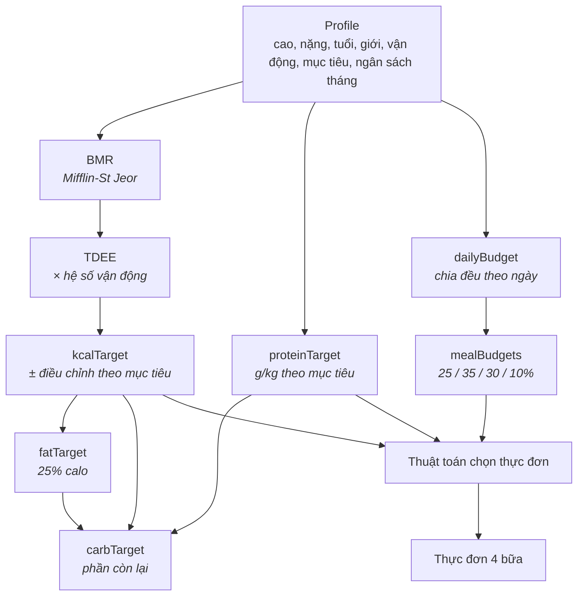
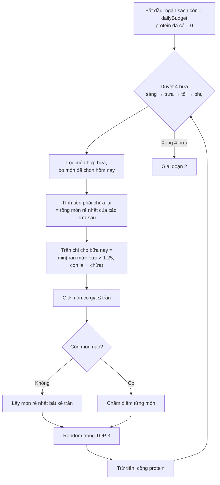
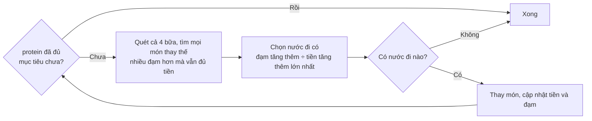
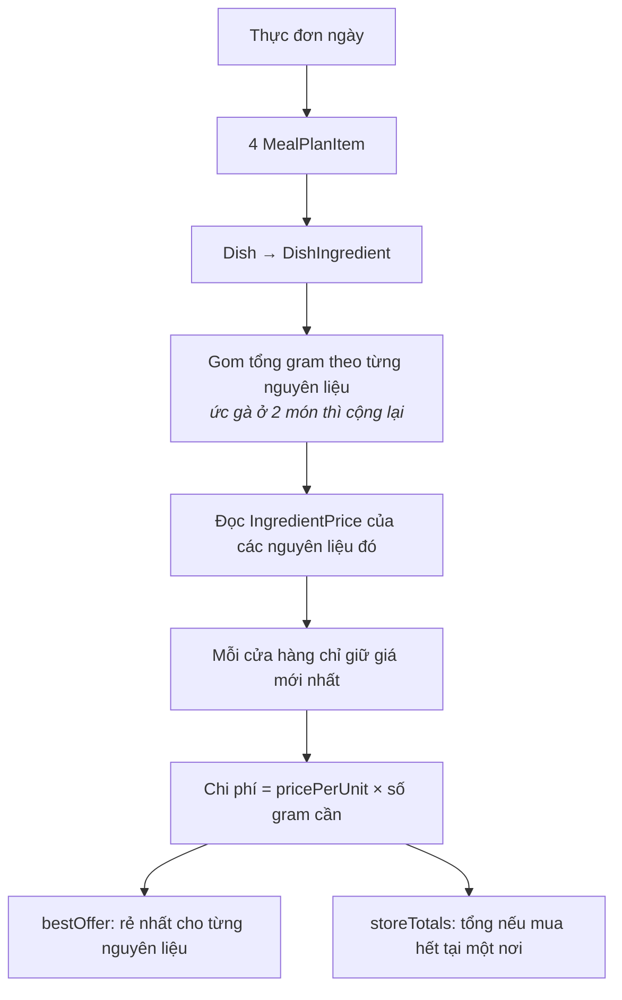

# 05 · Nghiệp vụ

> Toàn bộ công thức và thuật toán làm nên giá trị của sản phẩm: từ thể trạng
> ra mục tiêu, từ mục tiêu ra thực đơn, từ thực đơn ra danh sách đi chợ.
> Đây là phần đáng đọc nhất nếu bạn muốn hiểu dự án.

**Loại tài liệu:** Explanation. Mã nguồn tương ứng:
[`common/utils/nutrition.ts`](../src/common/utils/nutrition.ts) và
[`services/planner-algorithm.ts`](../src/services/planner-algorithm.ts) — cả
hai đều là **hàm thuần**, không chạm DB.

---

## Toàn cảnh



---

## Phần 1 — Từ thể trạng ra mục tiêu

### BMR: Mifflin-St Jeor

Đây là công thức trao đổi chất cơ bản được dùng phổ biến nhất hiện nay, chính
xác hơn Harris-Benedict với người hiện đại.

```
BMR = 10 × cân nặng(kg) + 6.25 × chiều cao(cm) − 5 × tuổi + s
s = +5 với nam, −161 với nữ
```

### TDEE và điều chỉnh theo mục tiêu

```
TDEE = BMR × hệ số vận động
kcalTarget = TDEE + điều chỉnh
```

| `activityLevel` | Hệ số | Mô tả |
|---|---|---|
| `SEDENTARY` | 1.2 | Ngồi nhiều, gần như không tập |
| `LIGHT` | 1.375 | 1–3 buổi/tuần |
| `MODERATE` | 1.55 | 3–5 buổi/tuần |
| `ACTIVE` | 1.725 | 6–7 buổi/tuần |
| `VERY_ACTIVE` | 1.9 | Vận động viên, lao động nặng |

| `goal` | Protein (g/kg) | Điều chỉnh calo |
|---|---|---|
| `GAIN_MUSCLE` | 2.0 | **+300** kcal |
| `LOSE_FAT` | 2.2 | **−300** kcal |
| `MAINTAIN` | 1.6 | 0 |

Giảm mỡ đặt protein cao nhất là có chủ ý: khi ăn thiếu calo, protein cao giúp
giữ cơ. Đây cũng là lý do sản phẩm lấy **protein làm chỉ số chính** thay vì
calo — sinh viên ăn rẻ thường thiếu đạm chứ hiếm khi thiếu tinh bột.

### Chia macro

```
fatTarget  = kcalTarget × 25% ÷ 9        (1g fat = 9 kcal)
carbTarget = (kcalTarget − protein×4 − fat×9) ÷ 4
```

Protein được chốt trước theo cân nặng, fat lấy một tỉ lệ cố định, carb nhận
phần còn lại. Thứ tự này phản ánh mức độ quan trọng: protein là ràng buộc
cứng, carb là biến phụ thuộc.

### Ngân sách

```
dailyBudget = ⌊ monthlyBudget ÷ số ngày trong tháng ⌋
```

| Bữa | Tỉ lệ | Vì sao |
|---|---|---|
| Sáng | 25% | Bữa nhẹ nhưng không được bỏ |
| Trưa | 35% | Bữa chính, thường ăn ngoài nên đắt nhất |
| Tối | 30% | Bữa chính, hay tự nấu |
| Phụ | 10% | Sữa, trứng, trái cây |

> **Sai lệch có chủ ý so với bản kế hoạch ban đầu.** Roadmap đề xuất "ngân
> sách còn lại ÷ số ngày còn lại", tức là tiêu lố hôm nay thì các ngày sau bị
> siết. Bản hiện tại chia đều cả tháng cho đơn giản và ổn định: hạn mức ngày
> không nhảy múa mỗi lần người dùng ghi nhận một bữa. Đổi lại, hệ thống chưa
> phản ứng khi người dùng tiêu vượt kéo dài.

### Ví dụ đã đối chiếu với API thật

Sinh viên nam, 172 cm, 64 kg, 21 tuổi, tập 3–5 buổi/tuần, muốn tăng cơ, được
chu cấp 2 400 000₫/tháng, tính vào tháng 8 (31 ngày):

| Bước | Phép tính | Kết quả |
|---|---|---|
| BMR | `10×64 + 6.25×172 − 5×21 + 5` | 1 615 |
| TDEE | `1615 × 1.55` | 2 503 |
| kcalTarget | `2503 + 300` | **2 803** |
| proteinTarget | `64 × 2.0` | **128 g** |
| fatTarget | `2803 × 0.25 ÷ 9` | **78 g** |
| carbTarget | `(2803 − 512 − 702) ÷ 4` | **397 g** |
| dailyBudget | `⌊2 400 000 ÷ 31⌋` | **77 419₫** |
| mealBudgets | `77419 × [0.25, 0.35, 0.3, 0.1]` | 19 355 / 27 097 / 23 226 / 7 742₫ |

---

## Phần 2 — Thuật toán chọn thực đơn

Bài toán: chọn 4 món (sáng/trưa/tối/phụ) sao cho **tổng protein đạt mục tiêu**
mà **tổng chi phí không vượt hạn mức ngày**, và **không lặp lại nhàm chán**.

Đây là bài toán ba lô nhiều ràng buộc — tối ưu tuyệt đối là NP-hard, nên hệ
thống dùng **greedy hai giai đoạn**.

### Giai đoạn 1 — Chọn tham lam theo từng bữa



**Ba cơ chế đáng chú ý:**

1. **Tiền chừa lại (`reserve`).** Trước khi chọn bữa sáng, thuật toán cộng
   trước giá món rẻ nhất của trưa + tối + phụ và trừ ra khỏi ngân sách khả
   dụng. Không có bước này, một bữa sáng đắt sẽ khiến bữa tối không còn tiền.

2. **Độ co giãn 25% (`MEAL_BUDGET_FLEX = 1.25`).** Một bữa được phép vượt hạn
   mức bữa tối đa 25%, miễn tổng ngày vẫn ổn. Chia cứng 25/35/30/10 mà không
   co giãn thì rất nhiều món hợp lý bị loại oan.

3. **Ngẫu nhiên trong TOP 3 (`TOP_N = 3`).** Luôn chọn món điểm cao nhất thì
   người dùng nhận đúng một thực đơn mỗi ngày và sẽ bỏ app. Lấy ngẫu nhiên
   trong 3 ứng viên tốt nhất giữ được chất lượng mà vẫn đa dạng.

**Công thức chấm điểm:**

```
proteinCần  = (proteinTarget − proteinĐãCó) ÷ số bữa còn lại
điểm = −|protein(món) − proteinCần|  +  protein(món) ÷ giá(món) × 1000
        └── vế 1: vừa vặn ──┘         └── vế 2: hiệu suất đạm/tiền ──┘
```

Vế 1 kéo về món đúng lượng đạm còn thiếu; vế 2 thưởng cho món nhiều đạm mà rẻ.
Hằng số `1000` chỉ để hai vế cùng bậc độ lớn.

### Giai đoạn 2 — Vòng nâng cấp

Greedy theo bữa có thể kết thúc mà vẫn thiếu đạm. Vòng này sửa lại:



Vòng lặp dừng khi đủ đạm **hoặc** không còn nước đi nào cải thiện được — nên
luôn kết thúc, không kẹt vô hạn. Nếu danh mục món quá nghèo đạm thì thực đơn
trả về sẽ thiếu đạm, và giao diện hiện cảnh báo thay vì báo lỗi.

### Đổi món

[`findAlternative`](../src/services/planner-algorithm.ts) chọn món **giống
nhất** thay vì tốt nhất:

```
điểm = −|Δprotein| × 2  −  |Δgiá| ÷ 1000
```

Người dùng bấm "Đổi món" là vì không thích món đó, chứ không phải muốn đổi cả
cân đối dinh dưỡng của ngày. Hệ số `×2` khiến protein được ưu tiên giữ hơn giá.
Vẫn random trong TOP 3 để bấm hai lần ra hai kết quả khác nhau.

---

## Phần 3 — Theo dõi thực tế

| Chỉ số | Công thức | Ở đâu |
|---|---|---|
| `consumed.*` | Cộng dồn `MealLog` của ngày | [`StatsService.daily`](../src/services/StatsService.ts) |
| `proteinWarning` | `protein đã ăn < 90% mục tiêu` | nt |
| `budgetWarning` | `chi phí đã ăn > dailyBudget` | nt |

Ngưỡng **90%** cho protein là khoảng dung sai: đúng 100% thì hôm nào cũng
cảnh báo và người dùng sẽ mù cảnh báo.

Lưu ý: `consumed` tính từ `MealLog` (**đã ăn**), còn `budgetStatus` của thực
đơn tính từ `MealPlanItem` (**dự định**). Hai con số này khác nhau là bình
thường — kế hoạch và thực tế vốn không trùng.

---

## Phần 4 — So sánh giá



Điểm mấu chốt là quy mọi giá về **`pricePerUnit` (đồng trên mỗi gram)** ngay
lúc crawl. Nhờ vậy so sánh "ức gà gói 500g" với "ức gà gói 1kg" là phép nhân
đơn giản, không cần quy đổi lúc truy vấn.

Cạm bẫy khi đọc kết quả: một cửa hàng chỉ bán 3/9 nguyên liệu sẽ có `total`
thấp nhất mà không hề rẻ nhất. Luôn đọc `total` kèm `itemCount` —
[04 · API](./04-api.md#get-apistorescomparedateyyyy-mm-dd-) nói rõ hơn.
