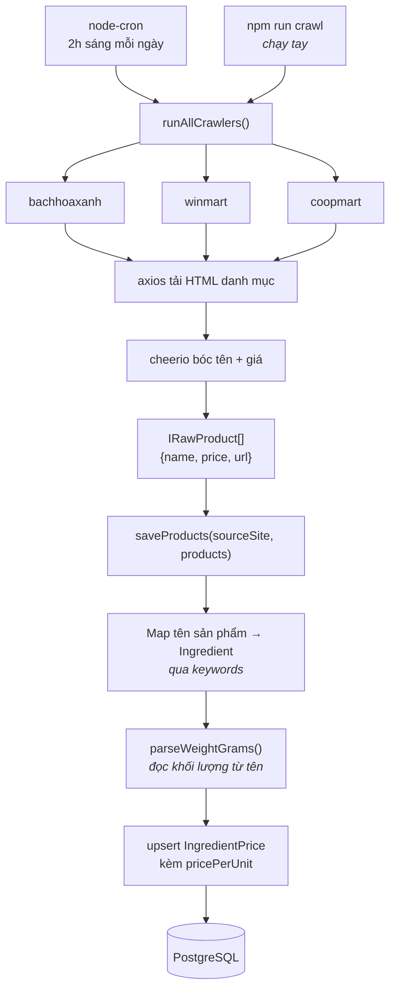
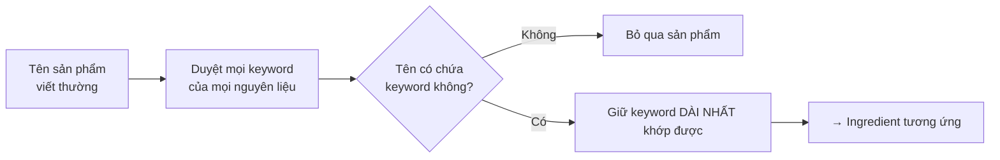
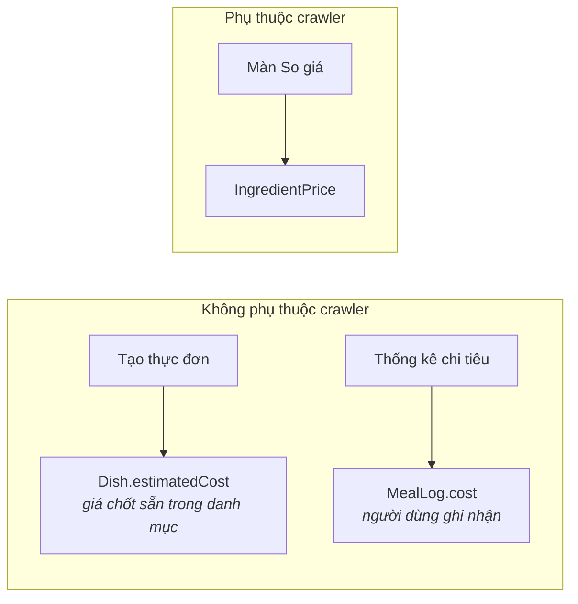

# 06 · Crawler giá

> Cách hệ thống lấy giá nguyên liệu từ website bán lẻ, map về bảng
> `Ingredient`, và vì sao nó được thiết kế để hỏng mà không kéo sập ứng dụng.

**Loại tài liệu:** Explanation + How-to. Mã nguồn:
[`src/crawlers/`](../src/crawlers/).

---

## Bài toán

Muốn trả lời "mua ức gà ở đâu rẻ nhất" thì phải có giá. Giá nằm trên website
bán lẻ, không có API công khai. Ba khó khăn:

1. **Tên sản phẩm không khớp tên nguyên liệu.** Website ghi "Ức gà phi lê
   500g Meat Master", hệ thống cần biết đó là nguyên liệu `Ức gà`.
2. **Đơn vị lung tung.** 500g, 1kg, vỉ 10 quả, chai 1 lít — phải quy về cùng
   một thước đo mới so được.
3. **HTML đổi bất cứ lúc nào.** Không có hợp đồng nào ràng buộc website giữ
   nguyên cấu trúc.

---

## Luồng chạy



Mỗi crawler thất bại được **bắt riêng lẻ** trong
[`runner.ts`](../src/crawlers/runner.ts): Bách Hóa Xanh sập thì WinMart và
Co.op vẫn chạy tiếp, chỉ ghi log lỗi.

---

## Bước 1 — Map sản phẩm về nguyên liệu

Mỗi `Ingredient` có mảng `keywords`. Ví dụ nguyên liệu `Ức gà` mang
`["ức gà", "ức gà phi lê", "gà phi lê"]`.

Thuật toán trong [`common.ts`](../src/crawlers/common.ts):



**Ưu tiên keyword dài nhất** là chi tiết quan trọng. "Ức gà phi lê 500g" khớp
cả `"gà phi lê"` lẫn `"ức gà phi lê"`; lấy chuỗi dài hơn cho kết quả cụ thể
hơn. Không có quy tắc này, sản phẩm dễ bị gán nhầm sang nguyên liệu chung
chung.

Sản phẩm không khớp keyword nào bị **bỏ qua im lặng** — chấp nhận sót còn hơn
ghi nhận sai giá.

## Bước 2 — Đọc khối lượng

`parseWeightGrams(name)` thử lần lượt các mẫu, dừng ở mẫu đầu tiên khớp:

| Mẫu trong tên | Ví dụ | Quy ra |
|---|---|---|
| `kg`, `kí`, `ký` | "Gạo ST25 5kg" | 5000 g |
| `g`, `gr`, `gam` | "Ức gà 500g" | 500 g |
| `l`, `lít` | "Sữa tươi 1 lít" | 1000 g |
| `ml` | "Nước mắm 500ml" | 500 g |
| "vỉ/hộp N quả" | "Vỉ 10 trứng" | 550 g (1 quả ≈ 55g) |
| Không khớp gì | "Rau muống" | **1000 g** (mặc định) |

Mặc định 1000g là giả định nguy hiểm nhưng cần thiết: nhiều mặt hàng tươi bán
theo kg mà không ghi số. Hệ quả — sản phẩm bán theo bó/gói nhỏ mà không ghi
khối lượng sẽ bị tính rẻ hơn thực tế. Xem
[08 · Vấn đề đã biết](./08-van-de-da-biet.md).

## Bước 3 — Lưu giá

```
pricePerUnit = price ÷ unitQty        (đồng trên mỗi gram)
```

Ghi bằng `upsert` với khoá `(ingredientId, storeId, productName)` nên chạy lại
mỗi ngày chỉ cập nhật `price` và `crawledAt`, không sinh bản sao.

`pricePerUnit` được tính sẵn ở đây thay vì lúc truy vấn, để màn so giá chỉ
việc nhân với số gram cần mua.

---

## Vì sao ứng dụng vẫn chạy khi crawler chết



Crawler chỉ nuôi **một** tính năng. Seed đã nạp sẵn 84 dòng giá tham khảo cho
3 nguồn, nên màn so giá có dữ liệu ngay cả khi chưa crawl lần nào.

Trường `crawledAt` được trả về trong API để giao diện nói được "giá cập nhật
3 ngày trước" thay vì giả vờ là giá thời gian thực.

---

## How-to

### Chạy tay ngay, không đợi 2h sáng

```bash
cd Backend
npm run crawl
```

Log mỗi nguồn có dạng:

```
[crawler] bachhoaxanh: lấy được 214 sản phẩm, match 31 nguyên liệu
```

Tỉ lệ match thấp (dưới ~10%) thường có nghĩa selector đã hỏng hoặc keyword
chưa đủ, chứ không phải website hết hàng.

### Thêm nguyên liệu mới

1. Thêm vào `INGREDIENTS` trong [`prisma/seed.ts`](../prisma/seed.ts), nhớ
   điền `keywords` — đây là thứ duy nhất giúp crawler nhận ra nó.
2. `npm run db:seed` (chạy lại an toàn, dùng `upsert`).
3. `npm run crawl` để lấy giá cho nguyên liệu mới.

### Thêm một website nguồn

1. Tạo `src/crawlers/<tên>.ts` xuất một object khớp giao diện `ICrawler`:
   `{ sourceSite, crawl }`.
2. Đăng ký vào mảng `CRAWLERS` trong [`runner.ts`](../src/crawlers/runner.ts).
3. Thêm một `Store` có `sourceSite` **trùng đúng chuỗi đó** — `saveProducts`
   tìm cửa hàng theo trường này, không khớp thì bỏ qua toàn bộ sản phẩm và chỉ
   ghi một dòng cảnh báo.

### Sửa khi selector hỏng

Selector nằm ngay trong từng file crawler, ví dụ
[`bachhoaxanh.ts`](../src/crawlers/bachhoaxanh.ts). Cách kiểm tra nhanh:

```bash
curl -s -H "User-Agent: Mozilla/5.0" https://www.bachhoaxanh.com/thit-ga | grep -o 'class="[^"]*price[^"]*"' | head
```

Đổi selector trong file rồi chạy lại `npm run crawl` và xem số match.

> Crawler hiện dùng `axios` + `cheerio`, chỉ đọc được HTML tĩnh. Website nào
> dựng danh sách bằng JavaScript sẽ trả về 0 sản phẩm mà không báo lỗi — khi
> đó cần chuyển sang Playwright.

---

## Ranh giới đạo đức và kỹ thuật

- Chỉ đọc **trang danh mục công khai**, không đăng nhập, không vượt tường phí.
- Tần suất **1 lần/ngày**, một dự án học tập không tạo tải đáng kể.
- `User-Agent` khai báo trình duyệt thật để không bị chặn — nhưng vì thế cũng
  không tự nhận diện là bot. Nếu triển khai thật, nên đọc `robots.txt` và
  khai `User-Agent` riêng có thông tin liên hệ.
- Overpass và Nominatim (dùng ở màn tìm cửa hàng) có `User-Agent` riêng
  `StudentBites/1.0 (student project)` đúng theo yêu cầu sử dụng của OSM.
