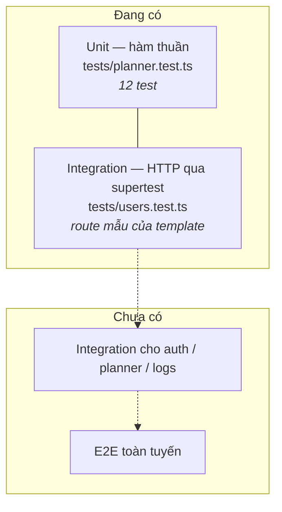

# 07 · Kiểm thử & quy ước mã nguồn

> Cách chạy và viết test, cùng những quy ước mà mã nguồn hiện tại đang tuân
> theo. Đọc file này trước khi mở pull request đầu tiên.

**Loại tài liệu:** How-to + Reference.

---

## Kiểm thử

### Chạy

```bash
npm test              # Vitest, chế độ watch
npm test -- --run     # chạy một lượt rồi thoát (dùng cho CI)
npm run type-check    # tsc --noEmit
npm run lint          # ESLint
```

Test đọc `config/.env.test` (cổng 4000, `NODE_ENV=test`) do
[`vitest.config.mts`](../vitest.config.mts) chỉ định. Cron **không** chạy
trong môi trường test — [`src/main.ts`](../src/main.ts) kiểm tra `NodeEnv`
trước khi đăng ký lịch.

### Kim tự tháp hiện tại



Phần được phủ tốt nhất chính là phần đáng phủ nhất: **logic nghiệp vụ thuần**.

| Nhóm | Kiểm chứng điều gì |
|---|---|
| `nutrition.calcBmr / calcTargets` | BMR đúng Mifflin-St Jeor; protein = 2g/kg khi tăng cơ; ngân sách ngày = tháng ÷ số ngày |
| `planner-algorithm.pickMenuForDay` | Chọn đủ 4 bữa; **không vượt ngân sách ngày**; đạt ≥ 70% mục tiêu protein; không trùng món trong ngày |
| `planner-algorithm.findAlternative` | Trả món khác cùng bữa, tránh món đã dùng; trả `undefined` khi hết lựa chọn |

### Vì sao test được mà không cần database

Vì [`planner-algorithm.ts`](../src/services/planner-algorithm.ts) và
[`nutrition.ts`](../src/common/utils/nutrition.ts) **nhận dữ liệu qua tham số,
không tự đi lấy**. Test dựng vài object `IDishLite` bằng tay rồi gọi hàm.

Đây là lý do chính khiến kiến trúc tách `planner-algorithm` (thuật toán) khỏi
`PlannerService` (đọc/ghi DB) — xem [02 · Kiến trúc](./02-kien-truc.md).

### Kiểm soát ngẫu nhiên

`pickMenuForDay` và `findAlternative` nhận tham số `rng` với mặc định
`Math.random`. Test truyền hàm cố định vào để kết quả lặp lại được:

```ts
pickMenuForDay(dishes, targets, () => 0);   // luôn lấy ứng viên đầu trong TOP 3
```

**Mọi hàm có yếu tố ngẫu nhiên đều phải nhận `rng` qua tham số.** Gọi thẳng
`Math.random()` bên trong là làm cho hàm không test được.

### Nên viết thêm test gì

Theo thứ tự giá trị giảm dần:

1. **Integration cho `requireAuth`** — xác nhận người dùng A không đọc/sửa
   được dữ liệu người dùng B. Đây là lỗ hổng đắt nhất nếu có.
2. **Integration cho `/api/planner/generate`** — chạy lại hai lần trên cùng
   một ngày phải ghi đè chứ không nhân đôi `MealPlanItem`.
3. **Unit cho `parseWeightGrams`** — bảng ánh xạ ở
   [06 · Crawler](./06-crawler.md) chính là bộ ca kiểm thử sẵn có.
4. **Unit cho `StoreService.compare`** — đặc biệt trường hợp cửa hàng thiếu
   hàng khiến `total` thấp giả tạo.

---

## Quy ước mã nguồn

### Chiều phụ thuộc

```
routes/  →  services/  →  repos/prisma
   ↓           ↓
routes/common  common/utils
```

Không có mũi tên ngược. Cụ thể:

- `services/` **không** import `express`, không nhận `req`/`res`.
- `routes/` **không** gọi `prisma` trực tiếp.
- `common/utils/` **không** làm I/O.

### Đường dẫn import

Dùng alias `@src/...` thay vì đường dẫn tương đối nhiều cấp:

```ts
import prisma from '@src/repos/prisma';        // đúng
import prisma from '../../repos/prisma';       // tránh
```

### Xác thực đầu vào

Kiểm tra ở `routes/`, bằng `parseReq` + `jet-validators`. Service nhận dữ liệu
đã sạch nên không phải kiểm lại.

```ts
const reqValidators = {
  generate: parseReq({ date: isDateStr, range: isRange }),
} as const;
```

### Lỗi

Service ném `RouteError(status, message)`. Thông điệp **viết cho người dùng
cuối bằng tiếng Việt**, vì nó đi thẳng ra giao diện:

```ts
// đúng
throw new RouteError(404, 'Chưa có thực đơn cho ngày này. Hãy tạo thực đơn trước.');
// sai
throw new RouteError(404, 'plan not found');
```

Gom hằng thông điệp vào object `Errors` đầu file service để test tham chiếu
được và để dịch tập trung sau này.

### Danh tính người dùng

Luôn lấy từ `getUserId(res)`, **không bao giờ** từ `req.body` hay query. Mọi
truy vấn thuộc về người dùng phải lọc theo `userId` — kể cả khi đã có `id` của
bản ghi:

```ts
const log = await prisma.mealLog.findUnique({ where: { id } });
if (!log || log.userId !== userId) throw new RouteError(404, ...);
```

Trả **404** thay vì 403 khi bản ghi thuộc về người khác, để không tiết lộ rằng
id đó tồn tại.

### Tiền và ngày

- Tiền là **số nguyên VND**, không dùng float, không lưu đơn vị nghìn.
- Ngày truyền qua API là chuỗi `YYYY-MM-DD`; chỉ đổi sang `Date` bằng
  `parseDateOnly` / `formatDateOnly` trong
  [`PlannerService.ts`](../src/services/PlannerService.ts). Không tự gọi
  `new Date(chuỗi)` ở chỗ khác — sẽ lệch múi giờ.

### Kiểu dữ liệu

- Interface bắt đầu bằng `I` (`IDishLite`, `IDayPlanResult`) theo quy ước có
  sẵn của template.
- Service xuất `default { ... } as const` để nơi gọi không sửa được.
- Tránh `any`; ESLint đã bật cảnh báo.

### Bình luận

Viết bình luận cho **cái không đọc được từ mã**: vì sao có hằng số `1.25`, vì
sao ưu tiên keyword dài nhất. Không viết lại điều mã đã nói rõ.

```ts
// cho phép 1 bữa vượt ngân sách bữa tối đa 25% (miễn cả ngày không vượt)
const MEAL_BUDGET_FLEX = 1.25;
```

### Trước khi mở pull request

```bash
npm run lint && npm run type-check && npm test -- --run
```

`npm run build` chạy lint trước khi biên dịch, nên lint hỏng là build hỏng.
