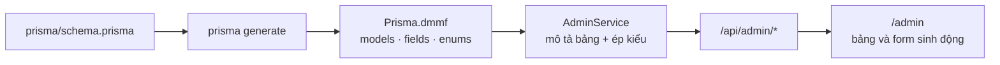
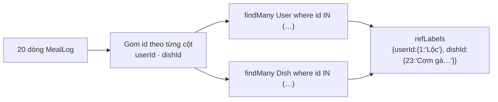

# 09 · Khu quản trị

> API quản trị generic ở `/api/admin`, phục vụ trang `/admin` phía giao diện.
> Một bộ endpoint duy nhất chạy được cho cả 11 bảng.

**Loại tài liệu:** Explanation + Reference. Mã nguồn:
[`services/AdminService.ts`](../src/services/AdminService.ts),
[`routes/AdminRoutes.ts`](../src/routes/AdminRoutes.ts),
[`routes/common/admin-auth.ts`](../src/routes/common/admin-auth.ts).

---

## Ý tưởng: đọc schema thay vì viết tay

Viết CRUD riêng cho 10 bảng là 10 lần lặp cùng một việc, và mỗi lần đổi
`schema.prisma` là phải sửa lại. Thay vào đó khu quản trị đọc **Prisma DMMF**
(`Prisma.dmmf.datamodel`) — chính metadata mà Prisma sinh ra từ schema.



**Hệ quả:** thêm cột hay thêm bảng vào `schema.prisma`, chạy
`prisma migrate`, là khu quản trị **tự có** cột/bảng đó. Không phải sửa dòng
mã nào ở đây lẫn ở giao diện.

---

## Phân quyền

Dự án chưa có hệ thống vai trò trong cơ sở dữ liệu. Để không phải thêm
migration, quyền quản trị đọc từ biến môi trường:

```bash
# config/.env.development
ADMIN_EMAILS=loc@demo.vn,ban@example.com
```

| Tình huống | Kết quả |
|---|---|
| Chưa đăng nhập | **401** |
| `ADMIN_EMAILS` trống hoặc chưa khai | **403** — mặc định đóng, không mở |
| Đăng nhập nhưng email ngoài danh sách | **403** |
| Email nằm trong danh sách | Cho qua |

Biến này đọc thẳng từ `process.env` chứ không qua `EnvVars`, để môi trường nào
chưa khai thì server vẫn khởi động bình thường.

> Đây là giải pháp nhanh, hợp với quy mô hiện tại. Khi cần nhiều mức quyền
> (biên tập viên, kiểm duyệt…) thì phải thêm cột `role` vào bảng `User`.

---

## Bốn lớp phòng vệ

Một API nhận tên bảng từ URL rồi gọi thẳng Prisma là chỗ rất dễ hở. Bốn chốt
chặn trong [`AdminService`](../src/services/AdminService.ts):

| Chốt | Ngăn điều gì |
|---|---|
| **Danh sách trắng theo DMMF** | `GET /api/admin/$queryRaw` trả 404, không gọi được thuộc tính bất kỳ của Prisma Client |
| **Lọc trường ghi được** | Body chỉ giữ cột `scalar`/`enum` không read-only; quan hệ, `id`, `createdAt` bị bỏ |
| **Ép kiểu ở biên** | Sai kiểu trả 400 kèm tên cột, thay vì để Prisma ném lỗi khó đọc |
| **Che trường bí mật** | `passwordHash` luôn trả về `••••••`, kể cả trong nhật ký |
| **Băm mật khẩu** | Ô mật khẩu nhận chuỗi thô rồi bcrypt trước khi lưu; bỏ trống = giữ nguyên |
| **Ghi vết** | Mọi create/update/delete để lại một dòng `AdminAuditLog` |

---

## Endpoint

Tất cả đều cần đăng nhập **và** có quyền quản trị.

| Method | Đường dẫn | Việc |
|---|---|---|
| `GET` | `/api/admin/models` | Danh sách bảng + số bản ghi + mô tả cột |
| `GET` | `/api/admin/:model` | Danh sách bản ghi, có phân trang/tìm kiếm/sắp xếp |
| `GET` | `/api/admin/:model/options` | Danh sách id + nhãn, để chọn khoá ngoại |
| `GET` | `/api/admin/:model/:id` | Một bản ghi + nhãn khoá ngoại + bản ghi liên quan |
| `POST` | `/api/admin/:model` | Tạo |
| `PUT` | `/api/admin/:model/:id` | Sửa |
| `DELETE` | `/api/admin/:model/:id` | Xoá |

`:model` là tên model **viết hoa đầu** đúng như trong schema: `Ingredient`,
`IngredientPrice`, `MealLog`…

### Tham số của danh sách

| Tham số | Mặc định | Ghi chú |
|---|---|---|
| `page` | 1 | |
| `pageSize` | 20 | Trần 100 |
| `q` | — | Tìm `contains`, không phân biệt hoa thường, trên các cột `String` |
| `sortBy` | cột id | Tên cột không hợp lệ sẽ bị bỏ qua |
| `sortDir` | `desc` | `asc` hoặc `desc` |
| `filterField` + `filterValue` | — | Lọc theo một cột; tên cột không có thật sẽ bị bỏ qua |

### Ép kiểu khi ghi

| Kiểu cột | Nhận vào | Ghi chú |
|---|---|---|
| `Int` | số hoặc chuỗi số | Không phải số nguyên → 400 |
| `Float` | số hoặc chuỗi số | |
| `Boolean` | `true` / `"true"` | |
| `DateTime` | chuỗi ngày | Không parse được → 400 |
| enum | chuỗi | Sai giá trị → 400 kèm danh sách hợp lệ |
| mảng (`String[]`) | mảng, hoặc chuỗi ngăn bằng dấu phẩy | Form gửi chuỗi, API gửi mảng đều được |
| chuỗi rỗng | → `null` | Lúc tạo mới, cột có default sẽ bị bỏ khỏi payload |

---

## Giao diện

| Route | Màn |
|---|---|
| `/admin` | Tổng quan: mỗi bảng một ô kèm số bản ghi |
| `/admin/[model]` | Bảng dữ liệu + tìm kiếm + phân trang + thêm/sửa/xoá |
| `/admin/[model]/[id]` | Chi tiết một bản ghi + các bản ghi liên quan |

### Trang chi tiết

`GET /api/admin/:model/:id` trả về `related`: mọi nhóm bản ghi ở bảng khác
đang trỏ về bản ghi này. Quan hệ ngược suy ra từ DMMF nên **không cần khai
báo tay** — thêm bảng mới có khoá ngoại là nó tự xuất hiện.

Ví dụ mở **Món ăn #1**:

| Nhóm | Từ đâu | Nội dung |
|---|---|---|
| Nguyên liệu của món | `DishIngredient.dishId` | Bánh mì 90g · Trứng gà 110g · Dầu ăn 5g · Dưa leo 30g |
| Bữa trong thực đơn | `MealPlanItem.dishId` | 5 bữa đang dùng món này |

Mỗi nhóm hiện tối đa **10 dòng**; nhiều hơn thì có link *Xem tất cả N →* dẫn
sang danh sách đã lọc sẵn bằng `filterField`/`filterValue`.

Cột khoá ngoại trỏ ngược về chính bản ghi đang xem bị ẩn khỏi bảng liên quan —
lặp lại "Món ăn #1" ở mọi dòng thì không mang thêm thông tin gì.

Form thêm/sửa sinh từ metadata trả về trong `model.fields`: khoá ngoại ra dropdown
chọn từ bảng liên quan, enum ra `<select>`,
`DateTime` ra `<input type="date">`, số ra `<input type="number">`, mật khẩu ra
`<input type="password">`, mảng ra
`<textarea>` ngăn bằng dấu phẩy.

Khu quản trị nằm ngoài nhóm route `(main)` nên không có tab bar và không bị
giới hạn bề rộng — bảng dữ liệu cần càng rộng càng tốt.

---

## Khoá ngoại

Cột khoá ngoại được nhận diện từ DMMF: field kiểu quan hệ có
`relationFromFields` chỉ đúng cột thật. Metadata trả về kèm `relatedModel`,
giao diện dựa vào đó để đổi ô số thành dropdown.

### Nhãn thay cho id trần

Danh sách và chi tiết đều trả kèm `refLabels` — bản đồ `{ cột: { id: nhãn } }`.
Nhờ vậy bảng hiện **"Cơm gà xối mỡ"** thay vì **23**, và bấm được sang bản ghi
đó.

Nhãn được gom theo lô: mỗi cột khoá ngoại chỉ **một** truy vấn `IN (...)` cho
toàn trang, không phải mỗi dòng một truy vấn.



`GET /api/admin/:model/options` trả `{ value, label }`, nhãn lấy từ cột đầu
tiên tìm được trong `name` → `productName` → `email` → `title` → `label`,
không có thì hiện `#id`. Cắt ở **200 bản ghi**, kèm cờ `truncated` và `total`
để giao diện nói rõ đã cắt bớt.

Giá trị đang có mà nằm ngoài 200 bản ghi đó vẫn được thêm vào danh sách dưới
dạng `#id (ngoài danh sách)` — nếu không, mở form sửa là mất khoá ngoại cũ.

---

## Mật khẩu

Ô `passwordHash` trong form là ô mật khẩu, nhận **mật khẩu thật**:

| Nhập | Kết quả |
|---|---|
| Chuỗi bất kỳ | bcrypt 10 vòng rồi lưu — tài khoản đăng nhập được ngay |
| Bỏ trống | Giữ nguyên mật khẩu cũ, **không** ghi đè thành rỗng |

Giá trị cũ không bao giờ hiện ra, kể cả trong nhật ký.

---

## Nhật ký thao tác

Bảng `AdminAuditLog` ghi lại mọi thao tác ghi:

| Cột | Nội dung |
|---|---|
| `actorId`, `actorEmail` | Ai làm. Không đặt quan hệ tới `User` để xoá tài khoản vẫn còn vết |
| `action` | `CREATE` · `UPDATE` · `DELETE` |
| `model`, `recordId` | Bảng nào, bản ghi nào |
| `changes` | CREATE: dữ liệu đã tạo · UPDATE: `{truoc, sau}` chỉ gồm cột thật sự đổi · DELETE: bản ghi trước khi xoá |

Hai chi tiết đáng chú ý:

1. **Bảng này chỉ đọc.** `POST`/`PUT`/`DELETE` lên `AdminAuditLog` trả **403**.
   Nhật ký sửa được thì không còn là nhật ký.
2. **Đổi mật khẩu vẫn để lại vết.** Hash bị che ở cả trước lẫn sau nên phép so
   sánh thông thường không thấy khác biệt — trường bí mật được ghi nhận riêng
   thành `{truoc: "••••••", sau: "(đã đổi)"}`.

Ghi nhật ký thất bại **không** làm hỏng thao tác chính: mất một dòng nhật ký
còn hơn chặn một thao tác đã thành công.

---

## Giới hạn đã biết

| Giới hạn | Ghi chú |
|---|---|
| Bảng liên quan quá 200 bản ghi | Dropdown chỉ liệt kê 200, có báo nhưng chưa có ô tìm kiếm trong dropdown |
| Xoá không cảnh báo phụ thuộc | Xoá bản ghi còn được tham chiếu sẽ bị cơ sở dữ liệu chặn; API trả lỗi nhưng không nói trước |
| Quyền theo email | Một mức quyền duy nhất, xem phần Phân quyền |
| Nhật ký không xoay vòng | Bảng chỉ lớn dần, chưa có cơ chế dọn bản ghi cũ |
