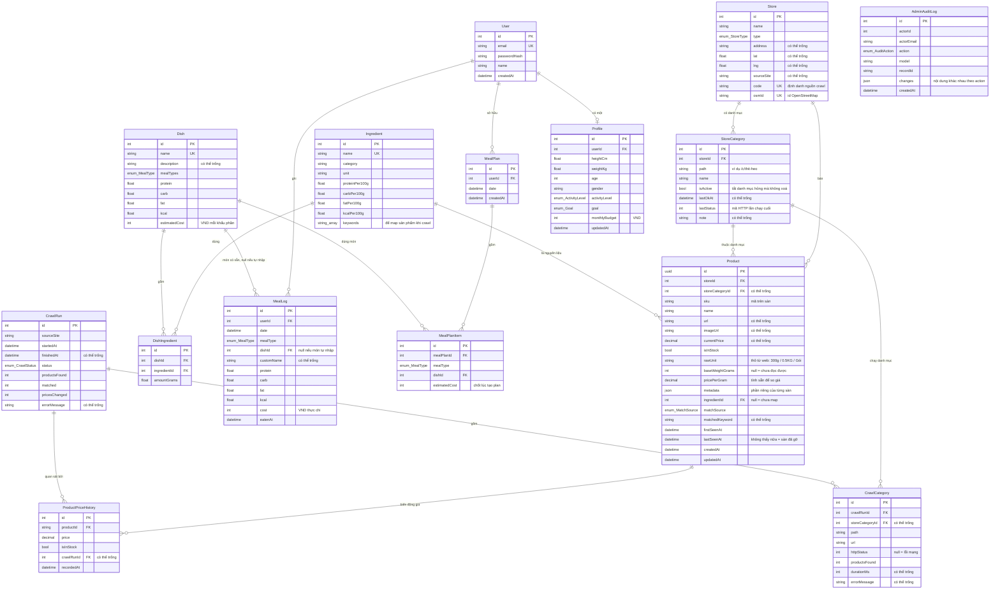

# ERD — Cơ sở dữ liệu StudentBites

> Sơ đồ quan hệ **đầy đủ** của toàn bộ bảng. File này sinh tự động từ
> `prisma/schema.prisma`, không viết tay, nên luôn khớp migration mới nhất.

**Sinh ngày:** 2026-08-02 · PostgreSQL 16 · 15 bảng · 16 khoá ngoại · 7 enum

---

## Sơ đồ



---

## Các bảng theo nhóm

### Người dùng

| Bảng | Dòng | Vai trò |
|---|---:|---|
| `User` | 1 | Tài khoản đăng nhập |
| `Profile` | 1 | Thể trạng, mục tiêu, ngân sách tháng — mỗi người một hồ sơ |

### Danh mục món ăn

| Bảng | Dòng | Vai trò |
|---|---:|---|
| `Ingredient` | 29 | Nguyên liệu ở mức khái niệm nấu ăn, macro trên 100g |
| `Dish` | 26 | Món ăn, macro và giá tính sẵn cho một khẩu phần |
| `DishIngredient` | 79 | Định lượng nguyên liệu của từng món |

### Hoạt động hằng ngày

| Bảng | Dòng | Vai trò |
|---|---:|---|
| `MealPlan` | 8 | Thực đơn một ngày của một người |
| `MealPlanItem` | 32 | Một bữa trong thực đơn |
| `MealLog` | 22 | Bữa đã ăn — ảnh chụp macro và chi phí tại thời điểm đó |

### Hàng hoá & giá

| Bảng | Dòng | Vai trò |
|---|---:|---|
| `Store` | 150 | 3 nguồn crawl (ONLINE) + phần còn lại lấy từ OpenStreetMap |
| `StoreCategory` | 19 | Danh mục từng sàn — đường dẫn crawl, sửa được trên admin |
| `Product` | 84 | Sản phẩm có thật trên kệ. **Giá luôn thuộc về đây** |
| `ProductPriceHistory` | 0 | Diễn biến giá, chỉ ghi khi giá hoặc tình trạng đổi |

### Vận hành crawl

| Bảng | Dòng | Vai trò |
|---|---:|---|
| `CrawlRun` | 0 | Một lượt crawl của một nguồn |
| `CrawlCategory` | 0 | Kết quả từng danh mục — nơi trả lời "đường dẫn nào 404" |

### Quản trị

| Bảng | Dòng | Vai trò |
|---|---:|---|
| `AdminAuditLog` | 2 | Nhật ký thao tác khu quản trị, chỉ đọc |

---

## Enum

| Enum | Giá trị |
|---|---|
| `ActivityLevel` | `SEDENTARY` · `LIGHT` · `MODERATE` · `ACTIVE` · `VERY_ACTIVE` |
| `AuditAction` | `CREATE` · `UPDATE` · `DELETE` |
| `CrawlStatus` | `RUNNING` · `SUCCESS` · `PARTIAL` · `FAILED` |
| `Goal` | `GAIN_MUSCLE` · `LOSE_FAT` · `MAINTAIN` |
| `MatchSource` | `NONE` · `AUTO_KEYWORD` · `MANUAL` |
| `MealType` | `BREAKFAST` · `LUNCH` · `DINNER` · `SNACK` |
| `StoreType` | `MARKET` · `SUPERMARKET` · `CONVENIENCE` · `ONLINE` |

---

## Ràng buộc duy nhất

| Bảng | Cột | Vì sao |
|---|---|---|
| `Dish` | `name` | Seed chạy lại không nhân bản |
| `DishIngredient` | `dishId, ingredientId` | Một món không lặp nguyên liệu |
| `Ingredient` | `name` | Seed chạy lại không nhân bản |
| `MealPlan` | `userId, date` | Một người một ngày một thực đơn — tạo lại là ghi đè |
| `Product` | `storeId, sku` | Crawl lại cập nhật đúng dòng cũ, không sinh bản sao |
| `Profile` | `userId` | Mỗi người đúng một hồ sơ |
| `Store` | `code` | Định danh ổn định của nguồn crawl |
| `Store` | `osmId` | Khoá upsert khi cache kết quả Overpass |
| `StoreCategory` | `storeId, path` | Một sàn không có hai danh mục cùng đường dẫn |
| `User` | `email` | Email là danh tính đăng nhập |

---

## Xoá lan

| Khi xoá | Kéo theo |
|---|---|
| `CrawlRun` | xoá luôn `CrawlCategory` · gỡ liên kết ở `ProductPriceHistory` |
| `Dish` | xoá luôn `DishIngredient` · gỡ liên kết ở `MealLog` · **bị chặn** nếu còn `MealPlanItem` |
| `Ingredient` | xoá luôn `DishIngredient` · gỡ liên kết ở `Product` |
| `MealPlan` | xoá luôn `MealPlanItem` |
| `Product` | xoá luôn `ProductPriceHistory` |
| `Store` | xoá luôn `Product`, `StoreCategory` |
| `StoreCategory` | gỡ liên kết ở `CrawlCategory`, `Product` |
| `User` | xoá luôn `MealLog`, `MealPlan`, `Profile` |

---

## Sinh lại file này

```bash
cd Backend && npm run docs:erd
```

Thêm migration xong thì chạy lệnh trên rồi commit đè lên. **Đừng sửa tay**
từng dòng — lần sinh sau sẽ ghi đè mất.

Bản ERD rút gọn chỉ gồm phần nghiệp vụ chính nằm ở
[03 · Mô hình dữ liệu](./03-mo-hinh-du-lieu.md); file này là bản đầy đủ,
có cả bảng vận hành crawl và quản trị.
