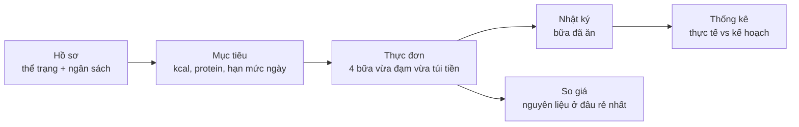

# Tài liệu Backend — StudentBites

> API Express 5 + TypeScript + Prisma/PostgreSQL cho ứng dụng lên thực đơn
> theo ngân sách sinh viên.

**Cập nhật:** 2026-08-02 · **Áp dụng cho:** `Backend/` trên nhánh `main`

---

## Đọc tài liệu này thế nào

Bộ tài liệu tổ chức theo **[Diátaxis](https://diataxis.fr/)** — bốn loại tài
liệu phục vụ bốn nhu cầu khác nhau, không trộn lẫn:

| Loại | Trả lời câu hỏi | Đọc khi |
|---|---|---|
| **Tutorial** (hướng dẫn) | "Làm sao chạy được?" | Ngày đầu vào dự án |
| **How-to** (cách làm) | "Làm sao xử lý việc X?" | Đang cần làm một việc cụ thể |
| **Reference** (tra cứu) | "Endpoint này nhận gì?" | Đang viết code, cần tra chính xác |
| **Explanation** (giải thích) | "Tại sao lại làm vậy?" | Muốn hiểu vì sao hệ thống có hình dạng này |

Sơ đồ kiến trúc dùng ký hiệu **[C4 model](https://c4model.com/)** (Context →
Container → Component). Quyết định kiến trúc ghi dưới dạng **ADR**
(Architecture Decision Record) trong [`adr/`](./adr/).

---

## Mục lục

| # | Tài liệu | Loại | Nội dung |
|---|---|---|---|
| 01 | [Bắt đầu](./01-bat-dau.md) | Tutorial | Từ máy trắng đến API chạy được kèm dữ liệu mẫu |
| 02 | [Kiến trúc](./02-kien-truc.md) | Explanation | Sơ đồ C4, phân lớp, vòng đời một request |
| 03 | [Mô hình dữ liệu](./03-mo-hinh-du-lieu.md) | Reference | ERD phần nghiệp vụ chính, từng bảng, ràng buộc |
| — | [ERD đầy đủ](./ERD.md) | Reference | Sơ đồ toàn bộ bảng, **sinh tự động** bằng `npm run docs:erd` |
| 04 | [API](./04-api.md) | Reference | Toàn bộ endpoint: request, response, mã lỗi |
| 05 | [Nghiệp vụ](./05-nghiep-vu.md) | Explanation | TDEE, chia ngân sách, thuật toán chọn thực đơn, so giá |
| 06 | [Crawler giá](./06-crawler.md) | Explanation + How-to | Cách crawl, map sản phẩm về nguyên liệu, vận hành |
| 07 | [Kiểm thử & quy ước](./07-kiem-thu-va-quy-uoc.md) | How-to + Reference | Chạy/viết test, quy ước mã nguồn |
| 08 | [Vấn đề đã biết](./08-van-de-da-biet.md) | Reference | Giới hạn hiện tại và nợ kỹ thuật, có mức độ ưu tiên |
| 09 | [Khu quản trị](./09-admin.md) | Explanation + Reference | API generic /api/admin, khoá ngoại, băm mật khẩu, nhật ký thao tác |
| — | [Sổ tay crawler](./crawler/) | Sổ làm việc | Brainstorm, khảo sát site, sổ vấn đề, quyết định — đang làm dở |
| — | [Quyết định kiến trúc](./adr/) | Explanation | ADR: chọn gì, vì sao, đánh đổi ra sao |

Tài liệu phía giao diện nằm ở
[`Frontend/studentbite/docs/`](../../Frontend/studentbite/docs/README.md).

---

## Tóm tắt trong 60 giây

StudentBites giải một bài toán: **sinh viên cần ăn đủ đạm nhưng tiền có hạn.**
Backend nhận thể trạng và ngân sách tháng của người dùng, quy ra mục tiêu
dinh dưỡng và hạn mức chi mỗi ngày/mỗi bữa, rồi tự chọn thực đơn thoả cả hai
ràng buộc đó. Người dùng đánh dấu bữa đã ăn để hệ thống theo dõi thực tế so
với kế hoạch, và có thể tra xem mua nguyên liệu ở đâu rẻ nhất.

**Ngăn xếp:** Node.js · Express 5 · TypeScript · Prisma · PostgreSQL 16 ·
Vitest · axios + cheerio (crawler) · node-cron.

---

## Quy ước của bộ tài liệu này

Áp dụng cho cả tài liệu Backend và Frontend, để hai bên đọc như một:

1. **Tên file theo số thứ tự đọc** — `01-`, `02-`… Người mới đọc từ trên xuống.
2. **Mỗi file mở đầu bằng một câu trả lời "file này dùng để làm gì"**, không
   mở đầu bằng mục lục.
3. **Sơ đồ dùng Mermaid**, nhúng thẳng vào Markdown để GitHub render được và
   để sơ đồ đi cùng lịch sử Git — không dùng ảnh xuất từ công cụ ngoài.
4. **Mỗi khẳng định về hành vi hệ thống phải trỏ được về mã nguồn**, ghi kèm
   đường dẫn file. Nếu tài liệu và mã lệch nhau, mã đúng — hãy sửa tài liệu.
5. **Tiếng Việt cho phần diễn giải, giữ nguyên thuật ngữ tiếng Anh** đã dùng
   trong mã (`MealPlan`, `dailyBudget`…) để tra cứu chéo không bị lệch.
6. **Không chép lại mã vào tài liệu** trừ khi đoạn mã là thứ đang được giải
   thích. Chép nhiều thì tài liệu sẽ lạc hậu ngay lần refactor kế tiếp.
