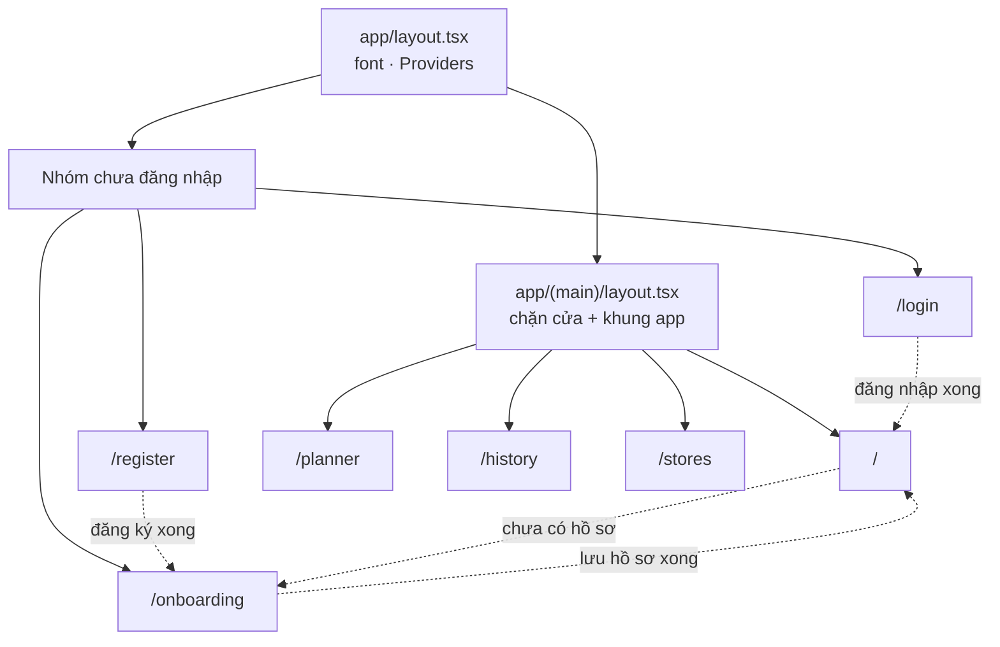
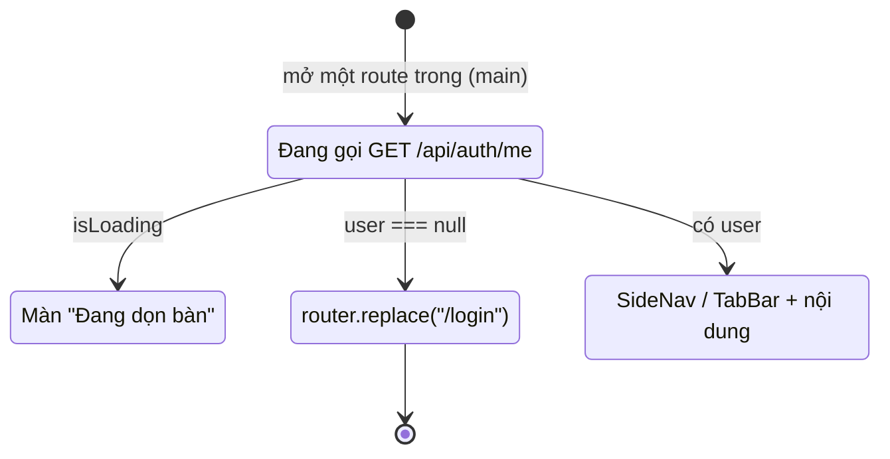
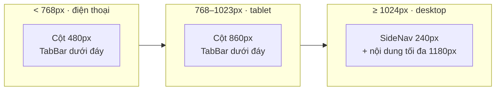
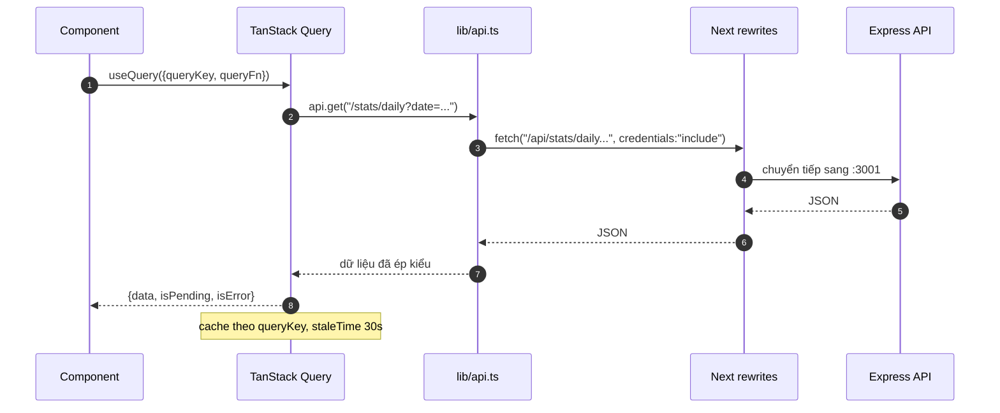

# 02 · Kiến trúc

> Mã nguồn tổ chức thế nào, route nào ra màn nào, và khung app đổi hình ra sao
> theo bề rộng màn hình.

**Loại tài liệu:** Explanation.

---

## Cấu trúc thư mục

```
app/
  layout.tsx              # gốc: font, metadata, Providers — KHÔNG quy định bề rộng
  globals.css             # design token + lớp component dùng chung
  (main)/                 # nhóm route cần đăng nhập
    layout.tsx            #   chặn cửa + khung app (SideNav / TabBar)
    page.tsx              #   /          Trang chủ
    planner/page.tsx      #   /planner   Thực đơn
    history/page.tsx      #   /history   Lịch sử
    stores/page.tsx       #   /stores    Đi chợ
  login/page.tsx          # /login
  register/page.tsx       # /register
  onboarding/page.tsx     # /onboarding
components/
  SideNav.tsx             # điều hướng desktop (≥1024px)
  TabBar.tsx              # điều hướng mobile/tablet (<1024px)
  StoreMap.tsx            # bọc Leaflet, chỉ chạy phía client
  Providers.tsx           # QueryClientProvider
  ui/                     # thư viện component dùng chung — xem tài liệu 04
lib/
  api.ts                  # bọc fetch + ApiError
  hooks.ts                # useMe, useLogout
  types.ts                # kiểu khớp response backend + nhãn tiếng Việt
  format.ts               # formatVnd, toDateStr, formatDateVi, formatDistance
  nav.ts                  # NAV_ITEMS — nguồn duy nhất cho cả SideNav và TabBar
```

Nguyên tắc phân chia:

| Nơi | Chứa gì | Không chứa |
|---|---|---|
| `app/**/page.tsx` | Gọi dữ liệu, ghép layout của riêng màn đó | Định nghĩa style dùng lại được |
| `components/ui/` | Khối dựng hình thuần trình bày | Gọi API |
| `lib/` | Hàm thuần và hook dùng chung | JSX |

---

## Bản đồ route



Toàn bộ page đều là **client component** (`"use client"`) vì đều cần TanStack
Query và trạng thái tương tác. Server Component chỉ dùng ở `app/layout.tsx`.

---

## Chặn cửa

[`app/(main)/layout.tsx`](<../app/(main)/layout.tsx>) là chốt duy nhất kiểm tra
đăng nhập cho cả bốn màn chính:



Không màn nào tự kiểm tra đăng nhập lại — thêm một route vào `(main)/` là tự
động được bảo vệ.

> Đây là bảo vệ **phía giao diện**, chỉ để điều hướng cho mượt. Bảo vệ thật
> nằm ở middleware `requireAuth` phía backend.

---

## Khung app đổi theo màn hình



Điểm mấu chốt: **`app/layout.tsx` không quy định bề rộng.** Trước đây nó khoá
cứng `max-w-[480px]` khiến desktop chỉ là bản mobile kéo giãn. Giờ mỗi nhóm
route tự quyết:

| Nơi | Bề rộng |
|---|---|
| `(main)/layout.tsx` | `max-w-120` → `md:max-w-215` → `lg:max-w-295`, kèm `SideNav` từ `lg` |
| `AuthShell` (login/register) | Một cột trên mobile, chia đôi màn từ `lg` |
| `onboarding` | `max-w-140` → `lg:max-w-170`, luôn căn giữa |

`SideNav` và `TabBar` đọc chung một danh sách
[`lib/nav.ts`](../lib/nav.ts) nên không bao giờ lệch nhau. Chi tiết ở
[07 · Responsive](./07-responsive.md).

---

## Luồng dữ liệu



Không có tầng quản lý trạng thái toàn cục nào khác — **TanStack Query là nguồn
sự thật cho dữ liệu máy chủ**, `useState` chỉ giữ trạng thái giao diện thuần
tuý (ngày đang chọn, tab đang mở). Xem
[06 · Dữ liệu & trạng thái](./06-du-lieu-va-trang-thai.md) và
[ADR-0002](./adr/0002-tanstack-query-lam-nguon-su-that.md).

---

## Ba chỗ đặc biệt

**Leaflet chỉ chạy phía client.** Thư viện đụng `window` ngay khi import nên
[`StoreMap.tsx`](../components/StoreMap.tsx) được nạp bằng
`dynamic(..., { ssr: false })` kèm khung chờ.

**Marker vẽ bằng `divIcon`.** Ảnh marker mặc định của Leaflet hay vỡ đường dẫn
khi bundle; dùng `divIcon` với HTML tự viết vừa tránh được lỗi đó vừa cho
marker mang đúng ngôn ngữ thị giác của app.

**Giờ hiện tại đọc qua `useSyncExternalStore`.** Lời chào "Chào buổi tối" phụ
thuộc đồng hồ máy người dùng — thứ server không biết. Đọc bằng
`useSyncExternalStore` với `getServerSnapshot` trả "Chào bạn" để tránh lệch
giữa HTML render trên server và trên client.
