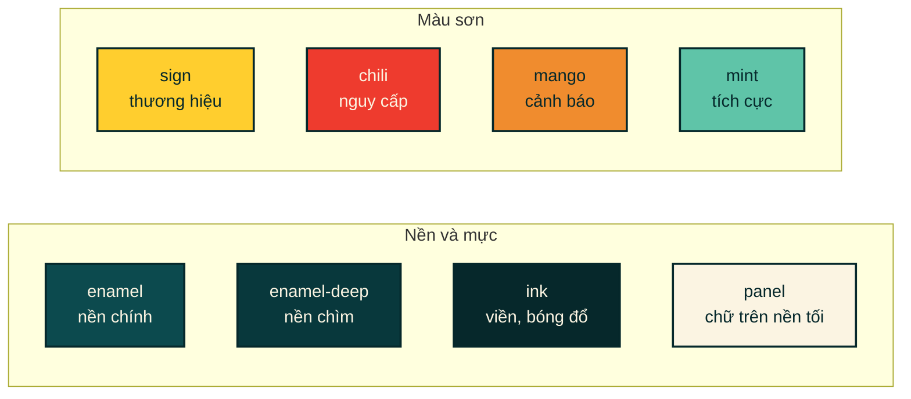

# 03 · Hệ thống thiết kế — "Bảng Hiệu"

> Bảng màu, bộ chữ, và các quy tắc dựng hình. Đọc file này trước khi thêm bất
> kỳ màn hình nào, để giao diện mới không lạc khỏi phần còn lại.

**Loại tài liệu:** Explanation + Reference.
Token định nghĩa tại [`app/globals.css`](../app/globals.css).

---

## Nhận diện đến từ đâu

Hướng thiết kế lấy chất liệu từ **tấm bảng hiệu quán cơm sinh viên** ngoài
đường: nền men xanh, chữ vàng kẻ tay, giá đỏ, viền đen dày, bóng đổ cứng
không nhoè. Rất Việt Nam mà không cần dùng nón lá hay hoa văn trống đồng.

Ba hướng đã được dựng thành màn hình thật rồi so sánh; hai hướng bị loại là
"Biên Lai" (giao diện như hoá đơn in nhiệt) và "Khay Cơm" (chia ô kiểu bento
trên nền tối). Lý do chọn hướng này ghi ở
[ADR-0001](./adr/0001-huong-nhan-dien-bang-hieu.md).

**App cam kết một tông màu duy nhất** — không có chế độ sáng/tối. Đây là lựa
chọn thiết kế, không phải thiếu sót: một tấm biển sơn không đổi màu theo giờ
trong ngày.

---

## Màu

| Token | Mã | Dùng cho |
|---|---|---|
| `--color-enamel` | `#0C4A4E` | Nền toàn app |
| `--color-enamel-deep` | `#08383C` | Header, thanh bên, ô chìm |
| `--color-ink` | `#06282B` | Viền, bóng đổ, chữ trên nền vàng/kem |
| `--color-panel` | `#FBF4E2` | Chữ trên nền tối, nền thẻ kem |
| `--color-panel-dim` | `#E8DFC7` | Thanh tiến trình trên nền kem |
| `--color-sign` | `#FFCE2E` | Màu thương hiệu; tấm biển chính, nút chính, mục đang chọn |
| `--color-sign-deep` | `#E5AF12` | Viền focus trên nền kem |
| `--color-chili` | `#EE3B2E` | Thanh protein, cột vượt hạn mức |
| `--color-chili-deep` | `#C22A1E` | Nền có chữ đè lên (đủ tương phản) |
| `--color-mango` | `#F08C2E` | Thanh fat, băng cảnh báo |
| `--color-mint` | `#5FC4A8` | Thanh kcal, "rẻ nhất", vị trí của bạn |

### Ba quy tắc bắt buộc

**1. Màu ngữ nghĩa tách khỏi màu thương hiệu.** `sign` là nhận diện; nguy cấp
luôn là `chili`, cảnh báo luôn là `mango`, tích cực luôn là `mint`. Không mượn
màu ngữ nghĩa để làm màu nhấn trang trí.

**2. Màu chỉ số là cố định.** Protein luôn `chili`, carb luôn `sign`, fat luôn
`mango`, kcal luôn `mint` — trên mọi màn hình, mọi biểu đồ. Người dùng học một
lần rồi nhận ra ở mọi nơi.

**3. Vượt ngưỡng báo bằng hoạ tiết, không đổi màu.** Thanh `Meter` vượt mục
tiêu sẽ được phủ gạch chéo chứ không chuyển sang đỏ — vì màu đã mang nghĩa
"đây là chỉ số nào" rồi, dùng lại để báo trạng thái sẽ mâu thuẫn.

### Về độ tương phản

Bảng màu biểu đồ đã được kiểm bằng công cụ kiểm tra mù màu. Cặp
`sign #FFCE2E` / `chili #EE3B2E` trên nền `#08383C`:

| Kiểm tra | Kết quả |
|---|---|
| Tách biệt khi mù màu (deutan) | ΔE 24.3 — đạt |
| Tách biệt với thị lực thường | ΔE 31.6 — đạt |
| Tương phản với nền | ≥ 3:1 — đạt |

Có một khuyến nghị bị **cố ý bỏ qua**: dải độ sáng cho nền tối. Vàng thương
hiệu sáng hơn ngưỡng khuyến nghị, nhưng ép nó tối lại khiến độ tách biệt khi
mù màu tụt từ ΔE 24.3 xuống 4.9 — tức là làm hỏng đúng thứ mà quy tắc đó sinh
ra để bảo vệ. Giữ vàng gốc, và bổ sung chú giải có nhãn chữ để nhận dạng
không phụ thuộc màu.

---

## Chữ

| Vai trò | Bộ chữ | Dùng cho |
|---|---|---|
| Tiêu đề | **Anton** 400 | Tiêu đề, nút, nhãn tab, tên mục — luôn IN HOA |
| Nội dung | **Be Vietnam Pro** 400–800 | Toàn bộ chữ đọc, số liệu nhỏ |

Cả hai đều có bộ dấu tiếng Việt đầy đủ và được `next/font/google` tự lưu vào
bản build — không gọi ra CDN lúc chạy.

### Ba lớp tiện ích

| Lớp | Định nghĩa | Dùng khi |
|---|---|---|
| `.disp` | Anton + **IN HOA** + giãn chữ | Tiêu đề, nút, nhãn |
| `.disp-num` | Anton, **không in hoa**, số thẳng cột | **Tiền và đơn vị** |
| `.label` | 0.625rem, đậm 800, in hoa, giãn `.14em` | Nhãn nhỏ, eyebrow, tên cột |

**Vì sao phải có `.disp-num`.** `.disp` viết hoa mọi thứ, nên `12.000đ` bị
biến thành `12.000Đ` — sai ký hiệu tiền đồng; `128.7g` thành `128.7G` — sai ký
hiệu đơn vị. Mọi chỗ hiện tiền hoặc đơn vị **phải** dùng `.disp-num`.

Thêm lớp `.num` (`font-variant-numeric: tabular-nums`) ở bất cứ đâu chữ số
xếp thành cột — bảng, danh sách giá — để các cột số thẳng hàng.

---

## Hình khối

Bốn quy tắc làm nên "cảm giác biển sơn":

| Quy tắc | Cụ thể | Vì sao |
|---|---|---|
| **Không bo góc** | Không dùng `rounded-*` | Biển sơn cắt thẳng cạnh |
| **Viền dày** | 2px cho thẻ, 3px cho tấm biển chính | Đường viền là nét vẽ, không phải đường phân cách mờ |
| **Bóng cứng** | `4px 4px 0` — offset, **không blur** | Bóng của một tấm biển thật dưới nắng |
| **Bấm thì đè xuống** | Lớp `.press` dịch 3px, xoá bóng | Cảm giác vật lý, không phải hiệu ứng mờ dần |

### Lớp component trong `globals.css`

| Lớp | Tác dụng |
|---|---|
| `.panel` | Viền 3px + bóng cứng + một đường viền mảnh bên trong (`::after`) — dành cho **tấm biển chính** |
| `.card-sign` | Thẻ nền kem, viền 2px, bóng cứng |
| `.press` | Hiệu ứng đè xuống khi bấm |
| `.rule-soft` | Vạch phân dòng mảnh, dùng trong danh sách |
| `.pb-safe` | Chừa vùng an toàn dưới đáy cho iOS |
| `.no-scrollbar` | Ẩn thanh cuộn ngang của dải chọn ngày |

**Mỗi màn hình chỉ nên có đúng một `.panel`.** Đó là chỗ mắt rơi vào đầu tiên
— số dư hôm nay ở Trang chủ, tổng tiền đi chợ ở màn Đi chợ. Hai tấm biển trên
một màn thì không tấm nào còn là tấm chính.

---

## Chuyển động

Rất ít, và có lý do:

- Chuyển màu khi hover/đổi trạng thái: `transition-colors`.
- Hiệu ứng đè xuống khi bấm: 120ms.
- Khung chờ nhấp nháy: `.sb-pulse`, 1.4s, biên độ nhẹ để không gây khó chịu.
- Biểu đồ **không** có animation dựng cột — vẽ xong ngay từ khung hình đầu.

Toàn bộ chuyển động bị vô hiệu hoá dưới `prefers-reduced-motion: reduce`.

---

## Icon

Không dùng emoji. Bộ icon nét tự vẽ nằm trong
[`components/ui/Icon.tsx`](../components/ui/Icon.tsx), 25 icon, dùng
`currentColor` nên tự ăn theo màu chữ.

> Bản đầu của app dùng emoji làm icon (🏠 🍱 📅 🛒). Thay bằng bộ icon nét là
> thay đổi kéo cảm giác "hàng thật" lên nhiều nhất trong toàn bộ đợt làm lại
> giao diện — emoji render khác nhau trên từng hệ điều hành và không bao giờ
> khớp với ngôn ngữ thị giác của sản phẩm.

---

## Thêm màn hình mới mà không lạc tông

1. Mở đầu bằng `<PageHeader />`.
2. Bọc nội dung trong `
` — lề do khung trang
   quyết định, `Board` không tự chừa lề.
3. Chia mục bằng `<Board title="..." icon="..." />`.
4. Nhiều nhất một `<SignPanel />`.
5. Tiền và đơn vị dùng `.disp-num`; cột số thêm `.num`.
6. Trạng thái rỗng dùng `<EmptyState />`, đang tải dùng `<Skeleton />`, lỗi
   dùng `<Banner tone="critical" />` — đừng tự viết lại.
7. Cần icon mới thì thêm vào `Icon.tsx`, đừng chèn SVG rời vào màn hình.
