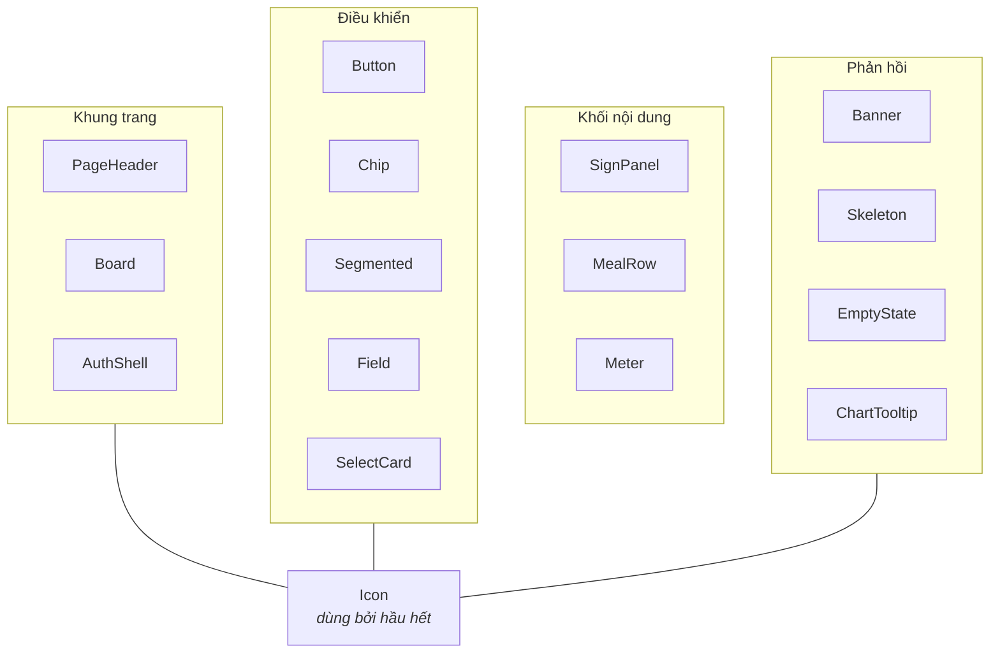

# 04 · Thư viện component

> Tra cứu từng component dùng chung trong [`components/ui/`](../components/ui/):
> nhận props gì, dùng khi nào, và khi nào **không** nên dùng.

**Loại tài liệu:** Reference.

---

## Vì sao có thư viện này

Bản đầu của app không có component dùng chung — mỗi màn tự viết lại chuỗi
Tailwind cho thẻ, nút, thanh tiến trình. Đó mới là nguyên nhân gốc của cảm
giác chắp vá: đổi màu ở một chỗ thì bốn chỗ khác lệch đi.

Nay mọi thứ lặp lại đều nằm ở một nơi. **Thấy mình sắp chép một chuỗi
`className` dài sang màn thứ hai thì hãy tạo component.**

---

## Bản đồ



---

## Khung trang

### `PageHeader`

Đầu trang, dùng cho cả bốn màn chính.

| Prop | Kiểu | Mô tả |
|---|---|---|
| `title` | `string` | Tiêu đề, hiện bằng Anton màu vàng |
| `eyebrow` | `ReactNode?` | Chữ nhỏ phía trên |
| `aside` | `ReactNode?` | Chữ phụ căn phải (ngày, số lượng) |
| `actions` | `ReactNode?` | Nút góc phải; trên desktop thường để trống vì đã có ở thanh bên |

Trên mobile là một dải sơn đậm sát mép; từ `lg` nhả nền, chữ to lên và có kẻ
chân.

### `Board`

Một mục nội dung: tiêu đề vàng, kẻ ngang chạy hết chỗ trống, chữ phụ bên phải
— đúng nhịp một tấm bảng thực đơn treo tường.

| Prop | Kiểu | Mô tả |
|---|---|---|
| `title` | `string` | Tên mục |
| `icon` | `IconName?` | Icon trước tiêu đề |
| `aside` | `ReactNode?` | Chữ phụ bên phải, thường là link "Chi tiết →" |
| `className` | `string?` | Để đặt `col-span` khi nằm trong lưới |

> **`Board` không tự chừa lề ngang.** Lề do khung trang quyết định
> (`px-4 lg:px-6`), nhờ vậy đặt thẳng vào ô của lưới desktop mà không bị thụt
> hai lần.

### `AuthShell`

Khung cho màn chưa đăng nhập. Mobile: tấm biển nằm trên form. Desktop: tấm
biển chiếm nửa trái, form nửa phải.

| Prop | Kiểu |
|---|---|
| `title` | `string` |
| `eyebrow`, `intro` | `string?` |
| `children` | `ReactNode` (form) |
| `footer` | `ReactNode?` (link chuyển trang) |

---

## Khối nội dung

### `SignPanel`

Tấm biển sơn: viền dày, bóng cứng, viền mảnh bên trong. Dành cho thông tin
quan trọng nhất màn hình.

| Prop | Kiểu | Mặc định |
|---|---|---|
| `tone` | `"sign" \| "panel" \| "chili"` | `"sign"` |

Dùng `tone="chili"` khi con số mang nghĩa xấu — ví dụ đã vượt ngân sách.

> **Mỗi màn chỉ một `SignPanel`.** Hai tấm thì không tấm nào còn là tấm chính.

### `MealRow`

Một dòng trên bảng thực đơn: tên bữa, món, giá bên phải.

| Prop | Kiểu | Mô tả |
|---|---|---|
| `mealType` | `MealType` | Tự dịch qua `MEAL_LABELS` |
| `name` | `string` | Tên món |
| `detail` | `string?` | Dòng phụ (macro) |
| `cost` | `number` | VND, tự định dạng |
| `action` | `ReactNode?` | Nút bên phải |
| `muted` | `boolean` | Làm mờ khi đã ghi nhận, để mắt bỏ qua |

Dùng ở cả Trang chủ (kèm nút đánh dấu) và Lịch sử (chỉ đọc).

### `Meter`

Một dòng dinh dưỡng: nhãn trái, thanh sơn giữa, số phải.

| Prop | Kiểu | Mô tả |
|---|---|---|
| `label` | `string` | Tên chỉ số |
| `value`, `target` | `number` | Đã nạp / mục tiêu |
| `unit` | `string?` | `"g"`, mặc định rỗng |
| `tone` | `"protein" \| "carb" \| "fat" \| "kcal"` | **Quyết định màu** |

Vượt mục tiêu thì thanh được phủ gạch chéo, **không** đổi màu — lý do ở
[03 · Hệ thống thiết kế](./03-he-thong-thiet-ke.md#ba-quy-tắc-bắt-buộc).
Có sẵn `role="progressbar"` cùng các thuộc tính `aria-value*`.

---

## Điều khiển

### `Button`

| Prop | Kiểu | Mặc định |
|---|---|---|
| `variant` | `"primary" \| "danger" \| "dark" \| "ghost"` | `"primary"` |
| `size` | `"sm" \| "md"` | `"md"` |
| `icon` | `IconName?` | — |
| `loading` | `boolean` | `false` |
| `full` | `boolean` | `false` |

Ba trạng thái phân biệt rõ:

| Trạng thái | Hình thức |
|---|---|
| Bình thường | Sơn đầy màu theo `variant`, có bóng cứng |
| `loading` | Giữ nguyên lớp sơn, mờ 75%, con trỏ `wait`, icon xoay |
| `disabled` | **Bỏ hẳn lớp sơn** — nền trong suốt, viền và chữ mờ |

> Trạng thái `disabled` cố tình không phải là "nút vàng bị làm mờ": vàng mờ
> trên nền men ra một màu olive trông như lỗi hiển thị.

Cần một `<Link>` trông y hệt nút thì dùng hàm `buttonClass(variant, size)`
thay vì chép class.

### `Chip`

Nút chọn nhanh (ngày, bán kính). Props: `active: boolean` + mọi props của
`<button>`. Có sẵn `aria-pressed`.

### `Segmented`

Công tắc gạt giữa vài chế độ xem. Generic theo kiểu giá trị:

```tsx
<Segmented
  value={tab}
  onChange={setTab}
  options={[["calendar", "Nhật ký ăn"], ["stats", "Chi tiêu"]]}
/>
```

Có sẵn `role="tablist"` / `role="tab"` / `aria-selected`.

### `Field`

Ô nhập kiểu phiếu điền tay: nền kem, viền đen dày, không bo góc.

| Prop | Kiểu | Mô tả |
|---|---|---|
| `label` | `string` | Bắt buộc; nối với input bằng `useId` |
| `hint` | `string?` | Chữ gợi ý dưới ô |
| `suffix` | `string?` | Đơn vị hiện bên trong mép phải (`cm`, `kg`, `đ`) |

Nhãn nằm **ngoài** ô, không dùng kiểu nhãn nổi — để dấu tiếng Việt không bị
che khi focus.

### `SelectCard`

Ô lựa chọn trong wizard. `compact` để bỏ dấu tích khi xếp ngang (chọn giới
tính).

| Prop | Kiểu |
|---|---|
| `selected` | `boolean` |
| `onClick` | `() => void` |
| `title` | `string` |
| `hint` | `string?` |
| `compact` | `boolean?` |

---

## Phản hồi

### `Banner`

Dải thông báo kiểu băng-rôn dán ngang bảng hiệu.

| `tone` | Màu | Icon | Vai trò ARIA |
|---|---|---|---|
| `critical` | `chili-deep` | cảnh báo | `alert` |
| `warn` | `mango` | cảnh báo | `alert` |
| `good` | `mint` | dấu tích | `status` |

Luôn có icon đi kèm màu — trạng thái không được truyền tải chỉ bằng màu.

### `Skeleton` và `SkeletonRows`

`<Skeleton className="h-32 w-full" />` cho một khối.
`<SkeletonRows rows={3} />` cho danh sách (icon + hai dòng chữ + giá).

Dùng thay cho chữ "Đang tải…" ở mọi nơi.

### `EmptyState`

| Prop | Kiểu | Mô tả |
|---|---|---|
| `icon` | `IconName` | |
| `title` | `string` | Thiếu cái gì |
| `hint` | `string?` | Làm gì tiếp theo |
| `action` | `ReactNode?` | Nút dẫn tới hành động đó |

Trạng thái rỗng phải **nói rõ bước tiếp theo**, không chỉ thông báo trống.

### `ChartTooltip`

Hộp chú giải khi rê chuột trên biểu đồ — cùng chất liệu với thẻ nội dung.
Dòng đầu là số chính, các dòng sau nhạt hơn.

```tsx
<ChartTooltip label="Ngày 02/08" rows={[
  { key: "spent", value: "Đã chi 43.500đ" },
  { key: "budget", value: "Hạn mức 77.419đ" },
]} />
```

---

## `Icon`

25 icon nét, `viewBox="0 0 24 24"`, dùng `currentColor`.

| Prop | Kiểu | Mặc định |
|---|---|---|
| `name` | `IconName` | — |
| `className` | `string?` | `"size-5"` |
| `strokeWidth` | `number?` | `2` |
| `title` | `string?` | Có `title` → `role="img"`; không có → `aria-hidden` |

Danh sách: `home` `bowl` `calendar` `cart` `gear` `logout` `swap` `check`
`plus` `chevronLeft` `chevronRight` `arrowRight` `search` `pin` `alert`
`spinner` `dice` `target` `ruler` `wallet` `navigate` `close` `trash` `chart`
`user`.

`spinner` tự xoay.

**Icon mang nghĩa thì phải có `title`.** Nút chỉ có icon mà không có nhãn chữ
— như nút đăng xuất — không có `title` là người dùng trình đọc màn hình không
biết nút làm gì.
