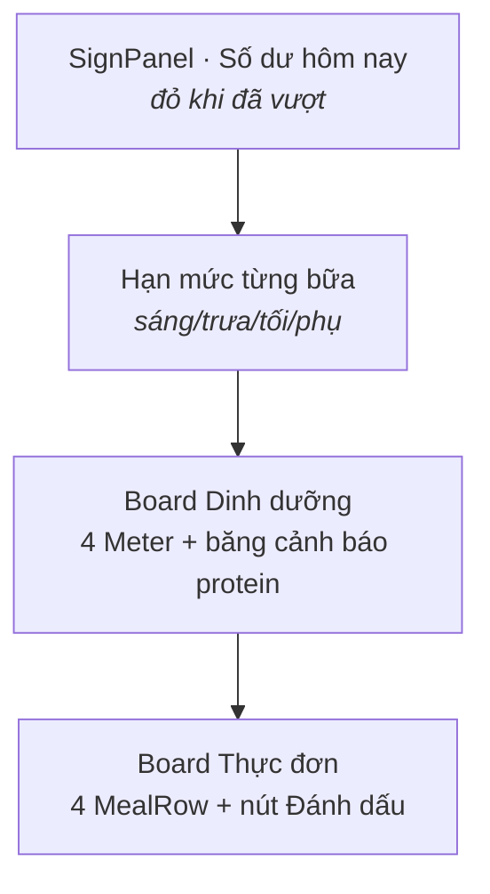
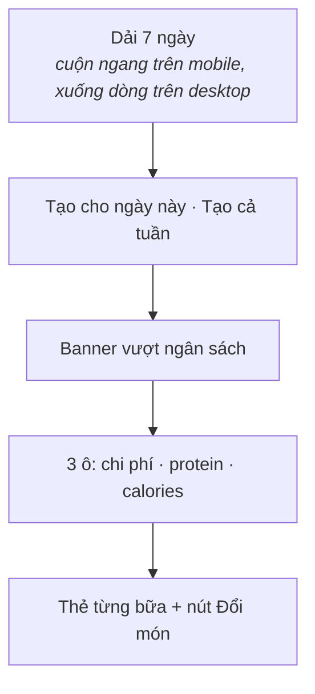
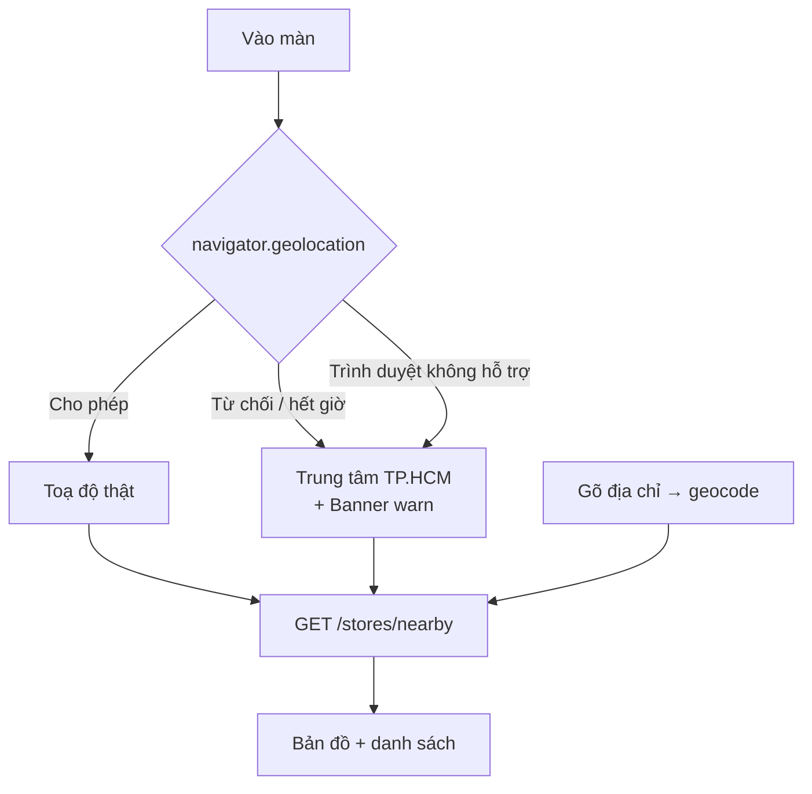
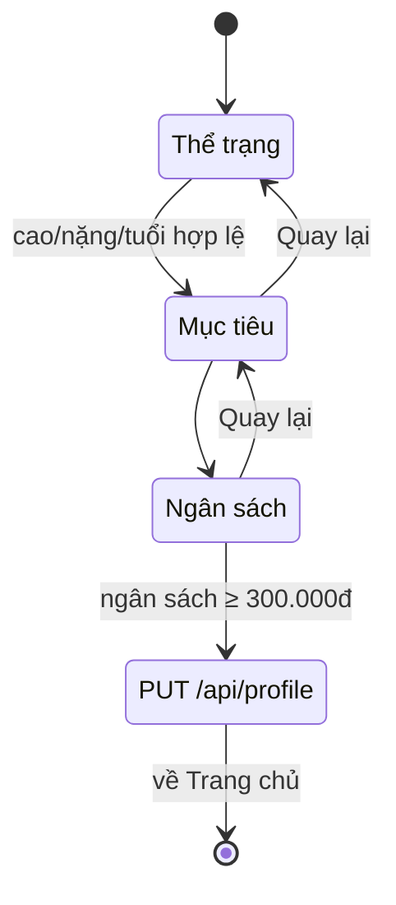

# 05 · Màn hình

> Mỗi màn: để làm gì, gọi API nào, có những trạng thái nào, và bố cục đổi ra
> sao trên desktop.

**Loại tài liệu:** Reference.

---

## Tổng quan

| Route | File | Việc chính | API dùng |
|---|---|---|---|
| `/` | [`(main)/page.tsx`](<../app/(main)/page.tsx>) | Xem còn bao nhiêu tiền, đủ đạm chưa, hôm nay ăn gì | `/profile`, `/stats/daily`, `/planner`, `/logs/day/:date`, `/logs` |
| `/planner` | [`(main)/planner/page.tsx`](<../app/(main)/planner/page.tsx>) | Tạo và chỉnh thực đơn 7 ngày tới | `/planner`, `/planner/generate`, `/planner/swap` |
| `/history` | [`(main)/history/page.tsx`](<../app/(main)/history/page.tsx>) | Nhìn lại đã ăn gì, đã tiêu bao nhiêu | `/logs`, `/logs/day/:date`, `/stats/spending` |
| `/stores` | [`(main)/stores/page.tsx`](<../app/(main)/stores/page.tsx>) | Mua nguyên liệu ở đâu rẻ nhất | `/stores/nearby`, `/stores/geocode`, `/stores/compare` |
| `/login`, `/register` | `app/login`, `app/register` | Vào tài khoản | `/auth/login`, `/auth/register` |
| `/onboarding` | `app/onboarding` | Khai thể trạng, mục tiêu, ngân sách | `/profile` |
| `/admin`, `/admin/[model]` | `app/admin/` | Quản trị dữ liệu 11 bảng — xem [Backend/docs/09](../../../Backend/docs/09-admin.md) | `/admin/*` |

---

## `/` — Trang chủ

Màn trả lời ba câu hỏi theo đúng thứ tự người dùng quan tâm: **còn bao nhiêu
tiền → đủ chất chưa → giờ ăn gì.**

**Trạng thái:**

| Điều kiện | Hiển thị |
|---|---|
| Đang tải | `Skeleton` cho tấm biển, thanh đo và danh sách |
| Chưa có hồ sơ | Đẩy sang `/onboarding` |
| `budgetLeft < 0` | `SignPanel` chuyển `tone="chili"`, nhãn đổi thành "Đã vượt ngân sách ngày" |
| `proteinWarning` | `Banner tone="warn"` nói còn thiếu bao nhiêu gram |
| Chưa có thực đơn | `EmptyState` kèm nút dẫn sang `/planner` |
| Bữa đã ghi nhận | `MealRow muted`, nút đổi thành nhãn "Đã ăn ✓" |
| Ghi nhận thất bại | `Banner tone="critical"`, hoàn tác thay đổi lạc quan |

**Desktop:** ba cột — ngân sách + hạn mức bữa / dinh dưỡng / thực đơn. Nút hồ
sơ và đăng xuất ẩn đi vì đã có ở thanh bên.

**Chi tiết đáng chú ý:** phần "Hạn mức từng bữa" dùng `targets.mealBudgets` —
dữ liệu backend vẫn trả về từ đầu nhưng giao diện bản trước không hề dùng.

---

## `/planner` — Thực đơn

**Trạng thái:**

| Điều kiện | Hiển thị |
|---|---|
| Chưa có thực đơn cho ngày đó | `EmptyState` hướng dẫn bấm "Tạo ngày này" |
| Đang tạo | Nút vào trạng thái `loading`, icon xoay |
| `budgetStatus.overBudget` | `Banner critical` nói vượt bao nhiêu; ô "Chi phí" chuyển đỏ |
| Đang đổi một món | Chỉ icon của **đúng thẻ đó** xoay (so `swapMutation.variables` với `item.id`) |
| Hết món thay thế | `Banner critical` |

**Desktop:** thẻ món xếp lưới 2 cột; dải ngày xuống dòng thay vì cuộn ngang;
hai nút tạo thu về đúng bề rộng nội dung thay vì kéo hết hàng.

---

## `/history` — Lịch sử

Hai tab qua `Segmented`.

**Tab "Nhật ký ăn"** — lịch tháng, chấm mint dưới ngày có ghi nhận; bấm vào
ngày để xem chi tiết bên dưới (desktop: bên phải).

**Tab "Chi tiêu"** — hai biểu đồ:

| Biểu đồ | Loại | Mã hoá |
|---|---|---|
| Chi tiêu mỗi ngày | Cột | Vàng = trong hạn mức, đỏ = vượt; đường đứt = hạn mức ngày |
| Protein theo ngày | Đường | Mint, 2px, không chấm, chấm to khi rê chuột |

Ba chi tiết trong biểu đồ cột:

1. **Chú giải có nhãn chữ**, không chỉ dựa vào màu.
2. **Trục Y tự nới** để đường "Hạn mức" luôn nằm trong khung — trước đây hạn
   mức 77.419₫ nằm ngoài trục dừng ở 60k nên không bao giờ hiện.
3. **Có `
` "Xem dạng bảng"** — số liệu đọc được cả khi không nhìn
   được biểu đồ.

Màu tô từng cột đặt qua prop `shape` của Recharts, không dùng `<Cell>` (đã bị
bỏ ở Recharts 4).

---

## `/stores` — Đi chợ

Màn duy nhất phụ thuộc dịch vụ ngoài, nên có nhiều trạng thái hỏng nhất.

| Điều kiện | Hiển thị |
|---|---|
| Đang lấy vị trí | "Đang lấy vị trí…" |
| Bị từ chối định vị | `Banner warn`, dùng trung tâm TP.HCM |
| Địa chỉ không tìm thấy | `Banner critical` gợi ý ghi rõ quận/phường |
| Không có cửa hàng trong bán kính | `EmptyState` gợi ý nới lên 5km |
| Trên 8 cửa hàng | Chỉ hiện 8 gần nhất + nút "Xem thêm N chỗ" |
| Ngày đó chưa có thực đơn | `EmptyState` bảo tạo thực đơn trước |

**Bản đồ:** tile OSM được nhuộm qua CSS `filter` cho khớp tông men xanh; ghim
là ô vuông sơn viền đen. Ghi công OpenStreetMap giữ nguyên theo yêu cầu giấy
phép.

**Danh sách bị cắt còn 8** vì Overpass hay trả về vài chục cửa hàng tiện lợi.
Số bị ẩn **luôn ghi rõ trên nút** — cắt bớt mà giấu đi sẽ khiến người dùng
tưởng đã xem hết.

**Desktop:** bản đồ + danh sách bên trái, bảng so giá dính bên phải khi cuộn.

---

## `/login`, `/register`

Dùng chung `AuthShell`. Desktop chia đôi màn: biển hiệu nửa trái kèm ba dòng
giới thiệu, form nửa phải.

| Điều kiện | Hiển thị |
|---|---|
| Sai email/mật khẩu (401) | "Email hoặc mật khẩu chưa đúng." |
| Lỗi mạng | "Không đăng nhập được. Kiểm tra mạng rồi thử lại." |
| Email đã tồn tại | Thông điệp lấy thẳng từ backend |

Thông điệp lỗi nói **cái gì sai và làm gì tiếp**, không xin lỗi, không nói
chung chung.

---

## `/onboarding`

Wizard 3 bước, cũng là màn cập nhật hồ sơ về sau (vào từ nút Hồ sơ).

**Điều kiện qua bước:** bước 1 cần cao > 50cm, nặng > 20kg, tuổi ≥ 15. Bước 3
cần ngân sách ≥ 300.000₫. Chưa đủ thì nút "Tiếp tục" ở trạng thái `disabled`
— nền trong suốt, không phải nút vàng bị làm mờ.

**Chi tiết đáng chú ý:** bước ngân sách hiện ngay số tiền tương đương mỗi
ngày. Đó là thứ người dùng thật sự cần biết — "2.400.000₫/tháng" là con số
trừu tượng, "77.419₫/ngày" thì không.

Vào lại màn này khi đã có hồ sơ thì các ô được điền sẵn qua một query riêng
(`queryKey: ["profile-prefill"]`, `retry: false`).
