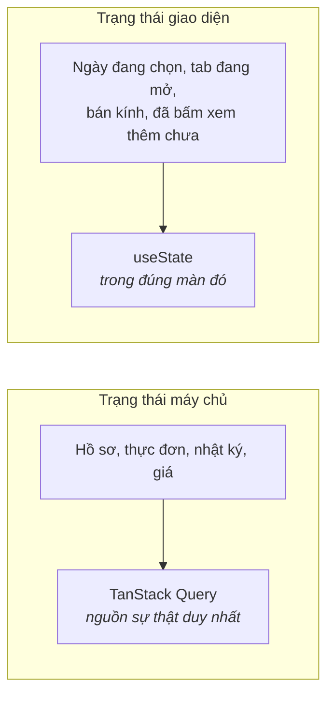
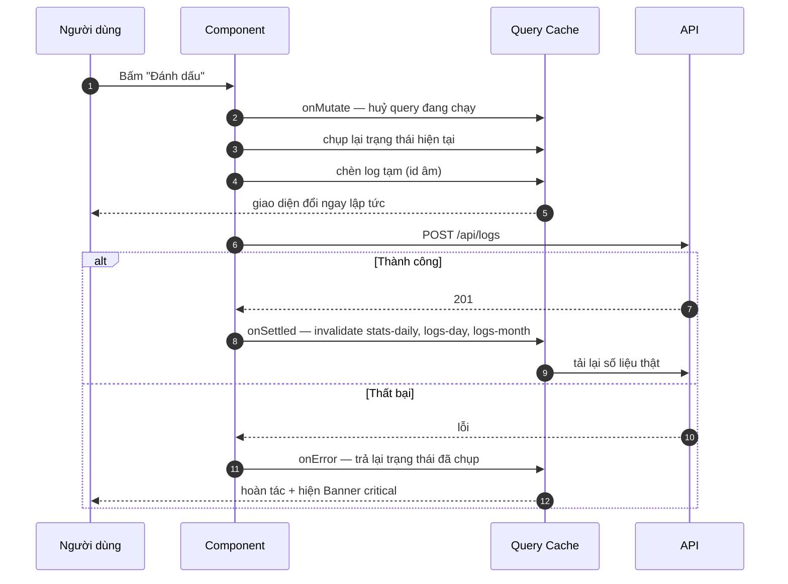
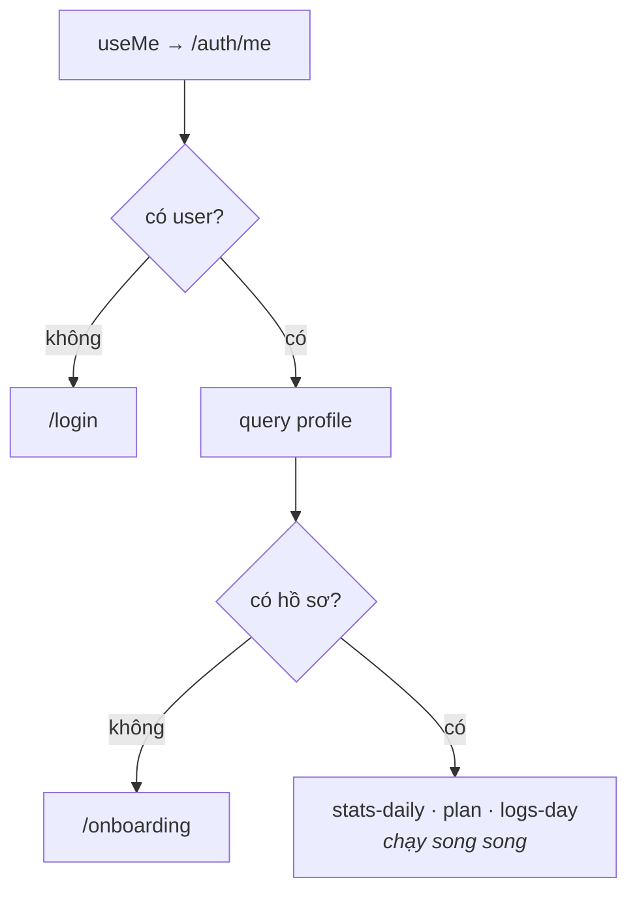

# 06 · Dữ liệu & trạng thái

> Cách app lấy dữ liệu, cache, và cập nhật giao diện trước khi máy chủ kịp
> trả lời. Bảng khoá cache là phần cần tra nhiều nhất.

**Loại tài liệu:** Explanation + Reference.

---

## Hai loại trạng thái



Không có Redux, Zustand hay Context nào cho dữ liệu. Dữ liệu máy chủ **không
bao giờ** được sao vào `useState` — làm vậy là tạo ra bản sao thứ hai sẽ lệch
đi. Xem [ADR-0002](./adr/0002-tanstack-query-lam-nguon-su-that.md).

---

## Lớp bọc API

[`lib/api.ts`](../lib/api.ts) là **chỗ duy nhất** gọi `fetch`.

```ts
api.get<T>(path)          api.post<T>(path, body)
api.put<T>(path, body)    api.del<T>(path)
```

Ba việc nó làm:

1. Thêm tiền tố `/api` (Next `rewrites` chuyển tiếp sang backend).
2. `credentials: "include"` — nếu thiếu, cookie phiên không đi kèm và mọi
   request đều 401.
3. Bóc lỗi thành `ApiError` có `status` và `message` **lấy từ trường `error`
   của backend**, nên thông điệp tiếng Việt hiện thẳng cho người dùng.

```tsx
catch (err) {
  setError(err instanceof ApiError ? err.message : "Kiểm tra mạng rồi thử lại.");
}
```

Khi backend không nói gì hữu ích (mất mạng, 500), **luôn có câu dự phòng nói
được bước tiếp theo** — đừng hiện `"Lỗi 500"` cho người dùng.

---

## Cấu hình chung

[`components/Providers.tsx`](../components/Providers.tsx):

| Tuỳ chọn | Giá trị | Vì sao |
|---|---|---|
| `retry` | `1` | Chập mạng thì thử lại một lần; nhiều hơn là bắt người dùng chờ |
| `refetchOnWindowFocus` | `false` | Đổi tab về không nên làm số liệu nhảy |
| `staleTime` | `30_000` | Trong 30 giây, chuyển qua lại giữa các màn dùng cache — không gọi lại mạng |

---

## Bảng khoá cache

Khoá cache là hợp đồng: `invalidateQueries` sai khoá thì màn hình không cập
nhật, mà không có lỗi nào báo.

| `queryKey` | Dữ liệu | Dùng ở |
|---|---|---|
| `["me"]` | Người dùng hiện tại | `useMe` — layout, thanh bên, trang chủ |
| `["profile"]` | Hồ sơ | Trang chủ (để biết có cần onboarding không) |
| `["profile-prefill"]` | Hồ sơ để điền sẵn form | Onboarding |
| `["stats-daily", date]` | Dinh dưỡng + ngân sách ngày | Trang chủ |
| `["plan", date]` | Thực đơn một ngày | Trang chủ, Thực đơn |
| `["logs-day", date]` | Các bữa đã ăn trong ngày | Trang chủ, Lịch sử |
| `["logs-month", month]` | Tổng hợp theo tháng | Lịch sử |
| `["spending", range]` | Chi tiêu theo kỳ | Lịch sử |
| `["stores-nearby", lat, lng, radius]` | Cửa hàng quanh đây | Đi chợ |
| `["stores-compare", date]` | So giá nguyên liệu | Đi chợ |

**Quy ước:** phần tử đầu là tên nguồn dữ liệu, các phần tử sau là tham số ảnh
hưởng tới kết quả. Đổi tham số là tự động có mục cache mới — không cần tự dọn.

`["plan", date]` cố tình dùng chung giữa Trang chủ và Thực đơn: tạo thực đơn ở
màn Thực đơn thì Trang chủ cũng mới theo.

---

## Cập nhật lạc quan khi bấm "Đánh dấu"

Đánh dấu một bữa đã ăn phải phản hồi **ngay**, không đợi vòng mạng — nếu không
người dùng sẽ bấm lại lần nữa.



Bốn chi tiết dễ làm sai:

1. **`cancelQueries` trước khi sửa cache.** Không huỷ thì một request đang bay
   có thể trả về sau và ghi đè mất thay đổi lạc quan.
2. **Chụp lại trạng thái cũ và trả về từ `onMutate`.** Đây là thứ `onError`
   dùng để hoàn tác.
3. **`id` âm cho bản ghi tạm** (`-Date.now()`) — không đụng id thật từ server.
4. **Dọn cache trong `onSettled`, không phải `onSuccess`.** Hỏng hay không thì
   cache cũng cần đồng bộ lại với sự thật.

Bản ghi tạm cố ý để macro bằng `0`: thanh dinh dưỡng chỉ nhảy khi số liệu thật
về. Đổi ngay trạng thái nút (thứ người dùng vừa bấm) nhưng không đoán bừa con
số — đoán sai rồi nhảy lại còn khó chịu hơn là đợi.

---

## Đăng xuất dọn sạch cache

[`useLogout`](../lib/hooks.ts) gọi `queryClient.clear()` chứ không chỉ
`invalidateQueries(["me"])`. Nếu chỉ invalidate, tài khoản đăng nhập sau vẫn
thấy thực đơn và nhật ký của tài khoản trước trong khoảnh khắc trước khi dữ
liệu mới về.

---

## Thứ tự tải ở Trang chủ



Ba query cuối đều có `enabled: hasProfile` — chưa có hồ sơ thì không gọi, vì
chúng chắc chắn lỗi (backend cần hồ sơ mới tính được mục tiêu).

Đây cũng là chỗ phát sinh lỗi đã biết: `GET /api/profile` trả 404 thay vì
`{ profile: null }` nên nhánh "không có hồ sơ" không bao giờ chạy. Xem
[09 · Vấn đề đã biết](./09-van-de-da-biet.md).

---

## Ngày tháng

[`lib/format.ts`](../lib/format.ts):

| Hàm | Vào | Ra |
|---|---|---|
| `toDateStr(date?)` | `Date` | `"2026-08-02"` theo **giờ địa phương** |
| `formatDateVi(str)` | `"2026-08-02"` | `"Chủ nhật, 2/8"` |
| `formatVnd(n)` | `77419` | `"77.419đ"` |
| `formatDistance(m)` | `1234` | `"1,2km"` |

`toDateStr` dùng giờ địa phương, còn backend neo mọi thứ theo UTC. Người dùng
ở Việt Nam thao tác trong khoảng 00:00–07:00 có thể gặp lệch một ngày — vấn đề
gốc nằm ở backend, ghi tại
[Backend/docs/08](../../../Backend/docs/08-van-de-da-biet.md).
