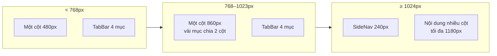
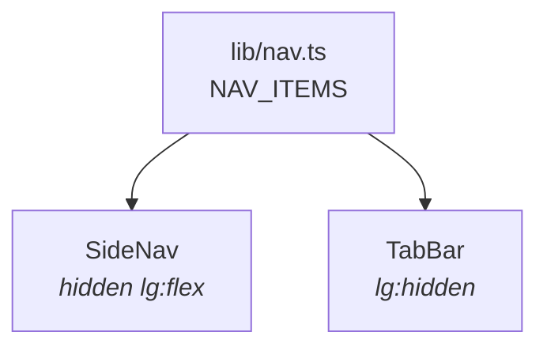

# 07 · Responsive

> Ba mốc màn hình, khung app đổi hình ra sao ở mỗi mốc, và cách kiểm tra —
> kể cả mẹo chụp được màn 375px bằng Chrome headless.

**Loại tài liệu:** Explanation + How-to.

---

## Ba mốc

| Mốc | Bề rộng | Điều hướng | Bề rộng nội dung |
|---|---|---|---|
| Điện thoại | `< 768px` | TabBar dưới đáy | `max-w-120` (480px) |
| Tablet | `768–1023px` | TabBar dưới đáy | `md:max-w-215` (860px) |
| Desktop | `≥ 1024px` | SideNav bên trái | `lg:max-w-295` (1180px) |

Chỉ dùng hai điểm ngắt Tailwind: `md` (768) và `lg` (1024). Ít điểm ngắt thì
ít trạng thái phải kiểm tra.



---

## Khung app

**`app/layout.tsx` cố tình không quy định bề rộng.** Nó chỉ lo font, metadata
và `Providers`. Bề rộng do từng nhóm route tự quyết:

| Nhóm | Nơi quy định | Cách xử lý |
|---|---|---|
| Bốn màn chính | [`(main)/layout.tsx`](<../app/(main)/layout.tsx>) | `SideNav` từ `lg`, nội dung `max-w-120 → md:max-w-215 → lg:max-w-295` |
| Đăng nhập / Đăng ký | [`AuthShell`](../components/ui/AuthShell.tsx) | Một cột, từ `lg` chia đôi màn |
| Onboarding | [`app/onboarding/page.tsx`](../app/onboarding/page.tsx) | `max-w-140 → lg:max-w-170`, luôn căn giữa |

> Bản đầu của app khoá cứng `max-w-[480px]` ngay ở layout gốc. Đó là lý do
> desktop chỉ là bản mobile kéo giãn: **không màn nào có thể rộng hơn dù muốn.**
> Gỡ khoá đó là thay đổi mở đường cho toàn bộ phần còn lại.

---

## SideNav và TabBar

Hai thành phần, một nguồn dữ liệu:



Thêm một mục điều hướng thì sửa đúng một chỗ. Hai thành phần không bao giờ
lệch nhau về số mục hay thứ tự.

`SideNav` còn giữ khối tài khoản (tên, nút Hồ sơ, nút Đăng xuất). Vì thế
Trang chủ ẩn hai nút đó từ `lg` — cùng một hành động không nên xuất hiện hai
lần trên một màn hình.

---

## Bố cục từng màn trên desktop

| Màn | Bố cục `lg` |
|---|---|
| Trang chủ | 3 cột: ngân sách + hạn mức bữa / dinh dưỡng / thực đơn |
| Thực đơn | Thẻ món lưới 2 cột; dải ngày xuống dòng; nút tạo thu về bề rộng nội dung |
| Lịch sử | Lịch trái (tối đa 400px) / chi tiết ngày phải; tab chi tiêu để 2 biểu đồ song song |
| Đi chợ | Bản đồ + danh sách trái / bảng so giá phải, dính khi cuộn (`lg:sticky lg:top-6`) |
| Đăng nhập | Chia đôi: biển hiệu trái, form phải |

Ở mốc `md`, phần lớn màn vẫn một cột nhưng rộng hơn; riêng thẻ món và vài
nhóm ô chuyển sang 2 cột từ `md`.

---

## Quy tắc khi viết mới

1. **Viết mobile trước, thêm `md:` / `lg:` sau.** Class không tiền tố là mốc
   nhỏ nhất.
2. **Nội dung rộng phải tự cuộn.** Bảng và biểu đồ bọc trong
   `overflow-x-auto`; thân trang không bao giờ được cuộn ngang.
3. **Lề do khung trang đặt** (`px-4 lg:px-6`), không đặt trong `Board` —
   nếu không sẽ thụt hai lần khi nằm trong lưới.
4. **Ô lưới phải có `min-w-0`** hoặc dùng `minmax(0, 1fr)`. Thiếu nó, nội dung
   dài sẽ đẩy lưới rộng ra và làm tràn trang.
5. **Chuỗi dài cần `truncate`** — tên món và địa chỉ cửa hàng đều có thể rất
   dài.

---

## Cách kiểm tra

### Trong trình duyệt

DevTools → chế độ thiết bị, kiểm ba mốc: **375** (iPhone SE), **820** (iPad),
**1440** (laptop).

### Bằng ảnh chụp tự động

Chrome headless chụp được nhanh, nhưng có ba cái bẫy đã gặp:

**Bẫy 1 — Chrome headless ép bề rộng tối thiểu 500px.**
`--window-size=375,812` vẫn cho viewport 500px rồi cắt ảnh còn 375 — nhìn
như bị tràn ngang trong khi thực tế không tràn. Muốn kiểm 375px thật thì đặt
trang trong `<iframe width="375">`.

**Bẫy 2 — iframe từ `file://` bị chặn cookie bên thứ ba.** Trang chứa iframe
phải cùng origin với app, tức là đặt trong `public/` **trước khi khởi động
server** (`next start` chỉ đọc `public/` lúc khởi động).

**Bẫy 3 — dev server làm treo `--virtual-time-budget`.** WebSocket của HMR
khiến thời gian ảo không bao giờ nhàn rỗi. Luôn chụp trên bản
`npm run build && npm start`.

```bash
# ví dụ chụp desktop
"/Applications/Google Chrome.app/Contents/MacOS/Google Chrome" \
  --headless --disable-gpu --hide-scrollbars \
  --window-size=1440,900 --screenshot=home.png \
  --virtual-time-budget=12000 http://localhost:3000/
```

> `timeout` không có sẵn trên macOS — dùng nó để bọc lệnh sẽ nhận `exit 127`
> và không có ảnh nào được tạo.

**Nhớ xoá mọi file tạm trong `public/`** khi chụp xong. Trang giúp đăng nhập
tự động dùng để chụp là một đường vòng qua xác thực — không được để lọt vào
bản build.
