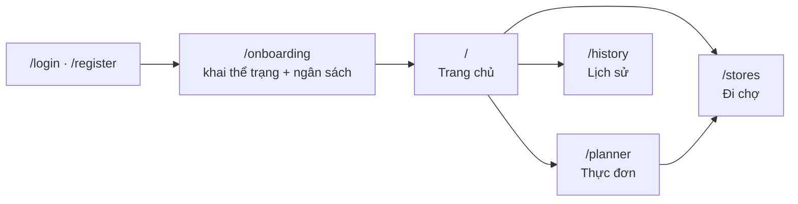

# Tài liệu Frontend — StudentBites

> Web app Next.js 16 + Tailwind 4, mobile-first, chạy được cả trên desktop.
> Nhận diện thị giác mang tên **"Bảng Hiệu"**.

**Cập nhật:** 2026-08-02 · **Áp dụng cho:** `Frontend/studentbite/` trên nhánh `main`

---

## Đọc tài liệu này thế nào

Cùng một chuẩn với [tài liệu Backend](../../../Backend/docs/README.md): tổ
chức theo **[Diátaxis](https://diataxis.fr/)**, sơ đồ vẽ bằng **Mermaid**,
quyết định kiến trúc ghi bằng **ADR**.

| Loại | Trả lời câu hỏi | Đọc khi |
|---|---|---|
| **Tutorial** | "Làm sao chạy được?" | Ngày đầu vào dự án |
| **How-to** | "Làm sao thêm một màn hình?" | Đang cần làm một việc cụ thể |
| **Reference** | "Component này nhận props gì?" | Đang viết code |
| **Explanation** | "Sao lại chọn tông màu này?" | Muốn hiểu vì sao giao diện có hình dạng này |

---

## Mục lục

| # | Tài liệu | Loại | Nội dung |
|---|---|---|---|
| 01 | [Bắt đầu](./01-bat-dau.md) | Tutorial | Chạy app cùng backend, có dữ liệu thật để nhìn |
| 02 | [Kiến trúc](./02-kien-truc.md) | Explanation | Cấu trúc thư mục, bản đồ route, khung app |
| 03 | [Hệ thống thiết kế](./03-he-thong-thiet-ke.md) | Explanation + Reference | "Bảng Hiệu": màu, chữ, quy tắc dùng |
| 04 | [Thư viện component](./04-thu-vien-component.md) | Reference | Từng component trong `components/ui/` |
| 05 | [Màn hình](./05-man-hinh.md) | Reference | Mỗi màn: dữ liệu, trạng thái, luồng |
| 06 | [Dữ liệu & trạng thái](./06-du-lieu-va-trang-thai.md) | Explanation | React Query, khoá cache, cập nhật lạc quan |
| 07 | [Responsive](./07-responsive.md) | Explanation + How-to | Ba mốc màn hình và cách kiểm tra |
| 08 | [Quy ước & kiểm thử](./08-quy-uoc-va-kiem-thu.md) | Reference + How-to | Quy ước mã nguồn, cách kiểm tra trước khi mở PR |
| 09 | [Vấn đề đã biết](./09-van-de-da-biet.md) | Reference | Giới hạn hiện tại, có mức ưu tiên |
| — | [Quyết định kiến trúc](./adr/) | Explanation | ADR |

---

## Tóm tắt trong 60 giây

App có **5 màn hình chính** và một khung điều hướng đổi hình theo bề rộng
màn hình: tab bar dưới đáy trên điện thoại, thanh bên trên desktop.

**Ngăn xếp:** Next.js 16 (App Router, Turbopack) · React 19 · Tailwind CSS 4 ·
TanStack Query 5 · Recharts 3 · Leaflet + react-leaflet · TypeScript.

**Nhận diện:** lấy chất liệu từ bảng hiệu quán cơm sơn men — nền xanh men,
chữ vàng, giá đỏ, viền đen dày, bóng đổ cứng. Chi tiết ở
[03 · Hệ thống thiết kế](./03-he-thong-thiet-ke.md).

---

## Quy ước của bộ tài liệu này

Giống hệt bên Backend, để hai bộ đọc như một:

1. **Tên file theo số thứ tự đọc** — người mới đọc từ trên xuống.
2. **Mỗi file mở đầu bằng câu trả lời "file này dùng để làm gì"**.
3. **Sơ đồ dùng Mermaid nhúng thẳng vào Markdown**, không dùng ảnh xuất từ
   công cụ ngoài — để sơ đồ đi cùng lịch sử Git.
4. **Mọi khẳng định phải trỏ được về mã nguồn.** Tài liệu lệch mã thì mã đúng.
5. **Tiếng Việt cho diễn giải, giữ nguyên thuật ngữ tiếng Anh** đã dùng trong
   mã (`SignPanel`, `queryKey`…).
6. **Không chép mã vào tài liệu** trừ khi đoạn mã chính là thứ đang giải thích.
